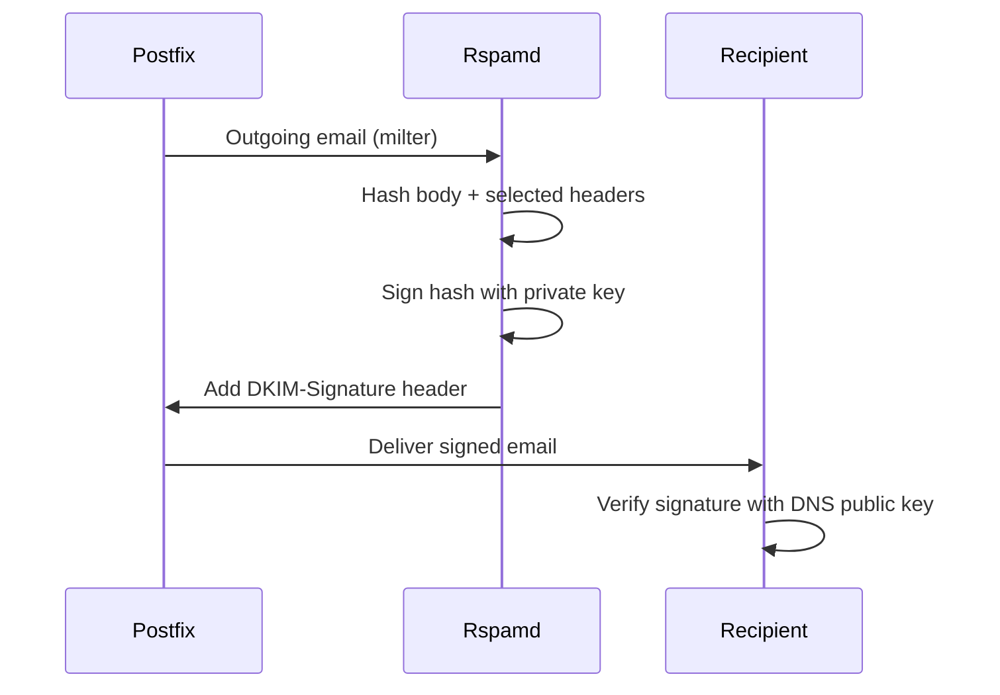

# Encryption

Mailyte encrypts data in transit and supports encryption at rest. This page covers every encryption layer.

## Transport Encryption (TLS)

### SMTP (Postfix)

| Port | Mode | Requirement |
|------|------|-------------|
| 25 | STARTTLS | Optional (opportunistic) |
| 587 | STARTTLS | Required for authentication |
| 465 | Implicit TLS | Always encrypted |

Postfix TLS configuration:

```
# Inbound TLS
smtpd_tls_security_level = may
smtpd_tls_protocols = !SSLv2, !SSLv3, !TLSv1, !TLSv1.1
smtpd_tls_mandatory_protocols = !SSLv2, !SSLv3, !TLSv1, !TLSv1.1
smtpd_tls_ciphers = high
smtpd_tls_mandatory_ciphers = high

# Outbound TLS
smtp_tls_security_level = may
smtp_tls_protocols = !SSLv2, !SSLv3, !TLSv1, !TLSv1.1
smtp_tls_mandatory_protocols = !SSLv2, !SSLv3, !TLSv1, !TLSv1.1
```

**`security_level = may`** means TLS is used when the remote server supports it, but plain text is allowed as fallback. For port 587/465 (submission), TLS is always required because authentication is involved.

### IMAP/POP3 (Dovecot)

| Port | Protocol | Mode |
|------|----------|------|
| 143 | IMAP | STARTTLS |
| 993 | IMAPS | Implicit TLS |
| 110 | POP3 | STARTTLS |
| 995 | POP3S | Implicit TLS |

Dovecot TLS configuration:

```
ssl = required
ssl_min_protocol = TLSv1.2
ssl_prefer_server_ciphers = yes
```

`ssl = required` means clients must use TLS. No plaintext connections are allowed.

### API (HTTPS)

The API should run behind a reverse proxy (Nginx, Traefik) with TLS termination:

```nginx
server {
    listen 443 ssl http2;
    server_name api.yourdomain.com;

    ssl_certificate /etc/ssl/certs/api.crt;
    ssl_certificate_key /etc/ssl/private/api.key;
    ssl_protocols TLSv1.2 TLSv1.3;

    location / {
        proxy_pass http://api:8080;
    }
}
```

### TLS Versions

| Version | Status |
|---------|--------|
| SSLv2 | Disabled (insecure) |
| SSLv3 | Disabled (POODLE vulnerability) |
| TLS 1.0 | Disabled (deprecated) |
| TLS 1.1 | Disabled (deprecated) |
| TLS 1.2 | Enabled (minimum) |
| TLS 1.3 | Enabled (preferred) |

## Certificate Management

Mailyte's `cert_manager` service handles Let's Encrypt certificates automatically.

### How It Works

1. cert_manager requests a certificate from Let's Encrypt using HTTP-01 or DNS-01 challenge
2. Certificate and private key are stored in `storage/ssl_certs/` and `storage/ssl_private/`
3. cert_manager writes an SNI map for multi-domain support
4. cert_manager sends SIGHUP to Postfix and Dovecot to reload the new certificate
5. Renewal happens automatically 30 days before expiry

### SNI (Server Name Indication)

SNI allows serving different certificates for different domains on the same IP:

```
# storage/sni_config/sni_map
example.com /etc/ssl/certs/example.com.crt /etc/ssl/private/example.com.key
other.com /etc/ssl/certs/other.com.crt /etc/ssl/private/other.com.key
```

### Wildcard Certificates

For `*.yourdomain.com` coverage:

```bash
WILDCARD_DOMAIN=yourdomain.com
DNS_PROVIDER=cloudflare  # or route53, etc.
```

DNS-01 challenge is required for wildcard certs.

## DKIM Signing

DKIM adds a cryptographic signature to outgoing emails.

### Key Management

- Keys are RSA 2048-bit (minimum)
- Private keys stored in `storage/dkim_keys/` and the `dkim_keys` database table
- Public keys published as DNS TXT records
- Rspamd signs outgoing email automatically

### Signature Process



The DKIM-Signature header includes:

```
DKIM-Signature: v=1; a=rsa-sha256; c=relaxed/relaxed;
  d=example.com; s=default;
  h=from:to:subject:date:message-id;
  bh=base64_body_hash;
  b=base64_signature;
```

## At-Rest Encryption

### Database

MySQL supports tablespace encryption with InnoDB:

```sql
-- Enable at-rest encryption
ALTER TABLE email_accounts ENCRYPTION='Y';
ALTER TABLE mail_logs ENCRYPTION='Y';
```

Requires MySQL's keyring plugin to be configured. The key is stored separately from the data.

### Mail Storage

Mail data on disk can be encrypted using:

1. **LUKS disk encryption** — encrypt the entire volume where `storage/mail_data/` lives
2. **Docker volume encryption** — use encrypted Docker volumes
3. **Per-message encryption** — the encryption worker can encrypt stored messages

```bash
# Create an encrypted volume
cryptsetup luksFormat /dev/sdb
cryptsetup luksOpen /dev/sdb mail_encrypted
mkfs.ext4 /dev/mapper/mail_encrypted
mount /dev/mapper/mail_encrypted /opt/mailyte/storage/mail_data
```

### Redis

Redis data is typically not encrypted at rest (it's a cache). If you need at-rest encryption:

1. Use an encrypted volume for the Redis data directory
2. Or use Redis with TLS for in-transit encryption:

```yaml
redis:
  command: redis-server --tls-port 6379 --port 0 --tls-cert-file /certs/redis.crt --tls-key-file /certs/redis.key
```

## Verifying Encryption

### Check TLS on SMTP

```bash
openssl s_client -connect mail.yourdomain.com:587 -starttls smtp < /dev/null 2>/dev/null | grep -E "Protocol|Cipher|Verify"
```

### Check TLS on IMAP

```bash
openssl s_client -connect mail.yourdomain.com:993 < /dev/null 2>/dev/null | grep -E "Protocol|Cipher|Verify"
```

### Check DKIM

Send an email to Gmail and view the message headers. Look for:

```
Authentication-Results: mx.google.com;
    dkim=pass header.i=@example.com header.s=default
```

### Check Certificate Details

```bash
echo | openssl s_client -connect mail.yourdomain.com:993 2>/dev/null | openssl x509 -noout -dates -subject -issuer
```
