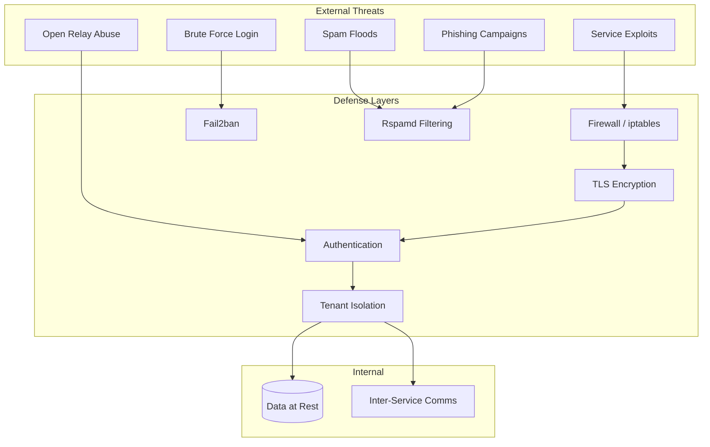

# Security

An email server is a high-value target. It handles credentials, private communications, and is directly exposed to the internet. This section documents how Mailyte is secured and how to keep it that way.

---

## In this section

-   :material-key:{ .lg .middle } **Authentication**

    ---

    API keys, admin auth, SMTP SASL, token management, and key rotation.

    [:octicons-arrow-right-24: Authentication](authentication.md)

-   :material-shield-account:{ .lg .middle } **Authorization**

    ---

    Multi-tenant isolation, org-scoped permissions, and access control.

    [:octicons-arrow-right-24: Authorization](authorization.md)

-   :material-lock:{ .lg .middle } **Encryption**

    ---

    TLS configuration, at-rest encryption, DKIM signing, and certificate management.

    [:octicons-arrow-right-24: Encryption](encryption.md)

-   :material-wall:{ .lg .middle } **Network Security**

    ---

    Firewalls, port exposure, Docker network isolation, and ingress rules.

    [:octicons-arrow-right-24: Network security](network-security.md)

-   :material-clipboard-check:{ .lg .middle } **Compliance**

    ---

    GDPR, data retention policies, right to erasure, and audit logging.

    [:octicons-arrow-right-24: Compliance](compliance.md)

-   :material-bug:{ .lg .middle } **Vulnerability Management**

    ---

    Dependency scanning, image patching, and security update process.

    [:octicons-arrow-right-24: Vulnerability management](vulnerability-management.md)

-   :material-monitor-eye:{ .lg .middle } **Security Monitoring**

    ---

    Detecting attacks, analyzing logs, alerting on anomalies.

    [:octicons-arrow-right-24: Security monitoring](security-monitoring.md)

-   :material-shield-alert:{ .lg .middle } **Intrusion Detection**

    ---

    Fail2ban configuration, brute-force protection, IP banning.

    [:octicons-arrow-right-24: Intrusion detection](intrusion-detection.md)

-   :material-checkbox-marked-circle:{ .lg .middle } **Security Checklist**

    ---

    Pre-deployment verification — make sure nothing is missed.

    [:octicons-arrow-right-24: Security checklist](security-checklist.md)

---

## Threat Model

Mailyte faces threats from the internet and from misconfiguration. Here's how the defense layers map to the attack surface:

---

## Defense Layers

The security model is organized into six layers. Each layer handles a specific class of threat, so a failure in one layer doesn't compromise the whole system.

| Layer | Protects against | Key technology |
|-------|-----------------|----------------|
| **1. Network** | Unauthorized access, port scanning | Firewall, Docker network isolation |
| **2. Transport** | Eavesdropping, MITM attacks | TLS 1.2+, STARTTLS, implicit TLS |
| **3. Authentication** | Unauthorized API/SMTP access | API keys, SASL, admin passwords |
| **4. Authorization** | Cross-tenant data access | Org-scoped keys, row-level isolation |
| **5. Spam & Abuse** | Spam floods, outbound abuse, brute force | Rspamd, rate limiting, fail2ban |
| **6. Monitoring** | Undetected attacks, slow compromise | Log analysis, Prometheus metrics, alerts |

### Layer 1: Network

The firewall only exposes the ports that need to be public. Internal services (MySQL, Redis, Qdrant, Prometheus) are not accessible from outside. Docker network isolation keeps containers in their own subnet.

!!! warning "Default Docker behaviour"
    Docker bypasses `ufw` / `iptables` rules by default. Make sure you configure Docker's `iptables` settings or use `DOCKER_IPTABLES=false` with an external firewall. See [Network Security](network-security.md) for the full setup.

See: [Network Security](network-security.md)

### Layer 2: Transport Encryption

All external connections use TLS 1.2+. SMTP connections support STARTTLS and implicit TLS. IMAP and POP3 use implicit TLS by default. The API runs behind HTTPS.

See: [Encryption](encryption.md)

### Layer 3: Authentication

API requests require an API key. SMTP submission requires SASL authentication (handled by Dovecot). Admin operations require an additional admin password. API keys can be scoped to organizations and restricted by IP.

See: [Authentication](authentication.md)

### Layer 4: Authorization

Each organization's data is completely isolated. API keys scoped to an organization can only see that organization's domains, mailboxes, and data. There's no cross-tenant data leakage by design.

See: [Authorization](authorization.md)

### Layer 5: Spam and Abuse Prevention

Rspamd filters inbound email using Bayesian analysis, DNSBL checks, SPF/DKIM/DMARC validation, and content analysis. Rate limiting prevents outbound abuse. Fail2ban blocks repeated failed login attempts.

See: [Intrusion Detection](intrusion-detection.md)

### Layer 6: Monitoring and Detection

Failed logins, unusual traffic patterns, and configuration changes are logged and can trigger alerts. Prometheus metrics track security-relevant events.

See: [Security Monitoring](security-monitoring.md)

---

## Security capabilities

| Capability | Details |
|------------|---------|
| **TLS** | TLS 1.2+ on all external connections, auto-renewal via cert manager |
| **DKIM** | Automatic key generation and DNS record management |
| **SPF/DMARC** | Validation on inbound, policy enforcement on outbound |
| **API key scoping** | Per-org keys, IP allowlists, read/write permissions |
| **SASL auth** | Dovecot-backed SMTP authentication, no open relay |
| **Fail2ban** | Automatic IP banning after failed login attempts |
| **Rate limiting** | Sliding window limits at org, domain, and mailbox level |
| **Antivirus** | ClamAV scanning on all inbound attachments |
| **Tenant isolation** | Row-level DB isolation, scoped API access, separate quotas |
| **Audit logging** | All admin actions logged with timestamps and actor |
| **Auto-healing** | Health monitor restarts failed services automatically |

---

## Most common security tasks

!!! tip "Start with the checklist"
    If you're deploying Mailyte for the first time, go through the **[Security Checklist](security-checklist.md)** before exposing anything to the internet.

| I want to... | Go to |
|---|---|
| Set up API keys for my app | [Authentication](authentication.md) |
| Configure TLS certificates | [Encryption](encryption.md) |
| Lock down exposed ports | [Network Security](network-security.md) |
| Block brute-force attacks | [Intrusion Detection](intrusion-detection.md) |
| Ensure GDPR compliance | [Compliance](compliance.md) |
| Monitor for attacks | [Security Monitoring](security-monitoring.md) |
| Run a pre-deployment audit | [Security Checklist](security-checklist.md) |

---

## Quick Links

| Topic | What it covers |
|-------|---------------|
| [Authentication](authentication.md) | API keys, admin auth, SMTP SASL, tokens |
| [Authorization](authorization.md) | Multi-tenant isolation, permissions |
| [Encryption](encryption.md) | TLS, at-rest encryption, DKIM, certificates |
| [Network Security](network-security.md) | Firewalls, port exposure, Docker isolation |
| [Compliance](compliance.md) | GDPR, data retention, right to erasure |
| [Vulnerability Management](vulnerability-management.md) | Dependency scanning, patching |
| [Security Monitoring](security-monitoring.md) | Detecting attacks, log analysis |
| [Intrusion Detection](intrusion-detection.md) | Fail2ban configuration |
| [Security Checklist](security-checklist.md) | Pre-deployment security verification |

---

## Reporting Security Issues

If you discover a security vulnerability, please report it responsibly. Do not open a public issue.

Email: `security@mailyte.com`

We'll acknowledge receipt within 24 hours and provide a timeline for a fix within 72 hours.

---

## Related sections

- [Architecture](../architecture/index.md) -- understand the security model in context
- [Getting Started](../getting-started/index.md) -- secure setup from the start
- [Features](../features/index.md) -- security-relevant features like rate limiting and anti-spam
- [Development](../development/index.md) -- security practices for contributors
