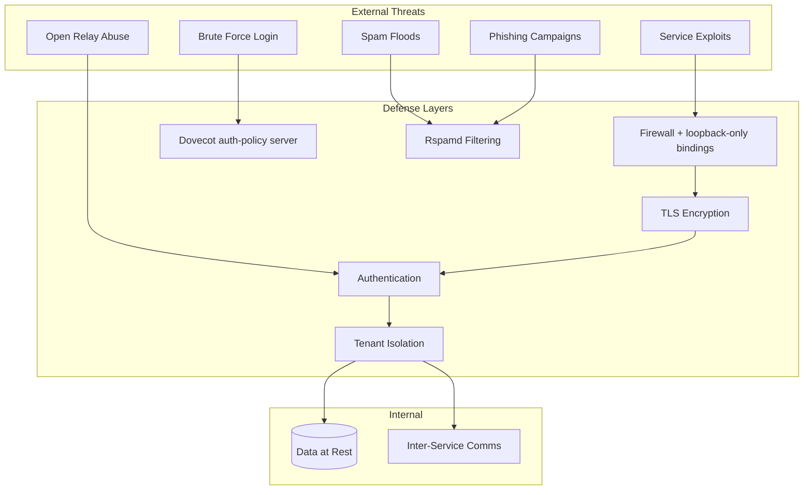

# Security

An email server is a high-value target. It handles credentials, private communications, and is directly exposed to the internet. This section documents how Mailyte is secured and how to keep it that way.

Every control documented in this section is one that actually executes in the deployed code or configuration. Where a capability exists as code but is not wired into the mail path, that status is stated explicitly — a documented control that does not run is worse than no documentation at all.

---

## In this section

-   :material-key:{ .lg .middle } **Authentication**

    ---

    API keys, operator sessions, SMTP SASL, SMTP API-key credentials, and the Dovecot auth cache.

    [:octicons-arrow-right-24: Authentication](authentication.md)

-   :material-shield-account:{ .lg .middle } **Authorization**

    ---

    Multi-tenant isolation, platform vs organization scope, roles, and sender restrictions.

    [:octicons-arrow-right-24: Authorization](authorization.md)

-   :material-lock:{ .lg .middle } **Encryption**

    ---

    TLS configuration, mail_crypt at-rest encryption, envelope-encrypted private keys, DKIM signing.

    [:octicons-arrow-right-24: Encryption](encryption.md)

-   :material-wall:{ .lg .middle } **Network Security**

    ---

    Port exposure, the 2026-08-22 loopback lockdown, Docker network isolation, and ingress rules.

    [:octicons-arrow-right-24: Network security](network-security.md)

-   :material-clipboard-check:{ .lg .middle } **Compliance**

    ---

    GDPR endpoints, data retention, right to erasure, legal holds, and audit logging.

    [:octicons-arrow-right-24: Compliance](compliance.md)

-   :material-bug:{ .lg .middle } **Vulnerability Management**

    ---

    Dependency scanning, image patching, and security update process.

    [:octicons-arrow-right-24: Vulnerability management](vulnerability-management.md)

-   :material-monitor-eye:{ .lg .middle } **Security Monitoring**

    ---

    Detecting attacks, the failed-auth pipeline, and log analysis.

    [:octicons-arrow-right-24: Security monitoring](security-monitoring.md)

-   :material-shield-alert:{ .lg .middle } **Intrusion Detection**

    ---

    The Dovecot auth-policy server, brute-force protection, IP blocking.

    [:octicons-arrow-right-24: Intrusion detection](intrusion-detection.md)

-   :material-checkbox-marked-circle:{ .lg .middle } **Security Checklist**

    ---

    Pre-deployment verification — make sure nothing is missed.

    [:octicons-arrow-right-24: Security checklist](security-checklist.md)

---

## Threat Model

Mailyte faces threats from the internet and from misconfiguration. Here's how the defense layers map to the attack surface:

---

## Defense Layers

| Layer | Protects against | Key technology |
|-------|-----------------|----------------|
| **1. Network** | Unauthorized access, port scanning | Loopback-only bindings (since 2026-08-22), Docker network isolation, Traefik ingress |
| **2. Transport** | Eavesdropping, MITM attacks | TLS 1.2+, STARTTLS, implicit TLS |
| **3. Authentication** | Unauthorized API/SMTP access | API keys, operator sessions, SASL, SMTP API-key credentials |
| **4. Authorization** | Cross-tenant data access | Org-scoped credentials, platform/organization scope split, role gates |
| **5. Spam & Abuse** | Spam floods, outbound abuse, brute force | Rspamd, Postfix rate limits + policy services, Dovecot auth-policy server |
| **6. Monitoring** | Undetected attacks, slow compromise | failed_auth_attempts pipeline, audit_logs, Prometheus, alerting |

### Layer 1: Network

Only mail ports (25/465/587, 143/993, 110/995) and web ingress (80/443 via Traefik) are published to the internet. Since 2026-08-22, `docker-compose.prod.yml` republishes **every** internal service — including previously world-reachable, unauthenticated Prometheus (9090) and Qdrant (6333) — on `127.0.0.1` only.

See: [Network Security](network-security.md)

### Layer 2: Transport Encryption

External connections use TLS 1.2+. SMTP supports STARTTLS (25/587) and implicit TLS (465), and Postfix refuses AUTH on unencrypted connections (`smtpd_tls_auth_only = yes`). Dovecot sets `ssl = required` with `ssl_min_protocol = TLSv1.2`. HTTP APIs are fronted by Traefik with TLS.

See: [Encryption](encryption.md)

### Layer 3: Authentication

API requests require an `X-API-Key` credential (or an operator/mailbox session). SMTP submission requires SASL authentication against Dovecot (bcrypt password hashes). Domain-scoped SMTP API-key credentials with instant revocation went live 2026-08-27. Invalid API-key attempts are rate-limited per IP.

See: [Authentication](authentication.md)

### Layer 4: Authorization

Credentials carry a scope — `organization` (tenant) or `platform` (staff) — and platform routes are unreachable for tenant credentials regardless of their permission flags (ADR-002). Organization scope is forced onto tenant queries server-side.

See: [Authorization](authorization.md)

### Layer 5: Spam and Abuse Prevention

Rspamd filters inbound email (Bayesian, DNSBL, SPF/DKIM/DMARC, greylisting, phishing checks). Postfix enforces per-client connection/rate limits (anvil) plus two live policy services: per-org submission rate limits and per-org IP allowlists. The Dovecot auth-policy server applies progressive delays and blocks brute-force sources.

See: [Intrusion Detection](intrusion-detection.md)

### Layer 6: Monitoring and Detection

Failed logins land in `failed_auth_attempts` (with block/unblock APIs), admin and auth events in `audit_logs`, and mail flow in `mail_logs`/`delivery_events` (since 2026-08-22). Prometheus and the monitoring service track service health and resource pressure.

See: [Security Monitoring](security-monitoring.md)

---

## Security capabilities

| Capability | Status |
|------------|--------|
| **TLS** | Live — TLS 1.2+ on all external connections, auto-renewal via cert_manager |
| **DKIM** | Live — per-domain keys, Rspamd signing; private keys envelope-encrypted at rest |
| **SPF/DMARC/ARC** | Live — validated on inbound by Rspamd |
| **API credential scoping** | Live — org-scoped keys, platform/organization scope split, role gates |
| **SMTP API-key credentials** | Live since 2026-08-27 — domain-scoped, bcrypt-hashed, doveadm-backed instant revocation |
| **SASL auth, no open relay** | Live — Dovecot-backed, TLS-only; sender-login-mismatch enforced on 587/465 |
| **Brute-force protection** | Live — Dovecot auth-policy server (progressive delay, Redis-backed blocking) + API-key attempt limiter. *Fail2ban is not deployed* — the configs in `mailer/intrusion_detection/` are unused unless you install them on the host yourself |
| **Rate limiting** | Live — Postfix anvil limits + per-org policy services + API rate limiter service |
| **Tenant isolation** | Live — org-scoped queries, scope-gated routes |
| **Audit logging** | Live — `audit_logs` table (auth events, API key lifecycle, compliance actions), queryable at `/api/v1/compliance/audit-log` |
| **Auto-healing** | Live — monitoring service restarts failed critical services via a scoped Docker socket proxy |
| **Antivirus (ClamAV)** | **Not deployed** — the Rspamd integration ships disabled (`mailer/rspamd/config/local.d/antivirus.conf`: `enabled = false`) and no ClamAV container exists; enable it yourself if you need attachment scanning |
| **DLP** | **Partial** — policy/violation management APIs and the `dlp` milter service run, but the milter is *not registered in Postfix's `smtpd_milters`*, so no mail is scanned |
| **Geo-blocking** | **Partial** — policy APIs and the `geo_blocking` service run, but no Postfix/Dovecot hook consults it, so no connection is geo-filtered |
| **Mailbox TOTP 2FA** | **Partial** — the `totp` service implements RFC 6238, but nothing in the IMAP/SMTP/webmail auth path enforces it |

---

## Most common security tasks

!!! tip "Start with the checklist"
    If you're deploying Mailyte for the first time, go through the **[Security Checklist](security-checklist.md)** before exposing anything to the internet.

| I want to... | Go to |
|---|---|
| Set up API keys for my app | [Authentication](authentication.md) |
| Give an app SMTP-only send access | [Authentication](authentication.md#smtp-api-key-credentials) |
| Configure TLS certificates | [Encryption](encryption.md) |
| Lock down exposed ports | [Network Security](network-security.md) |
| Block brute-force attacks | [Intrusion Detection](intrusion-detection.md) |
| Ensure GDPR compliance | [Compliance](compliance.md) |
| Monitor for attacks | [Security Monitoring](security-monitoring.md) |
| Run a pre-deployment audit | [Security Checklist](security-checklist.md) |

---

## Reporting Security Issues

If you discover a security vulnerability, please report it responsibly. Do not open a public issue.

Email: `security@mailyte.com`

See `SECURITY.md` in the repository root for the full policy, including the current accepted-risk register.

---

## Related sections

- [Architecture](../architecture/index.md) -- understand the security model in context
- [Getting Started](../getting-started/index.md) -- secure setup from the start
- [Features](../features/index.md) -- security-relevant features like rate limiting and anti-spam
- [Development](../development/index.md) -- security practices for contributors
