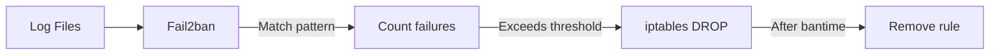

# Intrusion Detection

> **Enterprise Edition** — This feature is available in [Mailyte Enterprise](https://mailyte.com). The Community Edition does not include this functionality.


Fail2ban monitors log files for suspicious patterns and automatically bans offending IPs. It's your automated bouncer.

## How Fail2ban Works

1. Fail2ban watches log files for patterns (filters)
2. When a pattern matches, it counts failures per IP
3. After `maxretry` failures within `findtime`, the IP is banned
4. The ban blocks the IP at the firewall level (iptables)
5. After `bantime`, the IP is automatically unbanned



## Installation

Fail2ban runs on the host (not inside Docker):

```bash
# Ubuntu/Debian
sudo apt install fail2ban

# CentOS/RHEL
sudo yum install fail2ban

# Start and enable
sudo systemctl enable --now fail2ban
```

## Configuration

### Main Config

```ini
# /etc/fail2ban/jail.local
[DEFAULT]
# Ban for 1 hour by default
bantime = 3600

# Look at the last 10 minutes
findtime = 600

# Ban after 5 failures
maxretry = 5

# Don't ban these IPs
ignoreip = 127.0.0.1/8 ::1 10.0.0.0/8 172.16.0.0/12

# Send notifications
action = %(action_mwl)s

# Use iptables for banning
banaction = iptables-multiport
```

## Jail Rules

### SMTP Authentication (Postfix/Dovecot)

```ini
# /etc/fail2ban/jail.d/mailyte-smtp.conf
[mailyte-smtp-auth]
enabled = true
port = 25,465,587
filter = mailyte-smtp-auth
logpath = /path/to/mailyte/logs/mailer/dovecot/auth.log
          /path/to/mailyte/logs/mailer/postfix/maillog
maxretry = 5
findtime = 600
bantime = 3600
```

Filter:

```ini
# /etc/fail2ban/filter.d/mailyte-smtp-auth.conf
[Definition]
failregex = .*auth.*fail.*rip=<HOST>.*
            .*Password mismatch.*rip=<HOST>.*
            .*warning.*authentication failed.*\[<HOST>\].*
            .*SASL.*authentication failed.*\[<HOST>\].*

ignoreregex =
```

### IMAP/POP3 Authentication

```ini
# /etc/fail2ban/jail.d/mailyte-imap.conf
[mailyte-imap-auth]
enabled = true
port = 143,993,110,995
filter = mailyte-imap-auth
logpath = /path/to/mailyte/logs/mailer/dovecot/auth.log
maxretry = 5
findtime = 600
bantime = 3600
```

Filter:

```ini
# /etc/fail2ban/filter.d/mailyte-imap-auth.conf
[Definition]
failregex = .*imap-login.*Login failed.*rip=<HOST>.*
            .*pop3-login.*Login failed.*rip=<HOST>.*
            .*auth.*fail.*rip=<HOST>.*

ignoreregex =
```

### API Authentication

```ini
# /etc/fail2ban/jail.d/mailyte-api.conf
[mailyte-api-auth]
enabled = true
port = 443,8083
filter = mailyte-api-auth
logpath = /path/to/mailyte/logs/worker/api/*.log
maxretry = 10
findtime = 600
bantime = 1800
```

Filter:

```ini
# /etc/fail2ban/filter.d/mailyte-api-auth.conf
[Definition]
failregex = .*<HOST>.*401.*Unauthorized.*
            .*<HOST>.*403.*Forbidden.*

ignoreregex = .*health.*
              .*metrics.*
```

### Postfix Relay Abuse

```ini
# /etc/fail2ban/jail.d/mailyte-relay.conf
[mailyte-postfix-relay]
enabled = true
port = 25,465,587
filter = mailyte-postfix-relay
logpath = /path/to/mailyte/logs/mailer/postfix/maillog
maxretry = 3
findtime = 600
bantime = 7200
```

Filter:

```ini
# /etc/fail2ban/filter.d/mailyte-postfix-relay.conf
[Definition]
failregex = .*NOQUEUE: reject.*Relay access denied.*\[<HOST>\].*
            .*NOQUEUE: reject.*Recipient address rejected.*\[<HOST>\].*

ignoreregex =
```

## Ban Durations

| Jail | Max Retries | Find Time | Ban Time | Rationale |
|------|------------|-----------|----------|-----------|
| SMTP auth | 5 | 10 min | 1 hour | Brute force prevention |
| IMAP auth | 5 | 10 min | 1 hour | Brute force prevention |
| API auth | 10 | 10 min | 30 min | Higher threshold for API clients |
| Relay abuse | 3 | 10 min | 2 hours | Aggressive — relay probing is bad |

### Progressive Banning

For repeat offenders, increase ban duration:

```ini
# /etc/fail2ban/jail.d/mailyte-recidive.conf
[recidive]
enabled = true
filter = recidive
logpath = /var/log/fail2ban.log
banaction = iptables-allports
maxretry = 3
findtime = 86400     # 24 hours
bantime = 604800     # 1 week
```

This bans IPs that get banned 3 or more times within 24 hours for a full week.

## Whitelisting

### Always Whitelist

- Your own server IPs
- Your office IPs
- Known monitoring service IPs
- Docker internal network (172.16.0.0/12)

```ini
# In jail.local [DEFAULT]
ignoreip = 127.0.0.1/8 ::1 10.0.0.0/8 172.16.0.0/12 YOUR_OFFICE_IP
```

### Temporary Whitelist

```bash
# Whitelist an IP for testing
sudo fail2ban-client set mailyte-smtp-auth addignoreip 203.0.113.100

# Remove whitelist
sudo fail2ban-client set mailyte-smtp-auth delignoreip 203.0.113.100
```

## Managing Bans

```bash
# Check status of all jails
sudo fail2ban-client status

# Check a specific jail
sudo fail2ban-client status mailyte-smtp-auth

# Manually ban an IP
sudo fail2ban-client set mailyte-smtp-auth banip 203.0.113.50

# Manually unban an IP
sudo fail2ban-client set mailyte-smtp-auth unbanip 203.0.113.50

# Check if an IP is banned
sudo fail2ban-client get mailyte-smtp-auth banned | grep 203.0.113.50

# View all currently banned IPs
sudo fail2ban-client banned
```

## Monitoring Fail2ban

### Prometheus Metrics

Export Fail2ban stats to Prometheus:

```bash
# /var/lib/node-exporter/textfile/fail2ban.prom
# Updated by cron every minute
#!/bin/bash
for jail in mailyte-smtp-auth mailyte-imap-auth mailyte-api-auth mailyte-postfix-relay; do
  banned=$(sudo fail2ban-client status $jail 2>/dev/null | grep "Currently banned" | awk '{print $NF}')
  total=$(sudo fail2ban-client status $jail 2>/dev/null | grep "Total banned" | awk '{print $NF}')
  echo "fail2ban_banned_current{jail=\"$jail\"} ${banned:-0}"
  echo "fail2ban_banned_total{jail=\"$jail\"} ${total:-0}"
done > /var/lib/node-exporter/textfile/fail2ban.prom
```

### Alert on High Ban Rate

```yaml
- alert: HighBanRate
  expr: rate(fail2ban_banned_total[1h]) > 10
  for: 10m
  labels:
    severity: warning
  annotations:
    summary: "High ban rate on {{ $labels.jail }}: {{ $value }} bans/hour"
```

## Testing

### Test a Filter

```bash
# Test if the filter matches log lines
sudo fail2ban-regex /path/to/mailyte/logs/mailer/dovecot/auth.log /etc/fail2ban/filter.d/mailyte-imap-auth.conf
```

### Simulate a Ban

```bash
# Trigger 5 failed logins from a test IP (from another machine)
for i in {1..5}; do
  openssl s_client -connect mail.yourdomain.com:993 < /dev/null
done

# Check if the IP got banned
sudo fail2ban-client status mailyte-imap-auth
```
