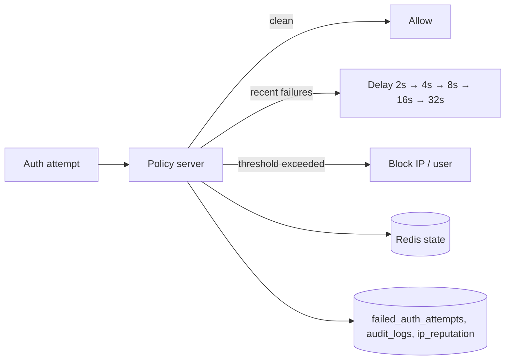

# Intrusion Detection

Brute-force protection in Mailyte is built into the auth path itself, not bolted on as a log-watcher.

!!! warning "Fail2ban is not part of the deployed stack"
    The repository carries Fail2ban filter/jail configs and helper scripts under `mailer/intrusion_detection/`, but **nothing installs or runs them** — no container includes fail2ban, and no compose service references that directory. Treat it as optional host-level scaffolding (see [Optional: host-level Fail2ban](#optional-host-level-fail2ban)). The controls documented below are the ones that actually execute.

## The Dovecot Auth-Policy Server

Every IMAP/POP3/SMTP authentication passes through a policy server (`mailer/dovecot/scripts/dovecot-auth-policy.py`, run by supervisord inside the Dovecot container and wired in `dovecot.conf`):

```
auth_policy_server_url = http://127.0.0.1:8090/
auth_policy_check_before_auth = yes
auth_policy_check_after_auth = yes
auth_policy_report_after_auth = yes
auth_policy_reject_on_fail = no     # policy-server outage degrades open, never blocks all auth
```

### What it does



- **Progressive delay:** exponential backoff per failure count — `2^(failures-1) * 2s`, capped at 60 s. Slows credential-stuffing to uselessness without hard-locking real users who typo once.
- **IP blocking:** after `MAX_AUTH_FAILURES_PER_IP` (default **10**) failures within the window, the IP is blocked.
- **Per-user blocking:** after `MAX_AUTH_FAILURES_PER_USER` (default **5**) failures, the account is protected regardless of source IP spread.
- **Windows:** failures are counted over `AUTH_FAILURE_WINDOW_SECS` (default **900 s / 15 min**); blocks last `AUTH_BLOCK_DURATION_SECS` (default **3600 s / 1 hour**).
- **Redis-backed state** — survives container restarts and is shared across instances.
- **Every failure is recorded** in MySQL: an upsert into `failed_auth_attempts` (IP, username, service, attempt count, timestamps), an `auth.failed` row in `audit_logs`, and a negative adjustment to `ip_reputation`.

### Tuning

Set these in the Dovecot container's environment:

| Variable | Default | Meaning |
|----------|---------|---------|
| `MAX_AUTH_FAILURES_PER_IP` | 10 | IP block threshold |
| `MAX_AUTH_FAILURES_PER_USER` | 5 | Per-account threshold |
| `AUTH_FAILURE_WINDOW_SECS` | 900 | Counting window |
| `AUTH_BLOCK_DURATION_SECS` | 3600 | Block duration |

## API-Level Brute-Force Protection

Independently of SMTP/IMAP, the API gateway rate-limits invalid `X-API-Key` attempts: **20 invalid keys per 5 minutes per IP**, exponential backoff from the 5th failure, `429` once blocked — checked before the key lookup so a blocked client gets no free guesses.

## Managing Blocks: the Security API

The `/api/v1/security` routes (platform scope) expose the failed-auth pipeline for operators:

| Endpoint | What it does |
|----------|-------------|
| `GET /api/v1/security/failed-auth` | List failed auth attempts (filter by IP, user, service, time range) |
| `GET /api/v1/security/failed-auth/summary` | Hourly buckets, top offender IPs |
| `POST /api/v1/security/failed-auth/{ip}/block` | Manually block an IP (`blocked_until`) |
| `DELETE /api/v1/security/failed-auth/{ip}/block` | Unblock (attempt counters are kept as evidence) |
| `GET/POST/PUT/DELETE /api/v1/security/ip-rules` | Per-organization SMTP IP allow/deny rules (`ip_access_rules`) — enforced live by the Postfix `policy-ip-access` service |

## Postfix-Level Abuse Controls

Rate and connection abuse on the SMTP side is handled inside Postfix (`main.cf`):

```
smtpd_client_connection_rate_limit = 30
smtpd_client_connection_count_limit = 50
smtpd_client_message_rate_limit = 100
smtpd_client_recipient_rate_limit = 200
anvil_rate_time_unit = 60s
```

Plus two live policy services in the submission path (`master.cf`):

- `policy-rate-limit` — per-organization submission rate limits
- `policy-ip-access` — per-organization IP allowlists

And Rspamd contributes greylisting, DNSBL checks, and phishing detection on inbound mail.

## Relay Probing

Relay attempts are rejected by the restriction chain (`permit_mynetworks` covers only loopback; everything unauthenticated to a non-local recipient hits `reject_unauth_destination`). Watch for probes in the Postfix log:

```bash
docker compose logs postfix | grep "Relay access denied" | tail -20
```

## Monitoring Intrusion Attempts

```sql
-- Top attacking IPs, last 24h
SELECT client_ip, SUM(attempt_count) AS attempts, MAX(last_attempt_at)
FROM failed_auth_attempts
WHERE last_attempt_at >= NOW() - INTERVAL 24 HOUR
GROUP BY client_ip ORDER BY attempts DESC LIMIT 20;

-- Currently blocked IPs
SELECT client_ip, blocked_until FROM failed_auth_attempts
WHERE blocked_until > NOW();
```

Or use the summary endpoint, which powers the console's security screens:

```bash
curl -s -H "X-API-Key: $PLATFORM_KEY" \
  "https://<api-host>/api/v1/security/failed-auth/summary?hours=24" | python3 -m json.tool
```

!!! note "Grafana's brute-force panels are empty by design"
    The provisioned security dashboard queries Prometheus series (`auth_failures_total`, `blocked_ips_total`) that no service exports. The live data is in the tables and endpoints above. See [Security Monitoring](security-monitoring.md).

## Optional: Host-Level Fail2ban

If you want firewall-level bans on top of the built-in protection, the unused configs in `mailer/intrusion_detection/` (filters for Postfix/Dovecot auth failures, a webhook ban action, and `scripts/install.sh`) can be installed on the **host**. Points to check before relying on them:

- Fail2ban must run on the host, not in a container, to program iptables
- The `logpath` values must point at the bind-mounted log directories (`logs/mailer/...`) — verify the filters actually match your current log format with `fail2ban-regex` before trusting a jail
- Whitelist your own IPs and the Docker subnets (`ignoreip = 127.0.0.1/8 ::1 172.16.0.0/12 <your-ips>`) or auto-healing traffic can ban your own infrastructure

This path is unmaintained relative to the built-in controls — treat it as an add-on you own, not a shipped feature.
