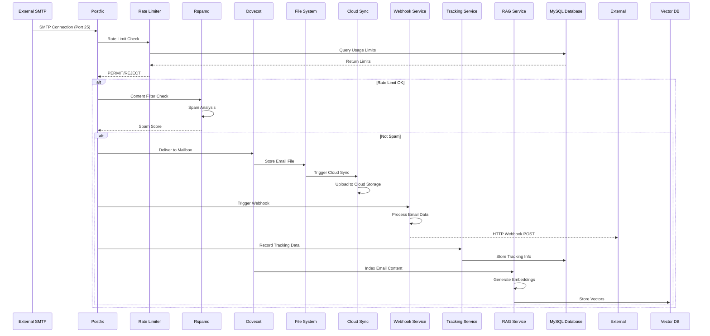
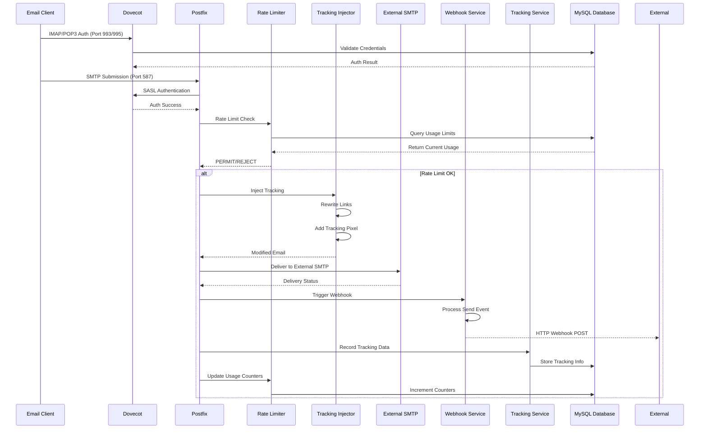
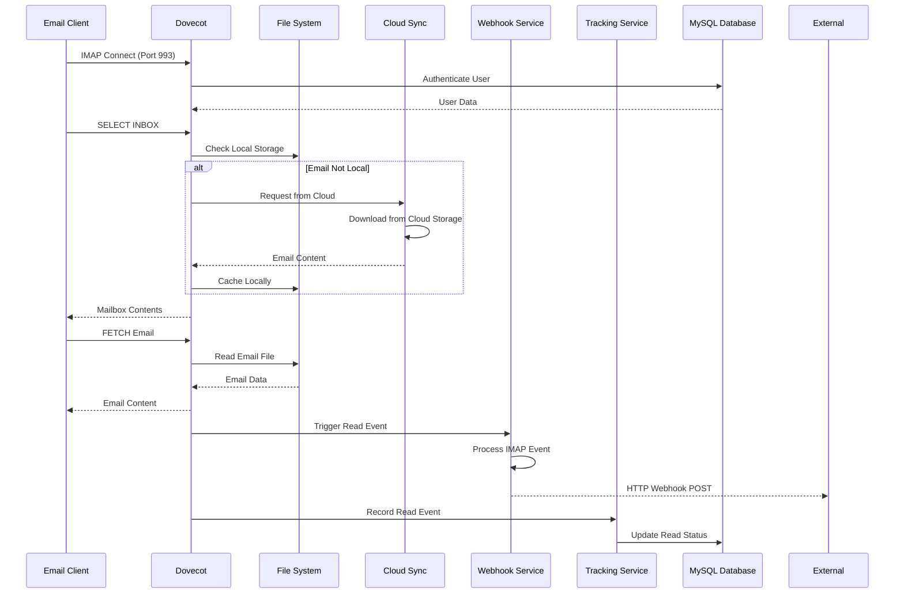
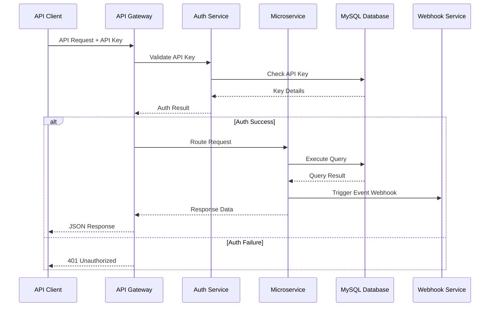
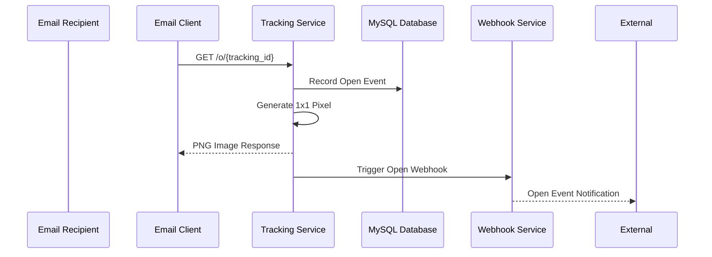
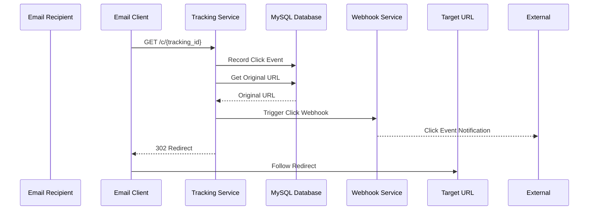
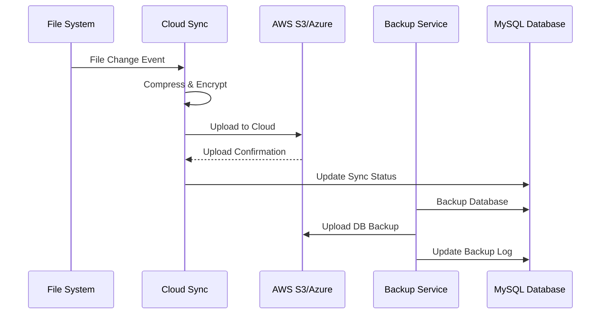
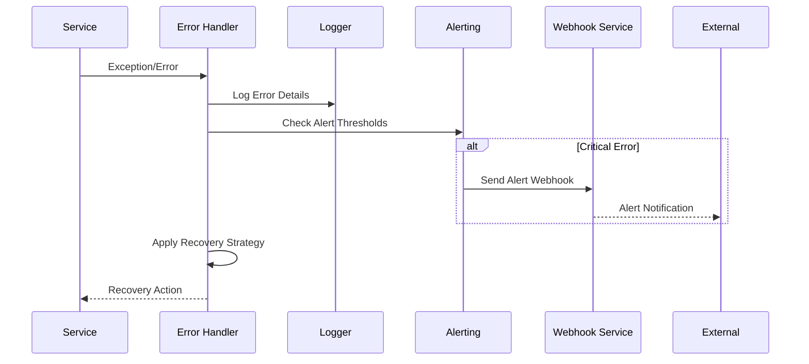
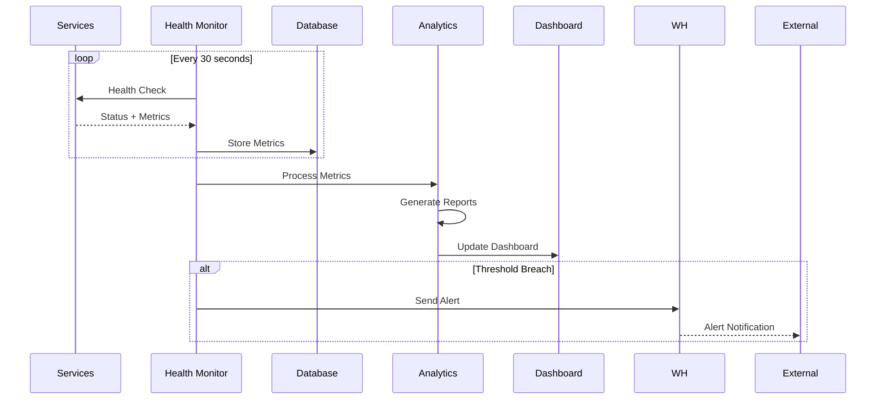

# Data Flow Architecture

This document provides a comprehensive overview of how data flows through the Enterprise Mail Server system, covering all major processes and interactions.

## Overview

The Enterprise Mail Server processes data through multiple interconnected flows:
1. **Email Processing Flow**: Handling inbound and outbound emails
2. **Authentication Flow**: User and API authentication
3. **Tracking Flow**: Email open and click tracking
4. **Webhook Flow**: Real-time event notifications
5. **Analytics Flow**: Data collection and reporting
6. **Storage Flow**: Data persistence and cloud synchronization

## Inbound Email Processing Flow



### Detailed Process Steps

#### 1. SMTP Reception (Postfix)
```python
# Postfix policy daemon interaction
{
    "request": "smtpd_access_policy",
    "protocol_state": "RCPT",
    "protocol_name": "SMTP",
    "client_address": "203.0.113.1",
    "client_name": "mail.external.com",
    "reverse_client_name": "mail.external.com",
    "helo_name": "mail.external.com",
    "sender": "sender@external.com",
    "recipient": "user@yourdomain.com",
    "recipient_count": "1",
    "queue_id": "A1B2C3D4E5",
    "instance": "postfix/smtpd[1234]",
}
```

#### 2. Rate Limiting Check
```sql
-- Rate limiter queries
SELECT 
    hourly_limit, 
    daily_limit, 
    monthly_limit,
    current_hourly_count,
    current_daily_count,
    current_monthly_count
FROM rate_limits 
WHERE identifier = 'sender@external.com' 
  AND type = 'inbound';
```

#### 3. Content Filtering (Rspamd)
```json
{
    "spam_score": 2.1,
    "required_score": 15.0,
    "action": "no action",
    "symbols": {
        "DKIM_SIGNED": -0.1,
        "SPF_PASS": -0.1,
        "RCVD_IN_DNSWL_LOW": -0.1
    }
}
```

#### 4. Email Storage
```bash
# File system structure
/var/mail/vhosts/yourdomain.com/user/
├── cur/           # Current messages
├── new/           # New messages
├── tmp/           # Temporary files
└── dovecot.index* # Index files
```

#### 5. Webhook Notification
```json
{
    "event": "email.smtp.inbound",
    "timestamp": "2024-01-15T10:30:00Z",
    "payload": {
        "direction": "inbound",
        "protocol": "smtp",
        "metadata": {
            "message_id": "<msg@external.com>",
            "subject": "Test Email",
            "from": "sender@external.com",
            "to": "user@yourdomain.com",
            "size": 12345,
            "has_attachments": true
        },
        "delivery_info": {
            "recipient": "user@yourdomain.com",
            "sender": "sender@external.com",
            "client_ip": "203.0.113.1",
            "delivery_status": "received"
        }
    },
    "eml_file": {
        "content_base64": "encoded_content",
        "size": 12345
    }
}
```

## Outbound Email Processing Flow



### Tracking Injection Process

#### Link Rewriting
```python
# Original link
original_url = "https://example.com/page"

# Rewritten tracking link
tracking_url = f"https://track.yourdomain.com/c/{tracking_id}"
```

#### Pixel Injection
```html
<!-- Tracking pixel inserted before </body> tag -->

```

## IMAP/POP3 Access Flow



## API Request Flow



### API Authentication Flow
```python
# API key validation
api_key_hash = hashlib.sha256(api_key.encode()).hexdigest()
query = """
    SELECT id, permissions, rate_limit, active 
    FROM api_keys 
    WHERE key_hash = %s AND active = 1
"""
result = db.execute(query, (api_key_hash,))
```

## Tracking Data Flow

### Open Tracking


### Click Tracking


## Storage and Backup Flow



## Error Handling Flow



## Performance Monitoring Flow



This comprehensive data flow documentation provides developers with a complete understanding of how data moves through the system, enabling them to build upon and extend the existing architecture effectively.
