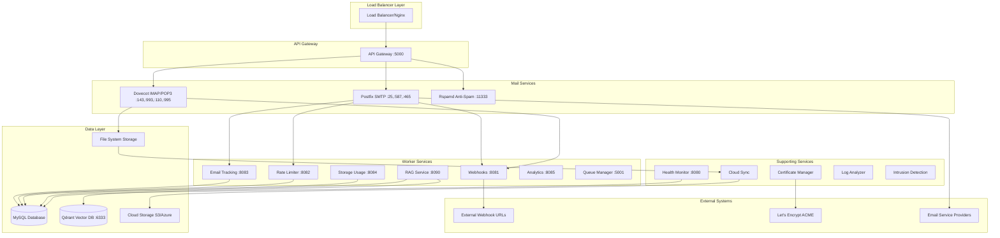

# Architecture Overview

The Enterprise Mail Server is built as a containerized microservices architecture designed for scalability, reliability, and enterprise-grade performance.

## System Architecture



## Core Components

### Mail Transfer Agent (MTA)
- **Postfix**: Primary SMTP server handling inbound/outbound email
- **Port Configuration**: 25 (SMTP), 587 (Submission), 465 (SMTPS)
- **Features**: Virtual domains, authentication, rate limiting, content filtering

### Mail Delivery Agent (MDA)
- **Dovecot**: IMAP/POP3 server for email retrieval
- **Port Configuration**: 143 (IMAP), 993 (IMAPS), 110 (POP3), 995 (POP3S)
- **Features**: Virtual users, quota management, authentication

### Anti-Spam Engine
- **Rspamd**: Advanced spam filtering and content analysis
- **Port Configuration**: 11333 (HTTP API)
- **Features**: Bayesian filtering, DKIM signing, greylisting

## Microservices Architecture

### API Gateway (Port 5000)
Central API endpoint that orchestrates all services:
- Domain management
- Mailbox operations
- Alias configuration
- Statistics and monitoring
- Rate limit management

### Webhook Service (Port 8081)
Real-time event notification system:
- Email event capture (inbound/outbound)
- IMAP/POP3 activity tracking
- Configurable webhook URLs
- Retry mechanisms and failure handling

### Email Tracking Service (Port 8083)
Advanced email tracking capabilities:
- Open tracking (pixel beacons)
- Click tracking (link rewriting)
- Geolocation and device detection
- Privacy-compliant analytics

### Rate Limiter Service (Port 8082)
Dynamic rate limiting and abuse prevention:
- Per-user, per-domain, per-organization limits
- Configurable time windows (hourly, daily, monthly)
- Real-time usage monitoring
- Alert thresholds

### RAG Service (Port 8090)
Retrieval-Augmented Generation for email intelligence:
- Vector database integration (Qdrant)
- Email content indexing
- Semantic search capabilities
- AI-powered email analytics

### Storage Usage Service (Port 8084)
Storage monitoring and quota management:
- Disk usage calculation
- Quota enforcement
- Storage alerts and notifications
- Cloud storage synchronization metrics

### Analytics Service (Port 8085)
Comprehensive email analytics:
- Delivery statistics
- Engagement metrics
- Performance monitoring
- Custom reporting

## Data Flow Architecture

### Inbound Email Flow
```
External SMTP → Postfix (Port 25) → Rate Limiter → Rspamd → Dovecot → Storage
                      ↓
                 Webhook Service → External Webhooks
                      ↓
                 Tracking Service → Database
                      ↓
                 RAG Service → Vector Database
```

### Outbound Email Flow
```
Email Client → Dovecot (Auth) → Postfix (Port 587) → Rate Limiter → External ISP
                                        ↓
                                   Tracking Injection
                                        ↓
                                   Webhook Notification
                                        ↓
                                   Analytics Recording
```

### API Request Flow
```
Client → API Gateway (Port 5000) → Service Router → Microservice → Database
                                                        ↓
                                                   Response Cache
                                                        ↓
                                                   Webhook Trigger
```

## Security Architecture

### Authentication Layers
1. **API Authentication**: JWT tokens and API keys
2. **SMTP Authentication**: SASL via Dovecot
3. **Service Authentication**: Internal service tokens

### Encryption Standards
- **TLS 1.2/1.3**: All inter-service communication
- **AES-256**: Database encryption at rest
- **RSA-2048**: DKIM signing keys
- **Let's Encrypt**: Automatic SSL certificate management

### Access Control
- **Role-based permissions**: Admin, user, read-only
- **IP whitelisting**: Configurable per service
- **Rate limiting**: Per-user and per-IP restrictions

## Scalability Design

### Horizontal Scaling
- **Stateless services**: All worker services are stateless
- **Load balancing**: Nginx upstream configuration
- **Database clustering**: MySQL master-slave replication
- **Storage scaling**: Cloud storage integration

### Vertical Scaling
- **Resource allocation**: Configurable CPU/memory per service
- **Queue management**: Asynchronous processing
- **Connection pooling**: Database connection optimization

## High Availability

### Service Redundancy
- **Health checks**: Automated service monitoring
- **Auto-restart**: Docker compose restart policies
- **Graceful degradation**: Service fallback mechanisms

### Data Redundancy
- **Database replication**: Master-slave MySQL setup
- **Cloud backup**: Automated S3/Azure sync
- **Point-in-time recovery**: Transaction log backups

### Monitoring & Alerting
- **Health Monitor**: Centralized service status (Port 8080)
- **Metrics collection**: Performance and usage statistics
- **Alert thresholds**: Configurable warning levels
- **Webhook notifications**: Real-time alert delivery
