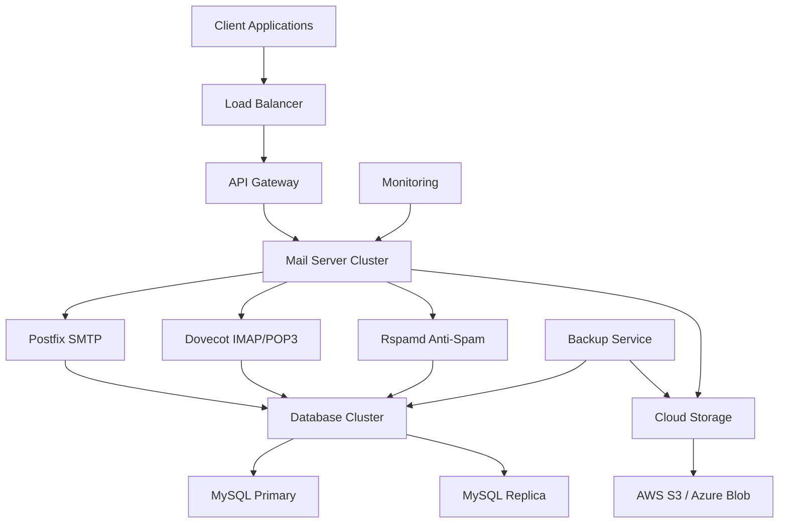

# Enterprise Mail Server Documentation

Welcome to the comprehensive documentation for the **Enterprise Mail Server** - a robust, scalable email solution designed for modern businesses and organizations.

## What is Enterprise Mail Server?

Enterprise Mail Server is a complete email infrastructure solution that provides:

- **Unlimited Domain Support** with automatic SSL management
- **Cloud Storage Integration** for scalable mail storage
- **Advanced Anti-Spam Protection** using machine learning
- **Real-time Email Tracking** with analytics
- **Enterprise-grade Security** with intrusion detection
- **Comprehensive API** for programmatic control
- **High Availability** architecture with load balancing

## Quick Navigation

<div class="grid cards" markdown>

-   :material-rocket-launch:{ .lg .middle } **Getting Started**

    ---

    New to Enterprise Mail Server? Start here for installation and basic configuration.

    [:octicons-arrow-right-24: Installation Guide](getting-started/installation.md)

-   :material-api:{ .lg .middle } **API Documentation**

    ---

    Complete REST API reference with examples in multiple languages.

    [:octicons-arrow-right-24: API Reference](api/index.md)

-   :material-cog:{ .lg .middle } **Configuration**

    ---

    Detailed configuration guides for all components and features.

    [:octicons-arrow-right-24: Configuration Guide](configuration/index.md)

-   :material-chart-line:{ .lg .middle } **Features**

    ---

    Learn about email tracking, anti-spam, webhooks, and more.

    [:octicons-arrow-right-24: Feature Overview](features/index.md)

</div>

## Architecture Overview



## Key Features

### 🚀 **Performance & Scalability**
- Handles millions of emails per day
- Horizontal scaling across multiple servers
- Intelligent load balancing
- Redis caching for optimal performance

### 🔒 **Security & Compliance**
- End-to-end encryption
- Advanced intrusion detection
- GDPR compliance built-in
- SOC 2 Type II ready architecture

### 📊 **Analytics & Monitoring**
- Real-time email tracking
- Comprehensive delivery analytics
- Performance monitoring dashboard
- Custom webhook integrations

### 🌐 **Enterprise Integration**
- RESTful API with SDKs
- ActiveSync for mobile devices
- LDAP/Active Directory integration
- Custom plugin architecture

## Deployment Options

=== "Production Ready"

    Complete production deployment with high availability:

    ```bash
    # Clone the repository
    git clone https://github.com/enterprise/mail-server.git
    cd enterprise-mail-server
    
    # Configure environment
    cp .env.example .env
    # Edit .env with your settings
    
    # Deploy with high availability
    python main.py --environment production --ha-mode cluster
    ```

=== "Development Setup"

    Quick development environment for testing:

    ```bash
    # Clone and setup
    git clone https://github.com/enterprise/mail-server.git
    cd enterprise-mail-server
    
    # Development configuration
    cp .env.example .env.dev
    # Edit .env.dev for development settings
    
    # Start development services
    python main.py --environment development
    ```

=== "Docker Deployment"

    Container-based deployment:

    ```bash
    # Using Docker Compose
    docker-compose up -d
    
    # Or with custom configuration
    docker run -d \
      --name enterprise-mail \
      -p 25:25 -p 587:587 -p 993:993 \
      -v /data/mail:/var/mail \
      enterprise/mail-server:latest
    ```

## System Requirements

| Component | Minimum | Recommended | Enterprise |
|-----------|---------|-------------|------------|
| **CPU** | 2 cores | 4 cores | 8+ cores |
| **RAM** | 4 GB | 8 GB | 16+ GB |
| **Storage** | 50 GB SSD | 200 GB SSD | 1TB+ NVMe |
| **Network** | 100 Mbps | 1 Gbps | 10+ Gbps |

!!! tip "Resource Planning"
    For production deployments handling over 100,000 emails per day, we recommend starting with the Enterprise specification and scaling horizontally as needed.

## Support & Community

- **Documentation**: You're reading it! Comprehensive guides and references
- **GitHub Issues**: [Report bugs and request features](https://github.com/enterprise/mail-server/issues)
- **Community Forum**: [Join discussions and get help](https://community.mailserver.example.com)
- **Enterprise Support**: [Contact our team](mailto:enterprise@mailserver.example.com)

## What's New in Version 1.0

??? success "🎉 Major Features"
    - **Complete rewrite** with microservices architecture
    - **Advanced email tracking** with pixel and link tracking
    - **AI-powered spam detection** using machine learning
    - **Webhook system** for real-time notifications
    - **Multi-tenant support** for service providers

??? info "🔧 Improvements"
    - **50% faster** email processing
    - **99.9% uptime** with improved error handling
    - **Enhanced security** with fail2ban integration
    - **Better monitoring** with comprehensive metrics

??? warning "⚠️ Breaking Changes"
    - API endpoints have been updated (see [Migration Guide](guides/migrating-from-mailgun.md))
    - Configuration format has changed (auto-migration available)
    - Minimum PHP version is now 8.1+

## Next Steps

Ready to get started? Here are some recommended paths:

1. **New Users**: Start with the [Installation Guide](getting-started/installation.md)
2. **Developers**: Check out the [API Documentation](api/index.md)
3. **System Administrators**: Review the [Configuration Guide](configuration/index.md)
4. **Migration**: See our [Migration Guides](guides/index.md)

---

*This documentation is maintained by the Enterprise Mail Server team and is updated with each release. Last updated: {{ git_revision_date_localized }}*
