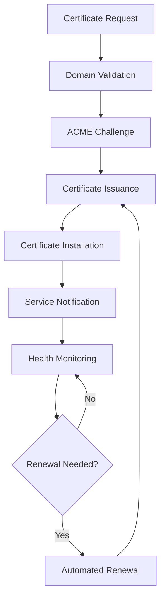

# Certificate Manager

The Certificate Manager is a critical component of the Enterprise Mail Server that handles SSL/TLS certificate management, including automated provisioning, renewal, and validation for secure email communication.

## Overview

The Certificate Manager provides enterprise-grade SSL/TLS certificate management with support for:

- **Automated Certificate Provisioning**: Let's Encrypt integration with ACME protocol
- **Multi-Domain Support**: Wildcard and SAN certificates for complex deployments  
- **Certificate Renewal**: Automated renewal with configurable thresholds
- **Custom CA Support**: Integration with enterprise Certificate Authorities
- **Health Monitoring**: Certificate expiration monitoring and alerting
- **API Integration**: RESTful API for certificate management operations

## Architecture

### Core Components

```
cert_manager/
├── scripts/
│   └── cert_manager.py          # Main certificate management logic
├── Dockerfile                   # Container configuration
├── README.md                   # Module documentation
└── requirements.txt            # Python dependencies
```

### Certificate Management Flow



## Configuration

### Environment Variables

```bash
# Certificate Authority Configuration
CERT_CA_TYPE=letsencrypt              # letsencrypt, custom, self-signed
CERT_ACME_STAGING=false              # Use staging environment for testing
CERT_ACME_EMAIL=admin@company.com    # Contact email for certificate authority

# Certificate Management
CERT_RENEWAL_DAYS=30                 # Days before expiration to renew
CERT_KEY_SIZE=2048                   # RSA key size (2048, 4096)
CERT_VALIDATION_METHOD=http-01       # http-01, dns-01, tls-alpn-01

# Storage Configuration
CERT_STORAGE_PATH=/etc/ssl/certs     # Certificate storage directory
CERT_BACKUP_ENABLED=true             # Enable certificate backups
CERT_BACKUP_RETENTION=90             # Backup retention in days

# DNS Challenge Configuration (for dns-01)
CERT_DNS_PROVIDER=cloudflare         # DNS provider for DNS challenges
CERT_DNS_API_TOKEN=your_api_token    # DNS provider API token

# Monitoring
CERT_HEALTH_CHECK_INTERVAL=3600      # Health check interval in seconds
CERT_WEBHOOK_URL=http://webhooks:8081/cert-events # Webhook notifications
```

### Docker Configuration

```dockerfile
FROM python:3.11-slim

WORKDIR /app

# Install system dependencies
RUN apt-get update && apt-get install -y \
    openssl \
    certbot \
    python3-certbot-dns-cloudflare \
    cron \
    curl \
    && rm -rf /var/lib/apt/lists/*

# Copy requirements and install Python dependencies
COPY requirements.txt .
RUN pip install --no-cache-dir -r requirements.txt

# Copy application files
COPY scripts/ ./scripts/
COPY config/ ./config/

# Create necessary directories
RUN mkdir -p /etc/ssl/certs /var/log/cert-manager

# Set up cron for automatic renewal
RUN echo "0 2 * * * root /app/scripts/cert_manager.py renew >> /var/log/cert-manager/renewal.log 2>&1" >> /etc/crontab

# Health check
HEALTHCHECK --interval=30s --timeout=10s --start-period=5s --retries=3 \
    CMD python3 /app/scripts/cert_manager.py health-check

EXPOSE 8086

CMD ["python3", "/app/scripts/cert_manager.py", "daemon"]
```

## Implementation Details

### Certificate Management Script

```python
#!/usr/bin/env python3
"""
Enterprise Certificate Manager
Handles SSL/TLS certificate lifecycle management
"""

import os
import sys
import json
import time
import logging
import requests
import subprocess
from datetime import datetime, timedelta
from cryptography import x509
from cryptography.hazmat.backends import default_backend
from cryptography.x509.oid import NameOID

# Configure logging
logging.basicConfig(
    level=logging.INFO,
    format="%(asctime)s - %(name)s - %(levelname)s - %(message)s",
    handlers=[
        logging.FileHandler("/var/log/cert-manager/cert-manager.log"),
        logging.StreamHandler(),
    ],
)
logger = logging.getLogger("cert-manager")


class CertificateManager:
    def __init__(self):
        self.config = self._load_config()
        self.cert_path = self.config.get("CERT_STORAGE_PATH", "/etc/ssl/certs")
        self.renewal_days = int(self.config.get("CERT_RENEWAL_DAYS", 30))
        self.ca_type = self.config.get("CERT_CA_TYPE", "letsencrypt")

    def _load_config(self):
        """Load configuration from environment variables"""
        return {
            "CERT_CA_TYPE": os.getenv("CERT_CA_TYPE", "letsencrypt"),
            "CERT_ACME_STAGING": os.getenv("CERT_ACME_STAGING", "false").lower() == "true",
            "CERT_ACME_EMAIL": os.getenv("CERT_ACME_EMAIL", "admin@example.com"),
            "CERT_RENEWAL_DAYS": os.getenv("CERT_RENEWAL_DAYS", "30"),
            "CERT_KEY_SIZE": os.getenv("CERT_KEY_SIZE", "2048"),
            "CERT_VALIDATION_METHOD": os.getenv("CERT_VALIDATION_METHOD", "http-01"),
            "CERT_STORAGE_PATH": os.getenv("CERT_STORAGE_PATH", "/etc/ssl/certs"),
            "CERT_WEBHOOK_URL": os.getenv("CERT_WEBHOOK_URL", ""),
            "CERT_DNS_PROVIDER": os.getenv("CERT_DNS_PROVIDER", ""),
            "CERT_DNS_API_TOKEN": os.getenv("CERT_DNS_API_TOKEN", ""),
        }

    def provision_certificate(self, domain, domain_list=None):
        """Provision a new SSL certificate for domain(s)"""
        logger.info(f"Provisioning certificate for domain: {domain}")

        try:
            if self.ca_type == "letsencrypt":
                return self._provision_letsencrypt(domain, domain_list)
            elif self.ca_type == "custom":
                return self._provision_custom_ca(domain, domain_list)
            else:
                return self._provision_self_signed(domain)

        except Exception as e:
            logger.error(f"Certificate provisioning failed: {e}")
            self._notify_webhook(
                "certificate_provision_failed", {"domain": domain, "error": str(e)}
            )
            return False

    def _provision_letsencrypt(self, domain, domain_list=None):
        """Provision Let's Encrypt certificate"""
        cmd = [
            "certbot",
            "certonly",
            "--non-interactive",
            "--agree-tos",
            "--email",
            self.config["CERT_ACME_EMAIL"],
            "--cert-name",
            domain,
        ]

        # Add staging flag if configured
        if self.config["CERT_ACME_STAGING"]:
            cmd.append("--staging")

        # Configure validation method
        validation_method = self.config["CERT_VALIDATION_METHOD"]
        if validation_method == "http-01":
            cmd.extend(["--webroot", "--webroot-path", "/var/www/html"])
        elif validation_method == "dns-01":
            dns_provider = self.config["CERT_DNS_PROVIDER"]
            if dns_provider == "cloudflare":
                cmd.extend(
                    [
                        "--dns-cloudflare",
                        "--dns-cloudflare-credentials",
                        "/etc/letsencrypt/cloudflare.ini",
                    ]
                )

        # Add domains
        if domain_list:
            for d in domain_list:
                cmd.extend(["-d", d])
        else:
            cmd.extend(["-d", domain])

        try:
            result = subprocess.run(cmd, capture_output=True, text=True, check=True)
            logger.info(f"Certificate provisioned successfully for {domain}")

            # Notify webhook
            self._notify_webhook(
                "certificate_provisioned",
                {
                    "domain": domain,
                    "domains": domain_list or [domain],
                    "expiry": self._get_certificate_expiry(domain),
                },
            )

            return True

        except subprocess.CalledProcessError as e:
            logger.error(f"Certbot failed: {e.stderr}")
            return False

    def renew_certificates(self):
        """Check and renew certificates that are approaching expiration"""
        logger.info("Starting certificate renewal check")

        renewed_count = 0
        failed_renewals = []

        # Get list of certificates
        certificates = self._get_managed_certificates()

        for cert_name, cert_info in certificates.items():
            try:
                if self._needs_renewal(cert_info["expiry"]):
                    logger.info(f"Renewing certificate: {cert_name}")

                    if self._renew_certificate(cert_name):
                        renewed_count += 1
                        self._notify_webhook(
                            "certificate_renewed",
                            {
                                "domain": cert_name,
                                "expiry": self._get_certificate_expiry(cert_name),
                            },
                        )
                    else:
                        failed_renewals.append(cert_name)

            except Exception as e:
                logger.error(f"Error processing certificate {cert_name}: {e}")
                failed_renewals.append(cert_name)

        logger.info(f"Renewal complete. Renewed: {renewed_count}, Failed: {len(failed_renewals)}")

        if failed_renewals:
            self._notify_webhook(
                "certificate_renewal_failed", {"failed_certificates": failed_renewals}
            )

        return renewed_count, failed_renewals

    def _get_managed_certificates(self):
        """Get list of managed certificates"""
        certificates = {}

        if self.ca_type == "letsencrypt":
            try:
                result = subprocess.run(
                    ["certbot", "certificates"], capture_output=True, text=True, check=True
                )

                # Parse certbot output
                current_cert = None
                for line in result.stdout.split("\n"):
                    line = line.strip()
                    if line.startswith("Certificate Name:"):
                        current_cert = line.split(":")[1].strip()
                        certificates[current_cert] = {}
                    elif line.startswith("Expiry Date:") and current_cert:
                        expiry_str = line.split(":", 1)[1].strip()
                        # Parse expiry date
                        expiry = datetime.strptime(expiry_str.split(" ")[0], "%Y-%m-%d")
                        certificates[current_cert]["expiry"] = expiry

            except subprocess.CalledProcessError as e:
                logger.error(f"Failed to get certificate list: {e}")

        return certificates

    def _needs_renewal(self, expiry_date):
        """Check if certificate needs renewal"""
        days_until_expiry = (expiry_date - datetime.now()).days
        return days_until_expiry <= self.renewal_days

    def _renew_certificate(self, cert_name):
        """Renew a specific certificate"""
        try:
            if self.ca_type == "letsencrypt":
                result = subprocess.run(
                    ["certbot", "renew", "--cert-name", cert_name],
                    capture_output=True,
                    text=True,
                    check=True,
                )
                return True
            return False

        except subprocess.CalledProcessError as e:
            logger.error(f"Certificate renewal failed for {cert_name}: {e.stderr}")
            return False

    def _get_certificate_expiry(self, domain):
        """Get certificate expiry date"""
        cert_path = f"/etc/letsencrypt/live/{domain}/cert.pem"

        try:
            with open(cert_path, "rb") as f:
                cert_data = f.read()

            certificate = x509.load_pem_x509_certificate(cert_data, default_backend())
            return certificate.not_valid_after.isoformat()

        except Exception as e:
            logger.error(f"Failed to get expiry for {domain}: {e}")
            return None

    def _notify_webhook(self, event_type, data):
        """Send webhook notification"""
        webhook_url = self.config.get("CERT_WEBHOOK_URL")
        if not webhook_url:
            return

        payload = {"event": event_type, "timestamp": datetime.utcnow().isoformat(), "data": data}

        try:
            response = requests.post(webhook_url, json=payload, timeout=10)
            response.raise_for_status()
            logger.info(f"Webhook notification sent: {event_type}")

        except Exception as e:
            logger.error(f"Failed to send webhook notification: {e}")

    def health_check(self):
        """Perform health check"""
        health_status = {
            "status": "healthy",
            "timestamp": datetime.utcnow().isoformat(),
            "certificates": {},
            "issues": [],
        }

        try:
            certificates = self._get_managed_certificates()

            for cert_name, cert_info in certificates.items():
                expiry = cert_info.get("expiry")
                if expiry:
                    days_until_expiry = (expiry - datetime.now()).days

                    health_status["certificates"][cert_name] = {
                        "expiry": expiry.isoformat(),
                        "days_until_expiry": days_until_expiry,
                        "needs_renewal": days_until_expiry <= self.renewal_days,
                    }

                    if days_until_expiry <= 7:
                        health_status["issues"].append(
                            f"Certificate {cert_name} expires in {days_until_expiry} days"
                        )

            if health_status["issues"]:
                health_status["status"] = "warning"

        except Exception as e:
            health_status["status"] = "error"
            health_status["issues"].append(f"Health check failed: {str(e)}")

        return health_status


def main():
    """Main entry point"""
    if len(sys.argv) < 2:
        print("Usage: cert_manager.py <command> [args]")
        print("Commands: provision, renew, health-check, daemon")
        sys.exit(1)

    cert_manager = CertificateManager()
    command = sys.argv[1]

    if command == "provision":
        if len(sys.argv) < 3:
            print("Usage: cert_manager.py provision <domain> [additional_domains...]")
            sys.exit(1)

        domain = sys.argv[2]
        additional_domains = sys.argv[3:] if len(sys.argv) > 3 else None
        success = cert_manager.provision_certificate(domain, additional_domains)
        sys.exit(0 if success else 1)

    elif command == "renew":
        renewed, failed = cert_manager.renew_certificates()
        print(f"Renewed: {renewed}, Failed: {len(failed)}")
        sys.exit(0 if not failed else 1)

    elif command == "health-check":
        health = cert_manager.health_check()
        print(json.dumps(health, indent=2))
        sys.exit(0 if health["status"] in ["healthy", "warning"] else 1)

    elif command == "daemon":
        # Run as daemon with periodic renewal checks
        logger.info("Starting certificate manager daemon")

        while True:
            try:
                cert_manager.renew_certificates()
                time.sleep(3600)  # Check every hour
            except KeyboardInterrupt:
                logger.info("Daemon stopped")
                break
            except Exception as e:
                logger.error(f"Daemon error: {e}")
                time.sleep(60)  # Wait before retrying

    else:
        print(f"Unknown command: {command}")
        sys.exit(1)


if __name__ == "__main__":
    main()
```

## API Integration

### Certificate Management Endpoints

```python
# Example API integration for certificate management
from flask import Flask, request, jsonify

app = Flask(__name__)


@app.route("/api/v1/certificates", methods=["POST"])
def provision_certificate():
    """Provision a new certificate"""
    data = request.get_json()
    domain = data.get("domain")
    additional_domains = data.get("additional_domains", [])

    # Validate input
    if not domain:
        return jsonify({"error": "Domain is required"}), 400

    # Provision certificate
    cert_manager = CertificateManager()
    success = cert_manager.provision_certificate(domain, additional_domains)

    if success:
        return jsonify({"status": "success", "message": f"Certificate provisioned for {domain}"})
    else:
        return jsonify({"status": "error", "message": "Certificate provisioning failed"}), 500


@app.route("/api/v1/certificates/renew", methods=["POST"])
def renew_certificates():
    """Trigger certificate renewal"""
    cert_manager = CertificateManager()
    renewed, failed = cert_manager.renew_certificates()

    return jsonify({"renewed_count": renewed, "failed_certificates": failed})


@app.route("/api/v1/certificates/health", methods=["GET"])
def certificate_health():
    """Get certificate health status"""
    cert_manager = CertificateManager()
    health = cert_manager.health_check()

    return jsonify(health)
```

## Monitoring and Alerting

### Certificate Expiration Monitoring

```bash
#!/bin/bash
# Certificate monitoring script

WEBHOOK_URL="http://webhooks:8081/cert-alerts"
WARNING_DAYS=30
CRITICAL_DAYS=7

# Check certificate expiration
check_certificate_expiry() {
    local domain=$1
    local cert_file="/etc/letsencrypt/live/$domain/cert.pem"
    
    if [ -f "$cert_file" ]; then
        local expiry_date=$(openssl x509 -in "$cert_file" -noout -enddate | cut -d= -f2)
        local expiry_epoch=$(date -d "$expiry_date" +%s)
        local current_epoch=$(date +%s)
        local days_left=$(( (expiry_epoch - current_epoch) / 86400 ))
        
        if [ $days_left -le $CRITICAL_DAYS ]; then
            send_alert "CRITICAL" "$domain" "$days_left"
        elif [ $days_left -le $WARNING_DAYS ]; then
            send_alert "WARNING" "$domain" "$days_left"
        fi
    fi
}

send_alert() {
    local severity=$1
    local domain=$2
    local days_left=$3
    
    curl -X POST "$WEBHOOK_URL" \
        -H "Content-Type: application/json" \
        -d "{
            \"alert_type\": \"certificate_expiry\",
            \"severity\": \"$severity\",
            \"domain\": \"$domain\",
            \"days_until_expiry\": $days_left,
            \"timestamp\": \"$(date -u +%Y-%m-%dT%H:%M:%S.%3NZ)\"
        }"
}

# Check all managed certificates
for cert_dir in /etc/letsencrypt/live/*/; do
    if [ -d "$cert_dir" ]; then
        domain=$(basename "$cert_dir")
        check_certificate_expiry "$domain"
    fi
done
```

## Security Considerations

### Certificate Storage Security

- **File Permissions**: Restrict access to private keys (600 permissions)
- **Backup Encryption**: Encrypt certificate backups
- **Access Logging**: Log all certificate access and modifications
- **Key Rotation**: Regular rotation of long-lived certificates

### ACME Security

- **Challenge Validation**: Secure domain validation processes
- **Rate Limiting**: Respect CA rate limits to prevent blocking
- **Staging Environment**: Use staging for testing to avoid production limits

## Troubleshooting

### Common Issues

1. **Domain Validation Failures**
   ```bash
   # Check DNS propagation
   dig +short TXT _acme-challenge.yourdomain.com
   
   # Verify HTTP challenge accessibility
   curl -I http://yourdomain.com/.well-known/acme-challenge/test
   ```

2. **Certificate Installation Issues**
   ```bash
   # Check certificate validity
   openssl x509 -in /etc/letsencrypt/live/domain/cert.pem -text -noout
   
   # Verify certificate chain
   openssl verify -CAfile /etc/letsencrypt/live/domain/chain.pem /etc/letsencrypt/live/domain/cert.pem
   ```

3. **Renewal Failures**
   ```bash
   # Test renewal dry-run
   certbot renew --dry-run
   
   # Check renewal logs
   tail -f /var/log/letsencrypt/letsencrypt.log
   ```

### Performance Optimization

- **Batch Processing**: Group certificate operations for efficiency
- **Caching**: Cache validation results and certificate metadata
- **Parallel Processing**: Handle multiple domains concurrently
- **Resource Monitoring**: Monitor CPU and memory usage during operations

## Integration Examples

### Docker Compose Integration

```yaml
version: '3.8'
services:
  cert-manager:
    build: ./mailer/cert_manager
    environment:
      - CERT_CA_TYPE=letsencrypt
      - CERT_ACME_EMAIL=admin@company.com
      - CERT_RENEWAL_DAYS=30
      - CERT_WEBHOOK_URL=http://webhooks:8081/cert-events
    volumes:
      - ssl_certs:/etc/ssl/certs
      - letsencrypt:/etc/letsencrypt
    ports:
      - "8086:8086"
    networks:
      - mail_network

volumes:
  ssl_certs:
  letsencrypt:

networks:
  mail_network:
    external: true
```

This comprehensive Certificate Manager provides enterprise-grade SSL/TLS certificate management with automated provisioning, renewal, and monitoring capabilities essential for secure email operations.
