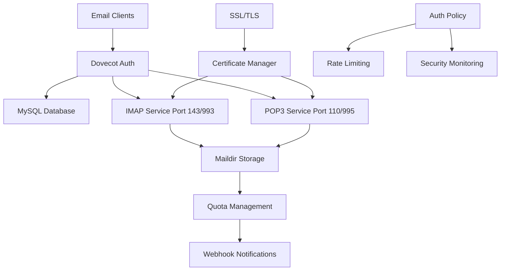

# Dovecot IMAP/POP3 Server Implementation

Dovecot serves as the Mail Delivery Agent (MDA) in the Enterprise Mail Server, providing secure IMAP and POP3 access with virtual user management, quota enforcement, and real-time monitoring capabilities.

## Architecture Overview



## Core Configuration

### Main Configuration (`dovecot.conf`)

The primary Dovecot configuration provides secure email access with virtual user support:

```ini
# Basic Configuration
protocols = imap pop3 lmtp
listen = *

# SSL Configuration
ssl = required
ssl_cert = </etc/ssl/certs/mail.crt
ssl_key = </etc/ssl/private/mail.key
ssl_min_protocol = TLSv1.2
ssl_cipher_list = ECDHE+AESGCM:ECDHE+AES256:ECDHE+AES128:!aNULL:!MD5:!DSS
ssl_prefer_server_ciphers = yes

# Authentication Configuration
auth_mechanisms = plain login
auth_username_format = %Lu
disable_plaintext_auth = yes

# Mail Location
mail_location = maildir:/var/mail/vhosts/%d/%n
mail_uid = vmail
mail_gid = vmail
first_valid_uid = 5000
last_valid_uid = 5000

# Namespace Configuration
namespace inbox {
  type = private
  separator = /
  prefix = 
  location = 
  inbox = yes
  
  mailbox Drafts {
    special_use = \Drafts
    auto = subscribe
  }
  
  mailbox Junk {
    special_use = \Junk
    auto = subscribe
  }
  
  mailbox Sent {
    special_use = \Sent
    auto = subscribe
  }
  
  mailbox "Sent Messages" {
    special_use = \Sent
  }
  
  mailbox Trash {
    special_use = \Trash
    auto = subscribe
  }
}

# Service Configuration
service imap-login {
  inet_listener imap {
    port = 143
  }
  inet_listener imaps {
    port = 993
    ssl = yes
  }
  
  # Performance settings
  process_min_avail = 4
  process_limit = 200
  vsz_limit = 256M
}

service pop3-login {
  inet_listener pop3 {
    port = 110
  }
  inet_listener pop3s {
    port = 995
    ssl = yes
  }
}

service lmtp {
  unix_listener /var/spool/postfix/private/dovecot-lmtp {
    mode = 0600
    user = postfix
    group = postfix
  }
}

service auth {
  unix_listener /var/spool/postfix/private/auth {
    mode = 0666
    user = postfix
    group = postfix
  }
  
  unix_listener auth-userdb {
    mode = 0600
    user = vmail
    group = vmail
  }
  
  user = dovecot
}

service auth-worker {
  user = vmail
}

# Quota Configuration
quota_full_tempfail = yes
quota_grace = 10%%
quota_max_mail_size = 100M

plugin {
  quota = maildir:User quota
  quota_rule = *:storage=1G
  quota_rule2 = Trash:storage=+100M
  quota_warning = storage=95%% quota-warning 95 %u
  quota_warning2 = storage=80%% quota-warning 80 %u
  
  # Quota notifications
  quota_exceeded_message = Quota exceeded, message rejected.
}

# Statistics
service stats {
  unix_listener stats-reader {
    user = vmail
    group = vmail
    mode = 0660
  }
  
  unix_listener stats-writer {
    user = vmail
    group = vmail
    mode = 0660
  }
}

# Logging
log_path = /var/log/dovecot.log
info_log_path = /var/log/dovecot-info.log
debug_log_path = /var/log/dovecot-debug.log
auth_verbose = yes
auth_debug = no
mail_debug = no
```

### SQL Authentication (`dovecot-sql.conf.ext`)

MySQL-based authentication for virtual users:

```ini
driver = mysql
connect = host=localhost dbname=mailserver user=mailserver password=your_password

# Default password scheme
default_pass_scheme = SHA512-CRYPT

# User query
user_query = \
  SELECT '/var/mail/vhosts/%d/%n' as home, \
         'maildir:/var/mail/vhosts/%d/%n' as mail, \
         5000 AS uid, 5000 AS gid, \
         concat('dirsize:storage=', quota) AS quota \
  FROM mailboxes WHERE email = '%u' AND active = 1

# Password query
password_query = \
  SELECT email as user, password, \
         '/var/mail/vhosts/%d/%n' as userdb_home, \
         'maildir:/var/mail/vhosts/%d/%n' as userdb_mail, \
         5000 as userdb_uid, 5000 as userdb_gid \
  FROM mailboxes WHERE email = '%u' AND active = 1

# Iterate query for user listing
iterate_query = SELECT email as username FROM mailboxes WHERE active = 1
```

## Virtual User Management

### User Authentication System

Dovecot implements a comprehensive virtual user system with MySQL backend:

```python
#!/usr/bin/env python3
"""
Dovecot Authentication Policy Script
Provides advanced authentication policies and monitoring
"""

import sys
import os
import mysql.connector
import hashlib
import crypt
import requests
import json
import logging
from datetime import datetime, timedelta


class DovecotAuthPolicy:
    def __init__(self):
        self.db_config = {
            "host": os.getenv("DB_HOST", "localhost"),
            "user": os.getenv("DB_USER", "mailserver"),
            "password": os.getenv("DB_PASSWORD"),
            "database": os.getenv("DB_NAME", "mailserver"),
        }
        self.webhook_url = os.getenv("WEBHOOK_URL", "")
        self.max_failed_attempts = int(os.getenv("MAX_FAILED_ATTEMPTS", 5))
        self.lockout_duration = int(os.getenv("LOCKOUT_DURATION", 900))  # 15 minutes

    def authenticate_user(self, username, password, client_ip):
        """Authenticate user with enhanced security policies"""
        try:
            # Check if account is locked
            if self.is_account_locked(username, client_ip):
                self.log_auth_event(username, client_ip, "locked_account")
                return False

            # Verify credentials
            if self.verify_credentials(username, password):
                # Reset failed attempts on successful login
                self.reset_failed_attempts(username, client_ip)
                self.log_auth_event(username, client_ip, "successful_login")
                self.send_webhook_notification(
                    "login_success",
                    {
                        "username": username,
                        "ip": client_ip,
                        "timestamp": datetime.utcnow().isoformat(),
                    },
                )
                return True
            else:
                # Increment failed attempts
                self.increment_failed_attempts(username, client_ip)
                self.log_auth_event(username, client_ip, "failed_login")
                self.send_webhook_notification(
                    "login_failure",
                    {
                        "username": username,
                        "ip": client_ip,
                        "timestamp": datetime.utcnow().isoformat(),
                    },
                )
                return False

        except Exception as e:
            logging.error(f"Authentication error: {e}")
            return False

    def verify_credentials(self, username, password):
        """Verify user credentials against database"""
        try:
            conn = mysql.connector.connect(**self.db_config)
            cursor = conn.cursor()

            cursor.execute(
                """
                SELECT password, active FROM mailboxes 
                WHERE email = %s
            """,
                (username,),
            )

            result = cursor.fetchone()

            if not result or not result[1]:  # User not found or inactive
                return False

            stored_password = result[0]

            # Verify password (supports multiple hash schemes)
            return self.verify_password(password, stored_password)

        except Exception as e:
            logging.error(f"Credential verification failed: {e}")
            return False
        finally:
            if conn:
                conn.close()

    def verify_password(self, plain_password, stored_password):
        """Verify password against stored hash"""
        if stored_password.startswith("{SHA512-CRYPT}"):
            hash_value = stored_password[13:]
            return crypt.crypt(plain_password, hash_value) == hash_value
        elif stored_password.startswith("{SHA256}"):
            hash_value = stored_password[8:]
            computed_hash = hashlib.sha256(plain_password.encode()).hexdigest()
            return computed_hash == hash_value
        elif stored_password.startswith("{MD5}"):
            hash_value = stored_password[5:]
            computed_hash = hashlib.md5(plain_password.encode()).hexdigest()
            return computed_hash == hash_value
        else:
            # Plain text comparison (not recommended for production)
            return plain_password == stored_password

    def is_account_locked(self, username, client_ip):
        """Check if account is locked due to failed attempts"""
        try:
            conn = mysql.connector.connect(**self.db_config)
            cursor = conn.cursor()

            # Check failed attempts within lockout duration
            lockout_time = datetime.utcnow() - timedelta(seconds=self.lockout_duration)

            cursor.execute(
                """
                SELECT COUNT(*) FROM auth_failures 
                WHERE (username = %s OR client_ip = %s) 
                AND attempt_time > %s
            """,
                (username, client_ip, lockout_time),
            )

            failed_count = cursor.fetchone()[0]

            return failed_count >= self.max_failed_attempts

        except Exception as e:
            logging.error(f"Lock check failed: {e}")
            return False
        finally:
            if conn:
                conn.close()

    def increment_failed_attempts(self, username, client_ip):
        """Record failed authentication attempt"""
        try:
            conn = mysql.connector.connect(**self.db_config)
            cursor = conn.cursor()

            cursor.execute(
                """
                INSERT INTO auth_failures (username, client_ip, attempt_time)
                VALUES (%s, %s, NOW())
            """,
                (username, client_ip),
            )

            conn.commit()

        except Exception as e:
            logging.error(f"Failed to record auth failure: {e}")
        finally:
            if conn:
                conn.close()

    def reset_failed_attempts(self, username, client_ip):
        """Clear failed attempts after successful login"""
        try:
            conn = mysql.connector.connect(**self.db_config)
            cursor = conn.cursor()

            cursor.execute(
                """
                DELETE FROM auth_failures 
                WHERE username = %s OR client_ip = %s
            """,
                (username, client_ip),
            )

            conn.commit()

        except Exception as e:
            logging.error(f"Failed to reset auth failures: {e}")
        finally:
            if conn:
                conn.close()

    def log_auth_event(self, username, client_ip, event_type):
        """Log authentication event"""
        try:
            conn = mysql.connector.connect(**self.db_config)
            cursor = conn.cursor()

            cursor.execute(
                """
                INSERT INTO auth_log (username, client_ip, event_type, event_time)
                VALUES (%s, %s, %s, NOW())
            """,
                (username, client_ip, event_type),
            )

            conn.commit()

        except Exception as e:
            logging.error(f"Failed to log auth event: {e}")
        finally:
            if conn:
                conn.close()

    def send_webhook_notification(self, event_type, data):
        """Send webhook notification for authentication events"""
        if not self.webhook_url:
            return

        payload = {
            "event": event_type,
            "service": "dovecot",
            "timestamp": datetime.utcnow().isoformat(),
            "data": data,
        }

        try:
            response = requests.post(
                self.webhook_url,
                json=payload,
                timeout=10,
                headers={"Content-Type": "application/json"},
            )

            if response.status_code != 200:
                logging.warning(f"Webhook notification failed: {response.status_code}")

        except Exception as e:
            logging.error(f"Webhook notification error: {e}")


if __name__ == "__main__":
    # This script is called by Dovecot auth process
    auth_policy = DovecotAuthPolicy()

    # Parse environment variables set by Dovecot
    username = os.getenv("USER", "")
    password = os.getenv("PASS", "")
    client_ip = os.getenv("REMOTE_IP", "")

    # Perform authentication
    if auth_policy.authenticate_user(username, password, client_ip):
        sys.exit(0)  # Success
    else:
        sys.exit(1)  # Failure
```

## Quota Management System

### Dynamic Quota Enforcement

Dovecot implements dynamic quota management with webhook notifications:

```bash
#!/bin/bash
# Dovecot Quota Warning Script
# Called when user approaches quota limits

USER="$1"
PERCENT="$2"

# Log quota warning
echo "$(date): Quota warning for $USER at $PERCENT%" >> /var/log/dovecot-quota.log

# Send webhook notification
python3 /usr/local/bin/quota-webhook-notify.py "$USER" "$PERCENT"

# Send email notification to user
if [ "$PERCENT" -eq "95" ]; then
    # Send urgent warning at 95%
    cat <<EOF | /usr/sbin/sendmail "$USER"
Subject: URGENT: Mailbox Almost Full ($PERCENT% used)
From: noreply@yourdomain.com
To: $USER

Your mailbox is $PERCENT% full. Please delete some emails to avoid bounced messages.

Current usage: $PERCENT%
Action required: Delete emails or contact administrator for quota increase.

This is an automated message.
EOF

elif [ "$PERCENT" -eq "80" ]; then
    # Send friendly reminder at 80%
    cat <<EOF | /usr/sbin/sendmail "$USER"
Subject: Mailbox Storage Warning ($PERCENT% used)
From: noreply@yourdomain.com
To: $USER

Your mailbox is $PERCENT% full. Consider deleting old emails or moving them to local storage.

Current usage: $PERCENT%
Recommendation: Archive old emails to free up space.

This is an automated message.
EOF
fi
```

### Quota Webhook Notification

Python script for sending quota webhook notifications:

```python
#!/usr/bin/env python3
"""
Dovecot Quota Webhook Notification
Sends quota usage data to webhook endpoints
"""

import sys
import os
import requests
import json
import mysql.connector
from datetime import datetime


class QuotaNotifier:
    def __init__(self):
        self.webhook_url = os.getenv("WEBHOOK_URL", "")
        self.db_config = {
            "host": os.getenv("DB_HOST", "localhost"),
            "user": os.getenv("DB_USER", "mailserver"),
            "password": os.getenv("DB_PASSWORD"),
            "database": os.getenv("DB_NAME", "mailserver"),
        }

    def send_quota_notification(self, username, usage_percent):
        """Send quota usage notification"""
        try:
            # Get additional user information
            user_info = self.get_user_info(username)

            payload = {
                "event": "quota_warning",
                "service": "dovecot",
                "timestamp": datetime.utcnow().isoformat(),
                "data": {
                    "username": username,
                    "usage_percent": int(usage_percent),
                    "quota_mb": user_info.get("quota_mb", 0),
                    "used_mb": user_info.get("used_mb", 0),
                    "domain": username.split("@")[1] if "@" in username else "",
                    "warning_level": self.get_warning_level(int(usage_percent)),
                },
            }

            # Send to webhook endpoint
            if self.webhook_url:
                response = requests.post(
                    self.webhook_url,
                    json=payload,
                    timeout=10,
                    headers={"Content-Type": "application/json"},
                )

                if response.status_code == 200:
                    print(f"Quota notification sent for {username}")
                else:
                    print(f"Webhook failed with status {response.status_code}")

            # Update database with quota usage
            self.update_quota_usage(username, usage_percent, user_info)

        except Exception as e:
            print(f"Quota notification failed: {e}")

    def get_user_info(self, username):
        """Get user quota information from database"""
        try:
            conn = mysql.connector.connect(**self.db_config)
            cursor = conn.cursor(dictionary=True)

            cursor.execute(
                """
                SELECT quota, 
                       ROUND(quota * %s / 100, 2) as used_mb
                FROM mailboxes 
                WHERE email = %s
            """,
                (int(sys.argv[2]), username),
            )

            result = cursor.fetchone()

            if result:
                return {"quota_mb": result["quota"], "used_mb": result["used_mb"]}

            return {}

        except Exception as e:
            print(f"Failed to get user info: {e}")
            return {}
        finally:
            if conn:
                conn.close()

    def get_warning_level(self, usage_percent):
        """Determine warning level based on usage"""
        if usage_percent >= 95:
            return "critical"
        elif usage_percent >= 80:
            return "warning"
        else:
            return "info"

    def update_quota_usage(self, username, usage_percent, user_info):
        """Update quota usage statistics"""
        try:
            conn = mysql.connector.connect(**self.db_config)
            cursor = conn.cursor()

            cursor.execute(
                """
                INSERT INTO quota_usage_log 
                (username, usage_percent, quota_mb, used_mb, logged_at)
                VALUES (%s, %s, %s, %s, NOW())
                ON DUPLICATE KEY UPDATE
                usage_percent = VALUES(usage_percent),
                used_mb = VALUES(used_mb),
                logged_at = NOW()
            """,
                (
                    username,
                    usage_percent,
                    user_info.get("quota_mb", 0),
                    user_info.get("used_mb", 0),
                ),
            )

            conn.commit()

        except Exception as e:
            print(f"Failed to update quota usage: {e}")
        finally:
            if conn:
                conn.close()


if __name__ == "__main__":
    if len(sys.argv) != 3:
        print("Usage: quota-webhook-notify.py <username> <usage_percent>")
        sys.exit(1)

    username = sys.argv[1]
    usage_percent = sys.argv[2]

    notifier = QuotaNotifier()
    notifier.send_quota_notification(username, usage_percent)
```

## Security Features

### SSL/TLS Configuration

Dovecot implements robust SSL/TLS security:

```ini
# SSL Configuration
ssl = required
ssl_cert = </etc/ssl/certs/mail.crt
ssl_key = </etc/ssl/private/mail.key

# SSL Security Settings
ssl_min_protocol = TLSv1.2
ssl_cipher_list = ECDHE+AESGCM:ECDHE+AES256:ECDHE+AES128:!aNULL:!MD5:!DSS
ssl_prefer_server_ciphers = yes
ssl_options = no_compression

# DH Parameters
ssl_dh = </etc/ssl/certs/dhparam.pem

# Certificate Verification
ssl_verify_client_cert = no
ssl_cert_username_field = commonName
```

### Authentication Security

Advanced authentication policies and monitoring:

```ini
# Authentication Configuration
auth_mechanisms = plain login
auth_username_format = %Lu
disable_plaintext_auth = yes
auth_cache_size = 100M
auth_cache_ttl = 1 hour
auth_cache_negative_ttl = 1 hour

# Rate Limiting
auth_penalty_timeout = 30 secs
auth_failure_delay = 2 secs

# Password Policy
passdb {
  driver = sql
  args = /etc/dovecot/dovecot-sql.conf.ext
}

userdb {
  driver = sql
  args = /etc/dovecot/dovecot-sql.conf.ext
}

# Master User Configuration (for admin access)
passdb {
  driver = passwd-file
  args = /etc/dovecot/master-users
  master = yes
  
  # Override fields from master passdb
  override_fields = userdb_uid=vmail userdb_gid=vmail
}
```

## Performance Optimization

### Connection Management

Dovecot includes advanced connection management:

```ini
# Process Limits
default_process_limit = 1000
default_client_limit = 1000

# Service-specific limits
service imap-login {
  process_min_avail = 4
  process_limit = 200
  client_limit = 1000
  vsz_limit = 256M
}

service imap {
  process_limit = 1024
  client_limit = 1
  vsz_limit = 256M
}

service pop3-login {
  process_min_avail = 2
  process_limit = 100
  client_limit = 1000
  vsz_limit = 256M
}

service pop3 {
  process_limit = 1024
  client_limit = 1
  vsz_limit = 256M
}

# Memory Management
default_vsz_limit = 256M
default_login_user = dovenull
default_internal_user = dovecot
```

### Caching Configuration

Optimize performance with intelligent caching:

```ini
# Mail Index Cache
mail_cache_min_mail_count = 10
mail_cache_unaccessed_field_drop = 30 days

# Authentication Cache
auth_cache_size = 100M
auth_cache_ttl = 1 hour
auth_cache_negative_ttl = 1 hour

# Mailbox Cache
mailbox_idle_check_interval = 30 secs
mailbox_max_lock_timeout = 0

# IMAP Optimizations
protocol imap {
  mail_max_userip_connections = 20
  imap_client_workarounds = delay-newmail tb-extra-mailbox-sep
  imap_idle_notify_interval = 2 mins
}

# POP3 Optimizations  
protocol pop3 {
  mail_max_userip_connections = 10
  pop3_client_workarounds = outlook-no-nuls oe-ns-eoh
  pop3_uidl_format = %08Xu%08Xv
}
```

## Monitoring & Health Checks

### Health Check Script

Comprehensive health monitoring for Dovecot:

```bash
#!/bin/bash
# Dovecot Health Check Script

HEALTH_STATUS=0
HEALTH_MESSAGE=""

# Check Dovecot service status
if ! systemctl is-active --quiet dovecot; then
    HEALTH_MESSAGE="ERROR: Dovecot service is not running"
    HEALTH_STATUS=1
fi

# Check SSL certificate expiry
CERT_FILE="/etc/ssl/certs/mail.crt"
if [ -f "$CERT_FILE" ]; then
    CERT_EXPIRY=$(openssl x509 -in "$CERT_FILE" -noout -enddate | cut -d= -f2)
    CERT_EXPIRY_EPOCH=$(date -d "$CERT_EXPIRY" +%s)
    CURRENT_EPOCH=$(date +%s)
    DAYS_UNTIL_EXPIRY=$(( (CERT_EXPIRY_EPOCH - CURRENT_EPOCH) / 86400 ))
    
    if [ $DAYS_UNTIL_EXPIRY -lt 7 ]; then
        HEALTH_MESSAGE="$HEALTH_MESSAGE WARNING: SSL certificate expires in $DAYS_UNTIL_EXPIRY days"
        HEALTH_STATUS=1
    fi
fi

# Check database connectivity
mysql -h localhost -u mailserver -p$DB_PASSWORD -e "SELECT 1" mailserver > /dev/null 2>&1
if [ $? -ne 0 ]; then
    HEALTH_MESSAGE="$HEALTH_MESSAGE ERROR: Database connection failed"
    HEALTH_STATUS=1
fi

# Check disk space for mail storage
MAIL_DIR="/var/mail/vhosts"
if [ -d "$MAIL_DIR" ]; then
    DISK_USAGE=$(df "$MAIL_DIR" | awk 'NR==2 {print $5}' | sed 's/%//')
    if [ "$DISK_USAGE" -gt 90 ]; then
        HEALTH_MESSAGE="$HEALTH_MESSAGE ERROR: Mail storage disk usage is $DISK_USAGE%"
        HEALTH_STATUS=1
    fi
fi

# Check active connections
IMAP_CONNECTIONS=$(ss -tlnp | grep :993 | wc -l)
POP3_CONNECTIONS=$(ss -tlnp | grep :995 | wc -l)

# Output health status
if [ $HEALTH_STATUS -eq 0 ]; then
    echo "Dovecot health check passed"
    echo "IMAP connections: $IMAP_CONNECTIONS"
    echo "POP3 connections: $POP3_CONNECTIONS"
else
    echo "$HEALTH_MESSAGE"
fi

exit $HEALTH_STATUS
```

### Performance Metrics Collection

Python script for collecting Dovecot performance metrics:

```python
#!/usr/bin/env python3
"""
Dovecot Performance Metrics Collector
Collects and reports performance statistics
"""

import subprocess
import json
import mysql.connector
import os
from datetime import datetime


class DovecotMetrics:
    def __init__(self):
        self.db_config = {
            "host": os.getenv("DB_HOST", "localhost"),
            "user": os.getenv("DB_USER", "mailserver"),
            "password": os.getenv("DB_PASSWORD"),
            "database": os.getenv("DB_NAME", "mailserver"),
        }

    def collect_metrics(self):
        """Collect comprehensive Dovecot metrics"""
        metrics = {
            "timestamp": datetime.utcnow().isoformat(),
            "service": "dovecot",
            "connections": self.get_connection_stats(),
            "authentication": self.get_auth_stats(),
            "quota": self.get_quota_stats(),
            "performance": self.get_performance_stats(),
            "errors": self.get_error_stats(),
        }

        return metrics

    def get_connection_stats(self):
        """Get connection statistics"""
        try:
            # Count active IMAP connections
            imap_result = subprocess.run(
                ["ss", "-tn", "src", ":993"], capture_output=True, text=True
            )
            imap_connections = len(imap_result.stdout.strip().split("\n")) - 1

            # Count active POP3 connections
            pop3_result = subprocess.run(
                ["ss", "-tn", "src", ":995"], capture_output=True, text=True
            )
            pop3_connections = len(pop3_result.stdout.strip().split("\n")) - 1

            return {
                "imap_active": max(0, imap_connections),
                "pop3_active": max(0, pop3_connections),
                "total_active": max(0, imap_connections + pop3_connections),
            }

        except Exception as e:
            print(f"Failed to get connection stats: {e}")
            return {"imap_active": 0, "pop3_active": 0, "total_active": 0}

    def get_auth_stats(self):
        """Get authentication statistics"""
        try:
            conn = mysql.connector.connect(**self.db_config)
            cursor = conn.cursor()

            # Get authentication stats for last hour
            cursor.execute("""
                SELECT 
                    SUM(CASE WHEN event_type = 'successful_login' THEN 1 ELSE 0 END) as successful,
                    SUM(CASE WHEN event_type = 'failed_login' THEN 1 ELSE 0 END) as failed,
                    COUNT(DISTINCT username) as unique_users
                FROM auth_log 
                WHERE event_time > DATE_SUB(NOW(), INTERVAL 1 HOUR)
            """)

            result = cursor.fetchone()

            return {
                "successful_logins": result[0] or 0,
                "failed_logins": result[1] or 0,
                "unique_users": result[2] or 0,
                "success_rate": (result[0] / (result[0] + result[1]) * 100)
                if (result[0] or result[1])
                else 0,
            }

        except Exception as e:
            print(f"Failed to get auth stats: {e}")
            return {
                "successful_logins": 0,
                "failed_logins": 0,
                "unique_users": 0,
                "success_rate": 0,
            }
        finally:
            if conn:
                conn.close()

    def get_quota_stats(self):
        """Get quota usage statistics"""
        try:
            conn = mysql.connector.connect(**self.db_config)
            cursor = conn.cursor()

            cursor.execute("""
                SELECT 
                    COUNT(*) as total_mailboxes,
                    AVG(quota) as avg_quota_mb,
                    SUM(quota) as total_quota_mb,
                    COUNT(CASE WHEN quota > 0 THEN 1 END) as quota_enabled
                FROM mailboxes 
                WHERE active = 1
            """)

            result = cursor.fetchone()

            return {
                "total_mailboxes": result[0] or 0,
                "avg_quota_mb": round(result[1] or 0, 2),
                "total_quota_mb": result[2] or 0,
                "quota_enabled": result[3] or 0,
            }

        except Exception as e:
            print(f"Failed to get quota stats: {e}")
            return {
                "total_mailboxes": 0,
                "avg_quota_mb": 0,
                "total_quota_mb": 0,
                "quota_enabled": 0,
            }
        finally:
            if conn:
                conn.close()

    def get_performance_stats(self):
        """Get performance statistics"""
        try:
            # Get system load
            with open("/proc/loadavg", "r") as f:
                load_avg = f.read().strip().split()

            # Get memory usage
            with open("/proc/meminfo", "r") as f:
                meminfo = f.read()

            mem_total = int(
                [line for line in meminfo.split("\n") if "MemTotal" in line][0].split()[1]
            )
            mem_available = int(
                [line for line in meminfo.split("\n") if "MemAvailable" in line][0].split()[1]
            )
            mem_usage = (mem_total - mem_available) / mem_total * 100

            return {
                "load_1min": float(load_avg[0]),
                "load_5min": float(load_avg[1]),
                "load_15min": float(load_avg[2]),
                "memory_usage_percent": round(mem_usage, 2),
            }

        except Exception as e:
            print(f"Failed to get performance stats: {e}")
            return {"load_1min": 0, "load_5min": 0, "load_15min": 0, "memory_usage_percent": 0}

    def get_error_stats(self):
        """Get error statistics from logs"""
        try:
            # Count errors in last hour from dovecot logs
            result = subprocess.run(
                ["grep", "-c", "ERROR", "/var/log/dovecot.log"], capture_output=True, text=True
            )

            error_count = int(result.stdout.strip()) if result.returncode == 0 else 0

            return {"error_count_1h": error_count, "last_check": datetime.utcnow().isoformat()}

        except Exception as e:
            print(f"Failed to get error stats: {e}")
            return {"error_count_1h": 0, "last_check": datetime.utcnow().isoformat()}


if __name__ == "__main__":
    metrics_collector = DovecotMetrics()
    metrics = metrics_collector.collect_metrics()
    print(json.dumps(metrics, indent=2))
```

## Docker Integration

### Optimized Dockerfile

```dockerfile
FROM ubuntu:22.04

# Install Dovecot and dependencies
RUN apt-get update && \
    DEBIAN_FRONTEND=noninteractive apt-get install -y \
    dovecot-core \
    dovecot-imapd \
    dovecot-pop3d \
    dovecot-lmtpd \
    dovecot-mysql \
    python3 \
    python3-pip \
    mysql-client \
    openssl \
    ca-certificates

# Install Python dependencies
RUN pip3 install mysql-connector-python requests

# Create vmail user
RUN groupadd -g 5000 vmail && \
    useradd -g vmail -u 5000 vmail -d /var/mail

# Copy configuration files
COPY config/ /etc/dovecot/
COPY scripts/ /usr/local/bin/

# Set permissions
RUN chmod +x /usr/local/bin/*.py
RUN chmod +x /usr/local/bin/*.sh
RUN chown -R vmail:vmail /var/mail

# Create necessary directories
RUN mkdir -p /var/mail/vhosts
RUN chown -R vmail:vmail /var/mail/vhosts

# Health check
HEALTHCHECK --interval=30s --timeout=10s --start-period=5s --retries=3 \
    CMD /usr/local/bin/dovecot_health_check.sh

EXPOSE 143 993 110 995 24

CMD ["/usr/local/bin/start_dovecot.sh"]
```

This comprehensive Dovecot implementation provides secure, scalable email access with advanced authentication, quota management, and monitoring capabilities, making it a robust component of the Enterprise Mail Server infrastructure.
