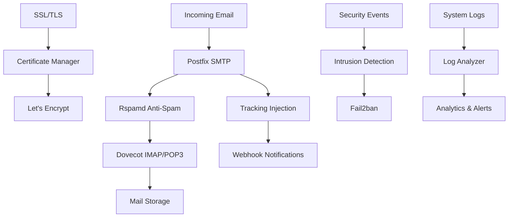

# Mail Infrastructure Components

The Mailyte Mail Server's mailer infrastructure consists of several integrated components that work together to provide enterprise-grade email services with advanced security, monitoring, and deliverability features.

## Architecture Overview

## Core Components

### [Postfix SMTP Server](postfix.md)
Primary mail transfer agent handling all SMTP operations with advanced tracking and rate limiting.

**Key Features:**
- Virtual domain and user management
- Email tracking injection pipeline
- Rate limiting and abuse prevention
- Webhook integration for email events
- MySQL-based configuration

### [Dovecot IMAP/POP3](dovecot.md)
Mail delivery agent providing secure email access with quota management and monitoring.

**Key Features:**
- Virtual user authentication
- Quota management with webhooks
- SSL/TLS encryption
- Real-time usage monitoring
- MySQL integration

### [Rspamd Anti-Spam](rspamd.md)
Advanced spam filtering engine with machine learning capabilities and content analysis.

**Key Features:**
- Bayesian spam filtering
- DKIM signing and verification
- ClamAV antivirus integration
- Greylisting support
- Real-time blacklist checking

### [Certificate Manager](cert-manager.md)
Automated SSL certificate management with Let's Encrypt integration and multi-domain support.

**Key Features:**
- Automatic certificate provisioning
- Multi-domain certificate support
- Automated renewal processes
- Certificate monitoring and alerts
- Secure key management

### [Intrusion Detection](intrusion-detection.md)
Security monitoring system using Fail2ban with custom filters and webhook notifications.

**Key Features:**
- Real-time attack detection
- Custom mail-specific filters
- Automated IP blocking
- Webhook security alerts
- Comprehensive logging

### [Log Analyzer](log-analyzer.md)
Intelligent log analysis system providing insights into mail server performance and security.

**Key Features:**
- Real-time log processing
- Pattern detection and analysis
- Performance metrics collection
- Security incident reporting
- Automated alerting

## Integration Points

### Database Integration
All components integrate with MySQL for:
- Virtual domain and user management
- Configuration storage
- Statistics and metrics
- Audit logging

### Webhook System
Components send real-time notifications for:
- Email delivery events
- Security incidents
- System alerts
- Performance metrics

### Monitoring Integration
Each component provides:
- Health check endpoints
- Performance metrics
- Error reporting
- Status monitoring

## Configuration Management

### Environment Variables
All components support centralized configuration through environment variables for:
- Database connections
- Service endpoints
- Security settings
- Feature toggles

### Docker Integration
Each component includes:
- Optimized Dockerfiles
- Health check configurations
- Volume management
- Network integration

## Security Features

### Access Control
- API key authentication
- Role-based permissions
- Secure inter-service communication
- Encrypted data transmission

### Monitoring & Alerting
- Real-time security monitoring
- Automated threat detection
- Incident response workflows
- Compliance reporting

## Performance Optimization

### Caching Strategies
- Redis integration for session management
- Database query optimization
- Connection pooling
- Resource management

### Scalability Features
- Horizontal scaling support
- Load balancing compatibility
- Resource monitoring
- Performance tuning

## Next Steps

Explore the detailed documentation for each component to understand implementation details, configuration options, and best practices for deployment and maintenance.
