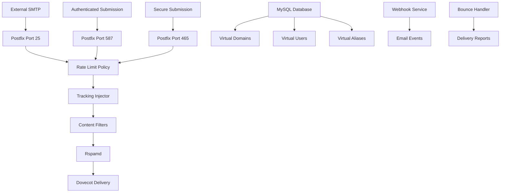

# Postfix SMTP Server Implementation

Postfix serves as the primary Mail Transfer Agent (MTA) in the Mailyte Mail Server, handling all inbound and outbound SMTP operations with advanced tracking, rate limiting, and security features.

## Architecture Overview



## Core Configuration

### Main Configuration (`main.cf`)

The Postfix main configuration provides enterprise-grade email routing with virtual domain support:

```ini
# Basic Configuration
myhostname = mail.yourdomain.com
mydestination = localhost
mynetworks = 127.0.0.0/8, 10.0.0.0/8, 172.16.0.0/12, 192.168.0.0/16

# Virtual Domain Configuration
virtual_mailbox_domains = mysql:/etc/postfix/mysql-virtual-mailbox-domains.cf
virtual_mailbox_maps = mysql:/etc/postfix/mysql-virtual-mailbox-maps.cf
virtual_alias_maps = mysql:/etc/postfix/mysql-virtual-alias-maps.cf

# Tracking Integration
content_filter = smtp:[127.0.0.1]:10025
receive_override_options = no_address_mappings

# Rate Limiting
smtpd_client_restrictions = check_policy_service inet:127.0.0.1:10030
smtpd_recipient_restrictions = check_policy_service inet:127.0.0.1:10030

# Security Configuration
smtpd_tls_cert_file = /etc/ssl/certs/mail.crt
smtpd_tls_key_file = /etc/ssl/private/mail.key
smtpd_use_tls = yes
smtpd_tls_auth_only = yes
```

### Master Configuration (`master.cf`)

Service definitions with tracking and filtering integration:

```ini
# SMTP Services
smtp      inet  n       -       y       -       -       smtpd
  -o content_filter=tracking:dummy

submission inet n       -       y       -       -       smtpd
  -o syslog_name=postfix/submission
  -o smtpd_tls_security_level=encrypt
  -o smtpd_sasl_auth_enable=yes
  -o content_filter=tracking:dummy

smtps     inet  n       -       y       -       -       smtpd
  -o syslog_name=postfix/smtps
  -o smtpd_tls_wrappermode=yes
  -o smtpd_sasl_auth_enable=yes
  -o content_filter=tracking:dummy

# Tracking Filter
tracking  unix  -       n       n       -       10      smtp
  -o smtp_destination_concurrency_limit=2
  -o smtp_destination_rate_delay=1s
  -o smtp_connect_timeout=10s
```

## Virtual Domain Management

### MySQL Integration

Virtual domain configuration uses MySQL for scalable multi-tenant support:

**Domain Configuration (`mysql-virtual-mailbox-domains.cf`):**
```ini
user = mailserver
password = your_password
hosts = localhost
dbname = mailserver
query = SELECT 1 FROM domains WHERE domain='%s' AND active = 1
```

**Mailbox Configuration (`mysql-virtual-mailbox-maps.cf`):**
```ini
user = mailserver
password = your_password
hosts = localhost
dbname = mailserver
query = SELECT 1 FROM mailboxes WHERE email='%s' AND active = 1
```

**Alias Configuration (`mysql-virtual-alias-maps.cf`):**
```ini
user = mailserver
password = your_password
hosts = localhost
dbname = mailserver
query = SELECT goto FROM aliases WHERE address='%s' AND active = 1
```

## Email Tracking Implementation

### Tracking Injector Service

The tracking injector modifies outbound emails to add tracking capabilities:

```python
#!/usr/bin/env python3
"""
Postfix Tracking Injector
Injects tracking pixels and modifies links for email tracking
"""

import sys
import re
import base64
import hashlib
import mysql.connector
from email.mime.multipart import MIMEMultipart
from email.mime.text import MIMEText
import json
import requests


class TrackingInjector:
    def __init__(self):
        self.db_config = {
            "host": os.getenv("DB_HOST", "localhost"),
            "user": os.getenv("DB_USER", "mailserver"),
            "password": os.getenv("DB_PASSWORD"),
            "database": os.getenv("DB_NAME", "mailserver"),
        }
        self.tracking_domain = os.getenv("TRACKING_DOMAIN", "track.yourdomain.com")
        self.webhook_url = os.getenv("WEBHOOK_URL", "")

    def process_email(self, raw_email):
        """Process email and inject tracking elements"""
        try:
            # Parse email
            msg = email.message_from_string(raw_email)

            # Generate tracking ID
            tracking_id = self.generate_tracking_id(msg)

            # Store tracking record
            self.store_tracking_record(tracking_id, msg)

            # Inject tracking pixel
            if msg.is_multipart():
                self.inject_tracking_multipart(msg, tracking_id)
            else:
                self.inject_tracking_single(msg, tracking_id)

            # Modify links for click tracking
            self.modify_links(msg, tracking_id)

            # Send webhook notification
            self.send_webhook_notification("email_sent", tracking_id, msg)

            return msg.as_string()

        except Exception as e:
            logger.error(f"Tracking injection failed: {e}")
            return raw_email  # Return original on failure

    def generate_tracking_id(self, msg):
        """Generate unique tracking ID for email"""
        content = f"{msg.get('From', '')}{msg.get('To', '')}{msg.get('Subject', '')}{time.time()}"
        return hashlib.sha256(content.encode()).hexdigest()[:16]

    def inject_tracking_pixel(self, html_content, tracking_id):
        """Inject tracking pixel into HTML content"""
        pixel_url = f"https://{self.tracking_domain}/pixel/{tracking_id}.png"
        tracking_pixel = (
            f''
        )

        # Insert before closing body tag
        if "</body>" in html_content:
            html_content = html_content.replace("</body>", f"{tracking_pixel}</body>")
        else:
            html_content += tracking_pixel

        return html_content

    def modify_links(self, msg, tracking_id):
        """Modify links for click tracking"""
        if msg.is_multipart():
            for part in msg.walk():
                if part.get_content_type() == "text/html":
                    content = part.get_payload(decode=True).decode("utf-8")
                    modified_content = self.rewrite_links(content, tracking_id)
                    part.set_payload(modified_content.encode("utf-8"))
        else:
            if msg.get_content_type() == "text/html":
                content = msg.get_payload(decode=True).decode("utf-8")
                modified_content = self.rewrite_links(content, tracking_id)
                msg.set_payload(modified_content.encode("utf-8"))

    def rewrite_links(self, html_content, tracking_id):
        """Rewrite URLs for click tracking"""

        def replace_link(match):
            original_url = match.group(1)
            if original_url.startswith(("mailto:", "tel:", "#")):
                return match.group(0)  # Skip special URLs

            # Encode original URL
            encoded_url = base64.urlsafe_b64encode(original_url.encode()).decode()
            tracking_url = f"https://{self.tracking_domain}/click/{tracking_id}/{encoded_url}"

            return f'href="{tracking_url}"'

        # Replace href attributes
        pattern = r'href=["\']([^"\']+)["\']'
        return re.sub(pattern, replace_link, html_content)

    def store_tracking_record(self, tracking_id, msg):
        """Store tracking record in database"""
        try:
            conn = mysql.connector.connect(**self.db_config)
            cursor = conn.cursor()

            cursor.execute(
                """
                INSERT INTO email_tracking 
                (tracking_id, sender, recipient, subject, created_at)
                VALUES (%s, %s, %s, %s, NOW())
            """,
                (tracking_id, msg.get("From", ""), msg.get("To", ""), msg.get("Subject", "")),
            )

            conn.commit()

        except Exception as e:
            logger.error(f"Failed to store tracking record: {e}")
        finally:
            if conn:
                conn.close()


if __name__ == "__main__":
    injector = TrackingInjector()

    # Read email from stdin
    raw_email = sys.stdin.read()

    # Process and output modified email
    processed_email = injector.process_email(raw_email)
    sys.stdout.write(processed_email)
```

## Rate Limiting Integration

### Policy Service

Rate limiting is implemented through a policy service that integrates with Postfix:

```python
#!/usr/bin/env python3
"""
Postfix Rate Limiting Policy Service
Implements per-sender, per-domain, and per-IP rate limiting
"""

import socket
import threading
import mysql.connector
import redis
import time
import logging
from collections import defaultdict


class RateLimitPolicy:
    def __init__(self):
        self.db_config = {
            "host": os.getenv("DB_HOST", "localhost"),
            "user": os.getenv("DB_USER", "mailserver"),
            "password": os.getenv("DB_PASSWORD"),
            "database": os.getenv("DB_NAME", "mailserver"),
        }

        self.redis_client = redis.Redis(
            host=os.getenv("REDIS_HOST", "localhost"),
            port=int(os.getenv("REDIS_PORT", 6379)),
            db=int(os.getenv("REDIS_DB", 1)),
        )

        self.default_limits = {"hourly": 100, "daily": 1000, "monthly": 10000}

    def start_server(self, host="127.0.0.1", port=10030):
        """Start the policy server"""
        server_socket = socket.socket(socket.AF_INET, socket.SOCK_STREAM)
        server_socket.setsockopt(socket.SOL_SOCKET, socket.SO_REUSEADDR, 1)
        server_socket.bind((host, port))
        server_socket.listen(5)

        logger.info(f"Rate limit policy server listening on {host}:{port}")

        while True:
            client_socket, address = server_socket.accept()
            thread = threading.Thread(target=self.handle_client, args=(client_socket,))
            thread.daemon = True
            thread.start()

    def handle_client(self, client_socket):
        """Handle policy request from Postfix"""
        try:
            data = b""
            while True:
                chunk = client_socket.recv(1024)
                if not chunk:
                    break
                data += chunk
                if b"\n\n" in data:
                    break

            # Parse policy request
            request = self.parse_request(data.decode("utf-8"))

            # Check rate limits
            decision = self.check_rate_limits(request)

            # Send response
            response = f"action={decision}\n\n"
            client_socket.send(response.encode("utf-8"))

        except Exception as e:
            logger.error(f"Policy handling error: {e}")
            client_socket.send(b"action=DUNNO\n\n")
        finally:
            client_socket.close()

    def parse_request(self, data):
        """Parse Postfix policy request"""
        request = {}
        for line in data.strip().split("\n"):
            if "=" in line:
                key, value = line.split("=", 1)
                request[key] = value
        return request

    def check_rate_limits(self, request):
        """Check if request exceeds rate limits"""
        try:
            sender = request.get("sender", "")
            client_address = request.get("client_address", "")
            recipient = request.get("recipient", "")

            # Skip rate limiting for authenticated users (optional)
            if request.get("sasl_username"):
                return "DUNNO"

            # Check various rate limits
            checks = [
                self.check_sender_limits(sender),
                self.check_ip_limits(client_address),
                self.check_domain_limits(sender.split("@")[-1] if "@" in sender else ""),
            ]

            # If any check fails, reject
            for result in checks:
                if result != "DUNNO":
                    return result

            # Record the email for tracking
            self.record_email(sender, client_address, recipient)

            return "DUNNO"  # Allow the email

        except Exception as e:
            logger.error(f"Rate limit check failed: {e}")
            return "DUNNO"  # Allow on error

    def check_sender_limits(self, sender):
        """Check per-sender rate limits"""
        if not sender:
            return "DUNNO"

        current_time = int(time.time())

        # Check hourly limit
        hourly_key = f"sender_hourly:{sender}:{current_time // 3600}"
        hourly_count = self.redis_client.incr(hourly_key)
        self.redis_client.expire(hourly_key, 3600)

        if hourly_count > self.get_sender_limit(sender, "hourly"):
            return "REJECT Rate limit exceeded for sender"

        # Check daily limit
        daily_key = f"sender_daily:{sender}:{current_time // 86400}"
        daily_count = self.redis_client.incr(daily_key)
        self.redis_client.expire(daily_key, 86400)

        if daily_count > self.get_sender_limit(sender, "daily"):
            return "REJECT Daily rate limit exceeded"

        return "DUNNO"

    def get_sender_limit(self, sender, period):
        """Get rate limit for specific sender"""
        try:
            conn = mysql.connector.connect(**self.db_config)
            cursor = conn.cursor()

            cursor.execute(
                """
                SELECT rate_limit_value FROM rate_limits 
                WHERE entity = %s AND period = %s AND active = 1
            """,
                (sender, period),
            )

            result = cursor.fetchone()
            return result[0] if result else self.default_limits.get(period, 100)

        except Exception as e:
            logger.error(f"Failed to get sender limit: {e}")
            return self.default_limits.get(period, 100)
        finally:
            if conn:
                conn.close()


if __name__ == "__main__":
    policy = RateLimitPolicy()
    policy.start_server()
```

## Webhook Integration

### Event Notification System

Postfix integrates with the webhook system to send real-time notifications:

```python
#!/usr/bin/env python3
"""
Postfix Webhook Sender
Sends email events to configured webhook endpoints
"""

import sys
import json
import requests
import mysql.connector
import logging
from datetime import datetime


class WebhookSender:
    def __init__(self):
        self.webhook_urls = os.getenv("WEBHOOK_URLS", "").split(",")
        self.webhook_timeout = int(os.getenv("WEBHOOK_TIMEOUT", 10))
        self.max_retries = int(os.getenv("WEBHOOK_RETRIES", 3))

    def send_email_event(self, event_type, email_data):
        """Send email event to webhook endpoints"""
        payload = {
            "event": event_type,
            "timestamp": datetime.utcnow().isoformat(),
            "data": email_data,
            "source": "postfix",
        }

        for webhook_url in self.webhook_urls:
            if webhook_url.strip():
                self.send_webhook(webhook_url.strip(), payload)

    def send_webhook(self, url, payload):
        """Send webhook with retry logic"""
        for attempt in range(self.max_retries):
            try:
                response = requests.post(
                    url,
                    json=payload,
                    timeout=self.webhook_timeout,
                    headers={"Content-Type": "application/json"},
                )

                if response.status_code == 200:
                    logger.info(f"Webhook sent successfully to {url}")
                    return
                else:
                    logger.warning(f"Webhook failed with status {response.status_code}")

            except Exception as e:
                logger.error(f"Webhook attempt {attempt + 1} failed: {e}")

            if attempt < self.max_retries - 1:
                time.sleep(2**attempt)  # Exponential backoff


if __name__ == "__main__":
    # This script is called by Postfix with email data
    webhook_sender = WebhookSender()

    # Parse command line arguments or stdin for email data
    event_type = sys.argv[1] if len(sys.argv) > 1 else "email_processed"

    # Extract email data (implementation depends on how Postfix calls this)
    email_data = {
        "message_id": os.getenv("MESSAGE_ID", ""),
        "sender": os.getenv("SENDER", ""),
        "recipient": os.getenv("RECIPIENT", ""),
        "subject": os.getenv("SUBJECT", ""),
        "size": os.getenv("SIZE", "0"),
    }

    webhook_sender.send_email_event(event_type, email_data)
```

## Security Features

### Content Filtering

Postfix includes comprehensive content filtering capabilities:

**Header Checks (`header_checks`):**
```regex
# Block suspicious headers
/^Subject:.*\$\$\$/           REJECT Spam detected in subject
/^X-Mailer:.*mass.*mail/i     REJECT Mass mailing software detected
/^Received:.*\[127\.0\.0\.1\]/ WARN Local delivery detected

# Rate limiting headers
/^X-Rate-Limit-Exceeded:/     REJECT Rate limit exceeded
```

**Body Checks (`body_checks`):**
```regex
# Block suspicious content
/urgent.*money.*transfer/i    REJECT Suspicious content detected
/click.*here.*now/i           WARN Potential spam content
/\$\d+.*million/              REJECT Financial spam detected
```

### Authentication Configuration

SASL authentication with Dovecot integration:

```ini
# SASL Configuration
smtpd_sasl_type = dovecot
smtpd_sasl_path = private/auth
smtpd_sasl_auth_enable = yes
smtpd_sasl_security_options = noanonymous, noplaintext
smtpd_sasl_tls_security_options = noanonymous
```

## Monitoring & Logging

### Health Monitoring

Postfix includes comprehensive monitoring capabilities:

```bash
#!/bin/bash
# Postfix Health Check Script

# Check Postfix service status
if ! systemctl is-active --quiet postfix; then
    echo "ERROR: Postfix service is not running"
    exit 1
fi

# Check mail queue size
QUEUE_SIZE=$(postqueue -p | tail -n 1 | awk '{print $5}')
if [ "$QUEUE_SIZE" -gt 100 ]; then
    echo "WARNING: Mail queue size is $QUEUE_SIZE"
fi

# Check disk space
DISK_USAGE=$(df /var/spool/postfix | awk 'NR==2 {print $5}' | sed 's/%//')
if [ "$DISK_USAGE" -gt 90 ]; then
    echo "ERROR: Disk usage is $DISK_USAGE%"
    exit 1
fi

# Check database connectivity
mysql -h localhost -u mailserver -p$DB_PASSWORD -e "SELECT 1" mailserver > /dev/null 2>&1
if [ $? -ne 0 ]; then
    echo "ERROR: Database connection failed"
    exit 1
fi

echo "Postfix health check passed"
exit 0
```

### Performance Metrics

Key performance indicators monitored:

- **Queue Management**: Active, deferred, and bounce queues
- **Delivery Rates**: Successful delivery percentages
- **Error Rates**: Temporary and permanent failures
- **Security Events**: Authentication failures and blocked attempts
- **Resource Usage**: CPU, memory, and disk utilization

## Deployment Configuration

### Docker Integration

Postfix includes optimized Docker configuration:

```dockerfile
FROM ubuntu:22.04

# Install Postfix and dependencies
RUN apt-get update && \
    DEBIAN_FRONTEND=noninteractive apt-get install -y \
    postfix \
    postfix-mysql \
    python3 \
    python3-pip \
    mysql-client \
    redis-tools

# Copy configuration files
COPY config/ /etc/postfix/
COPY scripts/ /usr/local/bin/

# Set permissions
RUN chmod +x /usr/local/bin/*.py
RUN chmod +x /usr/local/bin/*.sh

# Health check
HEALTHCHECK --interval=30s --timeout=10s --start-period=5s --retries=3 \
    CMD /usr/local/bin/health_check.sh

EXPOSE 25 587 465

CMD ["/usr/local/bin/start_postfix.sh"]
```

### Environment Configuration

Required environment variables:

```bash
# Database Configuration
DB_HOST=localhost
DB_USER=mailserver
DB_PASSWORD=secure_password
DB_NAME=mailserver

# Tracking Configuration
TRACKING_DOMAIN=track.yourdomain.com
WEBHOOK_URLS=https://api.yourdomain.com/webhook

# Rate Limiting
REDIS_HOST=localhost
REDIS_PORT=6379
REDIS_DB=1

# SSL Configuration
TLS_CERT_FILE=/etc/ssl/certs/mail.crt
TLS_KEY_FILE=/etc/ssl/private/mail.key
```

This comprehensive Postfix implementation provides enterprise-grade email routing with advanced tracking, security, and monitoring capabilities, forming the foundation of the Mailyte Mail Server's email infrastructure.
