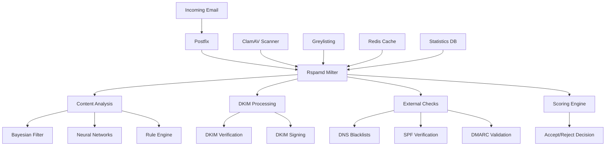

# Rspamd Anti-Spam Engine Implementation

Rspamd serves as the advanced anti-spam and anti-virus engine in the Mailyte Mail Server, providing machine learning-based content analysis, DKIM signing, and comprehensive email filtering capabilities.

## Architecture Overview



## Core Configuration

### Main Configuration (`rspamd.conf`)

Central Rspamd configuration with optimized settings:

```lua
-- Rspamd Configuration
options = {
    filters = "chartable,dkim,spf,surbl,regexp,fuzzy_check";
    url_tld = "/usr/share/rspamd/effective_tld_names.dat";
    dns {
        timeout = 1s;
        sockets = 16;
        retransmits = 5;
    }
    
    -- Worker processes
    worker_bind = "127.0.0.1:11333";
    bind_socket = "/var/run/rspamd/rspamd.sock";
    
    -- Logging
    log_level = "info";
    log_facility = "LOG_MAIL";
    
    -- Statistics
    statistics {
        classifier "bayes" {
            tokenizer {
                name = "osb";
            }
            cache {
                path = "/var/lib/rspamd/bayes.cache";
                size = 200M;
            }
            min_tokens = 11;
            backend = "redis";
            servers = "127.0.0.1:6379";
            database = 2;
            password = "$REDIS_PASSWORD";
            
            statfile {
                symbol = "BAYES_HAM";
                path = "/var/lib/rspamd/bayes.ham";
                size = 10M;
            }
            statfile {
                symbol = "BAYES_SPAM";
                path = "/var/lib/rspamd/bayes.spam";
                size = 10M;
            }
        }
    }
}

-- Worker configuration
worker "normal" {
    bind_socket = "/var/run/rspamd/rspamd.sock";
    .include "$CONFDIR/worker-normal.inc"
}

worker "controller" {
    bind_socket = "127.0.0.1:11334";
    count = 1;
    secure_ip = "127.0.0.1";
    secure_ip = "::1";
    static_dir = "${WWWDIR}";
    password = "$CONTROLLER_PASSWORD";
    enable_password = "$ENABLE_PASSWORD";
}

worker "rspamd_proxy" {
    bind_socket = "127.0.0.1:11332";
    milter = yes;
    timeout = 120s;
    upstream "local" {
        default = yes;
        self_scan = yes;
    }
}

-- Logging configuration
logging {
    type = "file";
    filename = "/var/log/rspamd/rspamd.log";
    level = "info";
    log_buffer = 32k;
    log_urls = false;
    debug_modules = [];
}

-- Include local configuration
.include(try=true; priority=1; duplicate=merge) "$LOCAL_CONFDIR/local.d/rspamd.conf"
.include(try=true; priority=10) "$LOCAL_CONFDIR/override.d/rspamd.conf"
```

### Antivirus Configuration (`antivirus.conf`)

ClamAV integration for malware detection:

```lua
-- Antivirus Configuration
clamav {
    action = "reject";
    symbol = "CLAM_VIRUS";
    type = "clamav";
    log_clean = true;
    servers = "127.0.0.1:3310";
    
    -- Scan settings
    scan_mime_parts = true;
    scan_text_mime = false;
    scan_image_mime = false;
    max_size = 20971520; -- 20MB
    timeout = 60.0;
    retransmits = 2;
    
    -- Custom patterns for additional protection
    patterns {
        -- Detect potentially dangerous file types
        CLAM_MACRO_VIRUS {
            pattern = "Heuristics.OLE2.ContainsMacros";
            score = 7.0;
            description = "Contains suspicious macros";
        }
        
        CLAM_PHISHING {
            pattern = "Phishing.*";
            score = 8.0;
            description = "Phishing attempt detected";
        }
        
        CLAM_MALWARE {
            pattern = ".*\\.Malware\\..*";
            score = 10.0;
            description = "Malware detected";
        }
    }
    
    -- Whitelist for trusted sources
    whitelist = "/etc/rspamd/antivirus_whitelist.map";
}

-- Additional scanners
fprot {
    action = "reject";
    symbol = "FPROT_VIRUS";
    type = "fprot";
    servers = "127.0.0.1:10200";
    patterns {
        FPROT_EICAR {
            pattern = "EICAR_Test_File";
            score = 100.0;
        }
    }
}

-- Attachment filtering
attachments {
    bad_extensions = ["exe", "com", "bat", "cmd", "scr", "vbs", "js"];
    archive_extensions = ["zip", "rar", "7z", "gz", "tar"];
    max_archive_size = 104857600; -- 100MB
    max_files_in_archive = 1000;
}
```

### Classifier Configuration (`classifier-bayes.conf`)

Bayesian spam classification with machine learning:

```lua
-- Bayesian Classifier Configuration
classifier "bayes" {
    tokenizer {
        name = "osb";
        hash = "siphash";
        max_tokens = 100000;
        min_word_len = 3;
        max_word_len = 40;
        
        -- Language detection
        languages_enabled = true;
        
        -- Custom tokenization rules
        unicode_scripts = ["latin", "cyrillic", "arabic", "chinese"];
    }
    
    backend = "redis";
    servers = "127.0.0.1:6379";
    database = 2;
    password = "$REDIS_PASSWORD";
    timeout = 5.0;
    
    -- Learning settings
    min_tokens = 11;
    min_learns = 200;
    max_learns = 50000;
    
    -- Autolearning configuration
    autolearn = true;
    autolearn_spam_threshold = 6.0;
    autolearn_ham_threshold = -0.5;
    autolearn_max_size = 1048576; -- 1MB
    
    -- Statfiles
    statfile {
        symbol = "BAYES_HAM";
        spam = false;
        
        -- Per-user statistics
        per_user = true;
        per_language = true;
    }
    
    statfile {
        symbol = "BAYES_SPAM";
        spam = true;
        
        -- Per-user statistics
        per_user = true;
        per_language = true;
    }
    
    -- Cache configuration
    cache {
        type = "redis";
        servers = "127.0.0.1:6379";
        database = 3;
        password = "$REDIS_PASSWORD";
        prefix = "bayes_cache_";
        ttl = 3600;
    }
    
    -- Learning exclusions
    learn_condition = <<EOD
return function(task, is_spam, is_unlearn)
    local rspamd_logger = require "rspamd_logger"
    local rspamd_util = require "rspamd_util"
    
    -- Don't learn from large messages
    if task:get_size() > 102400 then
        rspamd_logger.infox(task, "message too large for learning: %s bytes", task:get_size())
        return false
    end
    
    -- Don't learn from authenticated users (unless explicitly spam)
    if task:get_user() and not is_spam then
        return false
    end
    
    -- Custom learning conditions
    local from = task:get_from()
    if from and from[1] then
        local domain = from[1]['domain']
        if domain == 'yourdomain.com' and not is_spam then
            return false -- Don't learn ham from own domain
        end
    end
    
    return true
end
EOD
}

-- Neural network classifier
classifier "neural" {
    backend = "redis";
    servers = "127.0.0.1:6379";
    database = 4;
    password = "$REDIS_PASSWORD";
    
    -- Network topology
    layers = [32, 16, 8];
    learning_rate = 0.01;
    momentum = 0.9;
    decay = 0.01;
    
    -- Training parameters
    max_trains = 1000;
    max_iterations = 25;
    min_accuracy = 0.95;
    
    -- Feature extraction
    rules {
        "BAYES_HAM", "BAYES_SPAM",
        "R_SPF_ALLOW", "R_SPF_FAIL",
        "R_DKIM_ALLOW", "R_DKIM_REJECT",
        "DMARC_POLICY_ALLOW", "DMARC_POLICY_REJECT",
        "SURBL_MULTI", "URIBL_MULTI",
        "PHISHING"
    }
}
```

### Greylisting Configuration (`greylisting.conf`)

Temporary rejection for spam mitigation:

```lua
-- Greylisting Configuration
greylisting {
    expire = 86400; -- 24 hours
    timeout = 300;  -- 5 minutes initial delay
    key_prefix = "rg";
    max_data_len = 10k;
    
    -- Redis backend
    servers = "127.0.0.1:6379";
    database = 5;
    password = "$REDIS_PASSWORD";
    
    -- Whitelist settings
    whitelist_domains_url = [
        "https://maps.rspamd.com/rspamd/surbl-whitelist.inc.zst",
        "$LOCAL_CONFDIR/local.d/greylist-whitelist-domains.inc",
        "fallback+file://$CONFDIR/greylist-whitelist-domains.inc"
    ];
    
    -- Custom whitelist
    whitelist_domains = "/etc/rspamd/greylist_whitelist.map";
    whitelist_ips = "/etc/rspamd/greylist_ip_whitelist.map";
    
    -- Greylisting conditions
    check_local = false;
    check_authed = false;
    check_whitelist = true;
    
    -- Custom conditions
    greylist_min_score = 4.0; -- Only greylist suspicious messages
    
    -- Per-domain settings
    settings {
        "important.com" {
            expire = 3600; -- Shorter expire for important domains
            timeout = 60;   -- Shorter timeout
        }
        
        "bulk-sender.com" {
            expire = 172800; -- Longer expire for bulk senders
            timeout = 900;   -- Longer timeout
        }
    }
}
```

## DKIM Implementation

### DKIM Configuration

Comprehensive DKIM signing and verification:

```lua
-- DKIM Configuration
dkim {
    -- Verification settings
    whitelist = "/etc/rspamd/dkim_whitelist.map";
    
    -- Signing settings
    path = "/var/lib/rspamd/dkim/$domain.$selector.key";
    selector_map = "/etc/rspamd/dkim_selectors.map";
    
    -- Default signing parameters
    sign_authenticated = true;
    sign_local = true;
    sign_inbound = false;
    
    -- Signature parameters
    use_domain = "header";
    use_redis = true;
    key_prefix = "dkim_keys_";
    selector = "default";
    
    -- Advanced settings
    sign_headers = [
        "from", "sender", "reply-to", "subject", "date",
        "message-id", "to", "cc", "mime-version", "content-type",
        "content-transfer-encoding", "resent-to", "resent-cc",
        "resent-from", "resent-sender", "resent-message-id",
        "in-reply-to", "references", "list-id", "list-help",
        "list-owner", "list-unsubscribe", "list-subscribe",
        "list-post"
    ];
    
    -- Per-domain configuration
    domain {
        "yourdomain.com" {
            path = "/var/lib/rspamd/dkim/yourdomain.com.default.key";
            selector = "default";
        }
        
        "*.yourdomain.com" {
            path = "/var/lib/rspamd/dkim/yourdomain.com.subdomain.key";
            selector = "subdomain";
        }
    }
    
    -- Key generation script integration
    key_generation_script = "/usr/local/bin/generate_dkim_key.py";
}

-- DKIM key management
dkim_signing {
    enabled = true;
    
    -- Redis configuration for key storage
    redis {
        servers = "127.0.0.1:6379";
        database = 6;
        password = "$REDIS_PASSWORD";
    }
    
    -- Automatic key rotation
    key_rotation {
        enabled = true;
        rotation_days = 90;
        overlap_days = 7;
    }
}
```

### DKIM Key Management Script

Python script for automated DKIM key management:

```python
#!/usr/bin/env python3
"""
DKIM Key Management for Rspamd
Handles DKIM key generation, rotation, and DNS record management
"""

import os
import sys
import subprocess
import mysql.connector
import redis
import requests
from cryptography.hazmat.primitives import serialization
from cryptography.hazmat.primitives.asymmetric import rsa
import base64
import dns.resolver
import logging
from datetime import datetime, timedelta

class DKIMKeyManager:
    def __init__(self):
        self.db_config = {
            'host': os.getenv('DB_HOST', 'localhost'),
            'user': os.getenv('DB_USER', 'mailserver'),
            'password': os.getenv('DB_PASSWORD'),
            'database': os.getenv('DB_NAME', 'mailserver')
        }
        
        self.redis_config = {
            'host': os.getenv('REDIS_HOST', 'localhost'),
            'port': int(os.getenv('REDIS_PORT', 6379)),
            'db': int(os.getenv('REDIS_DKIM_DB', 6)),
            'password': os.getenv('REDIS_PASSWORD', '')
        }
        
        self.key_path = '/var/lib/rspamd/dkim'
        self.webhook_url = os.getenv('WEBHOOK_URL', '')
        
        # Ensure key directory exists
        os.makedirs(self.key_path, exist_ok=True)

    def generate_dkim_key(self, domain, selector='default', key_size=2048):
        """Generate DKIM key pair for domain"""
        try:
            # Generate RSA key pair
            private_key = rsa.generate_private_key(
                public_exponent=65537,
                key_size=key_size
            )
            
            # Serialize private key
            private_pem = private_key.private_bytes(
                encoding=serialization.Encoding.PEM,
                format=serialization.PrivateFormat.PKCS8,
                encryption_algorithm=serialization.NoEncryption()
            )
            
            # Get public key
            public_key = private_key.public_key()
            public_pem = public_key.public_bytes(
                encoding=serialization.Encoding.PEM,
                format=serialization.PublicFormat.SubjectPublicKeyInfo
            )
            
            # Save private key
            key_filename = f"{domain}.{selector}.key"
            key_file_path = os.path.join(self.key_path, key_filename)
            
            with open(key_file_path, 'wb') as f:
                f.write(private_pem)
            
            os.chmod(key_file_path, 0o600)
            
            # Generate DNS record
            dns_record = self.generate_dns_record(public_pem, selector)
            
            # Store in database
            self.store_dkim_key(domain, selector, key_file_path, dns_record)
            
            # Store in Redis for Rspamd
            self.store_redis_key(domain, selector, private_pem.decode())
            
            # Send webhook notification
            self.send_webhook_notification('dkim_key_generated', {
                'domain': domain,
                'selector': selector,
                'dns_record': dns_record
            })
            
            logging.info(f"DKIM key generated for {domain} with selector {selector}")
            
            return {
                'domain': domain,
                'selector': selector,
                'key_file': key_file_path,
                'dns_record': dns_record
            }
            
        except Exception as e:
            logging.error(f"Failed to generate DKIM key for {domain}: {e}")
            raise

    def generate_dns_record(self, public_pem, selector):
        """Generate DNS TXT record for DKIM"""
        # Extract public key components
        public_key_lines = public_pem.decode().split('\n')[1:-2]
        public_key_b64 = ''.join(public_key_lines)
        
        # Create DNS record
        dns_record = f'{selector}._domainkey IN TXT "v=DKIM1; k=rsa; p={public_key_b64}"'
        
        return dns_record

    def store_dkim_key(self, domain, selector, key_file, dns_record):
        """Store DKIM key information in database"""
        try:
            conn = mysql.connector.connect(**self.db_config)
            cursor = conn.cursor()
            
            cursor.execute("""
                INSERT INTO dkim_keys 
                (domain, selector, key_file, dns_record, created_at, active)
                VALUES (%s, %s, %s, %s, NOW(), 1)
                ON DUPLICATE KEY UPDATE
                key_file = VALUES(key_file),
                dns_record = VALUES(dns_record),
                updated_at = NOW()
            """, (domain, selector, key_file, dns_record))
            
            conn.commit()
            
        except Exception as e:
            logging.error(f"Failed to store DKIM key in database: {e}")
            raise
        finally:
            if conn:
                conn.close()

    def store_redis_key(self, domain, selector, private_key):
        """Store DKIM private key in Redis for Rspamd"""
        try:
            r = redis.Redis(**self.redis_config)
            
            # Store with domain and selector
            key_name = f"dkim_keys_{domain}_{selector}"
            r.set(key_name, private_key)
            
            # Set expiration (90 days)
            r.expire(key_name, 7776000)
            
        except Exception as e:
            logging.error(f"Failed to store DKIM key in Redis: {e}")
            raise

    def rotate_dkim_keys(self):
        """Rotate DKIM keys for all domains"""
        try:
            conn = mysql.connector.connect(**self.db_config)
            cursor = conn.cursor()
            
            # Find keys older than 90 days
            cursor.execute("""
                SELECT domain, selector FROM dkim_keys 
                WHERE created_at < DATE_SUB(NOW(), INTERVAL 90 DAY)
                AND active = 1
            """)
            
            keys_to_rotate = cursor.fetchall()
            
            for domain, selector in keys_to_rotate:
                # Generate new key with incremented selector
                new_selector = f"{selector}_{datetime.now().strftime('%Y%m')}"
                
                # Generate new key
                self.generate_dkim_key(domain, new_selector)
                
                # Mark old key as inactive after overlap period
                cursor.execute("""
                    UPDATE dkim_keys 
                    SET active = 0, rotated_at = NOW()
                    WHERE domain = %s AND selector = %s
                """, (domain, selector))
                
                conn.commit()
                
                logging.info(f"Rotated DKIM key for {domain}")
            
        except Exception as e:
            logging.error(f"DKIM key rotation failed: {e}")
        finally:
            if conn:
                conn.close()

    def verify_dns_record(self, domain, selector):
        """Verify DKIM DNS record is properly configured"""
        try:
            dns_name = f"{selector}._domainkey.{domain}"
            
            answers = dns.resolver.resolve(dns_name, 'TXT')
            
            for rdata in answers:
                txt_record = str(rdata).strip('"')
                if 'v=DKIM1' in txt_record:
                    return True, txt_record
            
            return False, "DKIM record not found"
            
        except Exception as e:
            return False, f"DNS verification failed: {e}"

    def send_webhook_notification(self, event_type, data):
        """Send webhook notification for DKIM events"""
        if not self.webhook_url:
            return
        
        payload = {
            'event': event_type,
            'service': 'rspamd_dkim',
            'timestamp': datetime.utcnow().isoformat(),
            'data': data
        }
        
        try:
            response = requests.post(
                self.webhook_url,
                json=payload,
                timeout=10,
                headers={'Content-Type': 'application/json'}
            )
            
            if response.status_code != 200:
                logging.warning(f"Webhook notification failed: {response.status_code}")
                
        except Exception as e:
            logging.error(f"Webhook notification error: {e}")

if __name__ == '__main__':
    logging.basicConfig(level=logging.INFO)
    
    manager = DKIMKeyManager()
    
    if len(sys.argv) < 2:
        print("Usage: generate_dkim_key.py <command> [args]")
        print("Commands:")
        print("  generate <domain> [selector] - Generate DKIM key")
        print("  rotate - Rotate all DKIM keys")
        print("  verify <domain> <selector> - Verify DNS record")
        sys.exit(1)
    
    command = sys.argv[1]
    
    if command == 'generate':
        if len(sys.argv) < 3:
            print("Usage: generate_dkim_key.py generate <domain> [selector]")
            sys.exit(1)
        
        domain = sys.argv[2]
        selector = sys.argv[3] if len(sys.argv) > 3 else 'default'
        
        result = manager.generate_dkim_key(domain, selector)
        print(f"DKIM key generated for {domain}")
        print(f"DNS record: {result['dns_record']}")
        
    elif command == 'rotate':
        manager.rotate_dkim_keys()
        print("DKIM key rotation completed")
        
    elif command == 'verify':
        if len(sys.argv) < 4:
            print("Usage: generate_dkim_key.py verify <domain> <selector>")
            sys.exit(1)
        
        domain = sys.argv[2]
        selector = sys.argv[3]
        
        verified, message = manager.verify_dns_record(domain, selector)
        print(f"DNS verification for {domain}: {'PASSED' if verified else 'FAILED'}")
        print(f"Details: {message}")
        
    else:
        print(f"Unknown command: {command}")
        sys.exit(1)
```

## Advanced Filtering Rules

### Custom Rule Engine

Rspamd includes sophisticated custom rules for enhanced filtering:

```lua
-- Custom Spam Detection Rules
rspamd_config.CUSTOM_SPAM_PATTERNS = {
    callback = function(task)
        local subject = task:get_subject()
        local from = task:get_from()
        local body = task:get_text_parts()
        
        local score = 0
        local reasons = {}
        
        -- Subject line analysis
        if subject then
            -- Excessive capitalization
            local caps_ratio = string.len(string.gsub(subject, "%l", "")) / string.len(subject)
            if caps_ratio > 0.7 then
                score = score + 2.0
                table.insert(reasons, "excessive_caps_subject")
            end
            
            -- Suspicious keywords
            local spam_keywords = {
                "urgent", "winner", "congratulations", "free money",
                "click here", "limited time", "act now", "guaranteed"
            }
            
            for _, keyword in ipairs(spam_keywords) do
                if string.find(string.lower(subject), keyword) then
                    score = score + 1.5
                    table.insert(reasons, "spam_keyword_" .. keyword:gsub(" ", "_"))
                end
            end
        end
        
        -- From address analysis
        if from and from[1] then
            local from_domain = from[1]['domain']
            local from_user = from[1]['user']
            
            -- Suspicious TLDs
            local suspicious_tlds = {".tk", ".ml", ".ga", ".cf"}
            for _, tld in ipairs(suspicious_tlds) do
                if string.find(from_domain, tld .. "$") then
                    score = score + 3.0
                    table.insert(reasons, "suspicious_tld")
                    break
                end
            end
            
            -- Random-looking usernames
            if string.len(from_user) > 15 and 
               string.match(from_user, "^[a-z0-9]+$") and
               not string.match(from_user, "^[a-z]+$") then
                score = score + 2.0
                table.insert(reasons, "random_username")
            end
        end
        
        -- Body content analysis
        if body and body[1] then
            local text = body[1]:get_content()
            
            -- Excessive links
            local link_count = 0
            for link in string.gmatch(text, "https?://[%w%.%-_]+") do
                link_count = link_count + 1
            end
            
            if link_count > 10 then
                score = score + 3.0
                table.insert(reasons, "excessive_links")
            end
            
            -- Pharmaceutical spam patterns
            local pharma_patterns = {
                "viagra", "cialis", "pharmacy", "prescription",
                "pills", "medication", "cheap drugs"
            }
            
            for _, pattern in ipairs(pharma_patterns) do
                if string.find(string.lower(text), pattern) then
                    score = score + 4.0
                    table.insert(reasons, "pharmaceutical_spam")
                    break
                end
            end
        end
        
        if score > 0 then
            return true, score, table.concat(reasons, ",")
        end
        
        return false
    end,
    
    score = 0,
    description = "Custom spam pattern detection",
    group = "custom"
}

-- Phishing detection
rspamd_config.PHISHING_DETECTION = {
    callback = function(task)
        local urls = task:get_urls()
        local from = task:get_from()
        
        if not urls or not from or not from[1] then
            return false
        end
        
        local from_domain = from[1]['domain']
        local score = 0
        
        for _, url in ipairs(urls) do
            local url_host = url:get_host()
            
            -- Check for domain spoofing
            if url_host and from_domain then
                -- Look for similar but different domains
                local similarity = calculate_domain_similarity(url_host, from_domain)
                if similarity > 0.8 and url_host ~= from_domain then
                    score = score + 5.0
                end
                
                -- Check against known phishing patterns
                local phishing_patterns = {
                    "paypal%-[a-z0-9]+%.com",
                    "amazon%-[a-z0-9]+%.com",
                    "ebay%-[a-z0-9]+%.com",
                    "microsoft%-[a-z0-9]+%.com"
                }
                
                for _, pattern in ipairs(phishing_patterns) do
                    if string.match(url_host, pattern) then
                        score = score + 8.0
                        break
                    end
                end
            end
        end
        
        if score > 0 then
            return true, score, "phishing_attempt"
        end
        
        return false
    end,
    
    score = 0,
    description = "Phishing attempt detection",
    group = "phishing"
}

-- Helper function for domain similarity
function calculate_domain_similarity(domain1, domain2)
    -- Simple Levenshtein distance calculation
    local len1, len2 = #domain1, #domain2
    local matrix = {}
    
    for i = 0, len1 do
        matrix[i] = {[0] = i}
    end
    
    for j = 0, len2 do
        matrix[0][j] = j
    end
    
    for i = 1, len1 do
        for j = 1, len2 do
            local cost = (domain1:sub(i,i) == domain2:sub(j,j)) and 0 or 1
            matrix[i][j] = math.min(
                matrix[i-1][j] + 1,      -- deletion
                matrix[i][j-1] + 1,      -- insertion
                matrix[i-1][j-1] + cost  -- substitution
            )
        end
    end
    
    local distance = matrix[len1][len2]
    local max_len = math.max(len1, len2)
    
    return 1 - (distance / max_len)
end
```

## Performance Optimization

### Redis Integration

Optimized Redis configuration for Rspamd:

```lua
-- Redis Configuration
redis {
    servers = "127.0.0.1:6379";
    password = "$REDIS_PASSWORD";
    timeout = 5.0;
    
    -- Database allocation
    -- 0: General cache
    -- 1: Rate limiting
    -- 2: Bayes statistics
    -- 3: Bayes cache
    -- 4: Neural networks
    -- 5: Greylisting
    -- 6: DKIM keys
    -- 7: Fuzzy storage
    -- 8: Statistics
    
    -- Connection pooling
    max_connections = 100;
    
    -- Compression
    compression = "lz4";
    
    -- Clustering support
    read_servers = [
        "127.0.0.1:6379",
        "127.0.0.1:6380"
    ];
    
    write_servers = "127.0.0.1:6379";
}

-- Performance tuning
options {
    -- DNS settings
    dns {
        timeout = 1s;
        sockets = 16;
        retransmits = 5;
        
        -- Upstream DNS servers
        nameserver = ["8.8.8.8", "8.8.4.4"];
    }
    
    -- Memory optimization
    lua_gc_step = 200;
    lua_gc_pause = 200;
    
    -- Worker settings
    worker_processes = auto;
    
    -- Caching
    cache_size = 100M;
    cache_expire = 86400;
}
```

## Monitoring & Statistics

### Health Monitoring Script

Comprehensive health monitoring for Rspamd:

```bash
#!/bin/bash
# Rspamd Health Check Script

HEALTH_STATUS=0
HEALTH_MESSAGE=""

# Check Rspamd service status
if ! systemctl is-active --quiet rspamd; then
    HEALTH_MESSAGE="ERROR: Rspamd service is not running"
    HEALTH_STATUS=1
fi

# Check Rspamd controller API
CONTROLLER_STATUS=$(curl -s -w "%{http_code}" -o /dev/null http://127.0.0.1:11334/stat)
if [ "$CONTROLLER_STATUS" != "200" ]; then
    HEALTH_MESSAGE="$HEALTH_MESSAGE ERROR: Rspamd controller API unavailable"
    HEALTH_STATUS=1
fi

# Check Redis connectivity
redis-cli -h 127.0.0.1 -p 6379 ping > /dev/null 2>&1
if [ $? -ne 0 ]; then
    HEALTH_MESSAGE="$HEALTH_MESSAGE ERROR: Redis connection failed"
    HEALTH_STATUS=1
fi

# Check ClamAV connectivity
clamdscan --version > /dev/null 2>&1
if [ $? -ne 0 ]; then
    HEALTH_MESSAGE="$HEALTH_MESSAGE WARNING: ClamAV not available"
fi

# Check log file size (prevent disk fill)
LOG_SIZE=$(stat -c%s "/var/log/rspamd/rspamd.log" 2>/dev/null || echo 0)
if [ "$LOG_SIZE" -gt 1073741824 ]; then  # 1GB
    HEALTH_MESSAGE="$HEALTH_MESSAGE WARNING: Rspamd log file is large ($LOG_SIZE bytes)"
fi

# Check Bayes database
BAYES_HAM=$(redis-cli -h 127.0.0.1 -p 6379 -n 2 GET "learns_ham" 2>/dev/null || echo 0)
BAYES_SPAM=$(redis-cli -h 127.0.0.1 -p 6379 -n 2 GET "learns_spam" 2>/dev/null || echo 0)

# Output health status
if [ $HEALTH_STATUS -eq 0 ]; then
    echo "Rspamd health check passed"
    echo "Bayes training: $BAYES_HAM ham, $BAYES_SPAM spam"
else
    echo "$HEALTH_MESSAGE"
fi

exit $HEALTH_STATUS
```

### Statistics Collection

Python script for comprehensive Rspamd statistics:

```python
#!/usr/bin/env python3
"""
Rspamd Statistics Collector
Collects comprehensive statistics from Rspamd
"""

import requests
import redis
import json
import mysql.connector
import os
from datetime import datetime, timedelta

class RspamdStats:
    def __init__(self):
        self.rspamd_url = "http://127.0.0.1:11334"
        self.redis_config = {
            'host': os.getenv('REDIS_HOST', 'localhost'),
            'port': int(os.getenv('REDIS_PORT', 6379)),
            'password': os.getenv('REDIS_PASSWORD', '')
        }
        
        self.db_config = {
            'host': os.getenv('DB_HOST', 'localhost'),
            'user': os.getenv('DB_USER', 'mailserver'),
            'password': os.getenv('DB_PASSWORD'),
            'database': os.getenv('DB_NAME', 'mailserver')
        }

    def collect_stats(self):
        """Collect comprehensive Rspamd statistics"""
        try:
            # Get basic statistics
            response = requests.get(f"{self.rspamd_url}/stat", timeout=10)
            basic_stats = response.json() if response.status_code == 200 else {}
            
            # Get learning statistics
            learning_stats = self.get_learning_stats()
            
            # Get performance metrics
            performance_stats = self.get_performance_stats()
            
            # Get error statistics
            error_stats = self.get_error_stats()
            
            stats = {
                'timestamp': datetime.utcnow().isoformat(),
                'service': 'rspamd',
                'basic': basic_stats,
                'learning': learning_stats,
                'performance': performance_stats,
                'errors': error_stats
            }
            
            # Store in database
            self.store_stats(stats)
            
            return stats
            
        except Exception as e:
            print(f"Failed to collect Rspamd stats: {e}")
            return {}

    def get_learning_stats(self):
        """Get Bayes learning statistics"""
        try:
            r = redis.Redis(**self.redis_config, db=2)
            
            ham_learns = int(r.get('learns_ham') or 0)
            spam_learns = int(r.get('learns_spam') or 0)
            total_learns = ham_learns + spam_learns
            
            return {
                'ham_learns': ham_learns,
                'spam_learns': spam_learns,
                'total_learns': total_learns,
                'ham_ratio': (ham_learns / total_learns * 100) if total_learns > 0 else 0,
                'spam_ratio': (spam_learns / total_learns * 100) if total_learns > 0 else 0
            }
            
        except Exception as e:
            print(f"Failed to get learning stats: {e}")
            return {}

    def get_performance_stats(self):
        """Get performance statistics"""
        try:
            response = requests.get(f"{self.rspamd_url}/stat", timeout=10)
            
            if response.status_code == 200:
                data = response.json()
                
                return {
                    'scanned': data.get('scanned', 0),
                    'learned': data.get('learned', 0),
                    'actions': data.get('actions', {}),
                    'scan_time': data.get('scan_time', 0),
                    'connections': data.get('connections', 0),
                    'control_connections': data.get('control_connections', 0)
                }
            
            return {}
            
        except Exception as e:
            print(f"Failed to get performance stats: {e}")
            return {}

    def get_error_stats(self):
        """Get error statistics from logs"""
        try:
            # Count recent errors
            error_count = 0
            
            with open('/var/log/rspamd/rspamd.log', 'r') as f:
                lines = f.readlines()
                recent_lines = lines[-1000:]  # Last 1000 lines
                
                for line in recent_lines:
                    if 'ERROR' in line or 'CRITICAL' in line:
                        error_count += 1
            
            return {
                'recent_errors': error_count,
                'last_check': datetime.utcnow().isoformat()
            }
            
        except Exception as e:
            print(f"Failed to get error stats: {e}")
            return {'recent_errors': 0, 'last_check': datetime.utcnow().isoformat()}

    def store_stats(self, stats):
        """Store statistics in database"""
        try:
            conn = mysql.connector.connect(**self.db_config)
            cursor = conn.cursor()
            
            cursor.execute("""
                INSERT INTO rspamd_stats 
                (timestamp, scanned, learned, scan_time, actions, errors)
                VALUES (%s, %s, %s, %s, %s, %s)
            """, (
                stats['timestamp'],
                stats['basic'].get('scanned', 0),
                stats['learning'].get('total_learns', 0),
                stats['performance'].get('scan_time', 0),
                json.dumps(stats['basic'].get('actions', {})),
                stats['errors'].get('recent_errors', 0)
            ))
            
            conn.commit()
            
        except Exception as e:
            print(f"Failed to store stats: {e}")
        finally:
            if conn:
                conn.close()

if __name__ == '__main__':
    collector = RspamdStats()
    stats = collector.collect_stats()
    print(json.dumps(stats, indent=2))
```

## Docker Integration

### Optimized Dockerfile

```dockerfile
FROM ubuntu:22.04

# Install Rspamd and dependencies
RUN apt-get update && \
    DEBIAN_FRONTEND=noninteractive apt-get install -y \
    rspamd \
    redis-server \
    clamav \
    clamav-daemon \
    python3 \
    python3-pip \
    curl \
    dns-utils

# Install Python dependencies
RUN pip3 install requests redis mysql-connector-python cryptography dnspython

# Create rspamd user and directories
RUN mkdir -p /var/lib/rspamd/dkim
RUN mkdir -p /var/log/rspamd
RUN chown -R _rspamd:_rspamd /var/lib/rspamd
RUN chown -R _rspamd:_rspamd /var/log/rspamd

# Copy configuration files
COPY config/ /etc/rspamd/
COPY scripts/ /usr/local/bin/

# Set permissions
RUN chmod +x /usr/local/bin/*.py
RUN chmod +x /usr/local/bin/*.sh

# Health check
HEALTHCHECK --interval=30s --timeout=10s --start-period=5s --retries=3 \
    CMD /usr/local/bin/rspamd_health_check.sh

EXPOSE 11333 11334 11332

CMD ["/usr/local/bin/start_rspamd.sh"]
```

This comprehensive Rspamd implementation provides enterprise-grade spam filtering with machine learning, DKIM management, and advanced threat detection capabilities, forming a crucial security layer in the Mailyte Mail Server infrastructure.
