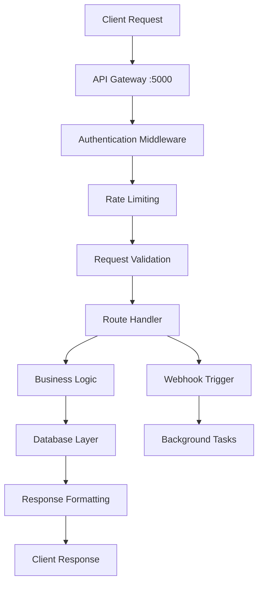

# API Gateway Service

The API Gateway serves as the central entry point for all client interactions with the Mailyte Mail Server. It provides a unified REST API for managing organizations, domains, mailboxes, and accessing all system features.

## Overview

The API Gateway is built with Flask and provides:

- **Unified API Interface**: Single endpoint for all operations
- **Authentication & Authorization**: JWT and API key support
- **Rate Limiting**: Built-in request throttling
- **Request Validation**: Comprehensive input validation
- **Error Handling**: Standardized error responses
- **Documentation**: OpenAPI/Swagger integration

## Architecture



## Service Configuration

### Environment Variables

```bash
# API Gateway Configuration
API_HOST=0.0.0.0
API_PORT=5000
API_DEBUG=false

# Database Connection
DB_HOST=mysql
DB_PORT=3306
DB_NAME=mailserver
DB_USER=mailserver
DB_PASSWORD=secure_password

# Authentication
JWT_SECRET_KEY=your-secret-key
API_KEY_HEADER=X-API-Key
SESSION_TIMEOUT=3600

# Rate Limiting
RATE_LIMIT_STORAGE_URL=redis://localhost:6379
DEFAULT_RATE_LIMIT=1000 per hour
BURST_RATE_LIMIT=100 per minute
```

## API Endpoints

### Organizations Management

#### List Organizations
```http
GET /api/v1/organizations
```

**Parameters:**
- `page` (int): Page number (default: 1)
- `per_page` (int): Items per page (default: 20)
- `search` (string): Search term

**Response:**
```json
{
  "organizations": [
    {
      "id": 1,
      "name": "Acme Corporation",
      "external_id": "acme-corp-123",
      "created_at": "2024-01-15T10:00:00Z",
      "limits": {
        "inbound_hourly": 10000,
        "outbound_hourly": 5000
      },
      "usage": {
        "storage_used_mb": 1024,
        "emails_sent_today": 150
      }
    }
  ],
  "total": 1,
  "page": 1,
  "per_page": 20
}
```

#### Create Organization
```http
POST /api/v1/organizations
```

**Request Body:**
```json
{
  "name": "New Organization",
  "external_id": "new-org-456",
  "limits": {
    "inbound_hourly": 5000,
    "outbound_hourly": 2500,
    "storage_quota_mb": 10000
  }
}
```

### Domains Management

#### List Domains
```http
GET /api/v1/domains
```

**Parameters:**
- `organization_id` (int): Filter by organization
- `active` (bool): Filter by active status

#### Add Domain
```http
POST /api/v1/domains
```

**Request Body:**
```json
{
  "domain": "example.com",
  "organization_id": 1,
  "external_id": "domain-example",
  "active": true,
  "limits": {
    "inbound_hourly": 1000,
    "outbound_hourly": 500
  }
}
```

### Mailboxes Management

#### List Mailboxes
```http
GET /api/v1/mailboxes
```

**Parameters:**
- `domain_id` (int): Filter by domain
- `organization_id` (int): Filter by organization
- `active` (bool): Filter by active status

#### Create Mailbox
```http
POST /api/v1/mailboxes
```

**Request Body:**
```json
{
  "email": "user@example.com",
  "password": "secure-password",
  "domain_id": 1,
  "external_id": "user-123",
  "quota_mb": 1000,
  "active": true
}
```

### Tracking & Analytics

#### Get Tracking Events
```http
GET /api/v1/tracking/events
```

**Parameters:**
- `email` (string): Filter by email address
- `start_date` (string): Start date (ISO format)
- `end_date` (string): End date (ISO format)
- `event_type` (string): Filter by event type

#### Get Analytics
```http
GET /api/v1/analytics/summary
```

**Response:**
```json
{
  "summary": {
    "emails_sent": 1500,
    "emails_delivered": 1450,
    "emails_opened": 725,
    "links_clicked": 145,
    "bounce_rate": 0.033,
    "open_rate": 0.5,
    "click_rate": 0.2
  },
  "period": "last_30_days"
}
```

## Authentication

### API Key Authentication

```bash
curl -H "X-API-Key: your-api-key" \
     https://api.yourdomain.com/api/v1/organizations
```

### JWT Token Authentication

```bash
# Get token
curl -X POST \
     -H "Content-Type: application/json" \
     -d '{"username": "admin", "password": "password"}' \
     https://api.yourdomain.com/api/v1/auth/login

# Use token
curl -H "Authorization: Bearer your-jwt-token" \
     https://api.yourdomain.com/api/v1/organizations
```

## Rate Limiting

The API implements multiple rate limiting strategies:

### Per-User Limits
```python
# Default limits per user
{"requests_per_minute": 100, "requests_per_hour": 1000, "requests_per_day": 10000}
```

### Per-IP Limits
```python
# Default limits per IP address
{"requests_per_minute": 200, "requests_per_hour": 2000}
```

### Rate Limit Headers
```http
X-RateLimit-Limit: 1000
X-RateLimit-Remaining: 999
X-RateLimit-Reset: 1640995200
X-RateLimit-Retry-After: 60
```

## Request Validation

### Input Validation
All requests are validated using Marshmallow schemas:

```python
from marshmallow import Schema, fields, validate


class OrganizationSchema(Schema):
    name = fields.Str(required=True, validate=validate.Length(min=2, max=100))
    external_id = fields.Str(required=True, validate=validate.Length(min=1, max=50))
    limits = fields.Dict(missing=dict)
```

### Error Responses
```json
{
  "error": {
    "code": "VALIDATION_ERROR",
    "message": "Invalid input data",
    "details": {
      "name": ["Field is required"],
      "email": ["Invalid email format"]
    }
  }
}
```

## Service Integration

### Database Operations
```python
from worker.api.utils.database import get_db_connection


def get_organizations(page=1, per_page=20):
    conn = get_db_connection()
    cursor = conn.cursor(dictionary=True)

    offset = (page - 1) * per_page
    query = """
        SELECT o.*, 
               COUNT(d.id) as domain_count,
               COUNT(e.id) as email_count
        FROM organizations o
        LEFT JOIN domains d ON o.id = d.organization_id
        LEFT JOIN email_accounts e ON d.id = e.domain_id
        GROUP BY o.id
        LIMIT %s OFFSET %s
    """

    cursor.execute(query, (per_page, offset))
    return cursor.fetchall()
```

### Webhook Integration
```python
from worker.webhooks.services.notification_sender import WebhookSender


def trigger_webhook(event_type, data):
    webhook_sender = WebhookSender()
    webhook_sender.send_webhook(
        {"event": event_type, "data": data, "timestamp": datetime.utcnow().isoformat()}
    )
```

## Error Handling

### Standard Error Codes
```python
ERROR_CODES = {
    "VALIDATION_ERROR": 400,
    "UNAUTHORIZED": 401,
    "FORBIDDEN": 403,
    "NOT_FOUND": 404,
    "CONFLICT": 409,
    "RATE_LIMITED": 429,
    "INTERNAL_ERROR": 500,
}
```

### Error Response Format
```python
def format_error(code, message, details=None):
    return {
        "error": {
            "code": code,
            "message": message,
            "details": details or {},
            "timestamp": datetime.utcnow().isoformat(),
        }
    }
```

## Health Monitoring

### Health Check Endpoint
```http
GET /health
```

**Response:**
```json
{
  "status": "healthy",
  "services": {
    "database": "connected",
    "redis": "connected",
    "webhook_service": "healthy",
    "tracking_service": "healthy"
  },
  "version": "1.0.0",
  "uptime": "5d 12h 30m"
}
```

### Metrics Collection
```python
from prometheus_client import Counter, Histogram, Gauge

# Request metrics
REQUEST_COUNT = Counter(
    "api_requests_total", "Total API requests", ["method", "endpoint", "status"]
)
REQUEST_DURATION = Histogram("api_request_duration_seconds", "Request duration")
ACTIVE_CONNECTIONS = Gauge("api_active_connections", "Active connections")
```

## Configuration Files

### Main Application Configuration
```python
# worker/api/config.py
import os


class Config:
    # Flask configuration
    SECRET_KEY = os.getenv("SECRET_KEY", "dev-secret-key")

    # Database configuration
    DATABASE_URL = f"mysql://{os.getenv('DB_USER')}:{os.getenv('DB_PASSWORD')}@{os.getenv('DB_HOST')}/{os.getenv('DB_NAME')}"

    # Rate limiting
    RATELIMIT_STORAGE_URL = os.getenv("RATE_LIMIT_STORAGE_URL", "redis://localhost:6379")

    # Pagination
    DEFAULT_PAGE_SIZE = 20
    MAX_PAGE_SIZE = 100
```

## Deployment

### Production Configuration
```python
# Production settings
DEBUG = False
TESTING = False
LOG_LEVEL = "INFO"

# Security headers
SECURITY_HEADERS = {
    "X-Content-Type-Options": "nosniff",
    "X-Frame-Options": "DENY",
    "X-XSS-Protection": "1; mode=block",
}
```

### Service Management
```bash
# Start API Gateway
python3 worker/api/app.py

# With gunicorn (production)
gunicorn -w 4 -b 0.0.0.0:5000 worker.api.app:app
```

## Testing

### Unit Tests
```python
import pytest
from worker.api.app import create_app


@pytest.fixture
def client():
    app = create_app(testing=True)
    with app.test_client() as client:
        yield client


def test_create_organization(client):
    response = client.post(
        "/api/v1/organizations", json={"name": "Test Org", "external_id": "test-org"}
    )
    assert response.status_code == 201
```

### Load Testing
```bash
# Using Apache Bench
ab -n 1000 -c 10 http://localhost:5000/api/v1/organizations

# Using wrk
wrk -t10 -c100 -d30s http://localhost:5000/api/v1/organizations
```

## Security Considerations

1. **Input Sanitization**: All inputs are validated and sanitized
2. **SQL Injection Protection**: Parameterized queries only
3. **Authentication**: Required for all endpoints
4. **Rate Limiting**: Prevents abuse and DoS attacks
5. **CORS Configuration**: Properly configured for web clients
6. **Security Headers**: Standard security headers included

## Best Practices

1. **Use External IDs**: Always provide external_id for resource mapping
2. **Implement Pagination**: Use pagination for large datasets
3. **Handle Errors Gracefully**: Provide meaningful error messages
4. **Monitor Performance**: Track response times and error rates
5. **Version APIs**: Use versioning for backward compatibility

The API Gateway provides a robust, scalable foundation for all client interactions with the Mailyte Mail Server, ensuring secure and efficient access to all system capabilities.
