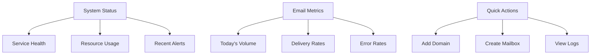

# Management Dashboard

The Management Dashboard provides a comprehensive web-based interface for monitoring, configuring, and managing all aspects of the Mailyte Mail Server with real-time analytics and administrative controls.

## Overview

**Port**: 8085  
**Status**: ✅ Production Ready  
**Framework**: Flask with modern web UI  
**Authentication**: Role-based access control  

## Key Features

### Real-time Monitoring
- **Live System Metrics**: CPU, memory, disk usage
- **Email Flow Visualization**: Real-time email processing
- **Service Health Dashboard**: All microservice status
- **Performance Graphs**: Historical performance data

### Administrative Controls
- **Domain Management**: Add, modify, remove domains
- **User Administration**: Mailbox and alias management
- **Configuration Management**: System-wide settings
- **Security Controls**: Access control and permissions

### Analytics & Reporting
- **Email Statistics**: Delivery and engagement metrics
- **Usage Reports**: Storage and quota utilization
- **Performance Analytics**: System performance insights
- **Custom Dashboards**: Configurable analytics views

## Dashboard Components

### System Overview


### Main Dashboard Sections

#### 1. System Health Overview
```html
<div class="system-health">
    <div class="health-card">
        <h3>Services Status</h3>
        <div class="service-list">
            <span class="service healthy">Postfix ✓</span>
            <span class="service healthy">Dovecot ✓</span>
            <span class="service warning">Rspamd ⚠</span>
            <span class="service healthy">API Gateway ✓</span>
        </div>
    </div>
    
    <div class="metrics-card">
        <h3>System Resources</h3>
        <div class="metric">
            <label>CPU Usage</label>
            <div class="progress-bar">
                <div class="progress" style="width: 65%">65%</div>
            </div>
        </div>
        <div class="metric">
            <label>Memory Usage</label>
            <div class="progress-bar">
                <div class="progress" style="width: 78%">78%</div>
            </div>
        </div>
    </div>
</div>
```

#### 2. Email Flow Monitoring
```javascript
// Real-time email flow chart
const emailFlowChart = new Chart(ctx, {
    type: 'line',
    data: {
        labels: timeLabels,
        datasets: [{
            label: 'Emails Processed',
            data: emailVolume,
            borderColor: 'rgb(75, 192, 192)',
            tension: 0.1
        }]
    },
    options: {
        responsive: true,
        scales: {
            y: {
                beginAtZero: true
            }
        },
        plugins: {
            legend: {
                display: true
            }
        }
    }
});
```

## API Endpoints

### Dashboard Data
```
GET /dashboard/overview
GET /dashboard/system-health
GET /dashboard/email-metrics
GET /dashboard/recent-activity
```

### Administrative Actions
```
POST /admin/domains
PUT  /admin/domains/{domain}
POST /admin/mailboxes
GET  /admin/logs
POST /admin/system/restart-service
```

### Configuration Management
```
GET  /config/global
PUT  /config/global
GET  /config/services
POST /config/backup
POST /config/restore
```

## Real-time Features

### WebSocket Integration
```javascript
// Establish WebSocket connection for real-time updates
const socket = io('http://localhost:8085');

socket.on('system_metrics', (data) => {
    updateSystemMetrics(data);
});

socket.on('email_processed', (data) => {
    updateEmailCounter(data);
    addToRecentActivity(data);
});

socket.on('service_alert', (data) => {
    showAlert(data.message, data.severity);
});
```

### Live Data Updates
```python
@socketio.on("connect")
def handle_connect():
    """Handle client connection"""
    emit("connected", {"status": "Connected to dashboard"})
    # Send initial data
    emit("system_metrics", get_current_metrics())


@app.route("/api/realtime/metrics")
def stream_metrics():
    """Stream real-time metrics via Server-Sent Events"""

    def generate():
        while True:
            metrics = collect_system_metrics()
            yield f"data: {json.dumps(metrics)}\n\n"
            time.sleep(5)

    return Response(generate(), mimetype="text/plain")
```

## User Interface

### Main Dashboard Layout
```html
<!DOCTYPE html>
<html>
<head>
    <title>Mailyte Mail Server Dashboard</title>
    <link rel="stylesheet" href="/static/css/dashboard.css">
    <script src="/static/js/chart.js"></script>
    <script src="/static/js/socket.io.js"></script>
</head>
<body>
    <nav class="sidebar">
        <div class="nav-brand">
            <h2>Mail Server</h2>
        </div>
        <ul class="nav-menu">
            <li><a href="/dashboard">Overview</a></li>
            <li><a href="/domains">Domains</a></li>
            <li><a href="/mailboxes">Mailboxes</a></li>
            <li><a href="/analytics">Analytics</a></li>
            <li><a href="/logs">Logs</a></li>
            <li><a href="/settings">Settings</a></li>
        </ul>
    </nav>
    
    <main class="main-content">
        <header class="content-header">
            <h1>System Overview</h1>
            <div class="header-actions">
                <button class="btn btn-primary">Refresh</button>
                <div class="user-menu">
                    <span>Admin User</span>
                    <a href="/logout">Logout</a>
                </div>
            </div>
        </header>
        
        <div class="dashboard-grid">
            <!-- Dashboard widgets will be loaded here -->
        </div>
    </main>
</body>
</html>
```

### Dashboard Widgets

#### Email Volume Widget
```javascript
class EmailVolumeWidget {
    constructor(container) {
        this.container = container;
        this.chart = null;
        this.init();
    }
    
    init() {
        const ctx = this.container.querySelector('canvas');
        this.chart = new Chart(ctx, {
            type: 'doughnut',
            data: {
                labels: ['Delivered', 'Pending', 'Failed'],
                datasets: [{
                    data: [0, 0, 0],
                    backgroundColor: ['#28a745', '#ffc107', '#dc3545']
                }]
            }
        });
        
        this.loadData();
        setInterval(() => this.loadData(), 30000); // Update every 30 seconds
    }
    
    async loadData() {
        const response = await fetch('/api/dashboard/email-stats');
        const data = await response.json();
        this.chart.data.datasets[0].data = [
            data.delivered,
            data.pending,
            data.failed
        ];
        this.chart.update();
    }
}
```

#### System Resources Widget
```javascript
class SystemResourcesWidget {
    constructor(container) {
        this.container = container;
        this.init();
    }
    
    init() {
        this.container.innerHTML = `
            <div class="resource-widget">
                <h3>System Resources</h3>
                <div class="resource-item">
                    <label>CPU</label>
                    <div class="progress-container">
                        <div class="progress-bar" id="cpu-progress"></div>
                        <span class="progress-text" id="cpu-text">0%</span>
                    </div>
                </div>
                <div class="resource-item">
                    <label>Memory</label>
                    <div class="progress-container">
                        <div class="progress-bar" id="memory-progress"></div>
                        <span class="progress-text" id="memory-text">0%</span>
                    </div>
                </div>
                <div class="resource-item">
                    <label>Disk</label>
                    <div class="progress-container">
                        <div class="progress-bar" id="disk-progress"></div>
                        <span class="progress-text" id="disk-text">0%</span>
                    </div>
                </div>
            </div>
        `;
        
        this.updateResources();
        setInterval(() => this.updateResources(), 5000);
    }
    
    async updateResources() {
        const response = await fetch('/api/dashboard/system-resources');
        const data = await response.json();
        
        this.updateProgressBar('cpu', data.cpu_percent);
        this.updateProgressBar('memory', data.memory_percent);
        this.updateProgressBar('disk', data.disk_percent);
    }
    
    updateProgressBar(type, percentage) {
        const progressBar = document.getElementById(`${type}-progress`);
        const progressText = document.getElementById(`${type}-text`);
        
        progressBar.style.width = `${percentage}%`;
        progressText.textContent = `${percentage}%`;
        
        // Color coding based on usage
        if (percentage > 90) {
            progressBar.className = 'progress-bar danger';
        } else if (percentage > 70) {
            progressBar.className = 'progress-bar warning';
        } else {
            progressBar.className = 'progress-bar normal';
        }
    }
}
```

## Administrative Features

### Domain Management Interface
```html
<div class="domain-management">
    <div class="page-header">
        <h2>Domain Management</h2>
        <button class="btn btn-primary" onclick="showAddDomainModal()">
            Add Domain
        </button>
    </div>
    
    <div class="domain-list">
        <table class="data-table">
            <thead>
                <tr>
                    <th>Domain</th>
                    <th>Status</th>
                    <th>Mailboxes</th>
                    <th>Storage Used</th>
                    <th>Actions</th>
                </tr>
            </thead>
            <tbody id="domain-table-body">
                <!-- Domain rows will be populated here -->
            </tbody>
        </table>
    </div>
</div>
```

### Configuration Management
```javascript
class ConfigurationManager {
    constructor() {
        this.config = {};
        this.loadConfiguration();
    }
    
    async loadConfiguration() {
        const response = await fetch('/api/config/global');
        this.config = await response.json();
        this.renderConfigForm();
    }
    
    renderConfigForm() {
        const container = document.getElementById('config-container');
        container.innerHTML = this.generateConfigForm(this.config);
    }
    
    async saveConfiguration() {
        const formData = new FormData(document.getElementById('config-form'));
        const config = Object.fromEntries(formData);
        
        const response = await fetch('/api/config/global', {
            method: 'PUT',
            headers: {
                'Content-Type': 'application/json'
            },
            body: JSON.stringify(config)
        });
        
        if (response.ok) {
            this.showNotification('Configuration saved successfully', 'success');
        } else {
            this.showNotification('Failed to save configuration', 'error');
        }
    }
}
```

## Security Features

### Authentication & Authorization
```python
from functools import wraps
from flask_login import login_required, current_user


def admin_required(f):
    @wraps(f)
    @login_required
    def decorated_function(*args, **kwargs):
        if not current_user.is_admin:
            abort(403)
        return f(*args, **kwargs)

    return decorated_function


@app.route("/admin/domains", methods=["POST"])
@admin_required
def create_domain():
    """Create new domain - admin only"""
    domain_data = request.get_json()
    # Domain creation logic
    return jsonify({"status": "created"})
```

### Audit Logging
```python
def log_admin_action(action, details):
    """Log administrative actions for audit trail"""
    audit_log.info(
        {
            "user": current_user.username,
            "action": action,
            "details": details,
            "timestamp": datetime.utcnow(),
            "ip_address": request.remote_addr,
        }
    )


@app.route("/admin/mailboxes/<email>", methods=["DELETE"])
@admin_required
def delete_mailbox(email):
    # Delete mailbox logic
    log_admin_action("delete_mailbox", {"email": email})
    return jsonify({"status": "deleted"})
```

## Configuration

### Environment Variables
```bash
DASHBOARD_PORT=8085
SECRET_KEY=your-secret-key
ADMIN_USERNAME=admin
ADMIN_PASSWORD=secure-password
SESSION_TIMEOUT=3600
```

### Dashboard Settings
```bash
ENABLE_REALTIME_UPDATES=true
METRICS_UPDATE_INTERVAL=5
CHART_DATA_POINTS=50
ENABLE_AUDIT_LOGGING=true
```

## Development

### Adding New Widgets
1. Create widget JavaScript class
2. Define data API endpoint
3. Add widget to dashboard layout
4. Style with CSS
5. Test real-time updates

### Testing Dashboard
```bash
# Start dashboard in development mode
FLASK_ENV=development python app.py

# Access dashboard
open http://localhost:8085

# Test WebSocket connection
node test_websocket.js
```

### Custom Dashboard Development
```javascript
// Create custom widget
class CustomWidget extends DashboardWidget {
    constructor(config) {
        super(config);
        this.apiEndpoint = config.apiEndpoint;
        this.updateInterval = config.updateInterval || 30000;
    }
    
    async fetchData() {
        const response = await fetch(this.apiEndpoint);
        return response.json();
    }
    
    render(data) {
        // Custom rendering logic
    }
}

// Register widget
DashboardRegistry.register('custom-widget', CustomWidget);
```
