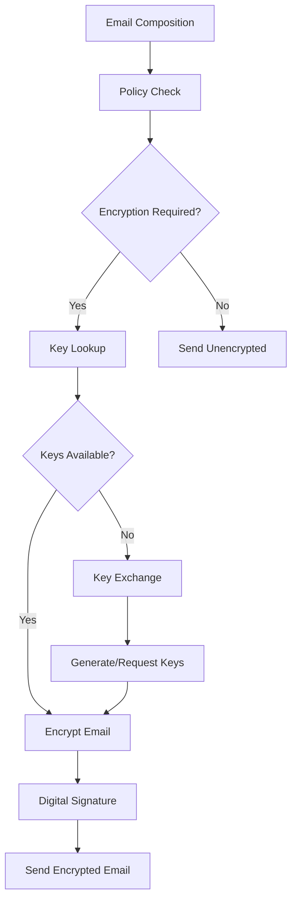

# Email Encryption System

**Status: 🚧 In Development - Basic Structure Only**

The Email Encryption System will provide comprehensive email encryption capabilities with PGP/GPG and S/MIME support, automatic key management, and enterprise-grade security policies.

## Planned Architecture

### Encryption Standards
- **OpenPGP (PGP/GPG)**: Industry-standard public key encryption
- **S/MIME**: Certificate-based encryption and digital signatures
- **Hybrid Encryption**: Combines symmetric and asymmetric encryption
- **Forward Secrecy**: Perfect forward secrecy implementation

### Key Management System
- **Automatic Key Generation**: Seamless key pair creation
- **Key Distribution**: Automated public key sharing
- **Key Rotation**: Periodic key refresh and renewal
- **Key Escrow**: Corporate key backup and recovery

## Planned Features

### Encryption Policies
```json
{
    "policy_id": "corporate_encryption_001",
    "name": "Corporate Email Encryption Policy",
    "scope": "organization",
    "rules": [
        {
            "condition": "recipient_domain == 'competitor.com'",
            "action": "require_encryption",
            "method": "pgp",
            "key_strength": 4096
        },
        {
            "condition": "subject_contains(['confidential', 'private'])",
            "action": "require_encryption",
            "method": "smime",
            "certificate_level": "high_assurance"
        },
        {
            "condition": "attachment_type == 'financial'",
            "action": "require_encryption",
            "method": "pgp",
            "additional_authentication": true
        }
    ],
    "default_action": "optional_encryption"
}
```

### Key Management Structure
```json
{
    "key_id": "key_abc123def456",
    "type": "pgp",
    "algorithm": "RSA",
    "key_size": 4096,
    "owner": "user@company.com",
    "created_at": "2024-01-01T12:00:00Z",
    "expires_at": "2025-01-01T12:00:00Z",
    "status": "active",
    "fingerprint": "A1B2 C3D4 E5F6 7890 1234 5678 9ABC DEF0 1234 5678",
    "public_key": "-----BEGIN PGP PUBLIC KEY BLOCK-----...",
    "revocation_certificate": "-----BEGIN PGP PUBLIC KEY BLOCK-----...",
    "backup_location": "hsm://key-vault/abc123",
    "usage_permissions": ["encrypt", "sign", "authenticate"]
}
```

### Encryption Workflow


## Planned API Endpoints

### Key Management
```
GET    /api/v1/encryption/keys
POST   /api/v1/encryption/keys/generate
GET    /api/v1/encryption/keys/{key_id}
DELETE /api/v1/encryption/keys/{key_id}/revoke
POST   /api/v1/encryption/keys/import
```

### Encryption Operations
```
POST /api/v1/encryption/encrypt
POST /api/v1/encryption/decrypt
POST /api/v1/encryption/sign
POST /api/v1/encryption/verify
```

### Policy Management
```
GET    /api/v1/encryption/policies
POST   /api/v1/encryption/policies
PUT    /api/v1/encryption/policies/{policy_id}
GET    /api/v1/encryption/policies/{policy_id}/test
```

### Certificate Management (S/MIME)
```
GET    /api/v1/certificates
POST   /api/v1/certificates/request
GET    /api/v1/certificates/{cert_id}
POST   /api/v1/certificates/{cert_id}/renew
```

## Planned Integration

### Email Processing Integration
```python
# Encryption in email pipeline
def process_outbound_email(email_data):
    # Check encryption policy
    policy_result = encryption_service.check_policy(email_data)
    
    if policy_result.requires_encryption:
        # Get recipient keys
        recipient_keys = key_service.get_public_keys(
            email_data['recipients']
        )
        
        # Encrypt email content
        encrypted_content = encryption_service.encrypt(
            content=email_data['body'],
            recipient_keys=recipient_keys,
            method=policy_result.encryption_method
        )
        
        # Add digital signature
        if policy_result.requires_signature:
            signature = encryption_service.sign(
                content=encrypted_content,
                sender_key=key_service.get_private_key(
                    email_data['sender']
                )
            )
            encrypted_content = encryption_service.attach_signature(
                encrypted_content, signature
            )
        
        email_data['body'] = encrypted_content
        email_data['is_encrypted'] = True
        email_data['encryption_method'] = policy_result.encryption_method
    
    return email_data
```

### Automatic Key Exchange
```python
def handle_key_exchange(sender, recipient):
    """Automatic key exchange for new contacts"""
    
    # Check if we have recipient's public key
    recipient_key = key_service.get_public_key(recipient)
    
    if not recipient_key:
        # Request key from recipient's key server
        key_request = KeyExchangeRequest(
            requester=sender,
            target=recipient,
            method='pgp',
            key_server=discover_key_server(recipient)
        )
        
        # Send key request
        key_exchange_service.request_key(key_request)
        
        # Also publish our public key
        key_exchange_service.publish_key(
            sender_key=key_service.get_public_key(sender),
            target_server=key_request.key_server
        )
```

## Planned Encryption Methods

### PGP/GPG Implementation
```python
class PGPEncryption:
    def __init__(self, gnupg_home="/var/lib/mailserver/gnupg"):
        self.gpg = gnupg.GPG(gnupghome=gnupg_home)
    
    def encrypt_email(self, content, recipient_keys, sender_key=None):
        """Encrypt email using PGP"""
        encrypted_data = self.gpg.encrypt(
            content,
            recipients=[key.fingerprint for key in recipient_keys],
            sign=sender_key.fingerprint if sender_key else None,
            always_trust=True
        )
        
        if not encrypted_data.ok:
            raise EncryptionError(f"PGP encryption failed: {encrypted_data.stderr}")
        
        return str(encrypted_data)
    
    def decrypt_email(self, encrypted_content, passphrase=None):
        """Decrypt PGP encrypted email"""
        decrypted_data = self.gpg.decrypt(
            encrypted_content,
            passphrase=passphrase
        )
        
        if not decrypted_data.ok:
            raise DecryptionError(f"PGP decryption failed: {decrypted_data.stderr}")
        
        return {
            'content': str(decrypted_data),
            'signature_valid': decrypted_data.valid,
            'signature_fingerprint': decrypted_data.fingerprint
        }
```

### S/MIME Implementation
```python
class SMIMEEncryption:
    def __init__(self, cert_store="/var/lib/mailserver/certificates"):
        self.cert_store = cert_store
    
    def encrypt_email(self, content, recipient_certificates):
        """Encrypt email using S/MIME"""
        from M2Crypto import SMIME, X509, BIO
        
        s = SMIME.SMIME()
        
        # Load recipient certificates
        sk = X509.X509_Stack()
        for cert in recipient_certificates:
            x509 = X509.load_cert_string(cert.certificate)
            sk.push(x509)
        
        s.set_x509_stack(sk)
        s.set_cipher(SMIME.Cipher('aes_256_cbc'))
        
        # Encrypt
        msg = BIO.MemoryBuffer(content.encode())
        p7 = s.encrypt(msg)
        
        return p7
    
    def sign_email(self, content, sender_certificate, private_key):
        """Sign email using S/MIME"""
        from M2Crypto import SMIME, X509, BIO, EVP
        
        s = SMIME.SMIME()
        
        # Load certificate and private key
        s.load_key(private_key, sender_certificate)
        
        msg = BIO.MemoryBuffer(content.encode())
        p7 = s.sign(msg, SMIME.PKCS7_DETACHED)
        
        return p7
```

## Planned Security Features

### Key Rotation Policy
```json
{
    "rotation_policy": {
        "automatic_rotation": true,
        "rotation_interval_days": 365,
        "key_overlap_days": 30,
        "notification_days_before": 14,
        "emergency_rotation_triggers": [
            "key_compromise_detected",
            "employee_termination",
            "security_audit_requirement"
        ]
    },
    "key_strength_requirements": {
        "minimum_rsa_bits": 2048,
        "preferred_rsa_bits": 4096,
        "allowed_elliptic_curves": ["P-256", "P-384", "P-521"],
        "hash_algorithms": ["SHA-256", "SHA-384", "SHA-512"]
    }
}
```

### Hardware Security Module Integration
```python
class HSMKeyManager:
    def __init__(self, hsm_config):
        self.hsm = HSMClient(hsm_config)
    
    def generate_key_pair(self, key_spec):
        """Generate key pair in HSM"""
        key_id = self.hsm.generate_keypair(
            algorithm=key_spec.algorithm,
            key_size=key_spec.size,
            usage=['encrypt', 'decrypt', 'sign', 'verify']
        )
        
        # Export public key for distribution
        public_key = self.hsm.export_public_key(key_id)
        
        return {
            'key_id': key_id,
            'public_key': public_key,
            'hsm_backed': True
        }
    
    def sign_with_hsm(self, content_hash, key_id):
        """Sign using HSM-stored private key"""
        return self.hsm.sign(content_hash, key_id)
```

## Planned Database Schema

### Encryption Keys
```sql
CREATE TABLE encryption_keys (
    id VARCHAR(255) PRIMARY KEY,
    owner_email VARCHAR(255) NOT NULL,
    key_type ENUM('pgp', 'smime', 'other'),
    algorithm VARCHAR(50),
    key_size INT,
    fingerprint VARCHAR(255) UNIQUE,
    public_key LONGTEXT,
    private_key_location VARCHAR(500), -- HSM location or encrypted storage
    created_at TIMESTAMP,
    expires_at TIMESTAMP,
    status ENUM('active', 'expired', 'revoked', 'compromised'),
    metadata JSON,
    INDEX idx_owner_type (owner_email, key_type),
    INDEX idx_fingerprint (fingerprint),
    INDEX idx_status_expires (status, expires_at)
);
```

### Encryption Policies
```sql
CREATE TABLE encryption_policies (
    id VARCHAR(255) PRIMARY KEY,
    name VARCHAR(255) NOT NULL,
    scope ENUM('global', 'organization', 'domain', 'user'),
    scope_value VARCHAR(255),
    policy_rules JSON,
    priority INT DEFAULT 100,
    active BOOLEAN DEFAULT true,
    created_at TIMESTAMP,
    updated_at TIMESTAMP,
    INDEX idx_scope (scope, scope_value),
    INDEX idx_priority (priority)
);
```

### Encryption Events
```sql
CREATE TABLE encryption_events (
    id BIGINT PRIMARY KEY AUTO_INCREMENT,
    event_type ENUM('encrypt', 'decrypt', 'sign', 'verify', 'key_generated', 'key_revoked'),
    email_id VARCHAR(255),
    user_email VARCHAR(255),
    key_id VARCHAR(255),
    success BOOLEAN,
    error_message TEXT,
    metadata JSON,
    timestamp TIMESTAMP,
    INDEX idx_email_type (email_id, event_type),
    INDEX idx_user_timestamp (user_email, timestamp)
);
```

## Current Status

### What's Implemented
- **Basic Structure**: Empty application stub
- **Framework Setup**: Flask application skeleton

### What's Planned (Priority Order)

#### Phase 1: Core Encryption Engine
- **PGP/GPG Integration**: OpenPGP encryption/decryption
- **Key Management**: Basic key generation and storage
- **Policy Engine**: Rule-based encryption decisions
- **Integration Points**: Email pipeline integration

#### Phase 2: S/MIME Support
- **Certificate Management**: X.509 certificate handling
- **S/MIME Operations**: Encryption and digital signatures
- **CA Integration**: Certificate authority connections
- **Hybrid Operations**: Combined PGP and S/MIME workflows

#### Phase 3: Enterprise Features
- **HSM Integration**: Hardware security module support
- **Key Escrow**: Corporate key backup and recovery
- **Compliance Reporting**: Encryption audit trails
- **Advanced Policies**: Complex policy rules and conditions

#### Phase 4: Advanced Security
- **Perfect Forward Secrecy**: Enhanced security protocols
- **Quantum-Resistant**: Post-quantum cryptography preparation
- **Zero-Knowledge**: Zero-knowledge proof systems
- **Secure Collaboration**: Encrypted group communications

## Dependencies (When Implemented)

### Required Packages
- **python-gnupg**: PGP/GPG operations
- **M2Crypto**: S/MIME and X.509 certificate handling
- **cryptography**: Modern cryptographic primitives
- **pyOpenSSL**: SSL/TLS and certificate operations

### Optional Integrations
- **PyKCS11**: PKCS#11 HSM integration
- **azure-keyvault**: Azure Key Vault integration
- **boto3**: AWS KMS integration
- **ldap3**: LDAP directory integration for key distribution

This module will provide enterprise-grade email encryption with comprehensive key management and policy enforcement once development is completed.
