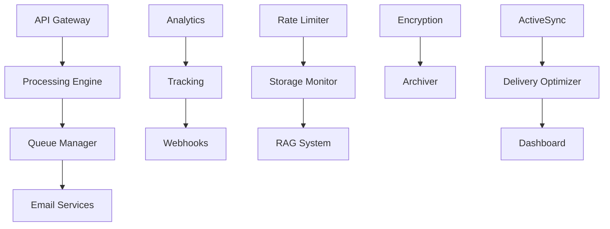

# Worker Services

The Mailyte Mail Server's worker services provide the core processing, API management, and advanced features that extend beyond basic mail transfer. These microservices work together to create a comprehensive email platform with enterprise-grade capabilities.

## Architecture Overview

## Core Services

### [API Gateway](api.md)
Central API endpoint that orchestrates all services with enterprise-level security and rate limiting.

### [Queue Manager](queue-manager.md)
Reliable message queuing system for email processing with error handling and retry logic.

### [RAG System](rag.md)
AI-powered email intelligence with vector database integration and semantic search capabilities.

## Processing Services

### [Email Tracking](tracking.md)
Advanced email tracking with pixel beacons, click tracking, and privacy-compliant analytics.

### [Webhook System](webhooks.md)
Real-time event notification system with reliable delivery and configurable payloads.

### [Analytics](analytics.md)
Comprehensive email analytics with delivery statistics and performance monitoring.

## Management Services

### [Rate Limiter](rate-limiter.md)
Dynamic rate limiting and abuse prevention with configurable policies.

### [Storage Monitor](storage.md)
Storage usage monitoring and quota management with cloud integration.

### [Dashboard](dashboard.md)
Web-based management interface for system monitoring and configuration.

## Advanced Features

### [Email Encryption](encryption.md)
PGP/GPG and S/MIME encryption with automatic key management *(In Development)*

### [Email Archiver & Backup](archiver.md)
Long-term email storage, compliance archiving, and automated backup system *(In Development)*

### [ActiveSync](activesync.md)
Mobile device synchronization with Exchange ActiveSync protocol *(In Development)*

### [Delivery Optimizer](delivery-optimizer.md)
AI-powered delivery optimization for maximum deliverability *(In Development)*

## Service Communication

All worker services communicate through:
- **REST APIs**: Standardized HTTP interfaces
- **Message Queues**: Asynchronous processing
- **Database**: Shared data layer
- **Webhooks**: Event-driven notifications

## Monitoring & Health

Each service includes:
- Health check endpoints
- Prometheus metrics
- Structured logging
- Error tracking
- Performance monitoring