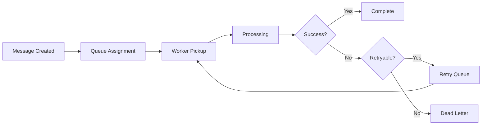

# Queue Manager Service

The Queue Manager Service provides reliable message queuing for email processing with advanced error handling, retry logic, and performance optimization for high-volume email operations.

## Overview

**Status**: ✅ Production Ready  
**Queue Backend**: Redis with persistent storage  
**Processing**: Multi-threaded with configurable workers  

## Key Features

### Reliable Message Processing
- **Persistent Queues**: Redis-backed message persistence
- **Dead Letter Queues**: Failed message handling
- **Priority Queues**: Message priority processing
- **Batch Processing**: Efficient bulk operations

### Advanced Error Handling
- **Retry Logic**: Exponential backoff with jitter
- **Circuit Breaker**: Prevent cascade failures
- **Error Classification**: Temporary vs permanent failures
- **Recovery Mechanisms**: Automatic failure recovery

### Performance Optimization
- **Worker Scaling**: Dynamic worker adjustment
- **Load Balancing**: Intelligent task distribution
- **Memory Management**: Efficient resource utilization
- **Monitoring**: Real-time performance metrics

## Queue Types

### Email Processing Queues
```python
QUEUE_TYPES = {
    "incoming_email": {"priority": "high", "workers": 5, "retry_attempts": 3, "timeout": 30},
    "outgoing_email": {"priority": "high", "workers": 3, "retry_attempts": 5, "timeout": 60},
    "tracking_injection": {"priority": "medium", "workers": 2, "retry_attempts": 2, "timeout": 15},
    "webhook_delivery": {"priority": "medium", "workers": 4, "retry_attempts": 3, "timeout": 30},
    "analytics_processing": {"priority": "low", "workers": 1, "retry_attempts": 1, "timeout": 120},
}
```

## Message Structure

### Standard Message Format
```json
{
    "id": "msg_123456789",
    "queue": "incoming_email",
    "priority": 5,
    "created_at": "2024-01-01T12:00:00Z",
    "scheduled_at": "2024-01-01T12:00:00Z",
    "attempts": 0,
    "max_attempts": 3,
    "timeout": 30,
    "data": {
        "email_id": "email_987654321",
        "sender": "user@example.com",
        "recipients": ["dest@domain.com"],
        "subject": "Test Email",
        "body": "Email content...",
        "headers": {},
        "attachments": []
    },
    "metadata": {
        "source": "postfix",
        "tracking_enabled": true,
        "organization_id": "org_001"
    }
}
```

### Processing Result
```json
{
    "message_id": "msg_123456789",
    "status": "completed",
    "processing_time": 2.5,
    "worker_id": "worker_001",
    "timestamp": "2024-01-01T12:00:02Z",
    "result": {
        "success": true,
        "message": "Email processed successfully",
        "tracking_id": "track_456789",
        "delivery_status": "queued"
    },
    "errors": []
}
```

## API Endpoints

### Queue Management
```
GET    /queues
GET    /queues/{queue_name}
POST   /queues/{queue_name}/message
GET    /queues/{queue_name}/stats
DELETE /queues/{queue_name}/purge
```

### Message Operations
```
GET    /messages/{message_id}
POST   /messages/{message_id}/retry
DELETE /messages/{message_id}
POST   /messages/batch
```

### Worker Management
```
GET  /workers
POST /workers/scale
GET  /workers/{worker_id}
POST /workers/{worker_id}/restart
```

### Monitoring
```
GET /health
GET /stats
GET /metrics
GET /dead-letter-queue
```

## Processing Pipeline

### Message Lifecycle


### Worker Processing
```python
class EmailProcessor:
    def __init__(self, queue_manager):
        self.queue_manager = queue_manager
        self.workers = []

    def process_message(self, message):
        """Process a single email message"""
        try:
            # Extract email data
            email_data = message.data

            # Apply tracking injection
            if message.metadata.get("tracking_enabled"):
                email_data = self.inject_tracking(email_data)

            # Send via SMTP
            result = self.send_email(email_data)

            # Update analytics
            self.update_analytics(email_data, result)

            # Send webhook notification
            self.send_webhook(email_data, result)

            return ProcessingResult(success=True, message="Email sent successfully", data=result)

        except TemporaryError as e:
            # Retryable error
            raise RetryableError(str(e))

        except PermanentError as e:
            # Non-retryable error
            raise FatalError(str(e))
```

## Error Handling

### Error Classification
```python
class ErrorClassifier:
    TEMPORARY_ERRORS = [
        "ConnectionTimeout",
        "ServiceUnavailable",
        "RateLimitExceeded",
        "TemporaryDNSFailure",
    ]

    PERMANENT_ERRORS = [
        "InvalidEmailAddress",
        "DomainNotFound",
        "AuthenticationFailed",
        "MessageTooLarge",
    ]

    def classify_error(self, error):
        if type(error).__name__ in self.TEMPORARY_ERRORS:
            return "temporary"
        elif type(error).__name__ in self.PERMANENT_ERRORS:
            return "permanent"
        else:
            return "unknown"
```

### Retry Strategy
```python
class RetryStrategy:
    def __init__(self, max_attempts=3, base_delay=1, max_delay=300):
        self.max_attempts = max_attempts
        self.base_delay = base_delay
        self.max_delay = max_delay

    def calculate_delay(self, attempt):
        """Calculate delay with exponential backoff and jitter"""
        delay = min(self.base_delay * (2**attempt), self.max_delay)
        # Add jitter (±20%)
        jitter = delay * 0.2 * (random.random() - 0.5)
        return delay + jitter

    def should_retry(self, attempt, error_type):
        """Determine if message should be retried"""
        if attempt >= self.max_attempts:
            return False
        if error_type == "permanent":
            return False
        return True
```

## Performance Monitoring

### Queue Statistics
```json
{
    "queue_stats": {
        "incoming_email": {
            "pending": 150,
            "processing": 5,
            "completed_today": 12500,
            "failed_today": 23,
            "average_processing_time": 2.1,
            "throughput_per_minute": 85
        },
        "outgoing_email": {
            "pending": 89,
            "processing": 3,
            "completed_today": 8900,
            "failed_today": 12,
            "average_processing_time": 3.4,
            "throughput_per_minute": 62
        }
    },
    "system_stats": {
        "total_workers": 15,
        "active_workers": 12,
        "memory_usage": "2.1GB",
        "cpu_usage": 0.68,
        "redis_memory": "512MB"
    }
}
```

### Performance Alerts
```json
{
    "alerts": [
        {
            "type": "high_queue_depth",
            "queue": "incoming_email",
            "current_depth": 500,
            "threshold": 100,
            "action": "scale_workers"
        },
        {
            "type": "high_failure_rate",
            "queue": "webhook_delivery",
            "failure_rate": 0.15,
            "threshold": 0.05,
            "action": "investigate_errors"
        }
    ]
}
```

## Configuration

### Environment Variables
```bash
QUEUE_MANAGER_PORT=5008
REDIS_URL=redis://localhost:6379
DEFAULT_WORKERS=5
MAX_WORKERS=20
QUEUE_RETENTION_DAYS=7
```

### Queue Configuration
```bash
INCOMING_EMAIL_WORKERS=5
OUTGOING_EMAIL_WORKERS=3
WEBHOOK_WORKERS=4
ANALYTICS_WORKERS=1
ENABLE_DEAD_LETTER_QUEUE=true
```

### Performance Settings
```bash
BATCH_SIZE=100
WORKER_TIMEOUT=300
HEALTH_CHECK_INTERVAL=30
METRICS_RETENTION_HOURS=24
AUTO_SCALING=true
```

## Integration

### Postfix Integration
```python
# In Postfix content filter
def queue_incoming_email(email_data):
    message = {
        "queue": "incoming_email",
        "data": email_data,
        "metadata": {"source": "postfix", "received_at": datetime.utcnow()},
    }

    queue_manager.enqueue(message)
```

### API Integration
```python
# Queue outgoing email
def send_email_async(email_data):
    message = {
        "queue": "outgoing_email",
        "priority": email_data.get("priority", 5),
        "data": email_data,
        "metadata": {"tracking_enabled": True, "webhook_url": "https://app.com/webhook"},
    }

    response = requests.post(f"{QUEUE_API}/queues/outgoing_email/message", json=message)

    return response.json()["message_id"]
```

## Worker Scaling

### Auto-scaling Logic
```python
class AutoScaler:
    def __init__(self, queue_manager):
        self.queue_manager = queue_manager
        self.scaling_rules = {
            "scale_up_threshold": 50,  # messages per worker
            "scale_down_threshold": 10,  # messages per worker
            "min_workers": 1,
            "max_workers": 20,
            "cooldown_minutes": 5,
        }

    def check_scaling_needed(self):
        """Check if worker scaling is needed"""
        for queue_name in self.queue_manager.get_queues():
            stats = self.queue_manager.get_queue_stats(queue_name)

            messages_per_worker = stats.pending / max(stats.workers, 1)

            if messages_per_worker > self.scaling_rules["scale_up_threshold"]:
                self.scale_up(queue_name)
            elif messages_per_worker < self.scaling_rules["scale_down_threshold"]:
                self.scale_down(queue_name)
```

## Development

### Testing Queue Operations
```bash
# Add test message
curl -X POST http://0.0.0.0:5008/queues/test/message \
  -H "Content-Type: application/json" \
  -d '{"data": {"test": "message"}, "priority": 5}'

# Check queue stats
curl http://0.0.0.0:5008/queues/test/stats

# Monitor processing
curl http://0.0.0.0:5008/stats
```

### Load Testing
```python
# Generate test load
import asyncio
import aiohttp


async def send_test_messages(count=1000):
    async with aiohttp.ClientSession() as session:
        tasks = []
        for i in range(count):
            task = session.post(
                "http://0.0.0.0:5008/queues/test/message", json={"data": {"test_id": i}}
            )
            tasks.append(task)

        responses = await asyncio.gather(*tasks)
        return responses
```

### Adding Custom Processors
1. Create processor class
2. Register with queue manager
3. Configure worker settings
4. Add monitoring metrics
5. Test processing logic
