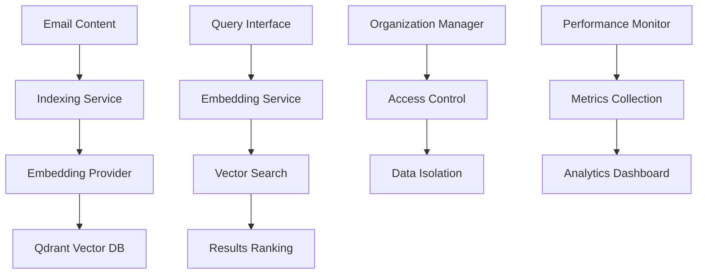

# RAG (Retrieval-Augmented Generation) System

The RAG System provides AI-powered email intelligence with vector database integration, semantic search capabilities, and multi-tenant organization support for enhanced email analytics and automation.

## Overview

**Port**: 8090  
**Status**: ✅ Production Ready  
**Vector Database**: Qdrant  
**AI Integration**: Multiple embedding providers  

## Key Features

### Vector Database Integration
- **Qdrant Backend**: High-performance vector search
- **Multi-Collection Support**: Organized data storage
- **Scalable Architecture**: Handles millions of documents
- **Real-time Indexing**: Live email content processing

### Multiple Embedding Providers
- **OpenAI**: GPT-based embeddings
- **Azure OpenAI**: Enterprise OpenAI integration
- **HuggingFace**: Open-source transformer models
- **Sentence Transformers**: Specialized email embeddings

### Multi-Tenant Organization Support
- **Organization Isolation**: Secure data separation
- **Role-based Access**: Granular permission control
- **Resource Management**: Per-organization limits
- **Performance Monitoring**: Organization-specific metrics

## Architecture



## API Endpoints

### Organization Management
```
GET    /organizations
POST   /organizations
GET    /organizations/{org_id}
PUT    /organizations/{org_id}
DELETE /organizations/{org_id}
```

### Document Management
```
POST   /documents/index
GET    /documents/{doc_id}
PUT    /documents/{doc_id}
DELETE /documents/{doc_id}
GET    /documents/search
```

### Search & Query
```
POST   /search/semantic
POST   /search/hybrid
GET    /search/similar/{doc_id}
POST   /search/batch
```

### Administration
```
GET    /admin/stats
POST   /admin/reindex
GET    /admin/health
POST   /admin/optimize
```

## Email Content Indexing

### Document Structure
```json
{
    "document_id": "email_123456",
    "organization_id": "org_001",
    "document_type": "email",
    "metadata": {
        "from": "sender@example.com",
        "to": ["recipient@domain.com"],
        "subject": "Important Update",
        "timestamp": "2024-01-01T12:00:00Z",
        "domain": "example.com",
        "thread_id": "thread_789",
        "attachments": ["report.pdf", "image.jpg"]
    },
    "content": {
        "body_text": "Email body content...",
        "body_html": "<html>...</html>",
        "attachments_text": "Extracted attachment content..."
    },
    "embedding": [0.1, 0.2, -0.3, ...],
    "indexed_at": "2024-01-01T12:00:00Z"
}
```

### Indexing Pipeline
```python
def index_email(email_data):
    """Process email for vector indexing"""
    # 1. Extract and clean content
    content = extract_email_content(email_data)
    
    # 2. Generate embeddings
    embedding = embedding_service.create_embedding(content)
    
    # 3. Create document
    document = RAGDocument(
        content=content,
        metadata=email_data.metadata,
        embedding=embedding,
        organization_id=email_data.organization_id
    )
    
    # 4. Store in vector database
    qdrant_service.index_document(document)
    
    return document.id
```

## Embedding Providers

### OpenAI Integration
```python
class OpenAIProvider:
    def __init__(self, api_key, model="text-embedding-ada-002"):
        self.client = OpenAI(api_key=api_key)
        self.model = model
    
    def create_embedding(self, text):
        response = self.client.embeddings.create(
            input=text,
            model=self.model
        )
        return response.data[0].embedding
```

### HuggingFace Integration
```python
class HuggingFaceProvider:
    def __init__(self, model_name="sentence-transformers/all-MiniLM-L6-v2"):
        self.model = SentenceTransformer(model_name)
    
    def create_embedding(self, text):
        return self.model.encode(text).tolist()
```

### Azure OpenAI Integration
```python
class AzureOpenAIProvider:
    def __init__(self, endpoint, api_key, deployment_name):
        self.client = AzureOpenAI(
            azure_endpoint=endpoint,
            api_key=api_key,
            api_version="2024-02-01"
        )
        self.deployment = deployment_name
```

## Search Capabilities

### Semantic Search
```json
{
    "query": "Find emails about quarterly financial reports",
    "organization_id": "org_001",
    "filters": {
        "date_range": {
            "start": "2024-01-01",
            "end": "2024-03-31"
        },
        "sender_domain": "company.com",
        "has_attachments": true
    },
    "limit": 20,
    "threshold": 0.7
}
```

### Search Response
```json
{
    "results": [
        {
            "document_id": "email_123456",
            "score": 0.89,
            "metadata": {
                "subject": "Q1 Financial Report",
                "from": "finance@company.com",
                "timestamp": "2024-03-31T17:00:00Z"
            },
            "content_snippet": "The quarterly financial report shows...",
            "highlights": ["quarterly", "financial", "report"]
        }
    ],
    "total_found": 45,
    "search_time_ms": 12,
    "query_id": "search_789"
}
```

### Hybrid Search
Combines vector similarity with traditional keyword search:

```python
def hybrid_search(query, filters=None, weights=None):
    """Combine semantic and keyword search"""
    if weights is None:
        weights = {"semantic": 0.7, "keyword": 0.3}
    
    # Semantic search
    semantic_results = vector_search(query, filters)
    
    # Keyword search
    keyword_results = keyword_search(query, filters)
    
    # Combine and rank results
    combined_results = combine_results(
        semantic_results, 
        keyword_results, 
        weights
    )
    
    return ranked_results(combined_results)
```

## Organization Management

### Multi-Tenant Architecture
```python
class OrganizationService:
    def create_organization(self, org_data):
        """Create new organization with isolated resources"""
        org = Organization(
            name=org_data.name,
            settings=org_data.settings,
            resource_limits=org_data.limits
        )
        
        # Create organization-specific vector collection
        qdrant_service.create_collection(f"org_{org.id}")
        
        return org
    
    def get_organization_stats(self, org_id):
        """Get organization usage statistics"""
        return {
            "documents_indexed": count_documents(org_id),
            "storage_used": calculate_storage(org_id),
            "queries_today": count_queries(org_id),
            "embedding_usage": get_embedding_usage(org_id)
        }
```

### Access Control
```python
def require_organization_access(org_id, user_id, permission):
    """Decorator for organization-based access control"""
    def decorator(func):
        def wrapper(*args, **kwargs):
            if not has_permission(user_id, org_id, permission):
                raise PermissionError("Insufficient permissions")
            return func(*args, **kwargs)
        return wrapper
    return decorator
```

## Performance Monitoring

### Metrics Collection
```json
{
    "indexing_performance": {
        "documents_per_second": 150,
        "average_indexing_time": "2.3s",
        "embedding_generation_time": "1.1s",
        "database_insertion_time": "0.8s"
    },
    "search_performance": {
        "average_query_time": "45ms",
        "queries_per_second": 1200,
        "cache_hit_rate": 0.78,
        "vector_search_time": "25ms"
    },
    "resource_usage": {
        "vector_database_size": "2.1GB",
        "memory_usage": "1.8GB",
        "cpu_utilization": 0.65,
        "embedding_api_calls": 15000
    }
}
```

### Performance Optimization
```python
class PerformanceMonitor:
    def __init__(self):
        self.metrics = {}
        self.thresholds = {
            "query_time": 100,  # ms
            "indexing_time": 5000,  # ms
            "error_rate": 0.01
        }
    
    def check_performance(self):
        """Monitor and alert on performance issues"""
        for metric, threshold in self.thresholds.items():
            current_value = self.get_current_metric(metric)
            if current_value > threshold:
                self.trigger_alert(metric, current_value, threshold)
```

## Configuration

### Environment Variables
```bash
RAG_API_PORT=8090
QDRANT_URL=http://localhost:6333
EMBEDDING_PROVIDER=openai
OPENAI_API_KEY=your-api-key
AZURE_OPENAI_ENDPOINT=https://your-resource.openai.azure.com/
```

### Provider Configuration
```bash
# OpenAI Settings
OPENAI_MODEL=text-embedding-ada-002
OPENAI_MAX_TOKENS=8191

# HuggingFace Settings
HUGGINGFACE_MODEL=sentence-transformers/all-MiniLM-L6-v2
HUGGINGFACE_CACHE_DIR=/tmp/huggingface

# Azure Settings
AZURE_DEPLOYMENT_NAME=your-deployment
AZURE_API_VERSION=2024-02-01
```

## Database Schema

### Organizations
```sql
CREATE TABLE rag_organizations (
    id VARCHAR(255) PRIMARY KEY,
    name VARCHAR(255) NOT NULL,
    settings JSON,
    resource_limits JSON,
    created_at TIMESTAMP,
    updated_at TIMESTAMP
);
```

### Documents
```sql
CREATE TABLE rag_documents (
    id VARCHAR(255) PRIMARY KEY,
    organization_id VARCHAR(255),
    document_type ENUM('email', 'attachment', 'custom'),
    metadata JSON,
    content_hash VARCHAR(64),
    indexed_at TIMESTAMP,
    FOREIGN KEY (organization_id) REFERENCES rag_organizations(id),
    INDEX idx_org_type (organization_id, document_type)
);
```

## Integration Examples

### Email Processing Integration
```python
# In email processing pipeline
@app.route('/webhook/email-processed', methods=['POST'])
def process_email_for_rag():
    email_data = request.get_json()
    
    # Index email content
    document_id = rag_service.index_email(email_data)
    
    # Update search index
    search_service.refresh_index()
    
    return jsonify({'document_id': document_id})
```

### API Integration Example
```python
# Search emails using RAG
def search_customer_emails(customer_email, query):
    response = requests.post(
        f'{RAG_API}/search/semantic',
        json={
            'query': query,
            'filters': {
                'sender': customer_email,
                'date_range': get_last_30_days()
            }
        },
        headers={'X-API-Key': api_key}
    )
    return response.json()['results']
```

## Development

### Testing RAG Features
```bash
# Test document indexing
curl -X POST http://0.0.0.0:8090/documents/index \
  -H "Content-Type: application/json" \
  -d @test_email.json

# Test semantic search
curl -X POST http://0.0.0.0:8090/search/semantic \
  -H "Content-Type: application/json" \
  -d '{"query": "project deadline", "limit": 10}'
```

### Adding New Embedding Providers
1. Implement provider interface
2. Add configuration options
3. Update provider factory
4. Add performance monitoring
5. Update documentation
