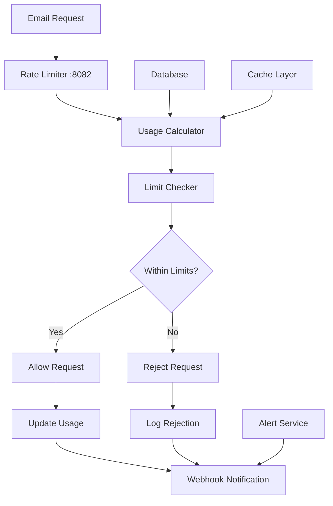

# Rate Limiter Service

The Rate Limiter Service provides intelligent rate limiting and quota management for the Mailyte Mail Server. It operates at multiple levels (organization, domain, and email account) to prevent abuse and ensure fair usage across all tenants.

## Overview

The rate limiting system enforces sending and receiving limits to protect the infrastructure from abuse while providing flexibility for legitimate high-volume users. It supports configurable limits with real-time monitoring and automatic enforcement.

### Key Features

- **Multi-Level Limiting**: Organization, domain, and mailbox-level limits
- **Time Window Support**: Hourly, daily, and monthly quotas
- **Real-time Monitoring**: Live usage tracking and reporting
- **Dynamic Configuration**: API-driven limit management
- **Alert System**: Proactive notifications for quota breaches
- **Graceful Degradation**: Soft limits with warnings before enforcement

## Architecture



## Service Configuration

### Environment Variables

```bash
# Rate Limiter Service Configuration
RATE_LIMITER_HOST=0.0.0.0
RATE_LIMITER_PORT=8082
RATE_LIMITER_DEBUG=false

# Cache Configuration
RATE_LIMITER_CACHE_TTL=300
RATE_LIMITER_CACHE_SIZE=10000
RATE_LIMITER_REDIS_URL=redis://localhost:6379/1

# Default Limits - Organization Level
ORG_INBOUND_HOURLY_DEFAULT=5000
ORG_INBOUND_DAILY_DEFAULT=50000
ORG_INBOUND_MONTHLY_DEFAULT=1000000
ORG_OUTBOUND_HOURLY_DEFAULT=10000
ORG_OUTBOUND_DAILY_DEFAULT=100000
ORG_OUTBOUND_MONTHLY_DEFAULT=2000000

# Default Limits - Domain Level
DOMAIN_INBOUND_HOURLY_DEFAULT=1000
DOMAIN_INBOUND_DAILY_DEFAULT=10000
DOMAIN_INBOUND_MONTHLY_DEFAULT=200000
DOMAIN_OUTBOUND_HOURLY_DEFAULT=2000
DOMAIN_OUTBOUND_DAILY_DEFAULT=20000
DOMAIN_OUTBOUND_MONTHLY_DEFAULT=400000

# Default Limits - Email Account Level
EMAIL_INBOUND_HOURLY_DEFAULT=100
EMAIL_INBOUND_DAILY_DEFAULT=1000
EMAIL_INBOUND_MONTHLY_DEFAULT=20000
EMAIL_OUTBOUND_HOURLY_DEFAULT=200
EMAIL_OUTBOUND_DAILY_DEFAULT=2000
EMAIL_OUTBOUND_MONTHLY_DEFAULT=40000

# Alert Thresholds
RATE_LIMIT_WARNING_THRESHOLD=80
RATE_LIMIT_CRITICAL_THRESHOLD=95
RATE_LIMIT_ALERT_INTERVAL=300

# Performance Settings
RATE_LIMITER_BATCH_SIZE=100
RATE_LIMITER_WORKER_THREADS=5
```

## Rate Limiting Levels

### Organization Level

Organization-level limits apply to the total usage across all domains and email accounts within an organization.

```python
organization_limits = {
    "inbound": {
        "hourly": 5000,
        "daily": 50000,
        "monthly": 1000000
    },
    "outbound": {
        "hourly": 10000,
        "daily": 100000,
        "monthly": 2000000
    }
}
```

### Domain Level

Domain-level limits apply to all email accounts within a specific domain.

```python
domain_limits = {
    "inbound": {
        "hourly": 1000,
        "daily": 10000,
        "monthly": 200000
    },
    "outbound": {
        "hourly": 2000,
        "daily": 20000,
        "monthly": 400000
    }
}
```

### Email Account Level

Individual email account limits provide granular control.

```python
email_limits = {
    "inbound": {
        "hourly": 100,
        "daily": 1000,
        "monthly": 20000
    },
    "outbound": {
        "hourly": 200,
        "daily": 2000,
        "monthly": 40000
    }
}
```

## API Endpoints

### Check Rate Limit

```http
POST /check-limit
```

**Request Body:**
```json
{
  "email": "user@example.com",
  "direction": "outbound",
  "count": 1
}
```

**Response:**
```json
{
  "allowed": true,
  "limits": {
    "organization": {
      "hourly": {"limit": 10000, "used": 150, "remaining": 9850},
      "daily": {"limit": 100000, "used": 1500, "remaining": 98500}
    },
    "domain": {
      "hourly": {"limit": 2000, "used": 45, "remaining": 1955},
      "daily": {"limit": 20000, "used": 450, "remaining": 19550}
    },
    "email": {
      "hourly": {"limit": 200, "used": 5, "remaining": 195},
      "daily": {"limit": 2000, "used": 50, "remaining": 1950}
    }
  },
  "reset_times": {
    "hourly": "2024-01-15T11:00:00Z",
    "daily": "2024-01-16T00:00:00Z",
    "monthly": "2024-02-01T00:00:00Z"
  }
}
```

### Get Usage Statistics

```http
GET /usage/{email}
```

**Response:**
```json
{
  "email": "user@example.com",
  "organization_id": 1,
  "domain_id": 2,
  "usage": {
    "current_hour": {
      "inbound": 5,
      "outbound": 10
    },
    "current_day": {
      "inbound": 50,
      "outbound": 100
    },
    "current_month": {
      "inbound": 500,
      "outbound": 1000
    }
  },
  "limits": {
    "hourly": {"inbound": 100, "outbound": 200},
    "daily": {"inbound": 1000, "outbound": 2000},
    "monthly": {"inbound": 20000, "outbound": 40000}
  },
  "last_updated": "2024-01-15T10:30:00Z"
}
```

### Update Limits

#### Organization Limits
```http
PUT /limits/organization/{organization_id}
```

**Request Body:**
```json
{
  "inbound": {
    "hourly": 10000,
    "daily": 100000,
    "monthly": 2000000
  },
  "outbound": {
    "hourly": 20000,
    "daily": 200000,
    "monthly": 4000000
  }
}
```

#### Domain Limits
```http
PUT /limits/domain/{domain_id}
```

#### Email Account Limits
```http
PUT /limits/email/{email}
```

### Reset Usage

```http
POST /reset-usage
```

**Request Body:**
```json
{
  "email": "user@example.com",
  "time_window": "hourly"
}
```

## Rate Limiting Algorithm

### Sliding Window Implementation

```python
import time
from collections import defaultdict
from typing import Dict, Tuple

class SlidingWindowRateLimiter:
    def __init__(self, redis_client):
        self.redis = redis_client
        self.window_sizes = {
            'hourly': 3600,
            'daily': 86400,
            'monthly': 2592000  # 30 days
        }
    
    def check_limit(self, key: str, limit: int, window: str) -> Tuple[bool, int]:
        """
        Check if request is within rate limit
        Returns (is_allowed, current_count)
        """
        now = time.time()
        window_size = self.window_sizes[window]
        window_start = now - window_size
        
        # Remove old entries
        self.redis.zremrangebyscore(key, 0, window_start)
        
        # Get current count
        current_count = self.redis.zcard(key)
        
        if current_count < limit:
            # Add current request
            self.redis.zadd(key, {str(now): now})
            self.redis.expire(key, window_size)
            return True, current_count + 1
        
        return False, current_count
    
    def get_usage(self, key: str, window: str) -> int:
        """Get current usage count for a time window"""
        now = time.time()
        window_size = self.window_sizes[window]
        window_start = now - window_size
        
        # Clean old entries and return count
        self.redis.zremrangebyscore(key, 0, window_start)
        return self.redis.zcard(key)
```

### Usage Tracking

```python
class UsageTracker:
    def __init__(self, database_service, cache_service):
        self.db = database_service
        self.cache = cache_service
    
    def record_usage(self, email: str, direction: str, count: int = 1):
        """Record email usage"""
        now = datetime.utcnow()
        
        # Get email account details
        account = self.db.get_email_account_by_email(email)
        if not account:
            raise ValueError(f"Email account not found: {email}")
        
        # Update usage counters
        self._update_usage_counters(account, direction, count, now)
        
        # Check if alert thresholds are exceeded
        self._check_alert_thresholds(account, direction)
    
    def _update_usage_counters(self, account, direction, count, timestamp):
        """Update usage counters at all levels"""
        # Update email account usage
        self._update_email_usage(account['id'], direction, count, timestamp)
        
        # Update domain usage
        self._update_domain_usage(account['domain_id'], direction, count, timestamp)
        
        # Update organization usage
        self._update_organization_usage(account['organization_id'], direction, count, timestamp)
    
    def _check_alert_thresholds(self, account, direction):
        """Check if usage exceeds alert thresholds"""
        limits = self.get_effective_limits(account['email'])
        usage = self.get_current_usage(account['email'])
        
        for window in ['hourly', 'daily', 'monthly']:
            limit = limits[direction][window]
            current = usage[window][direction]
            percentage = (current / limit) * 100
            
            if percentage >= RATE_LIMIT_CRITICAL_THRESHOLD:
                self._send_alert('critical', account, direction, window, percentage)
            elif percentage >= RATE_LIMIT_WARNING_THRESHOLD:
                self._send_alert('warning', account, direction, window, percentage)
```

## Caching Strategy

### Redis Integration

```python
import redis
import json
import hashlib

class RateLimiterCache:
    def __init__(self, redis_url):
        self.redis = redis.from_url(redis_url)
        self.default_ttl = 300  # 5 minutes
    
    def get_limits(self, email: str) -> Dict:
        """Get cached limits for email account"""
        cache_key = f"limits:{email}"
        cached_data = self.redis.get(cache_key)
        
        if cached_data:
            return json.loads(cached_data)
        
        return None
    
    def set_limits(self, email: str, limits: Dict, ttl: int = None):
        """Cache limits for email account"""
        cache_key = f"limits:{email}"
        ttl = ttl or self.default_ttl
        
        self.redis.setex(
            cache_key, 
            ttl, 
            json.dumps(limits)
        )
    
    def get_usage(self, email: str, window: str) -> int:
        """Get cached usage count"""
        cache_key = f"usage:{email}:{window}"
        usage = self.redis.get(cache_key)
        
        return int(usage) if usage else 0
    
    def increment_usage(self, email: str, window: str, count: int = 1):
        """Increment usage counter"""
        cache_key = f"usage:{email}:{window}"
        
        # Get window TTL
        ttl = self._get_window_ttl(window)
        
        # Increment counter
        pipeline = self.redis.pipeline()
        pipeline.incrby(cache_key, count)
        pipeline.expire(cache_key, ttl)
        pipeline.execute()
    
    def _get_window_ttl(self, window: str) -> int:
        """Get TTL for time window"""
        window_ttls = {
            'hourly': 3600,
            'daily': 86400,
            'monthly': 2592000
        }
        return window_ttls.get(window, 3600)
```

## Alert System

### Alert Configuration

```python
ALERT_THRESHOLDS = {
    'warning': 80,    # 80% of limit
    'critical': 95,   # 95% of limit
    'exceeded': 100   # Limit exceeded
}

ALERT_TYPES = {
    'rate_limit_warning': {
        'level': 'warning',
        'message': 'Rate limit warning: {percentage}% of {direction} {window} limit used for {email}',
        'webhook_enabled': True,
        'email_enabled': True
    },
    'rate_limit_critical': {
        'level': 'critical',
        'message': 'Rate limit critical: {percentage}% of {direction} {window} limit used for {email}',
        'webhook_enabled': True,
        'email_enabled': True
    },
    'rate_limit_exceeded': {
        'level': 'critical',
        'message': 'Rate limit exceeded: {direction} {window} limit exceeded for {email}',
        'webhook_enabled': True,
        'email_enabled': True
    }
}
```

### Alert Processing

```python
class AlertService:
    def __init__(self, webhook_service, email_service):
        self.webhook_service = webhook_service
        self.email_service = email_service
    
    def send_alert(self, alert_type: str, context: Dict):
        """Send rate limit alert"""
        alert_config = ALERT_TYPES.get(alert_type)
        if not alert_config:
            return
        
        # Format alert message
        message = alert_config['message'].format(**context)
        
        # Create alert payload
        alert_data = {
            'type': alert_type,
            'level': alert_config['level'],
            'message': message,
            'context': context,
            'timestamp': datetime.utcnow().isoformat()
        }
        
        # Send webhook notification
        if alert_config['webhook_enabled']:
            self.webhook_service.send_webhook({
                'event': 'rate_limit.alert',
                'data': alert_data
            })
        
        # Send email notification
        if alert_config['email_enabled']:
            self._send_email_alert(alert_data)
    
    def _send_email_alert(self, alert_data):
        """Send email alert to administrators"""
        subject = f"Rate Limit Alert: {alert_data['level'].upper()}"
        
        admin_emails = self._get_admin_emails(alert_data['context'])
        
        for admin_email in admin_emails:
            self.email_service.send_email(
                to=admin_email,
                subject=subject,
                body=self._format_alert_email(alert_data)
            )
```

## Database Schema

### Rate Limit Tables

```sql
-- Organization rate limits
CREATE TABLE organization_rate_limits (
    id INT PRIMARY KEY AUTO_INCREMENT,
    organization_id INT NOT NULL,
    inbound_hourly INT DEFAULT 5000,
    inbound_daily INT DEFAULT 50000,
    inbound_monthly INT DEFAULT 1000000,
    outbound_hourly INT DEFAULT 10000,
    outbound_daily INT DEFAULT 100000,
    outbound_monthly INT DEFAULT 2000000,
    created_at TIMESTAMP DEFAULT CURRENT_TIMESTAMP,
    updated_at TIMESTAMP DEFAULT CURRENT_TIMESTAMP ON UPDATE CURRENT_TIMESTAMP,
    FOREIGN KEY (organization_id) REFERENCES organizations(id)
);

-- Domain rate limits
CREATE TABLE domain_rate_limits (
    id INT PRIMARY KEY AUTO_INCREMENT,
    domain_id INT NOT NULL,
    inbound_hourly INT DEFAULT 1000,
    inbound_daily INT DEFAULT 10000,
    inbound_monthly INT DEFAULT 200000,
    outbound_hourly INT DEFAULT 2000,
    outbound_daily INT DEFAULT 20000,
    outbound_monthly INT DEFAULT 400000,
    created_at TIMESTAMP DEFAULT CURRENT_TIMESTAMP,
    updated_at TIMESTAMP DEFAULT CURRENT_TIMESTAMP ON UPDATE CURRENT_TIMESTAMP,
    FOREIGN KEY (domain_id) REFERENCES domains(id)
);

-- Email account rate limits
CREATE TABLE email_rate_limits (
    id INT PRIMARY KEY AUTO_INCREMENT,
    email_account_id INT NOT NULL,
    inbound_hourly INT DEFAULT 100,
    inbound_daily INT DEFAULT 1000,
    inbound_monthly INT DEFAULT 20000,
    outbound_hourly INT DEFAULT 200,
    outbound_daily INT DEFAULT 2000,
    outbound_monthly INT DEFAULT 40000,
    created_at TIMESTAMP DEFAULT CURRENT_TIMESTAMP,
    updated_at TIMESTAMP DEFAULT CURRENT_TIMESTAMP ON UPDATE CURRENT_TIMESTAMP,
    FOREIGN KEY (email_account_id) REFERENCES email_accounts(id)
);

-- Usage tracking
CREATE TABLE rate_limit_usage (
    id BIGINT PRIMARY KEY AUTO_INCREMENT,
    email_account_id INT NOT NULL,
    direction ENUM('inbound', 'outbound') NOT NULL,
    count INT DEFAULT 1,
    hour_bucket DATETIME NOT NULL,
    created_at TIMESTAMP DEFAULT CURRENT_TIMESTAMP,
    INDEX idx_email_hour (email_account_id, hour_bucket),
    INDEX idx_direction (direction),
    FOREIGN KEY (email_account_id) REFERENCES email_accounts(id)
);
```

## Integration Examples

### Postfix Integration

```bash
# Postfix policy service configuration
# /etc/postfix/main.cf
smtpd_recipient_restrictions = 
    permit_mynetworks,
    check_policy_service inet:localhost:8082,
    reject_unauth_destination

# Policy service script
policy_service_url = inet:localhost:8082
```

### Python Integration

```python
from worker.rate_limiter.services.usage_service import UsageService

# Check rate limit before sending email
rate_limiter = UsageService()

def send_email(from_email, to_email, message):
    # Check outbound rate limit
    result = rate_limiter.check_limit(from_email, 'outbound', 1)
    
    if not result['allowed']:
        raise RateLimitExceeded(
            f"Rate limit exceeded for {from_email}. "
            f"Try again at {result['reset_time']}"
        )
    
    # Send email
    email_service.send(from_email, to_email, message)
    
    # Record usage
    rate_limiter.record_usage(from_email, 'outbound', 1)
```

## Monitoring & Health

### Health Check

```http
GET /health
```

**Response:**
```json
{
  "status": "healthy",
  "database": "connected",
  "cache": "connected",
  "checks_per_second": 125,
  "cache_hit_rate": 0.95,
  "average_response_time": "5ms",
  "uptime": "3d 8h 15m"
}
```

### Metrics

```python
from prometheus_client import Counter, Histogram, Gauge

# Rate limiter metrics
rate_limit_checks_total = Counter('rate_limit_checks_total', 'Total rate limit checks', ['result'])
rate_limit_check_duration = Histogram('rate_limit_check_duration_seconds', 'Check duration')
rate_limit_cache_hits = Counter('rate_limit_cache_hits_total', 'Cache hits')
active_rate_limits = Gauge('active_rate_limits', 'Active rate limits')
```

## Best Practices

1. **Hierarchical Limits**: Set organization limits higher than domain limits
2. **Cache Usage**: Use Redis for high-performance limit checking
3. **Graceful Degradation**: Implement soft limits with warnings
4. **Alert Thresholds**: Set up proactive monitoring at 80% and 95%
5. **Reset Mechanisms**: Provide admin tools for emergency limit resets
6. **Documentation**: Clearly communicate limits to users
7. **Monitoring**: Track limit usage patterns for capacity planning

## Troubleshooting

### Common Issues

#### High Cache Miss Rate
- Increase cache TTL
- Optimize cache key patterns
- Add cache warming

#### False Limit Triggers
- Check time synchronization
- Verify window calculations
- Review limit configurations

#### Performance Issues
- Optimize database queries
- Increase cache size
- Add read replicas

The Rate Limiter Service provides comprehensive quota management while maintaining high performance and reliability, ensuring fair usage across all tenants of the Mailyte Mail Server.
