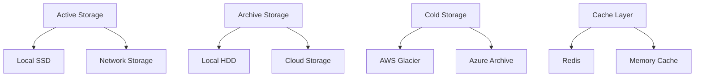

# Storage Management Service

The Storage Management Service provides comprehensive storage monitoring, quota enforcement, and cloud integration with real-time usage tracking and automated cleanup.

## Overview

**Port**: 8084  
**Status**: ✅ Production Ready  
**Monitoring**: Real-time storage usage and quota enforcement  

## Key Features

### Storage Monitoring
- **Real-time Usage**: Live storage consumption tracking
- **Quota Management**: Configurable storage limits
- **Usage Alerts**: Proactive notification system
- **Historical Tracking**: Storage usage trends and analytics

### Multi-tier Storage
- **Local Storage**: High-performance local disk storage
- **Cloud Integration**: AWS S3, Azure Blob, Google Cloud Storage
- **Archival Storage**: Long-term cold storage for compliance
- **Cache Management**: Intelligent caching strategies

### Automated Management
- **Cleanup Services**: Automated old data removal
- **Compression**: Space optimization for archived data
- **Deduplication**: Eliminate duplicate file storage
- **Load Balancing**: Distribute storage across multiple backends

## API Endpoints

### Usage Monitoring
```
GET /storage/usage/{domain}
GET /storage/usage/user/{email}
GET /storage/usage/global
GET /storage/stats
```

### Quota Management
```
GET    /quotas/{domain}
POST   /quotas/{domain}
PUT    /quotas/{domain}
DELETE /quotas/{domain}
```

### File Operations
```
GET    /files/{domain}
POST   /files/upload
DELETE /files/{file_id}
GET    /files/{file_id}/info
```

### Cleanup & Maintenance
```
POST /cleanup/start
GET  /cleanup/status
POST /compression/schedule
GET  /deduplication/report
```

## Storage Architecture

### Storage Hierarchy


### Data Lifecycle
1. **Hot Data**: Frequently accessed, stored on fast local storage
2. **Warm Data**: Occasionally accessed, moved to network storage
3. **Cold Data**: Rarely accessed, archived to cloud storage
4. **Frozen Data**: Compliance/legal hold, deep archive storage

## Quota Management

### Domain Quotas
```json
{
    "domain": "example.com",
    "quotas": {
        "total_storage": "100GB",
        "mailbox_storage": "80GB",
        "attachment_storage": "15GB",
        "archive_storage": "500GB"
    },
    "usage": {
        "total_used": "75GB",
        "percentage": 75,
        "last_updated": "2024-01-01T12:00:00Z"
    },
    "policies": {
        "cleanup_after_days": 365,
        "warning_threshold": 80,
        "block_threshold": 95
    }
}
```

### User Quotas
```json
{
    "email": "user@example.com",
    "quotas": {
        "mailbox_size": "5GB",
        "attachment_limit": "25MB",
        "monthly_upload": "1GB"
    },
    "usage": {
        "mailbox_used": "3.2GB",
        "attachments_used": "800MB",
        "monthly_uploaded": "250MB"
    }
}
```

## Cloud Integration

### AWS S3 Configuration
```json
{
    "provider": "aws_s3",
    "config": {
        "bucket_name": "mailserver-storage",
        "region": "us-west-2",
        "storage_class": "STANDARD_IA",
        "lifecycle_policies": {
            "transition_to_glacier": "90d",
            "delete_after": "2555d"
        }
    },
    "sync_settings": {
        "real_time_sync": true,
        "batch_size": 100,
        "retry_attempts": 3
    }
}
```

### Azure Blob Configuration
```json
{
    "provider": "azure_blob",
    "config": {
        "container_name": "mailserver-data",
        "account_name": "mailstorage",
        "access_tier": "Cool",
        "lifecycle_management": {
            "delete_after_days": 2555,
            "archive_after_days": 90
        }
    }
}
```

## Storage Monitoring

### Real-time Metrics
```json
{
    "global_usage": {
        "total_capacity": "10TB",
        "used_space": "6.8TB",
        "available_space": "3.2TB",
        "usage_percentage": 68
    },
    "by_domain": [
        {
            "domain": "company.com",
            "used": "2.1TB",
            "quota": "3TB",
            "percentage": 70
        }
    ],
    "storage_tiers": {
        "hot_storage": "1.2TB",
        "warm_storage": "3.1TB",
        "cold_storage": "2.5TB"
    }
}
```

### Usage Trends
```json
{
    "period": "last_30_days",
    "growth_rate": "+5.2%",
    "daily_average_growth": "15GB",
    "projected_full": "2024-06-15",
    "trends": {
        "email_storage": "+3.1%",
        "attachment_storage": "+8.7%",
        "archive_storage": "+2.3%"
    }
}
```

## Automated Cleanup

### Cleanup Policies
```json
{
    "policies": [
        {
            "name": "old_emails",
            "type": "age_based",
            "criteria": {
                "older_than_days": 365,
                "folder": "INBOX"
            },
            "action": "archive"
        },
        {
            "name": "large_attachments",
            "type": "size_based",
            "criteria": {
                "size_greater_than": "50MB",
                "older_than_days": 90
            },
            "action": "move_to_cold_storage"
        },
        {
            "name": "deleted_items",
            "type": "folder_based",
            "criteria": {
                "folder": "Trash",
                "older_than_days": 30
            },
            "action": "permanent_delete"
        }
    ]
}
```

### Cleanup Execution
```python
def execute_cleanup_policy(policy):
    """Execute storage cleanup based on policy"""
    files_processed = 0
    space_freed = 0

    for file in find_files_matching_criteria(policy.criteria):
        if policy.action == "archive":
            archive_file(file)
        elif policy.action == "delete":
            delete_file(file)
        elif policy.action == "compress":
            compress_file(file)

        files_processed += 1
        space_freed += file.size

    return {
        "files_processed": files_processed,
        "space_freed": space_freed,
        "execution_time": execution_time,
    }
```

## Database Schema

### Storage Usage
```sql
CREATE TABLE storage_usage (
    id BIGINT PRIMARY KEY AUTO_INCREMENT,
    entity_type ENUM('domain', 'user', 'global'),
    entity_value VARCHAR(255),
    storage_type ENUM('mailbox', 'attachment', 'archive', 'temp'),
    size_bytes BIGINT,
    file_count INT,
    timestamp DATETIME,
    INDEX idx_entity_timestamp (entity_type, entity_value, timestamp)
);
```

### Quota Configuration
```sql
CREATE TABLE storage_quotas (
    id INT PRIMARY KEY AUTO_INCREMENT,
    entity_type ENUM('domain', 'user'),
    entity_value VARCHAR(255),
    quota_type ENUM('mailbox', 'attachment', 'total'),
    quota_bytes BIGINT,
    warning_threshold INT DEFAULT 80,
    created_at TIMESTAMP,
    updated_at TIMESTAMP,
    UNIQUE KEY unique_entity_quota (entity_type, entity_value, quota_type)
);
```

## Alert System

### Storage Alerts
```json
{
    "alert_types": [
        {
            "name": "quota_warning",
            "threshold": 80,
            "message": "Storage usage at {percentage}% for {entity}",
            "frequency": "daily"
        },
        {
            "name": "quota_critical",
            "threshold": 95,
            "message": "CRITICAL: Storage nearly full for {entity}",
            "frequency": "immediate"
        },
        {
            "name": "cleanup_required",
            "condition": "no_cleanup_30_days",
            "message": "Automated cleanup has not run for 30 days",
            "frequency": "weekly"
        }
    ]
}
```

### Webhook Notifications
```json
{
    "event": "storage_quota_exceeded",
    "data": {
        "domain": "example.com",
        "current_usage": "4.8GB",
        "quota": "5GB",
        "percentage": 96,
        "recommended_action": "cleanup_old_emails",
        "timestamp": "2024-01-01T12:00:00Z"
    }
}
```

## Configuration

### Environment Variables
```bash
STORAGE_API_PORT=8084
DEFAULT_DOMAIN_QUOTA=100GB
DEFAULT_USER_QUOTA=5GB
CLEANUP_SCHEDULE="0 2 * * *"
CLOUD_SYNC_ENABLED=true
```

### Performance Settings
```bash
CACHE_SIZE=1GB
BATCH_PROCESSING_SIZE=1000
MONITORING_INTERVAL=300
DEDUPLICATION_ENABLED=true
COMPRESSION_LEVEL=6
```

## Development

### Testing Storage Operations
```bash
# Check storage usage
curl http://0.0.0.0:8084/storage/usage/example.com

# Test quota enforcement
curl -X POST http://0.0.0.0:8084/quotas/test.com \
  -H "Content-Type: application/json" \
  -d '{"mailbox_quota": "1GB", "attachment_quota": "100MB"}'

# Trigger cleanup
curl -X POST http://0.0.0.0:8084/cleanup/start
```

### Adding Storage Providers
1. Implement storage provider interface
2. Add configuration schema
3. Update sync service
4. Add monitoring metrics
5. Test integration
