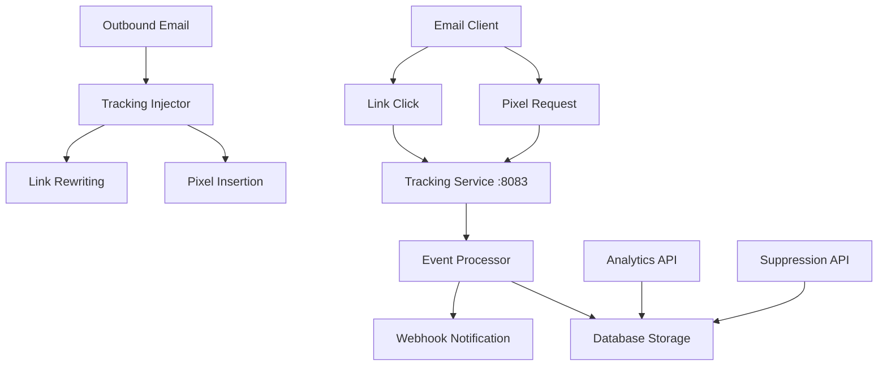

# Email Tracking Service

The Email Tracking Service provides comprehensive email analytics through pixel-based open tracking and link click tracking. It enables detailed insights into email engagement while maintaining user privacy compliance.

## Overview

The tracking service captures and analyzes email interactions to provide actionable insights for email campaigns and communications. It integrates seamlessly with the email delivery pipeline to inject tracking elements and collect engagement data.

### Key Features

- **Open Tracking**: Invisible pixel beacons for email open detection
- **Click Tracking**: Link rewriting for click analytics
- **Privacy Compliance**: GDPR-compliant tracking with opt-out mechanisms
- **Geolocation**: IP-based location detection
- **Device Detection**: User agent analysis for device/browser identification
- **Real-time Analytics**: Live tracking data and statistics
- **Suppression Management**: Unsubscribe and bounce handling

## Architecture



## Service Configuration

### Environment Variables

```bash
# Tracking Service Configuration
TRACKING_HOST=0.0.0.0
TRACKING_PORT=8083
TRACKING_DEBUG=false

# Core tracking settings
TRACKING_ENABLED=true
OPEN_TRACKING_ENABLED=true
CLICK_TRACKING_ENABLED=true

# Tracking domain configuration
TRACKING_DOMAIN=yourdomain.com
TRACKING_SUBDOMAIN=track
TRACKING_PROTOCOL=https
TRACKING_REQUIRE_SSL=true

# Privacy and analytics
TRACK_USER_AGENT=true
TRACK_IP_ADDRESS=true
TRACK_GEOLOCATION=true
TRACKING_ANONYMIZE_IP=false

# Data retention
TRACKING_IP_RETENTION_DAYS=90
TRACKING_DATA_RETENTION_DAYS=365
TRACKING_AGGREGATE_RETENTION_DAYS=2555  # 7 years

# Performance
TRACKING_CACHE_TTL=3600
TRACKING_BATCH_SIZE=100
TRACKING_ASYNC_PROCESSING=true
```

## Tracking Implementation

### Open Tracking

#### Pixel Injection
The tracking service automatically injects a 1x1 transparent pixel into HTML emails:

```html
<!-- Injected tracking pixel -->

```

#### Tracking URL Format
```
https://track.yourdomain.com/open/{tracking_token}
```

Where `tracking_token` is a JWT containing:
```json
{
  "msg_id": "msg_123456",
  "recipient": "user@example.com",
  "campaign_id": "camp_789",
  "timestamp": 1640995200,
  "organization_id": 1
}
```

### Click Tracking

#### Link Rewriting
Original links in emails are rewritten to pass through the tracking service:

```html
<!-- Original link -->
<a href="https://example.com/product">View Product</a>

<!-- Rewritten link -->
<a href="https://track.yourdomain.com/click/eyJ0eXAiOiJKV1QiLCJhbGciOiJIUzI1NiJ9...">View Product</a>
```

#### Tracking Flow
1. User clicks tracked link
2. Request hits tracking service
3. Click event is recorded
4. User is redirected to original URL

## API Endpoints

### Tracking Pixel Endpoint

```http
GET /open/{tracking_token}
```

**Response:**
- Returns 1x1 transparent PNG image
- Records open event in database
- Triggers webhook if configured

### Click Tracking Endpoint

```http
GET /click/{tracking_token}
```

**Response:**
- 302 redirect to original URL
- Records click event in database
- Triggers webhook if configured

### Tracking Events API

#### Get Events
```http
GET /api/v1/tracking/events
```

**Parameters:**
- `email` (string): Filter by email address
- `message_id` (string): Filter by message ID
- `event_type` (string): Filter by event type (open, click)
- `start_date` (string): Start date (ISO format)
- `end_date` (string): End date (ISO format)
- `page` (int): Page number
- `per_page` (int): Items per page

**Response:**
```json
{
  "events": [
    {
      "id": 12345,
      "event_type": "open",
      "message_id": "msg_123456",
      "recipient": "user@example.com",
      "timestamp": "2024-01-15T10:30:00Z",
      "ip_address": "203.0.113.1",
      "user_agent": "Mozilla/5.0...",
      "location": {
        "country": "US",
        "region": "CA", 
        "city": "San Francisco",
        "latitude": 37.7749,
        "longitude": -122.4194
      },
      "device": {
        "type": "desktop",
        "os": "Windows",
        "browser": "Chrome",
        "version": "120.0"
      }
    }
  ],
  "total": 1,
  "page": 1,
  "per_page": 20
}
```

### Statistics API

#### Get Summary Statistics
```http
GET /api/v1/tracking/stats/summary
```

**Parameters:**
- `organization_id` (int): Filter by organization
- `domain_id` (int): Filter by domain
- `start_date` (string): Start date
- `end_date` (string): End date

**Response:**
```json
{
  "summary": {
    "emails_sent": 10000,
    "emails_delivered": 9800,
    "emails_opened": 4900,
    "unique_opens": 3500,
    "links_clicked": 980,
    "unique_clicks": 750,
    "bounces": 200,
    "complaints": 5,
    "unsubscribes": 15,
    "delivery_rate": 0.98,
    "open_rate": 0.50,
    "click_rate": 0.10,
    "bounce_rate": 0.02
  },
  "period": {
    "start": "2024-01-01T00:00:00Z",
    "end": "2024-01-31T23:59:59Z"
  }
}
```

#### Get Detailed Analytics
```http
GET /api/v1/tracking/stats/detailed
```

**Response:**
```json
{
  "daily_stats": [
    {
      "date": "2024-01-15",
      "sent": 350,
      "delivered": 343,
      "opened": 171,
      "clicked": 34,
      "bounced": 7,
      "complained": 0,
      "unsubscribed": 1
    }
  ],
  "top_links": [
    {
      "url": "https://example.com/product",
      "clicks": 120,
      "unique_clicks": 95
    }
  ],
  "geographic_data": [
    {
      "country": "US",
      "opens": 120,
      "clicks": 25
    }
  ],
  "device_data": [
    {
      "type": "desktop",
      "opens": 200,
      "clicks": 40
    }
  ]
}
```

### Suppression Management

#### Add Suppression Entry
```http
POST /api/v1/tracking/suppress
```

**Request Body:**
```json
{
  "email": "user@example.com",
  "type": "unsubscribe",
  "reason": "User requested unsubscribe",
  "source": "email_link"
}
```

#### List Suppressed Emails
```http
GET /api/v1/tracking/suppress
```

#### Remove Suppression
```http
DELETE /api/v1/tracking/suppress/{email}
```

## Tracking Data Model

### Tracking Events Table
```sql
CREATE TABLE tracking_events (
    id BIGINT PRIMARY KEY AUTO_INCREMENT,
    message_id VARCHAR(255) NOT NULL,
    recipient VARCHAR(255) NOT NULL,
    event_type ENUM('open', 'click') NOT NULL,
    timestamp DATETIME NOT NULL,
    ip_address VARCHAR(45),
    user_agent TEXT,
    location_country VARCHAR(2),
    location_region VARCHAR(255),
    location_city VARCHAR(255),
    location_latitude DECIMAL(10, 8),
    location_longitude DECIMAL(11, 8),
    device_type VARCHAR(50),
    device_os VARCHAR(100),
    device_browser VARCHAR(100),
    clicked_url TEXT,
    organization_id INT,
    domain_id INT,
    email_account_id INT,
    INDEX idx_message_id (message_id),
    INDEX idx_recipient (recipient),
    INDEX idx_timestamp (timestamp),
    INDEX idx_organization (organization_id)
);
```

### Click Events Table
```sql
CREATE TABLE click_events (
    id BIGINT PRIMARY KEY AUTO_INCREMENT,
    tracking_event_id BIGINT NOT NULL,
    original_url TEXT NOT NULL,
    clicked_url TEXT NOT NULL,
    redirect_timestamp DATETIME NOT NULL,
    FOREIGN KEY (tracking_event_id) REFERENCES tracking_events(id)
);
```

## Privacy & Compliance

### GDPR Compliance

#### Data Collection Notice
```html
<!-- Email footer with tracking notice -->
<div style="font-size: 10px; color: #666; text-align: center;">
    This email contains tracking pixels for delivery confirmation.
    <a href="https://track.yourdomain.com/opt-out/TOKEN">Opt out of tracking</a>
</div>
```

#### Opt-out Mechanism
```http
GET /opt-out/{token}
```

Processes opt-out requests and adds email to suppression list.

#### Data Anonymization
```python
def anonymize_tracking_data(days_old=90):
    """Anonymize tracking data older than specified days"""
    cutoff_date = datetime.now() - timedelta(days=days_old)
    
    # Anonymize IP addresses
    query = """
        UPDATE tracking_events 
        SET ip_address = NULL,
            location_latitude = NULL,
            location_longitude = NULL
        WHERE timestamp < %s
    """
    execute_query(query, (cutoff_date,))
```

### Data Retention

```python
# Retention policies
RETENTION_POLICIES = {
    "raw_events": 365,  # Keep raw events for 1 year
    "aggregated_stats": 2555,  # Keep aggregated stats for 7 years
    "personal_data": 90,  # Anonymize personal data after 90 days
    "suppression_list": None,  # Keep suppression list indefinitely
}
```

## Integration Examples

### Postfix Integration

The tracking injector integrates with Postfix to automatically add tracking to outbound emails:

```python
# mailer/postfix/scripts/tracking_injector.py
import re
import jwt
import base64
from email.mime.multipart import MIMEMultipart
from email.mime.text import MIMEText


class TrackingInjector:
    def __init__(self, config):
        self.tracking_domain = config.get("TRACKING_DOMAIN")
        self.secret_key = config.get("TRACKING_SECRET_KEY")

    def inject_tracking(self, email_message, message_id, recipient):
        """Inject tracking pixel and rewrite links"""
        # Create tracking token
        tracking_token = self.create_tracking_token(message_id, recipient)

        # Inject pixel
        self.inject_pixel(email_message, tracking_token)

        # Rewrite links
        self.rewrite_links(email_message, tracking_token)

        return email_message

    def create_tracking_token(self, message_id, recipient):
        """Create JWT tracking token"""
        payload = {"msg_id": message_id, "recipient": recipient, "timestamp": int(time.time())}
        return jwt.encode(payload, self.secret_key, algorithm="HS256")

    def inject_pixel(self, message, token):
        """Inject 1x1 tracking pixel"""
        pixel_url = f"https://{self.tracking_domain}/open/{token}"
        pixel_html = f''

        # Add pixel to HTML content
        if message.is_multipart():
            for part in message.walk():
                if part.get_content_type() == "text/html":
                    content = part.get_content()
                    content = content.replace("</body>", f"{pixel_html}</body>")
                    part.set_content(content, subtype="html")
```

### Webhook Integration

```python
# Send tracking events via webhooks
def send_tracking_webhook(event_data):
    webhook_payload = {
        "event": f"email.{event_data['event_type']}",
        "timestamp": event_data["timestamp"].isoformat(),
        "data": {
            "message_id": event_data["message_id"],
            "recipient": event_data["recipient"],
            "ip_address": event_data["ip_address"],
            "user_agent": event_data["user_agent"],
            "location": event_data.get("location"),
            "device": event_data.get("device"),
        },
    }

    # Send to webhook service
    webhook_service.send(webhook_payload)
```

## Performance Optimization

### Caching Strategy

```python
# Redis caching for tracking data
import redis

cache = redis.Redis(host="localhost", port=6379, db=0)


def get_tracking_stats(cache_key, query_func, ttl=3600):
    """Get stats with caching"""
    cached_result = cache.get(cache_key)
    if cached_result:
        return json.loads(cached_result)

    result = query_func()
    cache.setex(cache_key, ttl, json.dumps(result))
    return result
```

### Database Optimization

```sql
-- Optimized queries with proper indexing
-- Get open rate for campaign
SELECT 
    COUNT(DISTINCT recipient) as total_recipients,
    COUNT(DISTINCT CASE WHEN event_type = 'open' THEN recipient END) as opened_recipients,
    (COUNT(DISTINCT CASE WHEN event_type = 'open' THEN recipient END) / COUNT(DISTINCT recipient)) * 100 as open_rate
FROM tracking_events 
WHERE message_id LIKE 'campaign_123_%'
    AND timestamp >= '2024-01-01'
    AND timestamp < '2024-02-01';

-- Aggregate daily stats
SELECT 
    DATE(timestamp) as date,
    event_type,
    COUNT(*) as event_count,
    COUNT(DISTINCT recipient) as unique_count
FROM tracking_events
WHERE timestamp >= DATE_SUB(NOW(), INTERVAL 30 DAY)
GROUP BY DATE(timestamp), event_type
ORDER BY date DESC;
```

## Monitoring & Health

### Health Check

```http
GET /health
```

**Response:**
```json
{
  "status": "healthy",
  "database": "connected",
  "cache": "connected",
  "events_processed_1h": 1250,
  "average_response_time": "15ms",
  "uptime": "5d 12h 30m"
}
```

### Metrics

```python
from prometheus_client import Counter, Histogram, Gauge

# Tracking metrics
tracking_events_total = Counter("tracking_events_total", "Total tracking events", ["event_type"])
tracking_response_time = Histogram("tracking_response_time_seconds", "Response time")
active_tracking_sessions = Gauge("active_tracking_sessions", "Active tracking sessions")
```

## Security Considerations

1. **Token Security**: Use JWT with secure secrets for tracking tokens
2. **IP Privacy**: Implement IP anonymization for privacy compliance
3. **Rate Limiting**: Prevent abuse of tracking endpoints
4. **SSL/TLS**: Always use HTTPS for tracking requests
5. **Data Validation**: Validate all tracking data inputs
6. **Access Control**: Restrict access to tracking administration

## Best Practices

1. **Respect Privacy**: Implement clear opt-out mechanisms
2. **Data Minimization**: Collect only necessary tracking data
3. **Performance**: Use caching for frequently accessed data
4. **Reliability**: Implement retry mechanisms for webhook delivery
5. **Monitoring**: Track service performance and error rates
6. **Compliance**: Follow GDPR and other privacy regulations

The Email Tracking Service provides comprehensive email analytics while maintaining user privacy and system performance, enabling data-driven email communication strategies.
