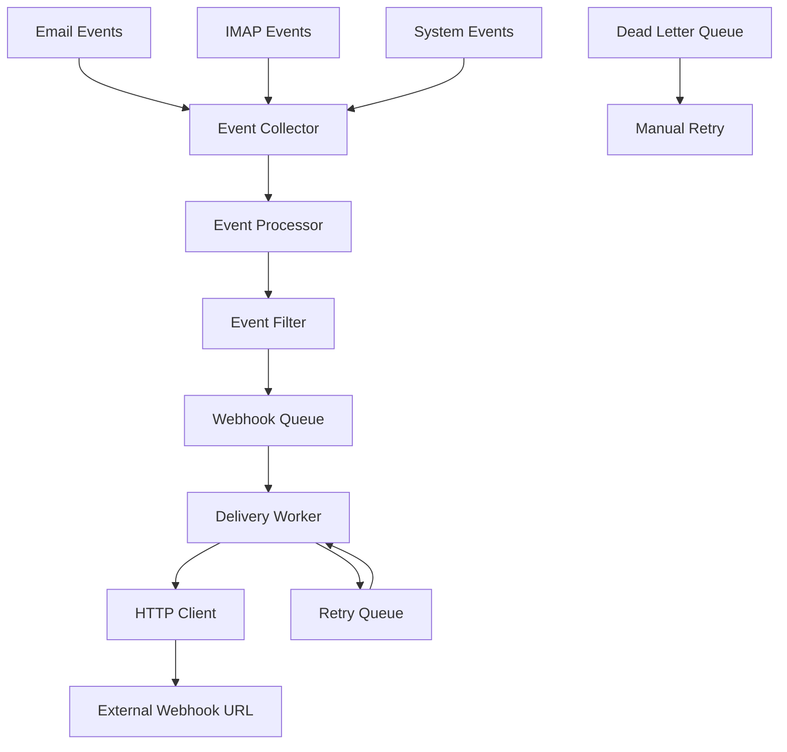

# Webhook Service

The Webhook Service provides real-time event notifications for all email-related activities in the Enterprise Mail Server. It captures events from various sources and delivers them reliably to configured endpoints.

## Overview

The webhook system enables real-time integration with external applications by sending HTTP POST requests whenever significant events occur. This allows for immediate response to email activities, quota warnings, and system events.

### Key Features

- **Real-time Event Delivery**: Immediate notification of email events
- **Reliable Delivery**: Retry mechanisms with exponential backoff
- **Event Filtering**: Configurable event subscriptions
- **Secure Delivery**: HMAC signature verification
- **Batch Processing**: Efficient bulk event delivery
- **Dead Letter Queue**: Failed event storage and replay

## Architecture



## Service Configuration

### Environment Variables

```bash
# Webhook Service Configuration
WEBHOOK_HOST=0.0.0.0
WEBHOOK_PORT=8081
WEBHOOK_DEBUG=false

# Webhook URLs (comma-separated)
WEBHOOK_URLS=https://your-app.com/webhook,https://backup.com/webhook

# Security Configuration
WEBHOOK_SECRET=your-webhook-secret-key
WEBHOOK_ENCRYPTION_KEY=your-32-character-encryption-key

# Delivery Configuration
WEBHOOK_TIMEOUT=30
WEBHOOK_RETRY_ATTEMPTS=3
WEBHOOK_RETRY_DELAY=5
WEBHOOK_BATCH_SIZE=50

# Queue Configuration
WEBHOOK_QUEUE_SIZE=10000
WEBHOOK_WORKER_THREADS=5
WEBHOOK_MAX_RETRY_DELAY=300

# Event Filtering
WEBHOOK_ENABLED_EVENTS=email.smtp.inbound,email.smtp.outbound,email.imap.read
```

## Event Types

### Email Events

#### SMTP Events
- `email.smtp.inbound` - Inbound email received
- `email.smtp.outbound` - Outbound email sent
- `email.smtp.rejected` - Email rejected by spam filter
- `email.smtp.bounced` - Email bounced back
- `email.smtp.delivered` - Email successfully delivered

#### IMAP/POP3 Events
- `email.imap.login` - IMAP login successful
- `email.imap.read` - Email marked as read
- `email.imap.delete` - Email deleted
- `email.imap.move` - Email moved between folders
- `email.pop3.login` - POP3 login successful
- `email.pop3.download` - Email downloaded via POP3

#### Tracking Events
- `email.opened` - Email opened (pixel tracking)
- `email.clicked` - Link clicked in email
- `email.unsubscribed` - Unsubscribe request
- `email.complained` - Spam complaint received

### System Events

#### Authentication Events
- `auth.login.success` - Successful authentication
- `auth.login.failure` - Failed authentication attempt
- `auth.password.changed` - Password changed
- `auth.account.locked` - Account locked due to failures

#### Quota Events
- `quota.warning` - Storage quota warning (80% usage)
- `quota.exceeded` - Storage quota exceeded
- `quota.critical` - Critical storage usage (95%)
- `rate_limit.exceeded` - Rate limit exceeded

#### Security Events
- `security.intrusion.detected` - Intrusion attempt detected
- `security.unusual.activity` - Unusual activity pattern
- `security.certificate.expiring` - SSL certificate expiring
- `security.configuration.changed` - Security configuration modified

## Webhook Payload Format

### Standard Payload Structure

```json
{
  "event": "email.smtp.inbound",
  "timestamp": "2024-01-15T10:30:00.000Z",
  "id": "evt_123456789",
  "organization_id": 1,
  "domain_id": 2,
  "email_account_id": 3,
  "data": {
    "message_id": "msg_987654321",
    "from": "sender@example.com",
    "to": ["recipient@yourdomain.com"],
    "subject": "Important Message",
    "size": 1024,
    "headers": {
      "X-Mailer": "Enterprise Mail Server"
    }
  },
  "metadata": {
    "ip_address": "203.0.113.1",
    "user_agent": "Mail Client 1.0",
    "protocol": "SMTP",
    "tls_version": "TLSv1.3"
  }
}
```

### Event-Specific Payloads

#### Email SMTP Inbound
```json
{
  "event": "email.smtp.inbound",
  "data": {
    "message_id": "msg_abc123",
    "from": "sender@external.com",
    "to": ["user@yourdomain.com"],
    "cc": ["cc@yourdomain.com"],
    "bcc": [],
    "subject": "Email Subject",
    "size": 2048,
    "attachments": 2,
    "spam_score": 0.1,
    "virus_scan": "clean",
    "headers": {
      "Message-ID": "<message@external.com>",
      "Date": "Mon, 15 Jan 2024 10:30:00 +0000"
    }
  }
}
```

#### Email Opened
```json
{
  "event": "email.opened",
  "data": {
    "message_id": "msg_def456",
    "tracking_id": "trk_789012",
    "recipient": "user@yourdomain.com",
    "ip_address": "203.0.113.5",
    "user_agent": "Mozilla/5.0...",
    "location": {
      "country": "US",
      "region": "CA",
      "city": "San Francisco"
    },
    "device": {
      "type": "desktop",
      "os": "Windows",
      "browser": "Chrome"
    }
  }
}
```

#### Quota Warning
```json
{
  "event": "quota.warning",
  "data": {
    "email_account_id": 3,
    "email": "user@yourdomain.com",
    "quota_mb": 1000,
    "used_mb": 800,
    "usage_percentage": 80,
    "warning_threshold": 80
  }
}
```

## Security

### HMAC Signature Verification

All webhooks include an HMAC signature for verification:

```http
POST /your-webhook-endpoint
Content-Type: application/json
X-Webhook-Signature: sha256=calculated_signature
X-Webhook-Timestamp: 1640995200
X-Webhook-ID: evt_123456789

{webhook_payload}
```

### Signature Calculation

```python
import hmac
import hashlib
import json


def verify_webhook_signature(payload, signature, secret):
    """Verify webhook signature"""
    expected_signature = hmac.new(secret.encode(), payload.encode(), hashlib.sha256).hexdigest()

    return hmac.compare_digest(f"sha256={expected_signature}", signature)


# Usage example
webhook_secret = "your-webhook-secret"
payload = request.get_data(as_text=True)
signature = request.headers.get("X-Webhook-Signature")

if verify_webhook_signature(payload, signature, webhook_secret):
    # Process webhook
    data = json.loads(payload)
else:
    # Invalid signature
    return "Invalid signature", 401
```

## Delivery Mechanism

### Retry Strategy

The webhook service implements exponential backoff for failed deliveries:

```python
retry_delays = [5, 15, 45, 135, 300]  # seconds
max_attempts = 5
```

### Delivery Workflow

1. **Initial Delivery**: Attempt immediate delivery
2. **Failure Handling**: Log failure and schedule retry
3. **Exponential Backoff**: Increase delay between retries
4. **Dead Letter Queue**: Store permanently failed events
5. **Manual Retry**: Admin interface for failed event replay

### Success Criteria

A webhook delivery is considered successful when:
- HTTP status code 200-299 is returned
- Response received within timeout period
- No connection errors occur

## Configuration Examples

### Multiple Webhook URLs

```bash
# Configure multiple endpoints
WEBHOOK_URLS=https://primary.com/webhook,https://backup.com/webhook,https://analytics.com/events

# Different configurations per URL
WEBHOOK_TIMEOUTS=30,45,60
WEBHOOK_RETRY_ATTEMPTS=3,2,1
```

### Event Filtering

```bash
# Only email events
WEBHOOK_ENABLED_EVENTS=email.smtp.inbound,email.smtp.outbound,email.opened,email.clicked

# All events except auth
WEBHOOK_DISABLED_EVENTS=auth.login.success,auth.login.failure

# Critical events only
WEBHOOK_ENABLED_EVENTS=quota.exceeded,security.intrusion.detected,email.smtp.bounced
```

### Conditional Webhooks

```python
# Configure conditional webhook delivery
webhook_conditions = {
    "email.smtp.inbound": {
        "spam_score": {"$lt": 5.0},
        "size": {"$lt": 10485760},  # 10MB
    },
    "quota.warning": {"usage_percentage": {"$gte": 80}},
}
```

## Client Implementation Examples

### Python Client

```python
import hmac
import hashlib
import json
from flask import Flask, request

app = Flask(__name__)
WEBHOOK_SECRET = "your-webhook-secret"


@app.route("/webhook", methods=["POST"])
def handle_webhook():
    # Verify signature
    signature = request.headers.get("X-Webhook-Signature")
    payload = request.get_data(as_text=True)

    if not verify_signature(payload, signature):
        return "Invalid signature", 401

    # Process event
    event_data = json.loads(payload)
    event_type = event_data["event"]

    if event_type == "email.smtp.inbound":
        handle_inbound_email(event_data)
    elif event_type == "quota.warning":
        handle_quota_warning(event_data)

    return "OK", 200


def verify_signature(payload, signature):
    expected = hmac.new(WEBHOOK_SECRET.encode(), payload.encode(), hashlib.sha256).hexdigest()
    return hmac.compare_digest(f"sha256={expected}", signature)
```

### Node.js Client

```javascript
const express = require('express');
const crypto = require('crypto');
const app = express();

const WEBHOOK_SECRET = 'your-webhook-secret';

app.use(express.raw({ type: 'application/json' }));

app.post('/webhook', (req, res) => {
    const signature = req.headers['x-webhook-signature'];
    const payload = req.body;
    
    // Verify signature
    const hmac = crypto.createHmac('sha256', WEBHOOK_SECRET);
    hmac.update(payload);
    const expectedSignature = `sha256=${hmac.digest('hex')}`;
    
    if (signature !== expectedSignature) {
        return res.status(401).send('Invalid signature');
    }
    
    // Process event
    const eventData = JSON.parse(payload);
    console.log('Received event:', eventData.event);
    
    res.status(200).send('OK');
});

app.listen(3000, () => {
    console.log('Webhook server listening on port 3000');
});
```

### PHP Client

```php
<?php
function verifyWebhookSignature($payload, $signature, $secret) {
    $expectedSignature = 'sha256=' . hash_hmac('sha256', $payload, $secret);
    return hash_equals($expectedSignature, $signature);
}

// Get webhook data
$payload = file_get_contents('php://input');
$signature = $_SERVER['HTTP_X_WEBHOOK_SIGNATURE'] ?? '';

if (!verifyWebhookSignature($payload, $signature, 'your-webhook-secret')) {
    http_response_code(401);
    exit('Invalid signature');
}

// Process event
$eventData = json_decode($payload, true);
$eventType = $eventData['event'];

switch ($eventType) {
    case 'email.smtp.inbound':
        handleInboundEmail($eventData);
        break;
    case 'quota.warning':
        handleQuotaWarning($eventData);
        break;
}

http_response_code(200);
echo 'OK';
?>
```

## Monitoring & Health

### Health Check Endpoint

```http
GET /health
```

**Response:**
```json
{
  "status": "healthy",
  "queue_size": 45,
  "processing_rate": "15 events/sec",
  "failed_deliveries_24h": 3,
  "uptime": "2d 5h 30m",
  "version": "1.0.0"
}
```

### Metrics

The webhook service exposes Prometheus metrics:

```python
# Webhook delivery metrics
webhook_deliveries_total = Counter(
    "webhook_deliveries_total", "Total webhook deliveries", ["status", "url"]
)
webhook_delivery_duration = Histogram(
    "webhook_delivery_duration_seconds", "Webhook delivery duration"
)
webhook_queue_size = Gauge("webhook_queue_size", "Current webhook queue size")
webhook_retry_count = Counter("webhook_retries_total", "Total webhook retries")
```

## Administration

### Webhook Management API

#### List Configured Webhooks
```http
GET /api/v1/webhooks
```

#### Add Webhook URL
```http
POST /api/v1/webhooks
```

```json
{
  "url": "https://your-app.com/webhook",
  "events": ["email.smtp.inbound", "quota.warning"],
  "timeout": 30,
  "retry_attempts": 3
}
```

#### Update Webhook Configuration
```http
PUT /api/v1/webhooks/{id}
```

#### Test Webhook
```http
POST /api/v1/webhooks/{id}/test
```

### Failed Event Management

#### List Failed Events
```http
GET /api/v1/webhooks/failed-events
```

#### Retry Failed Event
```http
POST /api/v1/webhooks/failed-events/{id}/retry
```

#### Bulk Retry
```http
POST /api/v1/webhooks/failed-events/retry-all
```

## Best Practices

1. **Idempotency**: Design webhook handlers to be idempotent
2. **Timeout Handling**: Set appropriate timeouts for webhook processing
3. **Error Handling**: Implement proper error handling and logging
4. **Security**: Always verify webhook signatures
5. **Performance**: Process webhooks asynchronously when possible
6. **Monitoring**: Monitor webhook delivery success rates
7. **Testing**: Test webhook endpoints thoroughly

## Troubleshooting

### Common Issues

#### High Failure Rate
- Check endpoint availability
- Verify response times
- Review error logs

#### Missing Events
- Check event filtering configuration
- Verify webhook URL configuration
- Review service health

#### Performance Issues
- Monitor queue size
- Check processing rates
- Review timeout settings

The Webhook Service provides a robust, secure foundation for real-time integration with external systems, ensuring reliable delivery of all email-related events.
