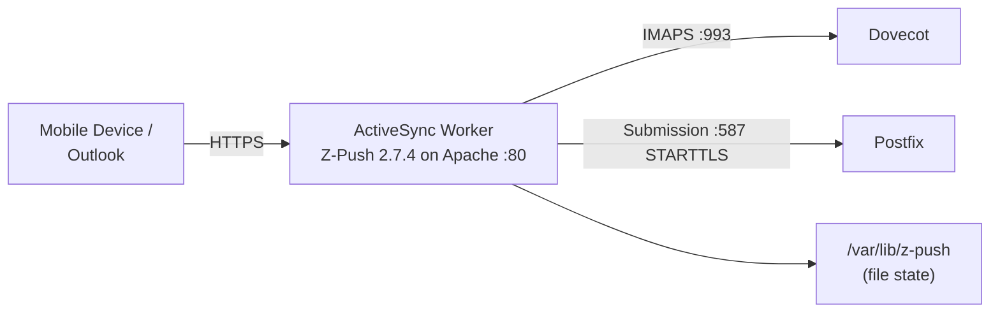

# ActiveSync Worker

The ActiveSync worker provides Microsoft Exchange ActiveSync (EAS) support so mobile devices and Outlook clients can sync mail without manual IMAP/SMTP setup. It is not a custom implementation: the container runs **Z-Push 2.7.4** (the open-source ActiveSync server) on PHP 8.2 / Apache, configured with the `BackendIMAP` backend against Dovecot.

## How It Works

- **Z-Push** handles the ActiveSync protocol; the Apache config aliases `/Microsoft-Server-ActiveSync` to Z-Push's `index.php`
- **Mail access** goes over IMAPS to `dovecot:993` (`/ssl/novalidate-cert`) using the device's own mailbox credentials
- **Sending** relays through Postfix on submission port 587 with STARTTLS, authenticating with the same credentials as the IMAP login
- **Sync state** is file-based (`STATE_DIR=/var/lib/z-push`), not database-backed
- A small custom `index.php` on the docroot serves `/health` (checks Z-Push installation, config, and state/log directory writability) and a status page

## Architecture



## Endpoints

```
POST /Microsoft-Server-ActiveSync     -- All EAS commands (handled by Z-Push)
GET  /AutoDiscover/AutoDiscover.xml   -- Z-Push autodiscover
GET  /autodiscover/autodiscover.xml   -- Z-Push autodiscover (lowercase alias)
GET  /health                          -- Health check (custom status page)
```

The EAS command set (Sync, FolderSync, Ping, SendMail, SmartReply, MoveItems, ...) is whatever Z-Push 2.7.4 implements -- see the upstream Z-Push documentation.

!!! note "Two autodiscover implementations"
    Z-Push's autodiscover here answers on this container's own aliases. Platform-wide client auto-setup for customer domains (`autodiscover.<customer-domain>`, `autoconfig.*`, MTA-STS) is served by the separate [autoconfig worker](autoconfig.md), which is what Traefik routes those hostnames to.

## Configuration

Z-Push settings are baked into `worker/activesync/config/z-push.conf.php`, reading these variables:

| Variable | Default | Description |
|----------|---------|-------------|
| `IMAP_HOST` | `dovecot` | IMAP backend host (port 993 fixed) |
| `SMTP_HOST` | `postfix` | SMTP relay host (port 587 fixed, STARTTLS) |
| `TIMEZONE` | `UTC` | PHP timezone |

The compose file also passes `DB_HOST` / `DB_NAME` / `DB_USER` / `DB_PASSWORD`, but the Z-Push IMAP backend does not use MySQL -- authentication is delegated to Dovecot, which does.

## Docker Configuration

```yaml
activesync:
  build: ./worker/activesync
  container_name: activesync
  ports:
    - "8084:80"
  depends_on:
    - mysql
    - migrate
```

Apache binds port 80 inside the container (published as 8084 on the host in dev; bound to `127.0.0.1` in production). The container runs with `cap_drop: ALL` plus the handful of capabilities Apache's master process needs to bind port 80 and drop to `www-data`.
