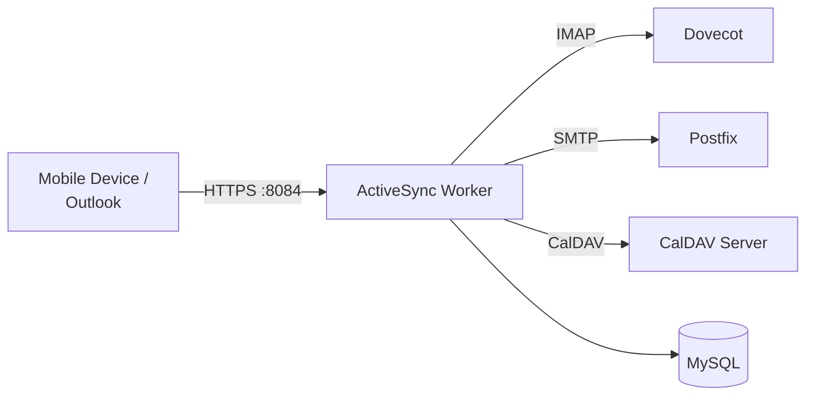

# ActiveSync Worker

> **Enterprise Edition** — This feature is available in [Mailyte Enterprise](https://mailyte.com). The Community Edition does not include this functionality.


!!! warning "Under Construction"
    This worker is currently in development. The API and features described below represent the planned design and may change.

The ActiveSync worker implements the Microsoft Exchange ActiveSync (EAS) protocol, allowing mobile devices and Outlook clients to sync email, calendar, and contacts without manual IMAP/SMTP configuration.

## Planned Features

- **Exchange ActiveSync protocol** (v14.1) implementation
- **Push email**: Real-time email push to mobile devices
- **Calendar sync**: CalDAV bridge for calendar data
- **Contact sync**: CardDAV bridge for contact data
- **Device management**: Track and manage connected devices
- **Remote wipe**: Remotely wipe email data from lost devices
- **Autodiscover**: Automatic client configuration via the Autodiscover protocol
- **Policy enforcement**: PIN requirements, encryption requirements per device

## Planned Architecture



## Planned API Endpoints

The ActiveSync protocol uses a single endpoint with different commands:

```
POST /Microsoft-Server-ActiveSync    -- All EAS commands
GET  /autodiscover/autodiscover.xml  -- Autodiscover
```

EAS Commands:

| Command | Purpose |
|---------|---------|
| `Sync` | Synchronize email/calendar/contacts |
| `FolderSync` | Synchronize folder list |
| `GetItemEstimate` | Get count of changes to sync |
| `MoveItems` | Move messages between folders |
| `SendMail` | Send email via SMTP |
| `SmartReply` | Reply to an email |
| `SmartForward` | Forward an email |
| `Ping` | Long-poll for new mail push |
| `Settings` | Device settings and OOF (Out of Office) |

## Configuration

| Variable | Default | Description |
|----------|---------|-------------|
| `DOVECOT_HOST` | `dovecot` | Dovecot IMAP server |
| `POSTFIX_HOST` | `postfix` | Postfix SMTP server |
| `DB_HOST` | `mysql` | MySQL host |
| `DB_NAME` | `mailserver` | Database name |
| `AUTODISCOVER_DOMAIN` | (required) | Domain for autodiscover |

## Docker Configuration

```yaml
activesync:
  build: ./worker/activesync
  container_name: activesync
  ports:
    - "8084:80"
  depends_on:
    - dovecot
    - postfix
    - mysql
```
