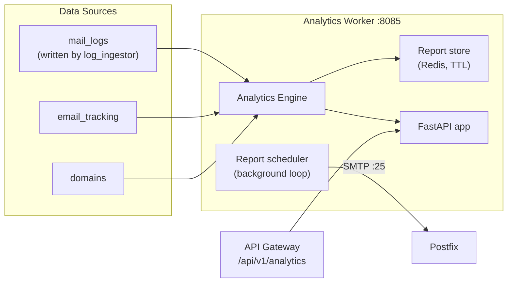

# Analytics Worker

The analytics worker aggregates email delivery statistics and produces reports. It is a FastAPI service that reads from the `mail_logs`, `email_tracking`, and `domains` tables, and serves both aggregate stats and per-domain, organization-aware analytics. The API gateway proxies its tenant-facing routes through `/api/v1/analytics/*` (wired up and working since 2026-08-08).

## What It Does

- Aggregate delivery stats over `mail_logs` (sent, bounced, deferred, rejected)
- Per-domain dashboards: volume, engagement (opens/clicks from `email_tracking`), deliverability, metrics
- Per-user activity summaries
- On-demand report generation, stored in Redis with a TTL (no `reports` table exists -- see below)
- Scheduled reports, stored per organization in Redis, delivered by email through Postfix on an interval scheduler
- Prometheus metrics at `/metrics`

## How It Works



`mail_logs` has been populated by the [log ingestor](../mailer/log-ingestor.md) since 2026-08-22 -- before that, every analytics surface was correctly rendering an empty set because nothing produced rows.

## API Endpoints

Copied from the route decorators in `worker/analytics/app.py`:

```
GET  /stats                              -- Overall email stats (total volume)
GET  /user-activity/{email}              -- Recent activity for one user
GET  /dashboard                          -- HTML overview page
GET  /analytics/dashboard/{domain}       -- Per-domain dashboard rollup
GET  /analytics/email-volume/{domain}    -- Per-domain volume series
GET  /analytics/engagement/{domain}      -- Opens/clicks for a domain
GET  /analytics/deliverability/{domain}  -- Delivery/bounce/complaint rates, DKIM status
GET  /analytics/metrics/{domain}         -- Domain metadata and metrics
POST /reports/generate                   -- Generate a report (stored in Redis)
GET  /reports/scheduled                  -- List scheduled reports for an org
POST /reports/scheduled                  -- Create a scheduled report
GET  /reports/{report_id}                -- Fetch a generated report
GET  /health                             -- Health check
GET  /metrics                            -- Prometheus metrics
```

## Data Stores

| Store | Purpose |
|-------|---------|
| `mail_logs` (MySQL, read) | Raw per-message delivery rows |
| `email_tracking` (MySQL, read) | Open/click tracking events |
| `domains` (MySQL, read) | Domain resolution and DKIM status |
| `report:{id}` (Redis, TTL) | Generated reports |
| `scheduled_reports:{org_id}` (Redis) | Scheduled report configs |

There are no `analytics_daily` / `analytics_hourly` rollup tables and no `reports` table -- reports are deliberately Redis-backed so the feature does not depend on a schema migration.

## Scheduled Report Delivery

A background loop wakes every `REPORT_SCHEDULER_INTERVAL_SECONDS` (default 900), runs due schedules, and emails the results via SMTP. The compose file points it at the stack's own Postfix on port 25.

## Configuration

| Variable | Default | Description |
|----------|---------|-------------|
| `DB_HOST` / `DB_PORT` / `DB_NAME` / `DB_USER` / `DB_PASSWORD` | `mysql` / `3306` / `mailserver` / -- / -- | MySQL connection |
| `REDIS_HOST` / `REDIS_PORT` | `redis` / `6379` | Report storage |
| `SMTP_HOST` | `postfix` (via `REPORT_SMTP_HOST`) | Report delivery relay |
| `SMTP_PORT` | `25` (via `REPORT_SMTP_PORT`) | Relay port |
| `REPORT_FROM_ADDRESS` | `ADMIN_EMAIL` | Envelope sender for report mail |
| `REPORT_SCHEDULER_INTERVAL_SECONDS` | `900` | Scheduler wake interval |

## Docker Configuration

```yaml
analytics:
  build:
    context: .
    dockerfile: ./worker/analytics/Dockerfile
  container_name: analytics
  ports:
    - "8087:8085"     # host 8087 -> container 8085
  depends_on:
    - mysql
    - migrate
    - redis
```

In production (`docker-compose.prod.yml`) the host port is bound to `127.0.0.1` only.

## Gotchas

!!! warning "Direction is inferred, not stored"
    `mail_logs` rows don't carry an explicit inbound/outbound direction column, so the overall `/stats` endpoint can only honestly report total volume; per-domain endpoints resolve direction by matching sender/recipient domains.

!!! tip "Organization hierarchy"
    Per-domain endpoints resolve the domain's `organization_id` first, so the gateway can enforce that a tenant only reads its own domains.
