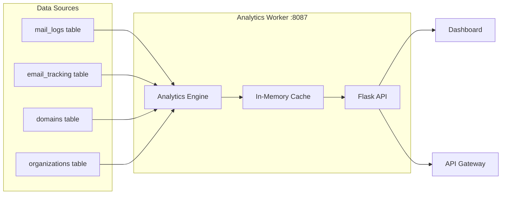

# Analytics Worker

> **Enterprise Edition** — This feature is available in [Mailyte Enterprise](https://mailyte.com). The Community Edition does not include this functionality.


The analytics worker aggregates email delivery statistics and produces reports. It reads from `mail_logs` and `email_tracking` tables, crunches the numbers, and serves them via an API. The dashboard and API gateway pull data from here.

## What It Does

- Aggregates delivery stats: sent, bounced, deferred, rejected counts
- Computes daily/weekly/monthly rollups
- Per-organization and per-domain breakdowns
- Geographic data (sender/recipient countries)
- Device and email client statistics (from tracking data)
- Top senders, top recipients, top domains
- Spam statistics and trends

## How It Works



## API Endpoints

```
GET /api/stats?days=30              -- Overall email stats for last N days
GET /api/stats/daily                -- Daily breakdown
GET /api/stats/domains              -- Top domains by volume
GET /api/stats/spam                 -- Spam detection rates
GET /api/stats/org/{org_id}         -- Per-organization stats
GET /api/stats/domain/{domain}      -- Per-domain stats
GET /api/stats/tracking             -- Open/click rates
GET /api/stats/geographic           -- Geographic breakdown
GET /health                         -- Health check
GET /metrics                        -- Prometheus metrics
```

### Example Response

```json
{
  "period": "2025-01-01 to 2025-01-31",
  "daily_stats": [
    {
      "date": "2025-01-15",
      "total_emails": 1250,
      "inbound": 800,
      "outbound": 450,
      "bounced": 12,
      "spam_detected": 95
    }
  ],
  "top_domains": [
    {"domain": "gmail.com", "count": 342},
    {"domain": "outlook.com", "count": 218}
  ]
}
```

## Database Tables

The analytics worker reads from:

| Table | Purpose |
|-------|---------|
| `mail_logs` | Raw delivery events (sent, bounced, deferred) |
| `email_tracking` | Open/click tracking events |
| `domains` | Domain list for per-domain breakdowns |
| `organizations` | Org list for multi-tenant reporting |

And writes aggregated data to:

| Table | Purpose |
|-------|---------|
| `analytics_daily` | Pre-computed daily rollups |
| `analytics_hourly` | Hourly volume data |

## Queries

The analytics engine runs SQL queries against MySQL. Here is a representative example for daily email counts:

```sql
SELECT
    DATE(timestamp) as date,
    COUNT(*) as total_emails,
    SUM(CASE WHEN direction = 'inbound' THEN 1 ELSE 0 END) as inbound,
    SUM(CASE WHEN direction = 'outbound' THEN 1 ELSE 0 END) as outbound
FROM mail_logs
WHERE timestamp >= DATE_SUB(NOW(), INTERVAL 30 DAY)
GROUP BY DATE(timestamp)
ORDER BY date;
```

## Configuration

| Variable | Default | Description |
|----------|---------|-------------|
| `DB_HOST` | `mysql` | MySQL host |
| `DB_PORT` | `3306` | MySQL port |
| `DB_NAME` | `mailserver` | Database name |
| `DB_USER` | (env) | Database user |
| `DB_PASSWORD` | (env) | Database password |
| `CACHE_TTL` | `300` | Seconds to cache query results |

## Docker Configuration

```yaml
analytics:
  build: ./worker/analytics
  container_name: analytics
  ports:
    - "8087:8087"
  depends_on:
    - mysql
```

## Gotchas

!!! warning "Query Performance"
    Aggregation queries on large `mail_logs` tables can be slow. The pre-computed rollup tables (`analytics_daily`, `analytics_hourly`) exist to avoid scanning millions of rows for dashboard queries. Make sure the rollup job runs on schedule.

!!! tip "Organization Hierarchy"
    Analytics respects the organization > domain > mailbox hierarchy. When you query stats for an org, it includes all domains and mailboxes under it. Per-domain queries filter within a single domain.
