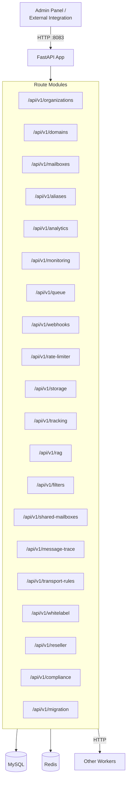

# API Gateway

The API gateway is the single entry point for managing the entire Mailyte mail server. It is a FastAPI application that exposes REST endpoints for organizations, domains, mailboxes, aliases, analytics, webhooks, tracking, RAG search, storage, compliance, migration, and more.

If you are building an integration or admin panel, this is the service you talk to.

## What It Does

- Centralized REST API on port **8083**
- 20 route modules covering every management function
- MySQL and Redis backends
- Authentication via API key or admin password
- CORS support for web dashboard integration
- Global exception handling (no stack traces leak to clients)

## Architecture



## API Endpoints

The API is versioned at `/api/v1/`. Here is what each route module provides:

| Route Module | Prefix | Key Operations |
|-------------|--------|---------------|
| `organizations` | `/api/v1/organizations` | CRUD orgs, settings, billing |
| `domains` | `/api/v1/domains` | Add/remove/verify domains, DNS checks, DKIM setup |
| `mailboxes` | `/api/v1/mailboxes` | Create/update/delete mailboxes, password resets |
| `aliases` | `/api/v1/aliases` | Email alias management, catch-all configs |
| `analytics` | `/api/v1/analytics` | Delivery stats, domain breakdowns, trends |
| `monitoring` | `/api/v1/monitoring` | Service health, system metrics |
| `queue` | `/api/v1/queue` | View/flush/hold/delete queued messages |
| `webhooks` | `/api/v1/webhooks` | Register/manage webhook endpoints |
| `rate_limiter` | `/api/v1/rate-limiter` | View/update rate limits per org/domain/mailbox |
| `storage` | `/api/v1/storage` | Storage usage reports, quota management |
| `tracking` | `/api/v1/tracking` | Tracking stats, enable/disable per domain |
| `rag` | `/api/v1/rag` | Semantic search queries, indexing status |
| `filters` | `/api/v1/filters` | Sieve filter management |
| `shared_mailboxes` | `/api/v1/shared-mailboxes` | Shared mailbox creation and ACL management |
| `message_trace` | `/api/v1/message-trace` | Trace email delivery path by message ID |
| `transport_rules` | `/api/v1/transport-rules` | Custom routing rules |
| `whitelabel` | `/api/v1/whitelabel` | White-label branding per org |
| `reseller` | `/api/v1/reseller` | Reseller account management |
| `compliance` | `/api/v1/compliance` | GDPR exports, data retention policies |
| `migration` | `/api/v1/migration` | Import from other mail servers |
| `ssl` | `/api/v1/ssl` | SSL certificate management |

### Common Endpoints

```
GET  /         -- API info and version
GET  /health   -- Health check with database status
```

## Authentication

The API supports two auth modes:

### API Key

Pass the key in the `X-API-Key` header:

```bash
curl -H "X-API-Key: your-api-key-here" \
     http://localhost:8083/api/v1/organizations
```

### Admin Password

For quick admin access, use Basic Auth with the admin password:

```bash
curl -u admin:your-admin-password \
     http://localhost:8083/api/v1/organizations
```

Auth logic lives in `worker/api/utils/auth.py`.

## Database

The API reads from and writes to MySQL. The database connection utility is in `worker/api/utils/database.py`.

Key tables the API touches:

| Table | Purpose |
|-------|---------|
| `organizations` | Multi-tenant org management |
| `domains` | Email domains with DNS verification status |
| `email_accounts` | Virtual mailboxes |
| `aliases` | Email forwarding rules |
| `mail_logs` | Delivery tracking |
| `webhook_endpoints` | Registered webhook URLs |
| `ssl_certificates` | SSL cert tracking |

## CORS Configuration

CORS is configured via the `CORS_ALLOWED_ORIGINS` environment variable:

```python
allow_origins=os.getenv("CORS_ALLOWED_ORIGINS", "http://localhost:3000").split(",")
```

For production, set this to your dashboard URL(s).

## Error Handling

The API has a global exception handler that catches unhandled errors and returns a clean JSON response instead of a stack trace:

```json
{"status": "error", "message": "Internal server error"}
```

Actual error details are logged server-side for debugging.

## Configuration

| Variable | Default | Description |
|----------|---------|-------------|
| `DB_HOST` | `mysql` | MySQL host |
| `DB_PORT` | `3306` | MySQL port |
| `DB_NAME` | `mailserver` | Database name |
| `DB_USER` | `mailuser` | Database user |
| `DB_PASSWORD` | `mailpassword` | Database password |
| `REDIS_HOST` | `redis` | Redis host |
| `REDIS_PORT` | `6379` | Redis port |
| `CORS_ALLOWED_ORIGINS` | `http://localhost:3000` | Comma-separated allowed origins |
| `API_KEY` | (empty) | API key for authentication |
| `ADMIN_PASSWORD` | (empty) | Admin password for Basic Auth |

## Docker Configuration

```yaml
api:
  build: ./worker/api
  container_name: api
  ports:
    - "8083:8080"
  depends_on:
    - mysql
    - redis
```

## Connections to Other Services

The API gateway acts as an orchestrator. It talks to other workers when it needs data or actions beyond its own scope:

- **Tracking worker** -- for tracking stats and injection config
- **Webhooks worker** -- for webhook endpoint management
- **Rate limiter worker** -- for rate limit status queries
- **Queue manager** -- for mail queue operations
- **Monitoring** -- for service health data
- **RAG worker** -- for semantic search queries
- **Storage usage** -- for disk usage reports

## Gotchas

!!! warning "Route Loading"
    Routes are loaded dynamically at startup. If a route module fails to import (e.g., missing dependency), it is skipped with a warning log -- the API still starts but that route will return 404. Check startup logs if a route is missing.

!!! warning "Database Connection"
    The health endpoint tests the database connection. If MySQL is not ready when the API starts, the health check will report `"database": "failed"` until the connection succeeds.

!!! tip "API Documentation"
    FastAPI auto-generates OpenAPI docs. Access them at:
    - Swagger UI: `http://localhost:8083/docs`
    - ReDoc: `http://localhost:8083/redoc`
