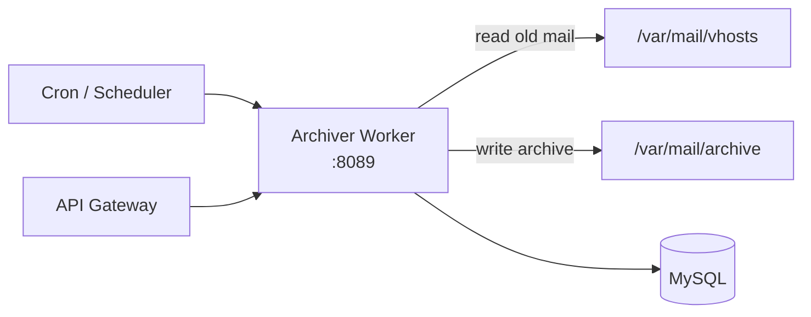

# Archiver Worker

> **Enterprise Edition** — This feature is available in [Mailyte Enterprise](https://mailyte.com). The Community Edition does not include this functionality.


!!! warning "Under Construction"
    This worker is currently in development. The API and features described below represent the planned design and may change.

The archiver worker provides long-term email storage with compliance-oriented retention policies. It moves older emails from the active Maildir storage to compressed archive storage, enforces retention rules, and supports legal hold and e-discovery.

## Planned Features

- **Automated archiving**: Move emails older than a configurable threshold to archive storage
- **Compression**: Compress archived emails to save disk space
- **Retention policies**: Per-organization retention rules (e.g., keep for 7 years)
- **Legal hold**: Freeze emails from deletion for legal proceedings
- **E-discovery search**: Search archived emails by date range, sender, recipient, keywords
- **Compliance reporting**: Generate reports showing retention policy compliance
- **Restore**: Bring archived emails back to active storage on demand

## Planned Architecture



## Planned API Endpoints

```
POST /api/archive/run                  -- Trigger archival run
GET  /api/archive/status               -- Archival statistics
GET  /api/archive/search               -- Search archived emails
POST /api/archive/restore/{id}         -- Restore an archived email
POST /api/archive/hold/{org_id}        -- Place org on legal hold
GET  /api/archive/compliance/{org_id}  -- Compliance report
GET  /api/archive/policies             -- List retention policies
PUT  /api/archive/policies/{org_id}    -- Update retention policy
```

## Configuration

| Variable | Default | Description |
|----------|---------|-------------|
| `DB_HOST` | `mysql` | MySQL host |
| `DB_NAME` | `mailserver` | Database name |
| `ACTIVE_STORAGE` | `/var/mail/vhosts` | Active mail storage path |
| `ARCHIVE_STORAGE` | `/var/mail/archive` | Archive storage path |
| `DEFAULT_RETENTION_DAYS` | `2555` | Default retention (7 years) |
| `COMPRESSION` | `gzip` | Compression algorithm |
| `ARCHIVE_AGE_DAYS` | `365` | Archive emails older than N days |

## Docker Configuration

```yaml
archiver:
  build: ./worker/archiver
  container_name: archiver
  ports:
    - "8089:8083"
  volumes:
    - mail_data:/var/mail/vhosts
    - archive_data:/var/mail/archive
```
