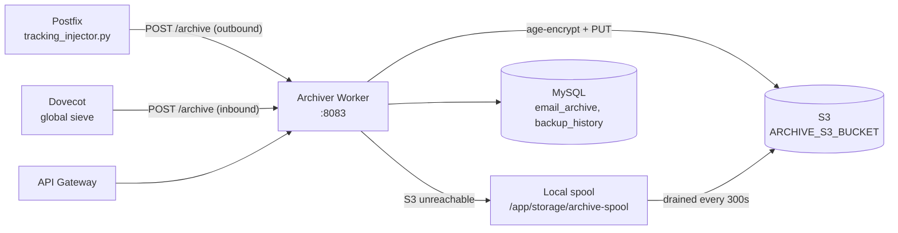

# Archiver Worker

The archiver worker is the platform's archival, retention, and compliance service. Every message the platform accepts -- inbound and outbound -- is POSTed to it as raw RFC 2822, encrypted client-side with `age`, and written to S3 within seconds of delivery. That is what takes the mail RPO from "whenever the last nightly backup ran" to approximately zero (see `plans/06-operations/00-PRD-disaster-recovery.md`).

## What It Does

- **Email archival to S3**, age-encrypted before upload, with a local spool that absorbs S3 outages and drains automatically
- **Dual-recipient encryption**: each object is encrypted to *both* the escrow recipient (`DR_AGE_RECIPIENT`, whose identity lives offsite only) and the service recipient (`ARCHIVE_AGE_RECIPIENT`, whose identity is mounted into the container so `GET /archive/{id}` can still serve mail)
- **Per-organization retention policies**, with an hourly background job deleting expired archives (legal holds exempt)
- **Legal holds** that prevent deletion
- **Archive search and retrieval**
- **Backup history read API** over the `backup_history` table that `scripts/backup.sh` writes (see [Backups](backup.md))

## Who Feeds It

The archiver does not walk maildirs. Both mail paths push to it at delivery time:

- **Outbound**: the Postfix tracking injector (`mailer/postfix/scripts/tracking_injector.py`) POSTs each accepted outbound message when `ARCHIVE_OUTBOUND_ENABLED=true` (the default), using `ARCHIVE_SERVICE_URL` (default `http://archiver:8083`)
- **Inbound**: Dovecot's global sieve pipes every delivered message to an `archive-message` script, which POSTs it to the same URL

Setting `ARCHIVE_OUTBOUND_ENABLED=false` on the postfix service and pointing Dovecot's `ARCHIVE_SERVICE_URL` nowhere are the two switches that turn archiving off.

## Architecture



## API Endpoints

Copied from the route decorators in `worker/archiver/app.py`:

```
POST   /archive                  -- Archive an email (raw message + metadata)
GET    /archive/search           -- Search archived emails
GET    /archive/spool            -- Spool status (messages awaiting S3)
POST   /archive/spool/drain      -- Force a spool drain now
GET    /archive/{message_id}     -- Retrieve an archived email
DELETE /archive/{message_id}     -- Delete (refused while under legal hold)
POST   /retention-policy         -- Create/update a retention policy
GET    /retention-policy         -- List retention policies
POST   /legal-hold               -- Place a legal hold
GET    /legal-hold               -- List legal holds
DELETE /legal-hold/{hold_id}     -- Release a legal hold
GET    /backup/history           -- Backup run history (reads backup_history)
GET    /health                   -- Health check
GET    /metrics                  -- Prometheus metrics
```

## Configuration

| Variable | Default | Description |
|----------|---------|-------------|
| `PORT` | `8083` | Bind port |
| `DB_HOST` / `DB_PORT` / `DB_NAME` / `DB_USER` / `DB_PASSWORD` | `mysql` / `3306` / `mailserver` / `mailuser` / -- | MySQL connection |
| `ARCHIVE_S3_BUCKET` | `mailyte-mail-archive` | Archive bucket -- deliberately distinct from the backup bucket, with a credential scoped to it alone |
| `ARCHIVE_S3_PREFIX` | `mail-archive` | Key prefix |
| `AWS_ACCESS_KEY_ID` / `AWS_SECRET_ACCESS_KEY` | -- | Set from `ARCHIVE_AWS_*` in compose -- the archiver-scoped principal, not the backup writer |
| `S3_ENDPOINT_URL` | (empty) | Empty for real AWS; set for MinIO/R2/B2 |
| `DR_AGE_RECIPIENT` | -- | Escrow recipient (identity offsite only) |
| `ARCHIVE_AGE_RECIPIENT` | -- | Service recipient (identity mounted at `/run/secrets/archive_age_identity`) |
| `ARCHIVE_AGE_IDENTITY_FILE` | `/run/secrets/archive_age_identity` | Identity used to decrypt on retrieval |
| `ARCHIVE_SPOOL_PATH` | `/app/storage/archive-spool` | Spool directory |
| `ARCHIVE_SPOOL_DRAIN_SECONDS` | `300` | Spool drain interval |
| `DEFAULT_RETENTION_DAYS` | (see code) | Default retention when no policy matches |

## Docker Configuration

```yaml
archiver:
  build:
    context: .
    dockerfile: ./worker/archiver/Dockerfile
  container_name: archiver
  ports:
    - "8089:8083"
  volumes:
    - ./storage/archive-spool:/app/storage/archive-spool
    - ./secrets/archive_age_identity:/run/secrets/archive_age_identity:ro
```

In production (`docker-compose.prod.yml`) the host port is bound to `127.0.0.1` only.

## Gotchas

!!! warning "Spool directory ownership"
    The spool holds messages that were accepted for delivery but have not reached S3 yet, so it must outlive the container -- and the bind-mounted host directory must be writable by uid 10001 (the image's `mailyte` user). A root-owned directory makes every spooled write fail with `EACCES` at the exact moment S3 is already unreachable. `deployment/deploy.sh` creates it with the right owner.

!!! warning "Two encryption recipients, two failure modes"
    Losing the mounted service identity makes `GET /archive/{id}` unable to decrypt, but the escrow identity can still recover everything offsite. Losing *both* identities makes the archive permanently unreadable -- treat the escrow identity per the DR runbook.
