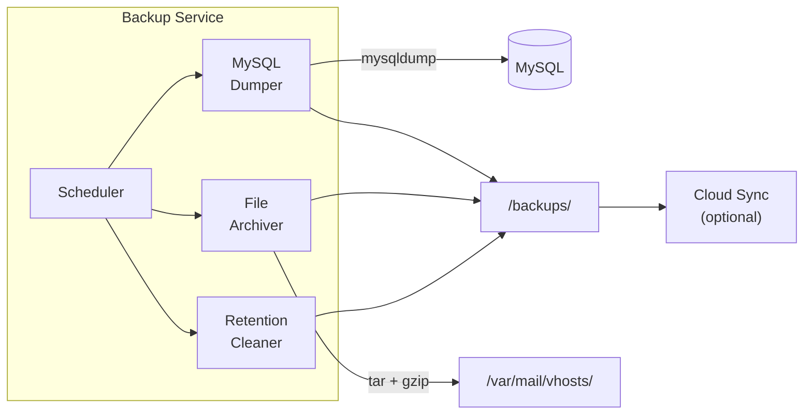

# Backup Service

The backup service handles automated backups of the Mailyte mail server -- MySQL database dumps, mail storage snapshots, and configuration files. It runs on a schedule and stores backups locally or pushes them to the cloud sync service.

## What It Does

- **MySQL dumps**: Full and incremental database backups
- **Mail storage snapshots**: Compressed archives of `/var/mail/vhosts/`
- **Configuration backups**: Postfix, Dovecot, Rspamd configs
- **Scheduled execution**: Configurable cron-like scheduling
- **Retention management**: Auto-delete old backups based on retention policy
- **Webhook notifications**: Alerts on backup success/failure
- **Restore support**: Scripts to restore from any backup point

## How It Works



## Backup Types

### MySQL Database

Full `mysqldump` with:

- All tables (schema + data)
- Triggers and stored procedures
- Consistent snapshot using `--single-transaction`

Output: `/backups/mysql/mailserver_YYYY-MM-DD_HH-MM-SS.sql.gz`

### Mail Storage

Compressed tar archive of the Maildir tree:

Output: `/backups/mail/vhosts_YYYY-MM-DD_HH-MM-SS.tar.gz`

For large deployments, incremental backups using `rsync --link-dest` are more efficient.

### Configuration

Archive of all service configs:

Output: `/backups/config/config_YYYY-MM-DD_HH-MM-SS.tar.gz`

## Scheduling

| Backup Type | Default Schedule | Configurable Via |
|------------|-----------------|-----------------|
| MySQL full dump | Daily at 02:00 | `MYSQL_BACKUP_CRON` |
| Mail storage | Weekly on Sunday at 03:00 | `MAIL_BACKUP_CRON` |
| Config backup | Daily at 01:00 | `CONFIG_BACKUP_CRON` |

## Retention Policy

| Backup Type | Default Retention | Configurable Via |
|------------|------------------|-----------------|
| MySQL dumps | 30 days | `MYSQL_BACKUP_RETENTION_DAYS` |
| Mail storage | 14 days | `MAIL_BACKUP_RETENTION_DAYS` |
| Config backups | 90 days | `CONFIG_BACKUP_RETENTION_DAYS` |

## Restore Procedures

### Restore MySQL

```bash
# Decompress and pipe into MySQL
gunzip < /backups/mysql/mailserver_2025-01-15_02-00-00.sql.gz | \
  mysql -h mysql -u root -p mailserver
```

### Restore Mail Storage

```bash
# Stop Dovecot first to prevent file conflicts
docker stop dovecot

# Extract to mail storage
tar -xzf /backups/mail/vhosts_2025-01-12_03-00-00.tar.gz -C /var/mail/

# Fix permissions
chown -R 5000:5000 /var/mail/vhosts/

# Restart Dovecot
docker start dovecot
```

## Configuration

| Variable | Default | Description |
|----------|---------|-------------|
| `DB_HOST` | `mysql` | MySQL host |
| `DB_NAME` | `mailserver` | Database name |
| `DB_USER` | `root` | Database user (needs dump privileges) |
| `DB_PASSWORD` | (env) | Database password |
| `BACKUP_PATH` | `/backups` | Where to store backups |
| `MAIL_STORAGE_PATH` | `/var/mail/vhosts` | Mail storage to back up |
| `MYSQL_BACKUP_CRON` | `0 2 * * *` | MySQL backup schedule |
| `MAIL_BACKUP_CRON` | `0 3 * * 0` | Mail backup schedule |
| `CONFIG_BACKUP_CRON` | `0 1 * * *` | Config backup schedule |
| `MYSQL_BACKUP_RETENTION_DAYS` | `30` | Days to keep MySQL backups |
| `WEBHOOK_URLS` | (empty) | Webhook URLs for backup notifications |

## Docker Configuration

```yaml
backup:
  build: ./storage/backup
  container_name: backup
  volumes:
    - backup_data:/backups
    - mail_data:/var/mail/vhosts:ro
    - ./config:/app/config:ro
  depends_on:
    - mysql
```

## Gotchas

!!! warning "Backup Size"
    Mail storage backups can be very large. A server with 100 users averaging 5 GB each means a 500 GB backup. Consider incremental backups or cloud sync for large deployments.

!!! warning "MySQL Privileges"
    The backup user needs `SELECT`, `LOCK TABLES`, `SHOW VIEW`, `EVENT`, `TRIGGER` privileges. The root user works but is not recommended in production.

!!! tip "Test Your Restores"
    A backup you have never tested is not a backup. Periodically restore to a test environment to verify backup integrity.
