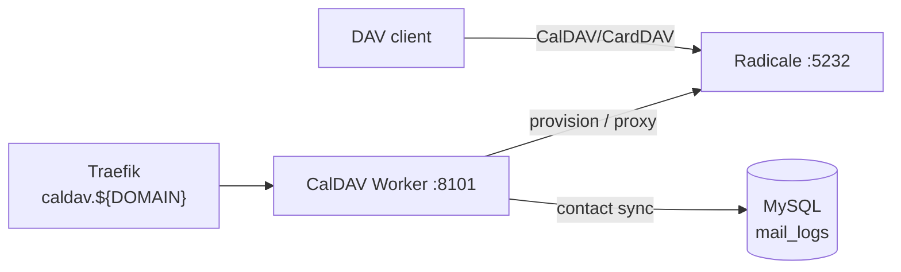

# CalDAV Worker

The CalDAV worker is a management API in front of a **Radicale** CalDAV/CardDAV backend. Radicale speaks the DAV protocols to clients; this FastAPI service provisions calendars and address books, syncs contacts out of mail history, generates vCards, and serves `.well-known` discovery.

## What It Does

- Provision a default address book / calendar per user in Radicale
- Sync contacts from email headers (reads `mail_logs` for correspondents)
- Create and list contacts (vCard format)
- CalDAV/CardDAV service discovery (`/discovery`, `/.well-known/caldav`, `/.well-known/carddav`)
- Prometheus metrics at `/metrics`

## Architecture



## API Endpoints

Copied from the route decorators in `worker/caldav/app.py`:

```
POST /addressbooks/{email}     -- Create a default address book for a user
GET  /addressbooks/{email}     -- List address books for a user
POST /calendars/{email}        -- Create a default calendar for a user
GET  /calendars/{email}        -- List calendars for a user
POST /contacts/sync/{email}    -- Sync contacts from mail history
GET  /contacts/{email}         -- List contacts for a user
POST /contacts/{email}         -- Create a contact (vCard)
GET  /discovery                -- CalDAV/CardDAV service discovery info
GET  /.well-known/caldav       -- Redirect to the Radicale CalDAV root
GET  /.well-known/carddav      -- Redirect to the Radicale CardDAV root
GET  /health                   -- Health check
GET  /metrics                  -- Prometheus metrics
```

## Configuration

| Variable | Default | Description |
|----------|---------|-------------|
| `PORT` | `8101` | Bind port |
| `RADICALE_URL` | `http://radicale:5232` | Radicale backend |
| `DB_HOST` / `DB_PORT` / `DB_NAME` / `DB_USER` / `DB_PASSWORD` | `mysql` / `3306` / `mailserver` / -- / -- | MySQL connection |

## Docker Configuration

```yaml
caldav:
  build: ./worker/caldav
  container_name: caldav
  ports:
    - "8101:8101"
  volumes:
    - ./shared:/app/shared     # build context excludes repo-root shared/
  depends_on:
    - mysql
    - migrate
    - radicale

radicale:
  image: tomsquest/docker-radicale:latest
  container_name: radicale
  ports:
    - "5232:5232"
  volumes:
    - radicale_data:/data
```

In production both host ports are bound to `127.0.0.1`; Traefik routes `caldav.${DOMAIN}` to this worker over HTTPS.
