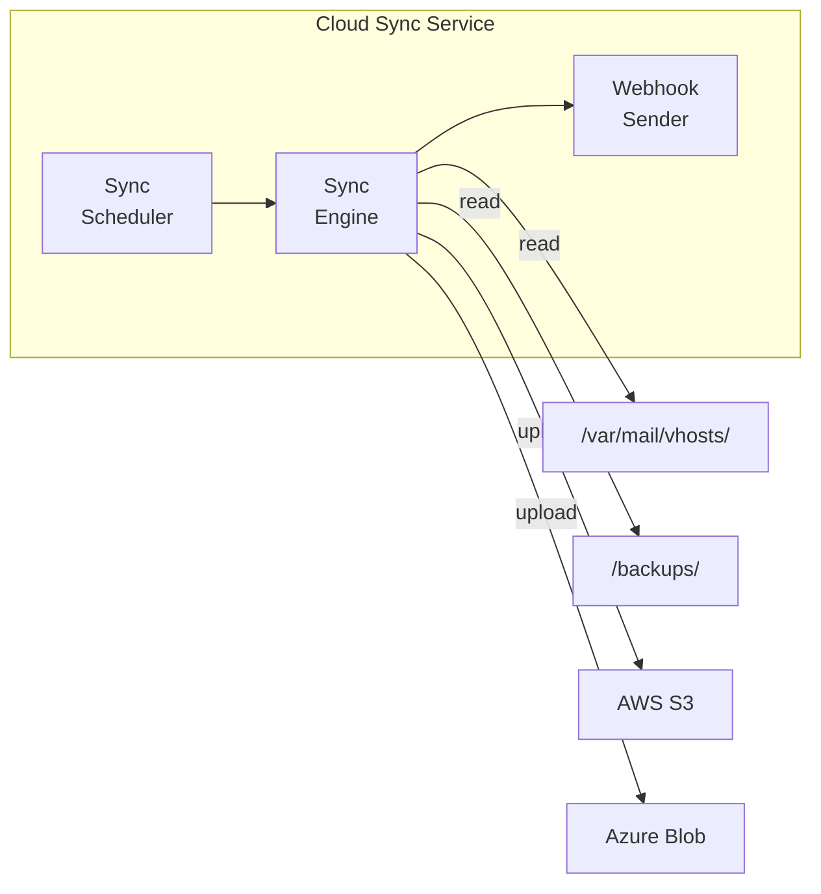

# Cloud Sync Service

> **Enterprise Edition** — This feature is available in [Mailyte Enterprise](https://mailyte.com). The Community Edition does not include this functionality.


The cloud sync service replicates mail storage and backups to cloud object storage -- AWS S3 or Azure Blob Storage. It provides an offsite copy of your data for disaster recovery.

## What It Does

- Syncs mail storage (`/var/mail/vhosts/`) to cloud storage
- Syncs backup files to cloud storage
- Supports **AWS S3** and **Azure Blob Storage**
- Incremental sync -- only uploads changed files
- Full resync capability for disaster recovery
- Webhook notifications on sync events (started, completed, failed)

## How It Works



## API Endpoints

```
POST /api/sync/start            -- Trigger a manual sync
POST /api/sync/full-resync      -- Full resync (re-upload everything)
GET  /api/sync/status           -- Current sync status
GET  /api/sync/history          -- Sync history
GET  /health                    -- Health check
```

## Configuration

| Variable | Default | Description |
|----------|---------|-------------|
| `CLOUD_PROVIDER` | `s3` | Cloud provider (`s3` or `azure`) |
| `AWS_ACCESS_KEY_ID` | (required for S3) | AWS access key |
| `AWS_SECRET_ACCESS_KEY` | (required for S3) | AWS secret key |
| `AWS_S3_BUCKET` | (required for S3) | S3 bucket name |
| `AWS_S3_REGION` | `us-east-1` | S3 region |
| `AZURE_STORAGE_ACCOUNT` | (required for Azure) | Azure storage account |
| `AZURE_STORAGE_KEY` | (required for Azure) | Azure storage key |
| `AZURE_CONTAINER` | (required for Azure) | Azure blob container |
| `SYNC_INTERVAL` | `86400` | Seconds between syncs (24 hours) |
| `SYNC_PATHS` | `/var/mail/vhosts,/backups` | Comma-separated paths to sync |
| `WEBHOOK_URLS` | (empty) | Webhook URLs for sync notifications |

## Docker Configuration

```yaml
cloud_sync:
  build: ./worker/cloud_sync
  container_name: cloud_sync
  volumes:
    - mail_data:/var/mail/vhosts:ro
    - backup_data:/backups:ro
```

## Gotchas

!!! warning "Bandwidth and Cost"
    Initial sync of a large mail store can use significant bandwidth and incur cloud storage costs. The first sync uploads everything; subsequent syncs only upload changes.

!!! warning "Credentials"
    Cloud storage credentials are sensitive. Use environment variables or Docker secrets -- never hardcode them in config files.

!!! tip "S3 Lifecycle Policies"
    Configure S3 lifecycle policies to automatically move old backups to Glacier for cost savings. This is managed on the AWS side, not in Mailyte.
