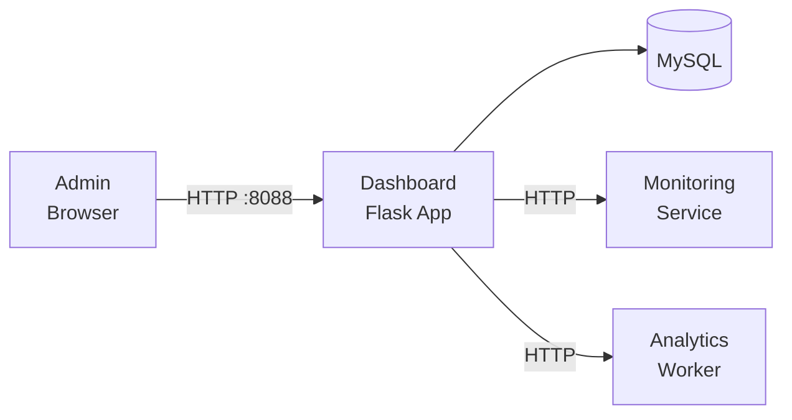

# Dashboard Service

> **Enterprise Edition** — This feature is available in [Mailyte Enterprise](https://mailyte.com). The Community Edition does not include this functionality.


The dashboard service provides a web-based admin interface for monitoring and managing the Mailyte mail server. It renders server-side HTML pages with real-time email statistics, system health, and management controls.

## What It Does

- Real-time email analytics dashboard
- System health overview (services, CPU, memory, disk)
- Email delivery statistics (daily, weekly, monthly)
- Per-organization and per-domain breakdowns
- Quick actions for common admin tasks
- Database connection pooling for performance

## Architecture



## Features

The dashboard queries MySQL directly for email statistics and renders them as HTML. It uses a connection pool (5 connections) for performance.

Key views:

| View | What It Shows |
|------|-------------|
| Overview | Total emails, delivery rate, active users, system health |
| Email Stats | Daily send/receive counts, bounce rates, trends |
| Domain Stats | Per-domain breakdown of email volume |
| Queue Status | Current queue size, deferred messages, oldest item |
| System Health | CPU, memory, disk, service status |

## API Endpoints

```
GET /                    -- Main dashboard page
GET /api/stats?days=7    -- JSON email stats
GET /api/health          -- System health data
GET /health              -- Service health check
```

## Configuration

| Variable | Default | Description |
|----------|---------|-------------|
| `DB_HOST` | `localhost` | MySQL host |
| `DB_PORT` | `3306` | MySQL port |
| `DB_NAME` | `mailserver` | Database name |
| `DB_USER` | `root` | Database user |
| `DB_PASSWORD` | (empty) | Database password |
| `DEBUG_MODE` | `false` | Enable debug mode |

## Docker Configuration

```yaml
dashboard:
  build: ./worker/dashboard
  container_name: dashboard
  ports:
    - "8088:8088"
  depends_on:
    - mysql
```

## Gotchas

!!! tip "Authentication"
    The dashboard does not have its own auth system. In production, put it behind a reverse proxy (nginx) with authentication, or use the API gateway's auth middleware.

!!! tip "Alternative"
    For more advanced visualizations, consider using Grafana with the Prometheus metrics exported by the monitoring service. The built-in dashboard is designed for quick operational checks.
