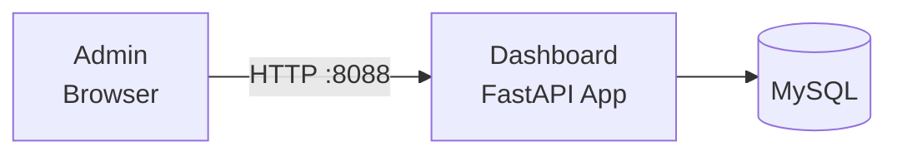

# Dashboard Service

The dashboard service is a small FastAPI application that renders a server-side HTML analytics dashboard and a few JSON stats endpoints. It queries MySQL directly through a 5-connection pool.

## What It Does

- Server-rendered HTML dashboard at `/dashboard`
- JSON stats endpoints: overview, per-domain, realtime
- MySQL connection pooling
- Prometheus metrics at `/metrics`

## Architecture



## API Endpoints

Copied from the route decorators in `worker/dashboard/app.py`:

```
GET /dashboard             -- Main dashboard page (HTML)
GET /api/stats/overview    -- Aggregate email stats
GET /api/stats/domains     -- Per-domain breakdown
GET /api/stats/realtime    -- Recent activity
GET /health                -- Service health check
GET /metrics               -- Prometheus metrics
```

The stats endpoints read `mail_logs` -- the per-message delivery record
populated by the [log ingestor](../mailer/log-ingestor.md) -- plus
`email_tracking`, `email_accounts`, and `domains`. Per-domain volume is
grouped by the sender's domain part (`mail_logs` has no domain column), so
inbound mail from external senders is excluded from domain rows. (Before
2026-08-30 these queries read an `email_logs` table that only ever existed
in an archived migration, plus nonexistent `users` /
`email_tracking_opens` / `email_tracking_clicks` tables, so every stats
endpoint returned errors.)

## Configuration

| Variable | Default | Description |
|----------|---------|-------------|
| `SERVICE_HOST` | `0.0.0.0` | Bind address |
| `SERVICE_PORT` | `8088` | Bind port |
| `DB_HOST` / `DB_PORT` / `DB_NAME` / `DB_USER` / `DB_PASSWORD` | `mysql` / `3306` / `mailserver` / -- / -- | MySQL connection |
| `DEBUG_MODE` | `false` | Debug logging |

## Docker Configuration

```yaml
dashboard:
  build: ./worker/dashboard
  container_name: dashboard
  ports:
    - "8088:8088"
  volumes:
    - ./shared:/app/shared
  depends_on:
    - mysql
    - migrate
```

The `./shared` mount is required because the `build: ./worker/dashboard` shorthand excludes the repo-root `shared/` from the build context. In production (`docker-compose.prod.yml`) the host port is bound to `127.0.0.1` only.

## Gotchas

!!! tip "Authentication"
    The dashboard has no auth of its own. In production it is loopback-bound and not routed by Traefik; do not expose it directly. Operator-facing dashboards live in the Mailyte Console and Grafana instead.
