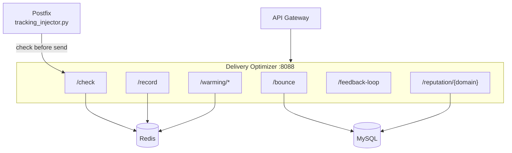

# Delivery Optimizer

The delivery optimizer manages sending rates, per-ISP throttling, IP warming, bounce processing, feedback-loop (FBL) handling, and domain reputation scoring. It is a FastAPI service; all rate counters live in Redis so they persist and are shared across callers. The API gateway exposes its tenant-facing surface, and the Postfix tracking injector consults it on the live outbound path -- both wired up and working since 2026-08-08.

## What It Does

- **Send checks**: `/check` answers "should this message go out now?" against ISP limits and warming schedules
- **ISP throttling**: per-destination-domain hourly/daily/burst/concurrency limits, with tuned defaults for Gmail, Outlook/Hotmail/Live, Yahoo, AOL, iCloud, Comcast, and a generic default
- **IP warming**: schedules that cap daily volume for new sending IPs
- **Bounce processing**: `/bounce` categorizes bounces and updates reputation
- **FBL handling**: `/feedback-loop` processes spam complaints
- **Domain reputation scoring**: per-domain scores exposed at `/reputation/{domain}`
- **Per-org delivery stats**: `/stats/{organization_id}`

## How It Works



### Integration with Postfix

`mailer/postfix/scripts/tracking_injector.py` calls `POST /check` (via `DELIVERY_OPTIMIZER_URL`, set to `http://delivery_optimizer:8088` in compose) for each outbound message it filters.

If the optimizer is unreachable or errors, the injector does **not** fail open at full speed: it paces down by a fixed conservative delay (`DELIVERY_OPTIMIZER_FALLBACK_DELAY`, default 2s) and then sends. The rationale mirrors `milter_default_action=tempfail` -- an unreachable limiter must never silently mean "no limits apply", but holding all outbound mail hostage on one dependency would be a worse failure mode.

## API Endpoints

Copied from the route decorators in `worker/delivery_optimizer/app.py`:

```
POST /check                        -- Should this email be sent now?
POST /record                       -- Record a send event
POST /bounce                       -- Process a bounce notification
GET  /reputation/{domain}          -- Domain reputation score
POST /warming/schedule             -- Create an IP warming schedule
GET  /warming/schedule/{ip_address} -- Warming schedule for one IP
GET  /warming/status               -- Warming status for all IPs
POST /feedback-loop                -- Process an FBL report
GET  /isp-limits                   -- Current ISP sending limits
PUT  /isp-limits/{domain}          -- Update limits for a destination domain
GET  /stats/{organization_id}      -- Delivery stats per org
GET  /health                       -- Health check
GET  /metrics                      -- Prometheus metrics
```

`POST /check` takes `{"recipient_domain": ..., "organization_id": ..., "sender_ip": ...}` and answers with the send decision and any delay.

## Default ISP Limits

From `DEFAULT_ISP_LIMITS` in `app.py` (overridable per domain via `PUT /isp-limits/{domain}`, cached in Redis under `isp_limits:{domain}`):

| Destination | Hourly | Daily | Burst | Delay | Concurrent |
|-------------|--------|-------|-------|-------|------------|
| gmail.com / googlemail.com | 100 | 2,000 | 10 | 1000 ms | 5 |
| outlook.com / hotmail.com / live.com | 300 | 5,000 | 20 | 500 ms | 10 |
| yahoo.com | 200 | 3,000 | 15 | 1000 ms | 8 |
| aol.com | 100 | 1,500 | 10 | 2000 ms | 3 |
| icloud.com / me.com | 200 | 3,000 | 15 | 800 ms | 8 |
| comcast.net | 150 | 2,000 | 10 | 1500 ms | 5 |
| (default) | 500 | 10,000 | 50 | 100 ms | 20 |

## Configuration

| Variable | Default | Description |
|----------|---------|-------------|
| `PORT` | `8088` | Bind port |
| `DB_HOST` / `DB_PORT` / `DB_NAME` / `DB_USER` / `DB_PASSWORD` | `mysql` / `3306` / `mailserver` / -- / -- | MySQL connection |
| `REDIS_HOST` / `REDIS_PORT` / `REDIS_DB` | `redis` / `6379` / -- | Counter storage |

On the Postfix side: `DELIVERY_OPTIMIZER_URL` (compose: `http://delivery_optimizer:8088`), `DELIVERY_OPTIMIZER_TIMEOUT` (default 5s), `DELIVERY_OPTIMIZER_FALLBACK_DELAY` (default 2s).

## Docker Configuration

```yaml
delivery_optimizer:
  build:
    context: .
    dockerfile: ./worker/delivery_optimizer/Dockerfile
  container_name: delivery_optimizer
  ports:
    - "8094:8088"     # host 8094 -> container 8088
  depends_on:
    - mysql
    - migrate
    - redis
```

In production (`docker-compose.prod.yml`) the host port is bound to `127.0.0.1` only.
