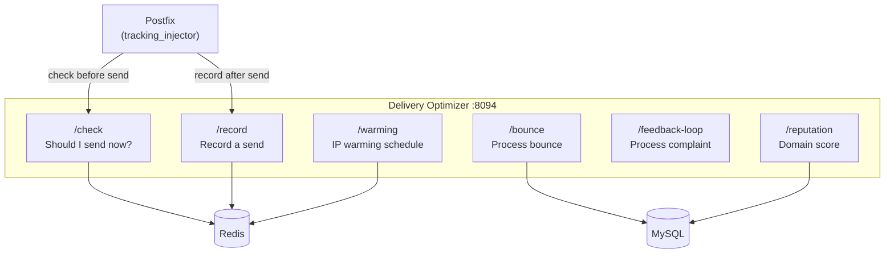

# Delivery Optimizer

> **Enterprise Edition** — This feature is available in [Mailyte Enterprise](https://mailyte.com). The Community Edition does not include this functionality.


!!! warning "Under Construction"
    This worker is currently in development. The API and features described below represent the planned design and may change.

The delivery optimizer uses AI-powered send-time optimization, ISP throttling management, IP warming schedules, bounce processing, and domain reputation scoring to maximize email deliverability.

## What It Does

- **Send-time optimization**: Determines the best time to send emails for maximum engagement
- **ISP throttling**: Respects per-ISP sending rate limits (Gmail, Outlook, Yahoo, etc.)
- **IP warming**: Gradually increases sending volume for new IP addresses
- **Bounce processing**: Categorizes bounces, updates reputation scores
- **Feedback loop (FBL) handling**: Processes spam complaints from ISPs
- **Domain reputation scoring**: Tracks sender reputation per domain
- **Redis-backed counters**: All rate data stored in Redis for persistence and speed

## How It Works



## Planned API Endpoints

```
GET  /health                              -- Health check
POST /check                              -- Check if email should be sent now
POST /record                             -- Record a send event
POST /bounce                             -- Process a bounce notification
GET  /stats/{organization_id}            -- Delivery stats per org
GET  /reputation/{domain}                -- Domain reputation score
POST /warming/schedule                   -- Create IP warming schedule
GET  /warming/schedule/{ip}              -- Get warming schedule for IP
GET  /warming/status                     -- Current warming status for all IPs
POST /feedback-loop                      -- Process FBL report
GET  /isp-limits                         -- Get current ISP sending limits
PUT  /isp-limits/{domain}                -- Update ISP limits
```

### Check Endpoint

The Postfix tracking injector calls `/check` before sending each email:

```json
// Request
{
  "recipient_domain": "gmail.com",
  "organization_id": "org-uuid"
}

// Response
{
  "send_now": true,
  "delay_seconds": 0,
  "reason": "within ISP limits"
}
```

If `send_now` is `false`, the email should be queued for later delivery.

## IP Warming

When you add a new sending IP, ISPs are suspicious of it. The warming schedule gradually increases sending volume:

| Day | Max Emails/Day |
|-----|---------------|
| 1-3 | 50 |
| 4-7 | 200 |
| 8-14 | 1,000 |
| 15-21 | 5,000 |
| 22-30 | 20,000 |
| 31+ | Full volume |

The optimizer enforces these limits and automatically progresses through the schedule.

## ISP-Specific Limits

Different ISPs have different tolerances:

| ISP | Recommended Limit | Notes |
|-----|-------------------|-------|
| Gmail | 500/hr per IP | Strict, drops connections if exceeded |
| Outlook/Hotmail | 1,000/hr per IP | Moderate |
| Yahoo | 500/hr per IP | Similar to Gmail |
| Generic | 2,000/hr per IP | Conservative default |

These limits are configurable and stored in Redis.

## Domain Reputation Scoring

The optimizer maintains a reputation score (0-100) for each sending domain:

- **90-100**: Excellent -- full sending speed
- **70-89**: Good -- normal limits
- **50-69**: Fair -- reduced limits, more monitoring
- **Below 50**: Poor -- significantly throttled, alerts sent

The score is affected by:

- Bounce rate (hard bounces reduce score more)
- Spam complaint rate (from FBL reports)
- Engagement metrics (opens, clicks)
- Historical delivery success rate

## Configuration

| Variable | Default | Description |
|----------|---------|-------------|
| `DB_HOST` | `mysql` | MySQL host |
| `DB_NAME` | `mailserver` | Database name |
| `REDIS_HOST` | `redis` | Redis host |
| `REDIS_PORT` | `6379` | Redis port |
| `DEFAULT_ISP_LIMIT` | `2000` | Default hourly limit per ISP |
| `WARMING_ENABLED` | `true` | Enable IP warming |

## Docker Configuration

```yaml
delivery_optimizer:
  build: ./worker/delivery_optimizer
  container_name: delivery_optimizer
  ports:
    - "8094:8088"
  depends_on:
    - mysql
    - redis
```

## Integration with Postfix

The tracking injector in Postfix calls the delivery optimizer before sending each email:

```python
# In tracking_injector.py
def _check_delivery_timing(self, recipient_domain, organization_id):
    response = requests.post(
        f"{delivery_optimizer_url}/api/delivery/check",
        json={
            'recipient_domain': recipient_domain,
            'organization_id': organization_id
        },
        timeout=5
    )
    result = response.json()
    return result.get('send_now', True)
```

If the optimizer is unavailable, emails are sent immediately (fail-open design).
