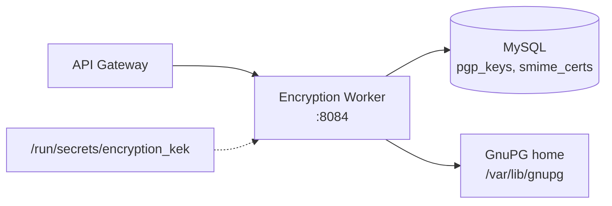

# Encryption Worker

The encryption worker provides PGP and S/MIME key management and message encryption as a FastAPI service. It generates, imports, lists, and deletes PGP keys, manages S/MIME certificates, serves public keys over Web Key Directory (WKD) for auto-discovery, and encrypts / decrypts / signs / verifies messages on demand.

This is an on-request crypto service for the API layer -- it does not sit in the Postfix delivery path as a content filter.

## Features

- **PGP key management**: generate, import, export (armored), list, delete -- per user, keyed by email
- **Message operations**: encrypt for a recipient, decrypt, sign, verify
- **S/MIME**: certificate import and listing
- **WKD serving**: `/.well-known/openpgpkey/hu/{wkd_hash}` for OpenPGP key auto-discovery
- **Storage**: key metadata and public material in MySQL (`pgp_keys`, `smime_certs` tables, auto-created at startup); private key material in the GnuPG home directory, with private keys envelope-encrypted via `shared.envelope_encryption` using the KEK mounted at `/run/secrets/encryption_kek`

## Architecture



## API Endpoints

Copied from the route decorators in `worker/encryption/app.py`:

```
POST   /pgp/generate                          -- Generate a PGP key pair
POST   /pgp/import                            -- Import a PGP public/private key
GET    /pgp/keys?email=                       -- List PGP keys for a user
GET    /pgp/keys/{fingerprint}                -- Export public key (armored)
DELETE /pgp/keys/{fingerprint}                -- Delete a key
POST   /pgp/encrypt                           -- Encrypt a message for a recipient
POST   /pgp/decrypt                           -- Decrypt a message
POST   /pgp/sign                              -- Sign a message
POST   /pgp/verify                            -- Verify a signature
GET    /.well-known/openpgpkey/hu/{wkd_hash}  -- WKD public key serving
POST   /smime/import                          -- Import an S/MIME certificate
GET    /smime/certs?email=                    -- List S/MIME certs for a user
GET    /health                                -- Health check
GET    /metrics                               -- Prometheus metrics
```

## Configuration

| Variable | Default | Description |
|----------|---------|-------------|
| `PORT` | `8084` | Bind port |
| `DB_HOST` / `DB_PORT` / `DB_NAME` / `DB_USER` / `DB_PASSWORD` | `mysql` / `3306` / `mailserver` / `mailuser` / -- | MySQL connection |
| `GNUPG_HOME` | `/var/lib/gnupg` | GnuPG home directory for key material |

## Docker Configuration

```yaml
encryption:
  build:
    context: .
    dockerfile: ./worker/encryption/Dockerfile
  container_name: encryption
  ports:
    - "8093:8084"
  volumes:
    - ./secrets/encryption_kek:/run/secrets/encryption_kek:ro
```

The KEK mount backs private-key envelope encryption -- generate it with `scripts/generate_dkim_kek.sh` (the same KEK the API service uses for DKIM/PGP/S-MIME material). In production (`docker-compose.prod.yml`) the host port is bound to `127.0.0.1` only.
