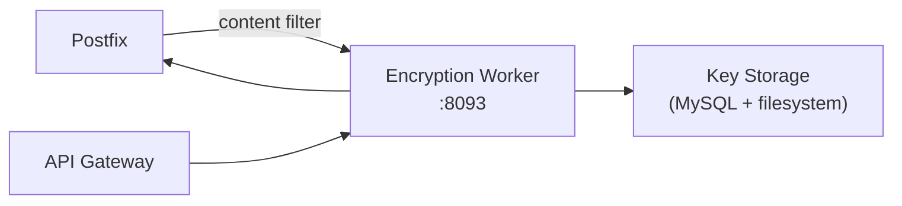

# Encryption Worker

> **Enterprise Edition** — This feature is available in [Mailyte Enterprise](https://mailyte.com). The Community Edition does not include this functionality.


!!! warning "Under Construction"
    This worker is currently in development. The API and features described below represent the planned design and may change.

The encryption worker adds end-to-end encryption support for email using PGP/GPG and S/MIME standards. It manages keys, encrypts outbound messages, and decrypts inbound messages for users who have enrolled.

## Planned Features

- **PGP/GPG encryption**: Encrypt and sign emails using OpenPGP
- **S/MIME support**: X.509 certificate-based encryption for enterprise environments
- **Key management**: Generate, import, export, and revoke keys per user
- **Automatic encryption**: Encrypt outbound mail when the recipient's public key is known
- **Key discovery**: WKD (Web Key Directory) and keyserver lookups
- **Transparent decryption**: Decrypt inbound mail before delivery to the mailbox (optional)
- **Key escrow**: Organization-level key backup for compliance

## Planned Architecture



## Planned API Endpoints

```
POST   /api/keys/generate          -- Generate a new key pair
POST   /api/keys/import            -- Import an existing public key
GET    /api/keys/{email}           -- Get public key for an address
DELETE /api/keys/{email}           -- Revoke a key
POST   /api/encrypt                -- Encrypt a message
POST   /api/decrypt                -- Decrypt a message
GET    /api/keys/{email}/status    -- Key status and expiration
```

## Configuration

| Variable | Default | Description |
|----------|---------|-------------|
| `DB_HOST` | `mysql` | MySQL host |
| `DB_NAME` | `mailserver` | Database name |
| `KEY_STORAGE_PATH` | `/var/lib/keys` | Path for key storage |
| `DEFAULT_KEY_SIZE` | `4096` | RSA key size for new keys |
| `ENABLE_AUTO_ENCRYPT` | `false` | Auto-encrypt when public key is available |

## Docker Configuration

```yaml
encryption:
  build: ./worker/encryption
  container_name: encryption
  ports:
    - "8093:8084"
  volumes:
    - key_data:/var/lib/keys
```
