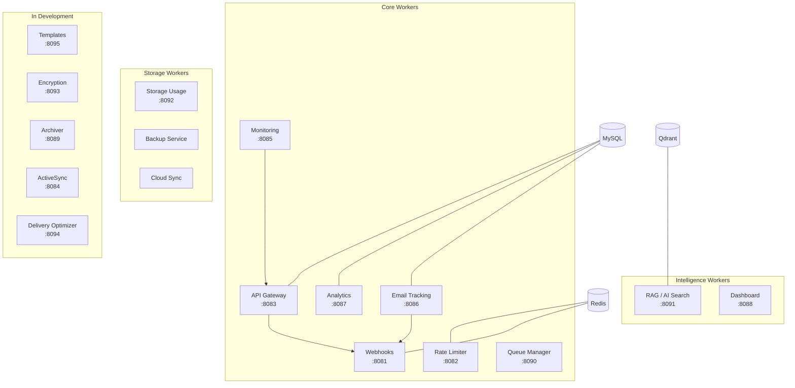

# Worker Modules

Workers are the background services that power everything beyond raw email delivery. They handle the API, tracking, webhooks, analytics, rate limiting, storage management, AI search, queue management, monitoring, and more. Each worker runs as its own Docker container with a single responsibility.

---

## Architecture Overview



## Active Workers

These workers are production-ready and ship with every Mailyte deployment.

<div class="grid cards" markdown>

-   :material-api:{ .lg .middle } **API Gateway**

    ---

    Central REST API for managing domains, mailboxes, aliases, organizations, and server configuration.

    **Port:** 8083 | **Container:** `api` | **Framework:** FastAPI

    [:octicons-arrow-right-24: API Gateway](api.md)

-   :material-eye-tracking:{ .lg .middle } **Email Tracking**

    ---

    Open and click tracking via tracking pixels and link rewriting. Fires webhook events on engagement.

    **Port:** 8086 | **Container:** `tracking` | **Framework:** Flask

    [:octicons-arrow-right-24: Email Tracking](tracking.md)

-   :material-webhook:{ .lg .middle } **Webhooks**

    ---

    Dispatches event notifications (sent, delivered, bounced, opened, clicked) to external URLs with retry logic.

    **Port:** 8081 | **Container:** `webhooks` | **Framework:** Flask

    [:octicons-arrow-right-24: Webhooks](webhooks.md)

-   :material-chart-bar:{ .lg .middle } **Analytics**

    ---

    Aggregates delivery stats, bounce rates, open rates, and per-organization reporting.

    **Port:** 8087 | **Container:** `analytics` | **Framework:** Flask

    [:octicons-arrow-right-24: Analytics](analytics.md)

-   :material-speedometer-slow:{ .lg .middle } **Rate Limiter**

    ---

    Redis-based sliding window rate limiting per mailbox, domain, and organization.

    **Port:** 8082 | **Container:** `rate_limiter` | **Framework:** Flask

    [:octicons-arrow-right-24: Rate Limiter](rate-limiter.md)

-   :material-tray-full:{ .lg .middle } **Queue Manager**

    ---

    Postfix mail queue monitoring, inspection, and management via API.

    **Port:** 8090 | **Container:** `queue_manager` | **Framework:** Flask

    [:octicons-arrow-right-24: Queue Manager](queue-manager.md)

</div>

### More Active Workers

| Worker | Port | Container | What It Does |
|--------|------|-----------|-------------|
| [Storage Usage](storage-usage.md) | 8092 | `storage_usage` | Disk usage tracking and quota enforcement per mailbox |
| [RAG / AI Search](rag.md) | 8091 | `rag` | Semantic email search with vector embeddings (Qdrant) |
| [Monitoring](monitoring.md) | 8085 | `monitoring` | Health checks, auto-healing, and alerting |
| [Dashboard](dashboard.md) | 8088 | `dashboard` | Admin dashboard for system overview |
| [Backup](backup.md) | -- | `backup` | Automated MySQL dumps and file snapshots |
| [Cloud Sync](cloud-sync.md) | -- | `cloud_sync` | Sync storage to S3 / Azure Blob / GCS |

## In Development

!!! info "Coming soon"
    These workers are under active development and not yet production-ready. They're included in the codebase but disabled by default.

| Worker | Port | Container | What It Will Do |
|--------|------|-----------|----------------|
| [Templates](templates.md) | 8095 | `templates` | Dynamic email templates with variable substitution |
| [Encryption](encryption.md) | 8093 | `encryption` | PGP/GPG and S/MIME end-to-end encryption |
| [Archiver](archiver.md) | 8089 | `archiver` | Long-term email storage with compliance and legal hold |
| [ActiveSync](activesync.md) | 8084 | `activesync` | Microsoft Exchange ActiveSync protocol support |
| [Delivery Optimizer](delivery-optimizer.md) | 8094 | `delivery_optimizer` | AI-powered send-time optimization for better engagement |

## Shared Patterns

All workers follow consistent patterns that make the system predictable and easy to extend.

### Health Endpoints

Every worker exposes these standard endpoints:

```
GET /health    → 200 OK if running
GET /metrics   → Prometheus metrics
```

### Shared Modules

Workers import from `shared/` at the project root:

| Module | Purpose |
|--------|---------|
| `shared.logging_config` | Structured logging with service-specific loggers |
| `shared.metrics` | Prometheus metrics collection and exposition |
| `shared.webhook_dispatcher` | Cross-container event dispatch via Redis pub/sub |

### Database Access

=== "MySQL"

    Workers that need MySQL use these environment variables:

    ```
    DB_HOST=mysql
    DB_PORT=3306
    DB_NAME=mailserver
    DB_USER=mailuser
    DB_PASSWORD=<your-password>
    ```

=== "Redis"

    Workers that need Redis use:

    ```
    REDIS_HOST=redis
    REDIS_PORT=6379
    ```

=== "Qdrant"

    The RAG worker connects to Qdrant for vector search:

    ```
    QDRANT_HOST=qdrant
    QDRANT_PORT=6333
    ```

### Frameworks

| Framework | Used By |
|-----------|---------|
| **FastAPI** | API Gateway, RAG, Delivery Optimizer — API-heavy workers that benefit from async and auto-generated OpenAPI docs |
| **Flask** | Webhooks, Analytics, Rate Limiter, Queue Manager, Storage Usage, Monitoring, Dashboard — simpler workers with straightforward request handling |

## Related Sections

- **[Mailer Services](../mailer/index.md)** — The email infrastructure layer that workers interact with
- **[Configuration > Environment Variables](../configuration/environment-variables.md)** — All worker-related env vars
- **[Monitoring](../monitoring/index.md)** — How worker health and metrics are collected
- **[Reference > API Endpoints](../reference/api-endpoints.md)** — Quick lookup for all API routes
- **[Reference > Webhook Events](../reference/webhook-events.md)** — Event types and payload formats
