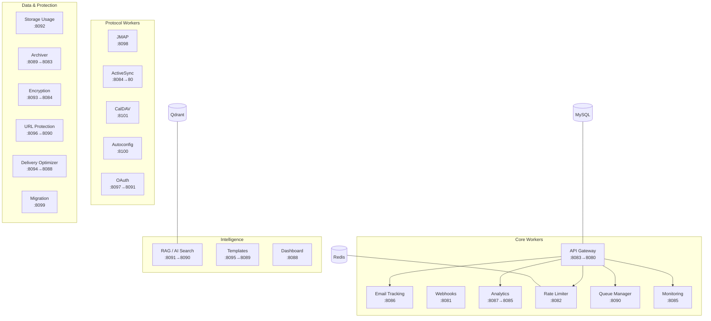

# Worker Modules

Workers are the services that power everything beyond raw email delivery: the API gateway, tracking, webhooks, analytics, rate limiting, storage accounting, AI search, client protocols (JMAP, ActiveSync, CalDAV), auto-configuration, migration, and monitoring. Each worker runs as its own Docker container with a single responsibility. Every worker is a **FastAPI** application, except ActiveSync (Z-Push on PHP/Apache).

---

## Architecture Overview



## Worker Directory

Every service below is built and enabled in `docker-compose.yml`. Ports are `host → container` for the dev compose; in production (`docker-compose.prod.yml`) internal services are republished on `127.0.0.1` and reached externally only through Traefik.

| Worker | Port (dev) | Container | What It Does |
|--------|-----------|-----------|-------------|
| [API Gateway](api.md) | 8083→8080 | `api` | Central REST API; 32 route modules; fronts most other workers. **replicas: 2 in prod** |
| [Webhooks](webhooks.md) | 8081 | `webhooks` | Email event ingest + signed webhook notifications. **replicas: 2 in prod** |
| [Rate Limiter](rate-limiter.md) | 8082 | `rate_limiter` | Redis-backed rate limiting; consulted by Postfix at DATA phase |
| [ActiveSync](activesync.md) | 8084→80 | `activesync` | Z-Push 2.7.4 (Exchange ActiveSync) over Dovecot IMAP |
| [Monitoring](monitoring.md) | 8085 | `monitoring` | Health checks, container restarts via docker-proxy, alerting |
| [Email Tracking](tracking.md) | 8086 | `tracking` | Open/click tracking, suppression list. **replicas: 2 in prod** |
| [Analytics](analytics.md) | 8087→8085 | `analytics` | Delivery/engagement analytics over `mail_logs`; scheduled reports |
| [Dashboard](dashboard.md) | 8088 | `dashboard` | Server-rendered stats dashboard |
| [Archiver](archiver.md) | 8089→8083 | `archiver` | age-encrypted archival of every message to S3; retention, legal hold |
| [Queue Manager](queue-manager.md) | 8090 | `queue_manager` | Postfix queue inspection and control via the shared spool |
| [RAG / AI Search](rag.md) | 8091→8090 | `rag` | Semantic email search with Qdrant vector embeddings |
| [Storage Usage](storage-usage.md) | 8092 | `storage_usage` | Quota accounting via Dovecot IMAP QUOTA; alerts |
| [Encryption](encryption.md) | 8093→8084 | `encryption` | PGP/S-MIME key management, WKD, message crypto |
| [Delivery Optimizer](delivery-optimizer.md) | 8094→8088 | `delivery_optimizer` | ISP throttling, IP warming, bounce/FBL processing, reputation |
| [Templates](templates.md) | 8095→8089 | `templates` | Jinja2 email templates with versioning and stats |
| [URL Protection](url-protection.md) | 8096→8090 | `url_protection` | Safe Links: rewrite + time-of-click verification |
| [OAuth](oauth.md) | 8097→8091 | `oauth` | OAuth 2.0 / XOAUTH2 authorization server |
| [JMAP](jmap.md) | 8098 | `jmap` | JMAP Core + Mail (RFC 8620/8621) over Dovecot |
| [Migration](migration.md) | 8099 | `migration` | IMAP-to-IMAP mailbox import/export with delta sync |
| [Autoconfig](autoconfig.md) | 8100 | `autoconfig` | Client auto-setup (Autoconfig/Autodiscover/MTA-STS), publicly routed for all domains |
| [CalDAV](caldav.md) | 8101 | `caldav` | Calendar/contacts management API over Radicale |

[Backups](backup.md) are handled by a host-side script and systemd timers, not a worker container -- see that page.

## Shared Patterns

### Health Endpoints

Every worker exposes:

```
GET /health    → 200 OK if running
GET /metrics   → Prometheus metrics
```

### Shared Modules

Workers import from `shared/` at the project root:

| Module | Purpose |
|--------|---------|
| `shared.logging_config` | Structured logging with service-specific loggers |
| `shared.metrics` | Prometheus metrics collection and exposition |
| `shared.webhook_dispatcher` | Signed webhook event dispatch over HTTP (reads `WEBHOOK_URL`, singular) |

Services built with the `build: ./worker/<name>` shorthand don't get `shared/` into their image -- the compose file bind-mounts `./shared:/app/shared` for them at runtime.

!!! warning "Kafka is provisioned but unused"
    `docker-compose.yml` runs Kafka + Zookeeper, and `shared/kafka_client.py` defines producer/consumer helpers and canonical topic names (`mailyte.inbound`, `mailyte.outbound.*`, ...). As of 2026-08-30 **no worker or mailer service imports it** -- inter-service communication is HTTP plus the webhook dispatcher. Don't document (or debug) message flows through Kafka; there are none.

### Database Access

=== "MySQL"

    Workers that need MySQL use these environment variables:

    ```
    DB_HOST=mysql
    DB_PORT=3306
    DB_NAME=mailserver
    DB_USER=mailuser
    DB_PASSWORD=<your-password>
    ```

=== "Redis"

    Workers that need Redis use:

    ```
    REDIS_HOST=redis
    REDIS_PORT=6379
    ```

=== "Qdrant"

    The RAG worker connects to Qdrant for vector search:

    ```
    QDRANT_HOST=qdrant
    QDRANT_PORT=6333
    ```

## Related Sections

- **[Mailer Services](../mailer/index.md)** — The email infrastructure layer that workers interact with
- **[Configuration > Environment Variables](../configuration/environment-variables.md)** — All worker-related env vars
- **[Monitoring](../monitoring/index.md)** — How worker health and metrics are collected
- **[Reference > API Endpoints](../reference/api-endpoints.md)** — Quick lookup for all API routes
- **[Reference > Webhook Events](../reference/webhook-events.md)** — Event types and payload formats
