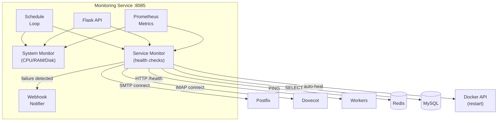

# Monitoring Service

> **Enterprise Edition** — This feature is available in [Mailyte Enterprise](https://mailyte.com). The Community Edition does not include this functionality.


The monitoring service is the watchdog for the entire Mailyte stack. It continuously checks the health of every service, tracks system resources, triggers auto-healing when things go wrong, and sends alerts via webhooks. It also provides a web dashboard and Prometheus metrics endpoint.

## What It Does

- **System resource monitoring**: CPU, memory, disk usage
- **Service health checks**: SMTP, IMAP, HTTP workers, Redis, MySQL
- **Automated recovery**: restarts failed services via Docker
- **Webhook notifications**: alerts on service failures and recoveries
- **Prometheus metrics**: exports gauges, counters, and histograms
- **Admin API**: manual service control and status queries
- **Scheduling**: periodic health checks on configurable intervals

## How It Works



## Health Check Methods

Each service type has its own check:

| Service | Check Method | Healthy Response |
|---------|-------------|-----------------|
| Postfix | TCP connect to port 25, verify SMTP banner | `220 mail.example.com ESMTP` |
| Dovecot | TCP connect to port 993, verify IMAP banner | `* OK` |
| Redis | `PING` command | `PONG` |
| MySQL | `SELECT 1` query | Returns `1` |
| HTTP workers | `GET /health` | HTTP 200 |
| Rspamd | `GET /` on port 11334 | HTTP 200 |

## Prometheus Metrics

The service exports these metrics:

| Metric | Type | Labels | Description |
|--------|------|--------|-------------|
| `service_health_status` | Gauge | `service_name` | 1 = up, 0 = down |
| `system_cpu_usage_percent` | Gauge | -- | Current CPU usage |
| `system_memory_usage_percent` | Gauge | -- | Current memory usage |
| `system_disk_usage_percent` | Gauge | -- | Current disk usage |
| `service_restart_total` | Counter | `service_name` | Total auto-restarts |
| `health_check_duration_seconds` | Histogram | `service_name` | Check duration |
| `webhook_delivery_total` | Counter | `status` | Webhook delivery stats |

Access metrics at `GET /metrics` in Prometheus exposition format.

## Auto-Healing

When a service fails its health check multiple times in a row, the monitor can automatically restart it:

1. First failure: log a warning, send webhook alert
2. Second consecutive failure: attempt Docker container restart
3. If restart succeeds: send recovery webhook
4. If restart fails: escalate to critical alert

Auto-healing requires Docker socket access (`/var/run/docker.sock`).

## API Endpoints

```
GET  /health                          -- Overall system health summary
GET  /api/status                      -- Detailed status of all services
GET  /api/status/{service_name}       -- Status of a specific service
POST /api/services/{name}/restart     -- Manually restart a service
GET  /api/system                       -- System resource metrics
GET  /api/alerts                       -- Recent alerts
GET  /metrics                          -- Prometheus metrics
```

### System Health Response

```json
{
  "status": "healthy",
  "services": {
    "postfix": {"status": "up", "latency_ms": 12},
    "dovecot": {"status": "up", "latency_ms": 8},
    "rspamd": {"status": "up", "latency_ms": 25},
    "mysql": {"status": "up", "latency_ms": 3},
    "redis": {"status": "up", "latency_ms": 1}
  },
  "system": {
    "cpu_percent": 35.2,
    "memory_percent": 62.8,
    "disk_percent": 45.1
  }
}
```

## Service Architecture

| Module | Purpose |
|--------|---------|
| `system_monitor` | CPU, memory, disk via `psutil` |
| `service_monitor` | TCP and HTTP health checks |
| `webhook_notifier` | Alert delivery to configured endpoints |

## Configuration

| Variable | Default | Description |
|----------|---------|-------------|
| `DB_HOST` | `mysql` | MySQL host |
| `DB_NAME` | `mailserver` | Database name |
| `CHECK_INTERVAL` | `60` | Seconds between health check rounds |
| `AUTO_HEAL_ENABLED` | `true` | Enable automatic service restarts |
| `FAILURE_THRESHOLD` | `3` | Consecutive failures before auto-heal |
| `WEBHOOK_URLS` | (empty) | Alert webhook URLs |
| `ALERT_CPU_THRESHOLD` | `90` | CPU usage alert threshold (%) |
| `ALERT_MEMORY_THRESHOLD` | `90` | Memory usage alert threshold (%) |
| `ALERT_DISK_THRESHOLD` | `85` | Disk usage alert threshold (%) |

## Database Tables

| Table | Purpose |
|-------|---------|
| `health_checks` | Health check results history |
| `service_metrics` | Service performance metrics over time |

## Docker Configuration

```yaml
monitoring:
  build: ./worker/monitoring
  container_name: monitoring
  ports:
    - "8085:8085"
  volumes:
    - /var/run/docker.sock:/var/run/docker.sock  # For auto-healing
  depends_on:
    - mysql
    - redis
```

## Gotchas

!!! warning "Docker Socket"
    Auto-healing requires Docker socket access, which is a privileged operation. If you do not want the monitoring service to restart containers, set `AUTO_HEAL_ENABLED=false`.

!!! warning "Check Interval vs. Service Count"
    With many services to check, a very short check interval can create load. Each check involves a TCP connection or HTTP request. A 60-second interval is a good balance for most deployments.

!!! tip "Grafana Integration"
    Point Grafana at the `/metrics` endpoint to build dashboards. The Prometheus metrics are designed to work out of the box with Grafana's standard panels.
