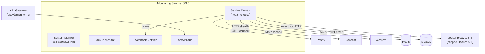

# Monitoring Service

The monitoring service is the watchdog for the Mailyte stack. It is a FastAPI application that continuously checks the health of services, tracks system resources, can restart failed containers, and sends alerts via webhooks. It exposes Prometheus metrics and an admin-token-protected control API.

## What It Does

- **System resource monitoring**: CPU, memory, disk via `psutil` (`services/system_monitor.py`)
- **Service health checks**: SMTP/IMAP/HTTP/Redis/MySQL checks (`services/service_monitor.py`)
- **Backup monitoring**: `services/backup_monitor.py` watches backup recency
- **Container restarts / auto-heal**: through the **docker-proxy** container, never the raw Docker socket
- **Webhook notifications**: alerts on failures and recoveries (`services/webhook_notifier.py`)
- **Prometheus metrics** and an admin control API

## How It Works



### Docker access is proxied

`docker.from_env()` in `service_monitor.py` reads `DOCKER_HOST`, which compose points at `tcp://docker-proxy:2375`. The proxy (a `tecnativa/docker-socket-proxy` container on the isolated `internal_only` network) allows exactly `CONTAINERS` + `POST` + `ALLOW_RESTARTS` -- list/inspect/restart, no exec, no image pulls, no volume or network access. The monitoring container itself never mounts `/var/run/docker.sock`.

## API Endpoints

Copied from the route decorators in `worker/monitoring/app.py`:

```
GET  /                        -- Service info
GET  /api/stats               -- Aggregate monitoring stats
GET  /api/metrics             -- Collected metrics (JSON)
GET  /metrics/prometheus      -- Monitoring gauges in Prometheus format
GET  /metrics                 -- Standard shared-module Prometheus metrics
GET  /health                  -- Health summary
GET  /heartbeat               -- Detailed heartbeat (used by the gateway)
POST /restart/{service_name}  -- Restart a container (admin token required)
POST /auto-heal               -- Run an auto-heal pass (admin token required)
POST /test/webhooks           -- Fire test alerts (admin token required)
GET  /admin/services/status   -- Per-service status detail
GET  /admin/token             -- Retrieve the admin token (local use)
POST /admin/regenerate-token  -- Rotate the admin token
```

Mutating endpoints require the admin token (generated at startup, retrievable/rotatable via the `/admin/token` endpoints) in the request. The API gateway's `/api/v1/monitoring/*` routes proxy to this service using `MONITORING_SERVICE_URL` (default `http://monitoring:8085`).

## Configuration

| Variable | Default | Description |
|----------|---------|-------------|
| `DOCKER_HOST` | `tcp://docker-proxy:2375` (compose) | Scoped Docker API endpoint for restarts |
| `DB_HOST` / `DB_PORT` / `DB_NAME` / `DB_USER` / `DB_PASSWORD` | `mysql` / `3306` / `mailserver` / -- / -- | MySQL connection |
| `REDIS_HOST` / `REDIS_PORT` | `redis` / `6379` | Redis connection |
| `WEBHOOK_SECRET` | -- | HMAC key for alert webhooks |
| `WEBHOOK_URLS` / `HEALTH_WEBHOOK_URLS` / `METRICS_WEBHOOK_URL` | (empty) | Alert/metric webhook targets |
| `ADMIN_PASSWORD` | -- | Admin authentication |

## Docker Configuration

```yaml
monitoring:
  build:
    context: .
    dockerfile: ./worker/monitoring/Dockerfile
  container_name: monitoring
  ports:
    - "8085:8085"
  environment:
    - DOCKER_HOST=tcp://docker-proxy:2375
  networks:
    - mailserver_network
    - internal_only        # to reach docker-proxy
  depends_on:
    - mysql
    - migrate
    - redis
    - docker-proxy
```

There is **no** `/var/run/docker.sock` mount. In production (`docker-compose.prod.yml`) the host port is bound to `127.0.0.1` only.

## Gotchas

!!! warning "Restart scope is deliberately narrow"
    The docker-proxy only permits list/inspect/restart. If a new monitoring feature needs more of the Docker API, that is a security-model decision (see `SECURITY.md` C1), not a config tweak.

!!! tip "Grafana / Prometheus"
    The stack also runs a full Prometheus + Grafana + Alertmanager set (see the compose file). This service's `/metrics` and `/metrics/prometheus` endpoints are scrape targets; dashboards belong in Grafana.
