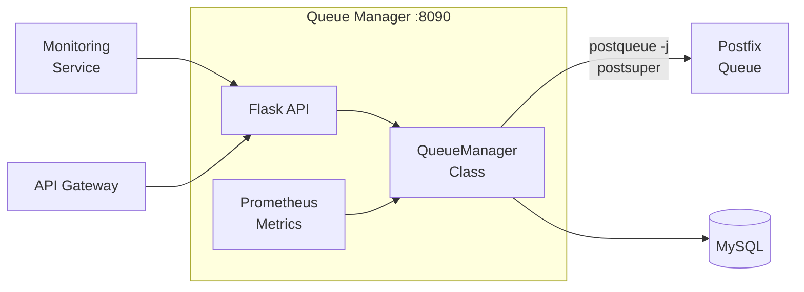

# Queue Manager Worker

> **Enterprise Edition** — This feature is available in [Mailyte Enterprise](https://mailyte.com). The Community Edition does not include this functionality.


The queue manager provides visibility and control over the Postfix mail queue. It wraps Postfix's native queue management commands in a friendly API and adds organization-aware features like per-org queue stats and priority routing.

## What It Does

- Real-time mail queue status monitoring
- Organization and domain-aware queue statistics
- Message management: hold, release, delete, requeue
- Queue analytics and reporting
- Prometheus metrics for queue size monitoring
- Integration with the monitoring and alerting system

## How It Works



The queue manager runs Postfix queue commands (`postqueue`, `postsuper`) either directly (if co-located) or via Docker exec, and parses the JSON output to provide structured data.

## API Endpoints

```
GET  /api/queue/status                    -- Overall queue stats
GET  /api/queue/messages                  -- List queued messages
GET  /api/queue/messages/{queue_id}       -- Details for a specific message
GET  /api/queue/stats/domain/{domain}     -- Queue stats per domain
GET  /api/queue/stats/org/{org_id}        -- Queue stats per organization
POST /api/queue/flush                     -- Force delivery attempt for all queued messages
POST /api/queue/hold/{queue_id}          -- Put a message on hold
POST /api/queue/release/{queue_id}       -- Release a held message
DELETE /api/queue/messages/{queue_id}    -- Delete a queued message
DELETE /api/queue/messages               -- Purge all queued messages (dangerous!)
GET  /health                              -- Health check
GET  /metrics                             -- Prometheus metrics
```

### Queue Status Response

```json
{
  "active": 12,
  "deferred": 45,
  "hold": 2,
  "total": 59,
  "oldest_message_age": "2h 15m",
  "top_deferred_domains": [
    {"domain": "slowmail.example.com", "count": 30},
    {"domain": "overloaded.example.com", "count": 15}
  ]
}
```

## Organization Support

The queue manager can break down queue stats by organization using the sender address to look up the org hierarchy in MySQL:

```
sender@example.com → domain: example.com → organization: Acme Corp
```

This lets admins see which organizations are generating the most deferred mail.

## Configuration

| Variable | Default | Description |
|----------|---------|-------------|
| `DB_HOST` | `mysql` | MySQL host |
| `DB_PORT` | `3306` | MySQL port |
| `DB_NAME` | `mailserver` | Database name |
| `POSTFIX_CONTAINER` | `postfix` | Postfix container name (for Docker exec) |
| `QUEUE_CHECK_INTERVAL` | `60` | Seconds between queue stat updates |

## Database Tables

| Table | Purpose |
|-------|---------|
| `domains` | Domain-to-org mapping for queue breakdowns |
| `organizations` | Org names and settings |
| `queue_stats` | Historical queue size data |

## Docker Configuration

```yaml
queue_manager:
  build: ./worker/queue_manager
  container_name: queue_manager
  ports:
    - "8090:8090"
  depends_on:
    - mysql
    - postfix
```

## Gotchas

!!! warning "Postfix Access"
    The queue manager needs to execute Postfix commands. If running in a separate container, it needs Docker socket access or an alternative mechanism to reach the Postfix container.

!!! warning "Purge with Caution"
    The "delete all" endpoint (`DELETE /api/queue/messages`) permanently destroys all queued messages. There is no undo. Use with extreme caution and never automate it without safeguards.

!!! tip "Deferred Queue Growth"
    A growing deferred queue usually means a downstream server is rejecting or rate-limiting you. Check the `top_deferred_domains` field to identify the problem destination, then investigate DNS, reputation, or remote server issues.
