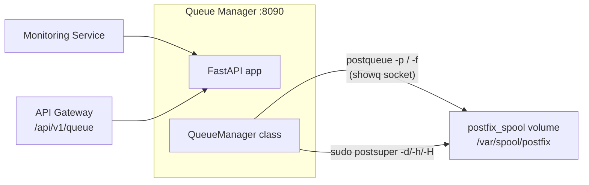

# Queue Manager Worker

The queue manager provides visibility and control over the Postfix mail queue. It is a FastAPI service that runs Postfix's native queue tools (`postqueue`, `postsuper`) against the shared spool and exposes the results as a structured API.

## What It Does

- Real-time mail queue inspection (`postqueue -p`, parsed into structured JSON)
- Message management: hold, release, delete individual messages (`postsuper -h/-H/-d`)
- Queue flush (`postqueue -f`)
- Queue statistics
- Prometheus metrics at `/metrics`
- A small HTML status page at `/`

## How It Works



The container mounts the same `postfix_spool` named volume Postfix owns. `postqueue` does not parse queue files -- it talks to Postfix's `showq` daemon over the socket at `public/showq` inside that spool. Reaching the socket requires traversing `/var/spool/postfix/public`, which is owned `postfix:postdrop`, so the compose file adds the numeric gid `106` via `group_add`.

`postsuper` refuses to run as anyone but root, so the image scopes `sudo` to exactly the three `postsuper` flags used (`-d`, `-h`, `-H`) and the service invokes it through that.

## API Endpoints

Copied from the route decorators in `worker/queue_manager/app.py`:

```
GET  /                             -- HTML status page
GET  /api/status                   -- Parsed queue listing and counts
GET  /api/statistics               -- Queue statistics
POST /flush                        -- Flush the queue (postqueue -f)
POST /message/{queue_id}/delete    -- Delete a queued message (postsuper -d)
POST /message/{queue_id}/hold      -- Hold a message (postsuper -h)
POST /message/{queue_id}/release   -- Release a held message (postsuper -H)
GET  /health                       -- Health check
GET  /metrics                      -- Prometheus metrics
```

Queue IDs are validated before being passed to `postsuper`. There is no "purge all" endpoint.

Tenant/console access goes through the API gateway's `/api/v1/queue/*` routes (`worker/api/routes/queue.py`), which proxy here using `QUEUE_SERVICE_URL` (default `http://queue_manager:8090`).

## Configuration

| Variable | Default | Description |
|----------|---------|-------------|
| `QUEUE_MANAGER_PORT` | `8090` | Bind port |
| `DB_HOST` / `DB_PORT` / `DB_NAME` / `DB_USER` / `DB_PASSWORD` | `mysql` / `3306` / `mailserver` / -- / -- | MySQL connection (passed by compose) |
| `REDIS_URL` | `redis://redis:6379/1` | Set by compose |

## Docker Configuration

```yaml
queue_manager:
  build:
    context: .
    dockerfile: ./worker/queue_manager/Dockerfile
  container_name: queue_manager
  ports:
    - "8090:8090"
  group_add:
    - "106"            # postdrop gid -- required to traverse public/ to the showq socket
  volumes:
    - postfix_spool:/var/spool/postfix
    - ./worker/queue_manager:/app
    - ./shared:/app/shared
    - ./database:/app/database
```

In production (`docker-compose.prod.yml`) the host port is bound to `127.0.0.1` only.

## Gotchas

!!! warning "The spool volume is the access mechanism"
    The queue manager does not use Docker exec or the Docker socket to reach Postfix. If the `postfix_spool` mount or the `group_add: "106"` entry is removed, every queue operation fails -- `postqueue` cannot reach the showq socket any other way.

!!! tip "Deferred queue growth"
    A growing deferred queue usually means a downstream server is rejecting or rate-limiting you. Inspect `/api/status` output for the problem destinations, then investigate DNS, reputation, or remote server issues.
