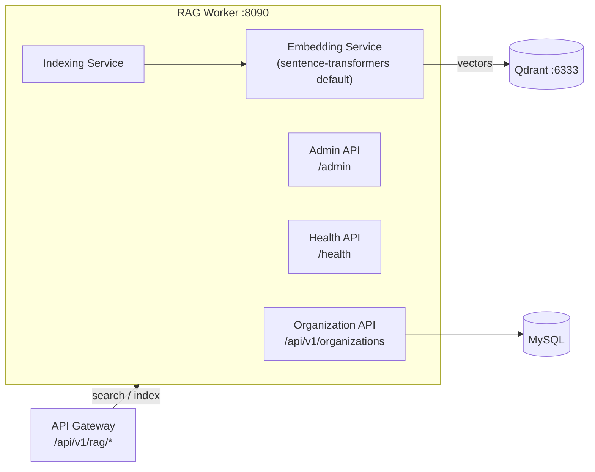

# RAG / AI Search Worker

The RAG (Retrieval-Augmented Generation) worker provides semantic email search. Instead of keyword matching, it understands the meaning of a query -- "emails about the Q3 budget discussion" finds relevant messages even when they never contain those exact words.

It converts email content into vector embeddings and stores them in Qdrant, a purpose-built vector database. It is a FastAPI service composed of an organization-config API, an admin API, and a health API, with search itself exposed to tenants through the API gateway.

## What It Does

- Embeds email content via pluggable providers -- default is local **sentence-transformers** (`all-MiniLM-L6-v2`); OpenAI, Azure OpenAI, and HuggingFace are configurable
- Stores embeddings in **Qdrant** with per-organization tenant isolation
- Per-organization indexing configuration (which fields to index, reindex triggers, status)
- Admin surface: collection management, circuit-breaker resets, performance and error introspection
- Webhook integration for indexing events

## How It Works



Tenant-facing search and indexing go through the API gateway (`worker/api/routes/rag.py`) under `/api/v1/rag/*` -- `/search`, `/rag/index/status/{domain}`, `/rag/index/trigger`, collection and document management -- with org scoping enforced at the gateway.

## API Endpoints

Copied from the routers in `worker/rag/app.py` and `worker/rag/api/`:

```
# app.py
GET /            -- Service info
GET /config      -- Effective (sanitized) configuration
GET /metrics     -- Prometheus metrics

# health router (prefix /health)
GET /health/             -- Basic health
GET /health/detailed     -- Detailed health
GET /health/qdrant       -- Qdrant connectivity
GET /health/embedding    -- Embedding provider health
GET /health/collections  -- Collection health
GET /health/metrics      -- Health metrics

# organization router (prefix /api/v1/organizations)
GET    /api/v1/organizations/                                -- List configured orgs
GET    /api/v1/organizations/available-fields                -- Indexable fields
GET    /api/v1/organizations/{organization_id}/config        -- Get org RAG config
POST   /api/v1/organizations/{organization_id}/config        -- Set org RAG config
DELETE /api/v1/organizations/{organization_id}/config        -- Delete org config
GET    /api/v1/organizations/{organization_id}/indexing-status
POST   /api/v1/organizations/{organization_id}/reindex

# admin router (prefix /admin)
GET  /admin/health, /admin/metrics, /admin/status/detailed
GET  /admin/performance/{operation_name}, /admin/errors/recent
POST /admin/circuit-breaker/{service_name}/reset
GET  /admin/optimization/suggestions
GET  /admin/collections, /admin/collections/{name}/info
POST /admin/collections/{name}/optimize
GET  /admin/embedding/models
POST /admin/embedding/test
GET  /admin/config/current
POST /admin/maintenance/cleanup

# gateway compatibility router (root-mounted; api/gateway_api.py) -- serves
# the paths worker/api/routes/rag.py forwards for the public /api/v1/rag/*
# contract, org-scoped via the organization_id the gateway supplies
POST /rag/search
GET  /rag/index/status/{domain}
POST /rag/index/trigger
GET  /collections/{domain}
POST /collections/{domain}
GET  /collections/{domain}/stats
GET  /organizations/{organization_id}/collections
POST /documents/{collection_id}
GET  /organizations/{organization_id}/rag/documents
GET  /rag/config/domain/{domain}
POST /rag/config/domain/{domain}
```

## Configuration

The service has a large config surface (`worker/rag/config.py`); the load-bearing variables:

| Variable | Default | Description |
|----------|---------|-------------|
| `QDRANT_HOST` / `QDRANT_PORT` / `QDRANT_URL` | `qdrant` / `6333` / `http://qdrant:6333` | Qdrant connection |
| `QDRANT_COLLECTION_PREFIX` | `mailrag` | Collection name prefix |
| `QDRANT_VECTOR_SIZE` | derived from the embedding model (`384` for the shipped default) | Vector dimensions; collection creation follows the active model and warns when an explicit setting disagrees |
| `EMBEDDING_PROVIDER` | `sentence_transformers` | `sentence_transformers`, `openai`, `azure_openai`, `huggingface` |
| `EMBEDDING_MODEL_NAME` | `all-MiniLM-L6-v2` | Model for the default provider |
| `OPENAI_API_KEY` / `AZURE_OPENAI_*` / `HUGGINGFACE_API_KEY` | -- | Only needed for hosted providers |
| `DB_HOST` / `DB_PORT` / `DB_NAME` / `DB_USER` / `DB_PASSWORD` | `mysql` / `3306` / `mailserver` / -- / -- | MySQL connection |
| `RAG_TENANT_ISOLATION_LEVEL` / `RAG_ORGANIZATION_CONFIGS` | -- | Multi-tenancy behavior |
| `SEARCH_TOP_K` / `SEARCH_SCORE_THRESHOLD` / `SEARCH_CACHE_TTL` | -- | Search tuning |
| `WEBHOOK_SERVICE_URL` | `http://webhooks:8081` (compose) | Webhook integration |

## Docker Configuration

```yaml
rag:
  build:
    context: .
    dockerfile: ./worker/rag/Dockerfile
  container_name: rag
  ports:
    - "8091:8090"     # host 8091 -> container 8090
  depends_on:
    - mysql
    - migrate
    - redis
    - qdrant

qdrant:
  image: qdrant/qdrant:latest
  container_name: qdrant
  ports:
    - "6333:6333"
  volumes:
    - ./storage/qdrant_data:/qdrant/storage
```

In production (`docker-compose.prod.yml`) both host ports are bound to `127.0.0.1` only -- Qdrant carries no authentication of its own, which is exactly why it must never be published on `0.0.0.0`.

## Gotchas

!!! warning "Embedding costs"
    With a hosted provider (OpenAI/Azure), every indexed email and every query costs API credits. The default is a local sentence-transformers model for exactly this reason.

!!! warning "Qdrant memory"
    Qdrant keeps vectors in memory for fast search. A million 1536-dimension vectors is roughly 6 GB of RAM.
