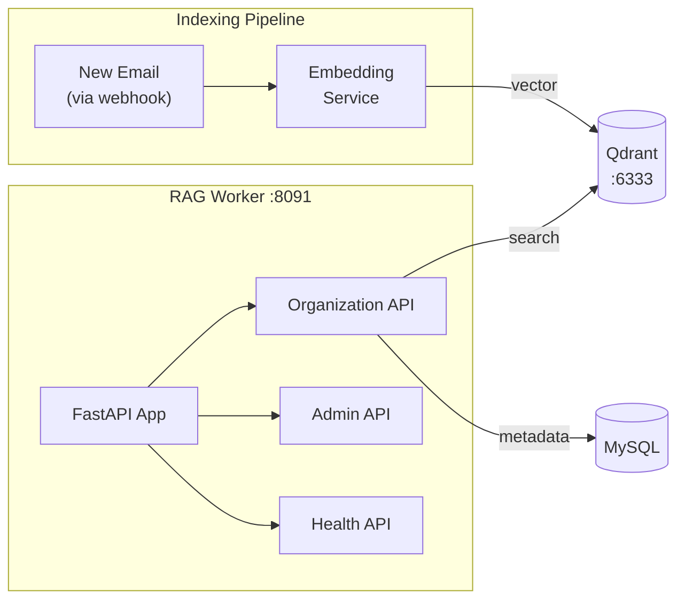

# RAG / AI Search Worker

> **Enterprise Edition** — This feature is available in [Mailyte Enterprise](https://mailyte.com). The Community Edition does not include this functionality.


The RAG (Retrieval-Augmented Generation) worker provides semantic email search. Instead of just keyword matching, it understands the meaning of your query. Ask "emails about the Q3 budget discussion" and it finds relevant messages even if they never contain the exact words "Q3 budget discussion."

It works by converting email content into vector embeddings and storing them in Qdrant, a purpose-built vector database.

## What It Does

- Embeds email content using multiple embedding providers (OpenAI, local models)
- Stores embeddings in **Qdrant** vector database
- Provides semantic search API -- query by meaning, not just keywords
- Multi-tenant isolation -- each organization gets its own collection
- Background indexing of new emails as they arrive
- Health monitoring and performance tracking

## How It Works



### Search Flow

1. User submits a search query via the API
2. RAG worker converts the query text into a vector embedding
3. Qdrant finds the nearest neighbor vectors (most semantically similar emails)
4. RAG worker enriches results with metadata from MySQL
5. Returns ranked results with relevance scores

### Indexing Flow

1. New email arrives (detected via webhook or periodic scan)
2. Email content is extracted and cleaned
3. Content is sent to the embedding service (OpenAI API or local model)
4. The resulting vector + metadata is stored in Qdrant
5. The email is tagged as indexed in MySQL

## API Endpoints

```
POST /api/v1/search                     -- Semantic search
POST /api/v1/index                      -- Index a single email
GET  /api/v1/org/{org_id}/stats         -- Indexing stats for an org
POST /api/v1/org/{org_id}/reindex       -- Trigger full reindex
DELETE /api/v1/org/{org_id}/collection  -- Delete org's search index
GET  /api/v1/admin/health               -- Detailed health status
GET  /health                             -- Basic health check
```

### Search Request

```json
{
  "query": "budget discussion for next quarter",
  "organization_id": "org-uuid",
  "limit": 10,
  "filters": {
    "date_from": "2025-01-01",
    "date_to": "2025-01-31",
    "sender": "finance@example.com"
  }
}
```

### Search Response

```json
{
  "results": [
    {
      "email_id": "msg-123",
      "subject": "Re: Q3 Budget Planning",
      "sender": "cfo@example.com",
      "date": "2025-01-10T14:30:00Z",
      "snippet": "I've updated the budget spreadsheet with...",
      "relevance_score": 0.92
    }
  ],
  "total": 1,
  "query_time_ms": 45
}
```

## Multi-Tenancy

Each organization gets its own Qdrant collection (like a separate database). This ensures:

- Complete data isolation between organizations
- Per-org index management (reindex, delete)
- Independent scaling and performance

Collection naming: `org_{organization_id}_emails`

## Service Architecture

| Service | Purpose |
|---------|---------|
| `qdrant_service` | Qdrant client, collection management, search |
| `embedding_service` | Vector embedding generation (OpenAI/local) |
| `error_handler` | Categorized error handling with severity levels |
| `performance_monitor` | Query timing and throughput tracking |

## Configuration

| Variable | Default | Description |
|----------|---------|-------------|
| `QDRANT_HOST` | `qdrant` | Qdrant server host |
| `QDRANT_PORT` | `6333` | Qdrant server port |
| `EMBEDDING_PROVIDER` | `openai` | Embedding provider (`openai`, `local`) |
| `OPENAI_API_KEY` | (required if using OpenAI) | OpenAI API key |
| `EMBEDDING_MODEL` | `text-embedding-3-small` | Model name for embeddings |
| `EMBEDDING_DIMENSIONS` | `1536` | Vector dimensions |
| `DB_HOST` | `mysql` | MySQL host |
| `DB_NAME` | `mailserver` | Database name |
| `ENABLE_MULTI_TENANCY` | `true` | Enable per-org collections |

## Docker Configuration

```yaml
rag:
  build: ./worker/rag
  container_name: rag
  ports:
    - "8091:8091"
  depends_on:
    - mysql
    - qdrant

qdrant:
  image: qdrant/qdrant:latest
  container_name: qdrant
  ports:
    - "6333:6333"
```

## Database Tables

| Table | Purpose |
|-------|---------|
| `email_index_status` | Tracks which emails have been indexed |
| `rag_collections` | Collection metadata per org |

## Gotchas

!!! warning "Embedding Costs"
    If using OpenAI, every email indexed and every search query costs API credits. For high-volume servers, consider using a local embedding model to control costs.

!!! warning "Qdrant Memory"
    Qdrant loads vectors into memory for fast search. Monitor memory usage -- a million 1536-dimension vectors uses roughly 6 GB of RAM.

!!! tip "Startup Dependencies"
    The RAG worker checks both Qdrant and the embedding service health at startup. If either is unavailable, the worker will fail to start. Make sure both dependencies are healthy first.
