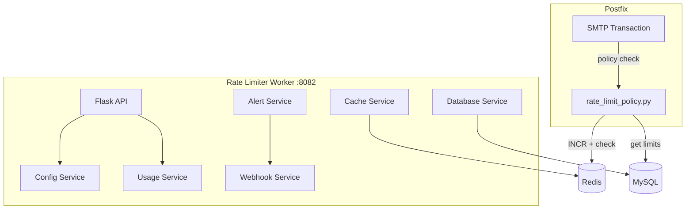

# Rate Limiter Worker

The rate limiter worker provides a centralized, Redis-backed rate limiting service for the entire mail system. It enforces sending limits at the organization, domain, and mailbox level, and integrates with Postfix's policy service for real-time enforcement during SMTP transactions.

There are actually two rate limiting components:

1. **Postfix policy script** (`mailer/postfix/scripts/rate_limit_policy.py`) -- runs inside the Postfix container, does real-time checks during SMTP
2. **Rate limiter worker** (`worker/rate_limiter/`) -- the standalone service with an API for managing limits, viewing usage, and alerting

They share the same Redis counters, so limits are enforced consistently regardless of which component checks them.

## What It Does

- **Sliding window** rate limiting using Redis atomic counters
- **Three-tier hierarchy**: Organization > Domain > Mailbox
- Configurable limits stored in MySQL `settings` JSON column
- Real-time usage tracking and quota consumption reporting
- Threshold alerts via webhooks when approaching limits
- Prometheus metrics for monitoring
- API for querying and updating rate limits

## How It Works



## Rate Limit Hierarchy

```
Organization (default: 10,000/hour)
  └── Domain (default: 5,000/hour)
       └── Mailbox (default: 1,000/hour)
```

All three levels are checked. If any level is exceeded, the email is rejected with:

```
REJECT 4.7.1 Rate limit exceeded for {entity}. Try again later.
```

The `4.7.1` code is a temporary failure, so the sending client will retry.

## Redis Key Structure

```
rate:{entity_type}:{identifier}:{YYYY-MM-DD-HH}
```

Examples:

```
rate:mailbox:user@example.com:2025-01-15-14
rate:domain:example.com:2025-01-15-14
rate:organization:org-uuid:2025-01-15-14
```

Keys expire after 2 hours (7200 seconds) so old counters are automatically cleaned up.

## Custom Limits

Limits are stored as JSON in the `settings` column of the respective table:

```sql
-- Set a custom limit for a mailbox
UPDATE email_accounts
SET settings = JSON_SET(COALESCE(settings, '{}'), '$.rate_limits.hourly', 500)
WHERE email = 'user@example.com';

-- Set a custom limit for a domain
UPDATE domains
SET settings = JSON_SET(COALESCE(settings, '{}'), '$.rate_limits.hourly', 2000)
WHERE domain = 'example.com';
```

If no custom limit is set, the defaults apply.

## API Endpoints

```
GET  /api/rate-limits/{entity_type}/{identifier}  -- Current usage and limits
PUT  /api/rate-limits/{entity_type}/{identifier}  -- Update limits
GET  /api/rate-limits/status                       -- Overview of all active limiters
GET  /health                                        -- Health check
GET  /metrics                                       -- Prometheus metrics
```

## Configuration

| Variable | Default | Description |
|----------|---------|-------------|
| `REDIS_HOST` | `redis` | Redis host |
| `REDIS_PORT` | `6379` | Redis port |
| `DB_HOST` | `mysql` | MySQL host |
| `DB_NAME` | `mailserver` | Database name |
| `DEFAULT_ORG_LIMIT` | `10000` | Default org hourly limit |
| `DEFAULT_DOMAIN_LIMIT` | `5000` | Default domain hourly limit |
| `DEFAULT_MAILBOX_LIMIT` | `1000` | Default mailbox hourly limit |

## Docker Configuration

```yaml
rate_limiter:
  build: ./worker/rate_limiter
  container_name: rate_limiter
  ports:
    - "8082:8082"
  depends_on:
    - mysql
    - redis
```

## Gotchas

!!! warning "Redis Availability"
    If Redis goes down, the Postfix policy script fails open (allows all email). This is by design -- we never want rate limiting failures to block legitimate email. But it means a Redis outage temporarily disables rate limiting.

!!! warning "Hourly Windows"
    The sliding window resets on the hour boundary (e.g., 14:00, 15:00). A burst of 999 emails at 14:59 followed by 999 at 15:01 would pass a 1000/hour limit because they fall in different windows. This is a known trade-off for simplicity and performance.

!!! tip "Monitoring"
    Watch the `rate:*` keys in Redis to see current counter values. Use `redis-cli keys "rate:*"` to list all active counters.
