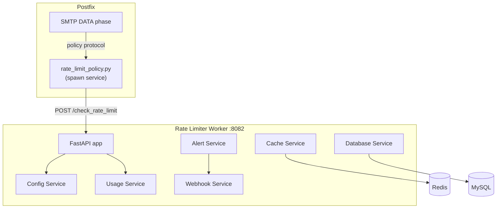

# Rate Limiter Worker

The rate limiter worker provides a centralized, Redis-backed rate limiting service for the entire mail system. It enforces sending and receiving limits at the organization, domain, and mailbox level, and is consulted by Postfix's policy service in real time during SMTP transactions.

There are actually two rate limiting components:

1. **Postfix policy bridge** (`mailer/postfix/scripts/rate_limit_policy.py`) -- runs inside the Postfix container, speaks the Postfix policy delegation protocol on stdin/stdout, and delegates every decision to this worker over HTTP
2. **Rate limiter worker** (`worker/rate_limiter/`) -- the standalone FastAPI service that owns the counters, configuration, usage reporting, and alerting

All counting happens in the worker; the policy script holds no state of its own.

## What It Does

- Fixed-window rate limiting using Redis atomic counters, with database fallback
- **Three-tier hierarchy**: Organization > Domain > Mailbox -- every tier is checked
- **Two directions**: `inbound` and `outbound` are limited independently
- **Six windows per tier and direction**: per-second, per-minute, hourly, daily, monthly, and burst
- Configurable limits stored in MySQL (per-entity overrides via `/set_limits`), with environment-variable defaults
- Real-time usage tracking and quota consumption reporting
- Threshold alerts via webhooks when approaching limits (80% warning / 95% critical / 100% exceeded)
- Prometheus metrics at `/metrics`

The service is split into specialized internal services: `ConfigService` (limit configuration and caching), `CacheService` (Redis counters), `DatabaseService` (MySQL operations and fallback), `UsageService`, `AlertService`, and `WebhookService` -- see `worker/rate_limiter/services/`.

## How It Works



### Where Postfix calls it

The policy service is defined in `master.cf` as `policy-rate-limit` (a `spawn` service running `rate_limit_policy.py`) and is referenced from exactly one place in `main.cf`: `smtpd_data_restrictions`. DATA runs once per message, which matches a limiter keyed on the sender.

!!! danger "Do not add the policy check to other restriction lists"
    The check used to run in three restriction lists at once. Each call posts `record: true`, so one message incremented the same counter three times -- against a per-second limit of 1, essentially every unauthenticated inbound message was deferred with `450 4.7.1 Rate limit exceeded`. The full postmortem is in the comments above `smtpd_data_restrictions` in `mailer/postfix/config/main.cf`. Re-adding the policy to `smtpd_sender_restrictions` or `smtpd_recipient_restrictions` re-creates that outage.

The submission port (587) references the same check through the `submission_rate_limit_check` restriction class -- `master.cf`'s `-o` parser splits unquoted whitespace, so the class name is the only way to reference `check_policy_service unix:private/policy-rate-limit` from a service override.

### Decision flow

- Authenticated sessions are checked as `outbound`, keyed on the SASL username (SMTP API key usernames without an `@` are deliberately included -- they used to slip through).
- Unauthenticated sessions are checked as `inbound`, keyed on the envelope sender.
- Over quota returns `DEFER_IF_PERMIT 4.7.1 Rate limit exceeded for {email}. Try again later.` -- a temporary failure, so legitimate senders retry.
- If the worker is unreachable, the policy script fails open (`DUNNO`): mail is never dropped because of a rate limiter outage. An HTTP 429 *denial*, however, is honored -- the denial is read out of the error response rather than being treated as a transport failure.

## Default Limits (hourly)

Defaults come from `worker/rate_limiter/config.py` and are overridable per window/tier/direction via environment variables (e.g. `ORG_OUTBOUND_HOURLY_DEFAULT`):

| Tier | Outbound / hour | Inbound / hour |
|------|----------------|----------------|
| Organization | 10,000 | 5,000 |
| Domain | 2,000 | 1,000 |
| Mailbox | 200 | 100 |

Per-second, per-minute, daily, monthly, and burst defaults exist for every tier and direction as well -- see the `*_SECOND_DEFAULT`, `*_MINUTE_DEFAULT`, `*_DAILY_DEFAULT`, `*_MONTHLY_DEFAULT`, and `*_BURST_DEFAULT` variables in `config.py`.

## Redis Key Structure

```
rate:{entity_type}:{identifier}:{direction}:{window}:{timestamp}
```

Examples:

```
rate:mailbox:user@example.com:outbound:hour:2026-08-30-14
rate:domain:example.com:inbound:day:2026-08-30
rate:organization:org-uuid:outbound:month:2026-08
```

Each window key expires shortly after its window closes, so old counters clean themselves up.

## API Endpoints

```
POST /check_rate_limit                        -- Check (and optionally record) usage for an email + direction
POST /increment_usage                         -- Record usage without a check
GET  /get_usage/{entity_type}/{identifier}    -- Current usage and limits
POST /set_limits                              -- Set per-entity limit overrides
POST /reset_counters                          -- Reset counters for an entity
POST /policy                                  -- Raw Postfix policy protocol over HTTP (alternative to the JSON API)
GET  /stats                                   -- Service statistics
GET  /health                                  -- Health check
GET  /metrics                                 -- Prometheus metrics
```

`POST /check_rate_limit` takes `{"email": ..., "direction": "inbound"|"outbound", "record": true|false}`. With `record: true` (what the Postfix policy bridge sends), allowed messages consume quota; read-only callers leave it unset.

Tenant-facing management of these limits goes through the API gateway at `/api/v1/rate-limiter/*` (`worker/api/routes/rate_limiter.py`), which proxies to this service and enforces organization scoping on the way through -- wired up and working since 2026-08-08.

## Configuration

| Variable | Default | Description |
|----------|---------|-------------|
| `RATE_LIMITER_HOST` | `0.0.0.0` | Bind address |
| `RATE_LIMITER_PORT` | `8082` | Bind port |
| `REDIS_HOST` / `REDIS_PORT` | `redis` / `6379` | Redis connection |
| `REDIS_URL` | `redis://redis:6379/0` | Set by compose |
| `DB_HOST` / `DB_PORT` / `DB_NAME` / `DB_USER` / `DB_PASSWORD` | `mysql` / `3306` / `mailserver` / -- / -- | MySQL connection |
| `ORG_OUTBOUND_HOURLY_DEFAULT` | `10000` | Org outbound hourly default (one of ~36 `*_DEFAULT` window variables) |
| `RATE_LIMIT_WARNING_THRESHOLD` | `80` | Warning alert threshold (%) |
| `RATE_LIMIT_CRITICAL_THRESHOLD` | `95` | Critical alert threshold (%) |
| `WEBHOOK_TIMEOUT` / `WEBHOOK_MAX_ATTEMPTS` / `WEBHOOK_RETRY_DELAY` | `10` / `3` / `5` | Alert webhook delivery |

The Postfix-side bridge reads `RATE_LIMITER_URL` (default `http://rate_limiter:8082`), `RATE_LIMITER_TIMEOUT` (default `5`), and `USE_POLICY_ENDPOINT` (default `false` -- the JSON API gives richer error detail than `/policy`).

## Docker Configuration

```yaml
rate_limiter:
  build:
    context: .
    dockerfile: ./worker/rate_limiter/Dockerfile
  container_name: rate_limiter
  ports:
    - "8082:8082"
  depends_on:
    - mysql
    - migrate
    - redis
```

In production (`docker-compose.prod.yml`) the host port is bound to `127.0.0.1` only -- the service is reached over the compose network by name, and externally only through the API gateway.

## Gotchas

!!! warning "Fail-open on outages only"
    If the worker is unreachable, the Postfix policy script fails open (allows all mail) by design. But a *denial* (HTTP 429) is not a transport error -- an earlier version treated it as one, which turned every rate-limit denial into a silent allow.

!!! warning "Fixed windows, not sliding"
    Counters reset on window boundaries (e.g., the hourly window at 14:00, 15:00). A burst of 999 emails at 14:59 followed by 999 at 15:01 passes a 1,000/hour limit because they fall in different windows. The per-minute and per-second windows blunt this in practice.

!!! tip "Monitoring"
    Watch the `rate:*` keys in Redis to see current counter values: `redis-cli --scan --pattern "rate:*"`.
