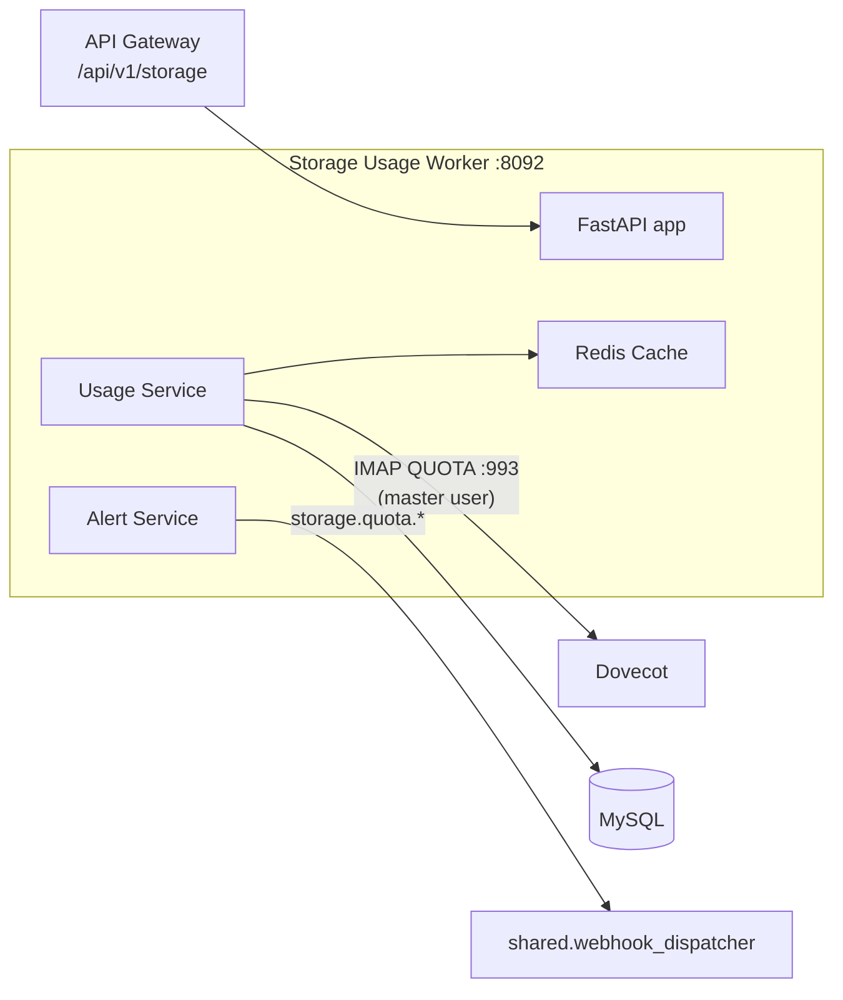

# Storage Usage Worker

The storage usage worker tracks storage consumption per mailbox, domain, and organization, enforces quota thresholds, and fires webhook alerts when limits are approached or crossed. It is a FastAPI service with Redis caching and a modular internal service architecture.

## How Usage Is Measured

Mailbox usage is read from **Dovecot over IMAP QUOTA (RFC 2087)**, not by walking the maildirs. This service runs unprivileged (uid 10001) while maildirs are owned by `vmail`, so a filesystem walk could not traverse them -- in production that approach measured 105 of 107 mailboxes as 0 bytes against 3 GB of real mail. QUOTA asks Dovecot for the figure it already maintains for enforcement, needs no filesystem access, and cannot drift. The connection uses `IMAP_HOST`/`IMAP_PORT` (dovecot:993) with the IMAP master credentials.

A filesystem scanning service still exists for the explicit `/storage/filesystem/scan` endpoint (the mail and attachment mounts are read-only for it), but it is not how quota accounting works.

## What It Does

- Per-entity usage queries with hierarchy rollups (organization > domain > mailbox)
- Quota threshold alerts (warning / critical) dispatched as `storage.quota.warning` / `storage.quota.exceeded` webhook events via `shared.webhook_dispatcher`
- Usage increments and recalculation on demand
- Per-entity storage configuration (quotas, thresholds)
- Redis caching of usage stats; MySQL persistence
- Prometheus metrics at `/metrics`

Internal services: `StorageConfigService`, `StorageCacheService` (Redis), `StorageDatabaseService` (MySQL), `StorageUsageService` (IMAP QUOTA reads), `StorageAlertService`, `StorageWebhookService`, `FilesystemService` -- see `worker/storage_usage/services/`.

## How It Works



## API Endpoints

Copied from the route decorators in `worker/storage_usage/app.py`:

```
GET  /storage/usage/{entity_type}/{identifier}            -- Usage for one entity
GET  /storage/usage/{entity_type}/{identifier}/hierarchy  -- Usage with child rollups
POST /storage/increment                                   -- Record a usage delta
POST /storage/calculate/{entity_type}/{identifier}        -- Recalculate from Dovecot
GET  /storage/quota-check                                 -- Quota check (delivery-time gate)
POST /storage/alerts/{entity_type}/{identifier}           -- Trigger alert evaluation
GET  /storage/config/{entity_type}/{identifier}           -- Get storage config
PUT  /storage/config/{entity_type}/{identifier}           -- Update storage config
POST /storage/cleanup                                     -- Cleanup task
GET  /storage/stats                                       -- Service statistics
POST /storage/webhook/test                                -- Fire a test storage webhook
POST /storage/filesystem/scan                             -- Explicit filesystem scan
GET  /health                                              -- Health check
GET  /metrics                                             -- Prometheus metrics
```

The API gateway proxies tenant-facing storage routes under `/api/v1/storage/*` using `STORAGE_SERVICE_URL` (default `http://storage_usage:8092`).

## Configuration

| Variable | Default | Description |
|----------|---------|-------------|
| `IMAP_HOST` / `IMAP_PORT` | `dovecot` / `993` | Where QUOTA is read from |
| `IMAP_MASTER_USER` / `IMAP_MASTER_PASSWORD` | -- | Master credentials for impersonation |
| `DB_HOST` / `DB_PORT` / `DB_NAME` / `DB_USER` / `DB_PASSWORD` | `mysql` / `3306` / `mailserver` / -- / -- | MySQL connection |
| `REDIS_HOST` / `REDIS_PORT` / `REDIS_DB` | `redis` / `6379` / -- | Cache |
| `WEBHOOK_URL` | (mapped from `WEBHOOK_URLS` in compose) | Read by `shared.webhook_dispatcher` -- without this mapping, quota events silently no-op |
| `MAIL_DATA_PATH` | `/var/mail/vhosts` | Read-only mount for the explicit scan endpoint |
| `ATTACHMENT_PATH` | `/var/attachments` | Read-only attachment mount |
| `STORAGE_WARNING_THRESHOLD` / `STORAGE_CRITICAL_THRESHOLD` | -- | Alert thresholds (%) |
| `STORAGE_CALC_INTERVAL` / `STORAGE_CLEANUP_INTERVAL` | -- | Background intervals |

Note: the service reads `MAIL_DATA_PATH` / `ATTACHMENT_PATH` -- not `STORAGE_DATA_PATH` / `STORAGE_ATTACHMENT_PATH`, which were once set in `.env` but never read by any code.

## Docker Configuration

```yaml
storage_usage:
  build:
    context: .
    dockerfile: ./worker/storage_usage/Dockerfile
  container_name: storage_usage
  ports:
    - "8092:8092"
  extra_hosts:
    - "host.docker.internal:host-gateway"
  volumes:
    - ./storage/mail_data:/var/mail/vhosts:ro
    - ./storage/attachments:/var/attachments:ro
```

In production (`docker-compose.prod.yml`) the host port is bound to `127.0.0.1` only.

## Gotchas

!!! warning "Do not revert to filesystem walking"
    The read-only maildir mount looks like an invitation to `rglob` mailbox sizes. It does not work: the container's uid cannot traverse `vmail`-owned maildirs, and the result silently reads as zero. IMAP QUOTA is the supported path.

!!! tip "Quota vs. enforcement"
    Dovecot enforces quotas at delivery time. This worker reports, alerts, and manages configuration -- the two complement each other and read the same underlying figure.
